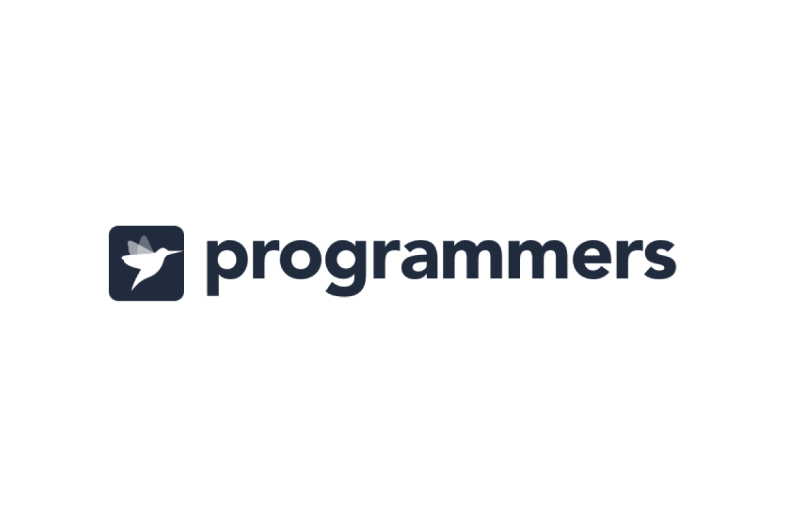

<br />

# 문제 설명

라이언은 저번 카카오배 양궁대회 우승자이고 이번 대회에도 결승전까지 올라왔다. 결승전 상대는 어피치이다.
결승전 규칙은 전 대회 우승자인 라이언에게 불리하게 다음과 같이 정했다.

어피치가 화살 n발을 다 쏜 후에 라이언이 화살 n발을 쏜다.
점수를 계산한다.
과녁판의 가장 작은 원의 과녁 점수는 10점이고 가장 큰 원의 바깥쪽은 과녁 점수가 0점이다.
만약, k(k는 1~10사이의 자연수)점을 어피치가 a발을 맞혔고 라이언이 b발을 맞혔을 경우
더 많은 화살을 k점에 맞힌 선수가 k 점을 가져간다. 단, a = b일 경우는 어피치가 k점을 가져간다.
k점을 여러 발 맞혀도 k점 보다 많은 점수를 가져가는 게 아니고 k점만 가져가는 것을 유의해라.
또한 a = b = 0 인 경우, 즉, 라이언과 어피치 모두 k점에 단 하나의 화살도 맞히지 못한 경우는 어느 누구도 k점을 가져가지 않는다.

예를 들어, 어피치가 10점을 2발 맞혔고 라이언도 10점을 2발 맞혔을 경우 어피치가 10점을 가져간다.
다른 예로, 어피치가 10점을 0발 맞혔고 라이언이 10점을 2발 맞혔을 경우 라이언이 10점을 가져간다.

모든 과녁 점수에 대하여 각 선수의 최종 점수를 계산한다.
최종 점수가 더 높은 선수를 우승자로 결정한다. 단, 최종 점수가 같을 경우 어피치를 우승자로 결정한다.
현재 상황은 어피치가 화살 n발을 다 쏜 후이고 라이언이 화살을 쏠 차례이다.
라이언은 어피치를 가장 큰 점수 차이로 이기기 위해서 n발의 화살을 어떤 과녁 점수에 맞혀야 하는지를 구하려고 한다.

이때, 라이언이 가장 큰 점수 차이로 우승하기 위해 n발의 화살을 어떤 과녁 점수에 맞혀야 하는지를 10점부터 0점까지 순서대로
정수 배열에 담아 return 하도록 solution 함수를 완성해라.
만약, 라이언이 우승할 수 없는 경우(무조건 지거나 비기는 경우)는 [-1]을 리턴.

<br />

# 매개변수

- n : 화살 개수
- info : 어피치가 맞힌 과녁 점수의 개수를 10점부터 0점까지 순서대로 담은 정수 배열

<br />

# 제한사항

- 1 ≤ n ≤ 10
- info의 길이 = 11
- 0 ≤ info의 원소 ≤ n
- info의 원소 총합 = n
- info의 i번째 원소는 과녁의 10 - i 점을 맞힌 화살 개수이다. ( i는 0~10 사이의 정수이다.)
- 라이언이 우승할 방법이 있는 경우, return 할 정수 배열의 길이는 11이다.
- 0 ≤ return할 정수 배열의 원소 ≤ n
- return할 정수 배열의 원소 총합 = n (꼭 n발을 다 쏴야 한다.)
- return할 정수 배열의 i번째 원소는 과녁의 10 - i 점을 맞힌 화살 개수이다. ( i는 0~10 사이의 정수이다.)

<br />

# 입출력예

| n   | info                    | result                  |
| --- | ----------------------- | ----------------------- |
| 5   | [2,1,1,1,0,0,0,0,0,0,0] | [0,2,2,0,1,0,0,0,0,0,0] |
| 1   | [1,0,0,0,0,0,0,0,0,0,0] | [-1]                    |
| 9   | [0,0,1,2,0,1,1,1,1,1,1] | [1,1,2,0,1,2,2,0,0,0,0] |
| 10  | [0,0,0,0,0,0,0,0,3,4,3] | [1,1,1,1,1,1,1,1,0,0,2] |

<br />

# 내 풀이

사실 문제를 처음 접했을 때, 어떻게 접근해야할지 감이 잡히지 않았다. 각 배열의 인덱스 (점수)마다 들어갈 수 있는 요소들 (화살 수)의 경우의 수가 너무 많은데, 이걸 어떻게 비교를 해야하는지 방법을 찾지 못했다.

구글링을 해보니, 이 문제는 그래프 탐색 알고리즘인 DFS를 사용해야하는 문제였다. 경기 결과의 모든 경우의 수를 비교한 후, 라이언이 가장 큰 점수차로 이기는 케이스를 구하면 된다. 경우의 수는 다음과 같다.

> 1 ) 0 포인트 부터 나올수 있는 모든 경우를 탐색한다 <br/> &emsp;1-1 ) 라이언이 이겨 점수를 얻는 경우 <br/> &emsp;1-2 ) 어피치가 이겨 점수를 얻는 경우 <br/> &emsp;1-3 ) 둘다 점수를 얻지 못하는 경우 <br/>
>
> 2 ) 0 ~ 10포인트까지 모든 경우를 탐색한다.<br/>
> 모든 경우의 수 중, 가장 큰 점수차(maxDiff)가 정답.<br/> 이 값이 0일 경우, 라이언이 이기는 경우는 없다.

## DFS 함수

DFS 함수는 다음과 같은 인자를 받는다.

- `aTotalScore` : 어피치의 총 점수
- `rTotalScore` : 라이언의 총 점수
- `nUse` : 라이언이 사용한 화살 개수
- `point` : 화살을 맞춘 경우 얻는 점수
- `scoreArr` : 점수 배열

이 재귀 함수의 로직을 간략하게 설명하자면 다음과 같다.

<br/>

1 ) 점수 배열 ( `[ 10점, 9점, 8점, … ]` )을 0점부터 10점까지 각 점수마다 재귀함수(DFS)를 호출한다.

2 ) 각 재귀(점수)마다, 다음 경우의 수에 대해 알맞는 연산 처리를 해준다.

&emsp; 2- 1) 라이언이 이겨 점수를 얻는 경우 → 라이언의 총 점수 (`rTotalScore`)에 점수(`point`)를 합산 + `어피치가 맞춘 화살 + 1` 만큼 라이언이 사용한 화살 개수 (`nUse`) 합산

> k점을 어치피보다 여러 발 더 맞혀도 k점보다 더 많은 점수가 아닌, k점만 가져가기 때문에 어피치가 맞춘 화살보다 딱 하나만 더 맞춘다.

&emsp; 2- 2 ) 어피치가 이겨 점수를 얻는 경우 → 라이언의 총 점수 (`aTotalScore`)에 점수(`point`)를 합산

&emsp; 2 -3 ) 아무도 점수를 얻지 못하는 경우 → 어떤 연산도 하지 않음

3 ) 다음 점수(`point + 1` )로 다시 재귀 함수를 호출한다.

<br/>

이렇게 0점부터 10점까지 재귀 함수를 호출한 후, 화살을 다 썼거나 마지막 10점까지 계산을 완료한 경우 재귀 함수를 종료한다.

이 과정을 거치면, 라이언과 어피치의 총 점수가 나오는데 이 점수 차가 가장 큰 경우가 정답이다. 이렇게 만들어진 점수 배열 (`scoreArr`)을 리턴하면 된다.

만약, 가장 큰 점수 차가 0이라면 라이언이 이기는 경우가 없다는 뜻이기 때문에 문제의 조건대로 `[-1]` 을 리턴하면 된다.

## 코드

```jsx
function solution(n, info) {
  let answer = Array(11).fill(0);
  let maxDiff = 0;

  const dfs = (aTotalScore, rTotalScore, nUse, point, scoreArr) => {
    // 화살을 다 쓴 경우 (재귀 함수 종료)
    if (n < nUse) return;

    // 현재 점수의 인덱스
    const index = 10 - point;

    // 마지막 10점까지 계산한 경우 (재귀 함수 종료)
    if (point > 10) {
      let diff = rTotalScore - aTotalScore;
      if (diff > maxDiff) {
        maxDiff = diff;
        // 남은 화살은 모두 0점 처리
        scoreArr[10] = n - nUse;
        answer = scoreArr;
      }
      return;
    }

    // 라이언이 이길 경우
    if (n > nUse) {
      const currentScoreArr = [...scoreArr];
      // 어피치가 쏜 화살 + 1
      const nShots = info[index] + 1;
      currentScoreArr[index] = nShots;
      dfs(
        aTotalScore,
        rTotalScore + point,
        nUse + nShots,
        point + 1,
        currentScoreArr
      );
    }

    if (info[index] > 0) {
      // 어피치가 이길 경우
      dfs(aTotalScore + point, rTotalScore, nUse, point + 1, scoreArr);
    } else {
      // 둘 다 점수를 얻지 못하는 경우
      dfs(aTotalScore, rTotalScore, nUse, point + 1, scoreArr);
    }
  };

  dfs(0, 0, 0, 0, answer);

  return maxDiff > 0 ? answer : [-1];
}
```

<br />

# Reference

- [https://velog.io/@tnehd1998/프로그래머스-양궁대회-JavaScript](https://velog.io/@tnehd1998/%ED%94%84%EB%A1%9C%EA%B7%B8%EB%9E%98%EB%A8%B8%EC%8A%A4-%EC%96%91%EA%B6%81%EB%8C%80%ED%9A%8C-JavaScript)
