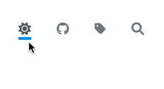

## 다크모드 버튼 만들기

요즘 벨로그에서 깃헙 페이지로 블로그를 이전하는 작업을 하고 있는데, 이미 알고 있었지만 상당히 손이 많이 간다… 그래도 하나하나 기능을 만들고 꾸미고 하면서 큰 보람을 느끼고 있다 😁 내가 Minimal Mistakes 테마를 커스텀하면서 했던 작업들을 블로그에 올려볼 계획이다. 그 중 첫 번째로 다크모드 버튼을 만든 작업을 공유해보려한다. 이 [블로그](https://etch-cure.github.io/blog/toggle-dark-mode/#site-nav)를 참고하여 버튼으로 만들었다.

## 버튼 추가

일단 아무 기능이 없는 버튼을 추가하자. 엄밀히 말하면, 버튼이 아닌 DOM 조작으로 아이콘을 붙일 a태그를 만드는 작업이다. 헤더에 버튼을 추가했다. `_includes / masthead.html` 경로에 여러 메뉴 아이템이 있는데 똑같이 하나를 추가해주자.

```html
/* _includes/masthead.html */

<div class="masthead">
  <div class="masthead__inner-wrap">
    <div class="masthead__menu">
      ...
      <!-- 추가 -->
      <li class="masthead__menu-item">
        <a id="toggle-theme"></a>
      </li>
      <!-- ... -->
      ...
    </div>
  </div>
</div>
```

## SCSS 파일 추가

다크모드와 라이트모드 2개의 CSS 파일을 빌드하여 버튼을 누를 때마다 다른 CSS 파일이 적용되도록 만들 것이다.

원래 Minimal Mistakes는 `config.yml` 에서 테마를 변수로 받아와서 다른 CSS 파일을 적용시키지만, 어차피 ‘default’ (라이트모드)와 ‘dark’ (다크모드)만 사용할 것이기 때문에 그냥 테마명을 하드코딩으로 넣었다.

기존 `assets/css/main.scss` 파일은 라이트모드 전용으로 만들고,

```scss
/* assets/css/main.scss */

@charset "utf-8";

@import 'minimal-mistakes/skins/default'; // 변경
@import 'minimal-mistakes';
```

또 다른 다크모드 전용 파일 `assets/css/main-dark.scss` 을 만들자.

```scss
/* assets/css/main-dark.scss */

@charset "utf-8";

@import 'minimal-mistakes/skins/dark'; // 변경
@import 'minimal-mistakes';
```

그 다음, head 부분에서 앞서 만든 두 개의 CSS 파일을 모두 불러올 수 있게 해주자.

```html
/* _includes/head.html */
<link rel="stylesheet" href="{{ '/assets/css/main.css' | relative_url }}" />
<!-- 추가 -->
<link rel="stylesheet" href="{{ '/assets/css/main_dark.css' | relative_url }}" />
<!-- ... -->
```

## 스크립트 파일 추가

이제 본격적으로 페이지에 스크립트를 추가하여 버튼을 눌렀을 때 테마가 바뀔 수 있도록 만들어보자.

경로는 `assets/js/custom/dark-theme.js` 로 만들었다.

코드를 간략하게 설명하자면, 브라우저의 로컬스토리지에 저장된 theme에 따라서 ( 없으면 시스템 설정 값 ) 다른 CSS 파일을 적용시켜 다크와 라이트 모드를 전환할 수 있도록 해준다.

```jsx
/* assets/js/custom/dark-theme.js */

const defaultTheme = [...document.styleSheets].find((style) => /(main.css)$/.test(style.href));
const darkTheme = [...document.styleSheets].find((style) => /(main_dark.css)$/.test(style.href));

const toggleThemeBtn = document.getElementById('toggle-theme');

const toLight = () => {
  toggleThemeBtn.innerHTML = `<i class="fa-solid fa-sun"></i>`;
  defaultTheme.disabled = false;
  darkTheme.disabled = true;
  localStorage.setItem('theme', 'default');
};

const toDark = () => {
  toggleThemeBtn.innerHTML = `<i class="fa-solid fa-moon"></i>`;
  defaultTheme.disabled = true;
  darkTheme.disabled = false;
  localStorage.setItem('theme', 'dark');
};

const currentTheme = () => localStorage.getItem('theme');

const setDarkMode = (isDark) => {
  if (isDark) {
    toLight();
  } else {
    toDark();
  }
};

if (darkTheme) {
  let isDarkMode = false;
  if (currentTheme() === 'dark') {
    isDarkMode = true;
  } else if (currentTheme() === 'default') {
    isDarkMode = false;
  } else {
    isDarkMode = matchMedia('(prefers-color-scheme: dark)').matches;
  }

  if (toggleThemeBtn) {
    if (isDarkMode) {
      toDark();
    } else {
      toLight();
    }
  }

  const changeTheme = () => {
    setDarkMode(currentTheme() === 'dark');
  };

  toggleThemeBtn.addEventListener('click', changeTheme);
}
```

위 스크립트 파일이 페이지가 로드될 때, 실행될 수 있도록 아래 코드를 `config.yml` 파일 최하단에 추가해주자.

```yaml
after_footer_scripts:
  - /assets/js/custom/dark-theme.js
```

## 추가 스타일링 작업

여기까지 실질적인 다크모드 작업은 끝났다. 하지만, 나는 전체적인 색상이 마음에 들지 않아서 추가적으로 색상에 관련된 변수들을 손 보았다.

특히, 두 테마에서 `$primary-color` 라는 색상 변수가 조금씩 다르게 적용되어서 일체감이 떨어졌다. 그래서 아예 새로운 변수 `$highlight-color` 를 만들어 `$primary-color`를 일부 대체하였다. 그외에도 백그라운드 색상이나 폰트 컬러를 수정하였다.

라이트모드 (default 테마) 색상 변수

```scss
/* _sass/minimal-mistakes/_variables.scss */

$primary-color: #6f777d !default;
$highlight-color: #0091ff !default; // 추가
$success-color: #3fa63f !default;
...

/* links */
$link-color: mix(#000, $info-color, 20%) !default;
$link-color: mix(#000, $highlight-color, 20%) !default; // 변경
$link-color-hover: mix(#000, $link-color, 25%) !default;
```

다크모드 (dark 테마) 색상 변수

```scss
/* _sass/minimal-mistakes/skins/_dark.scss */

$background-color: #1c1c1c !default; // 변경
$text-color: #cecece !default; // 변경
$primary-color: #fff !default; // 변경
$highlight-color: #ffff00 !default; // 추가
...
$link-color: mix($highlight-color, $text-color, 40%) !default; // 변경
```

헤더 메뉴 hover 시, 밑줄 색상

```scss
/* _sass/minimal-mistakes/_navigation.scss */

.greedy-nav {
	...
	.visible-links {
		...
		a {
			position: relative;
			&:before {
				...
				background: $highlight-color; // 변경
				...
			}
		}
	}
}
```
