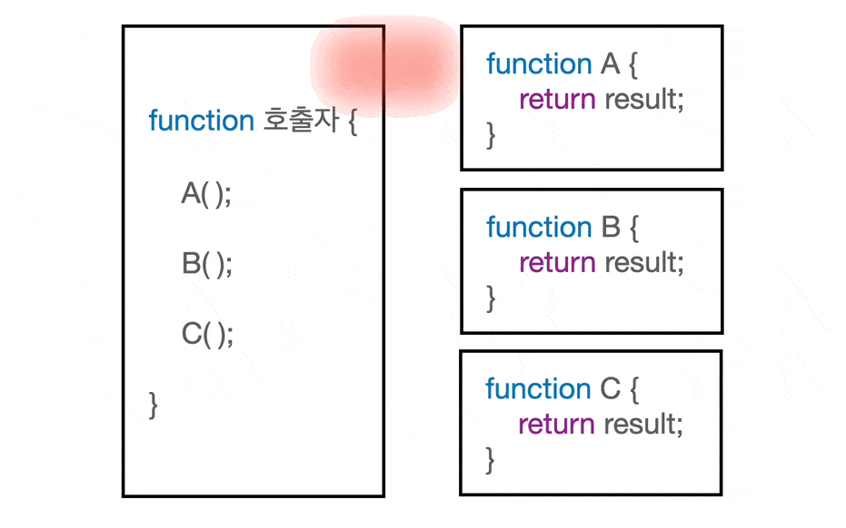
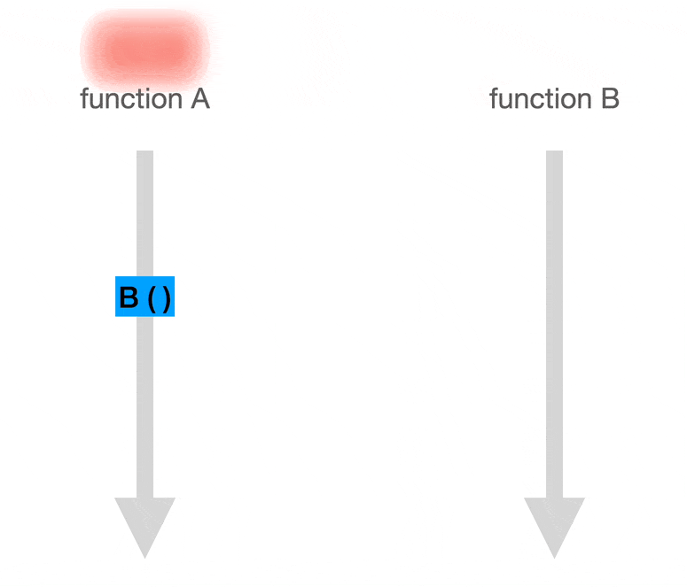
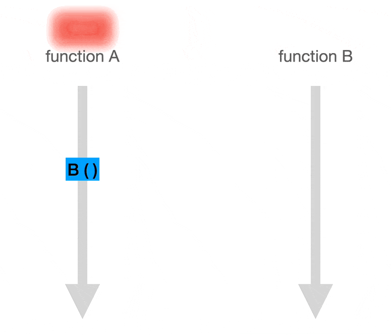
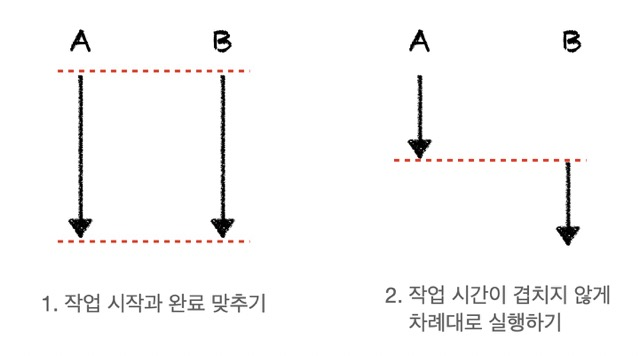
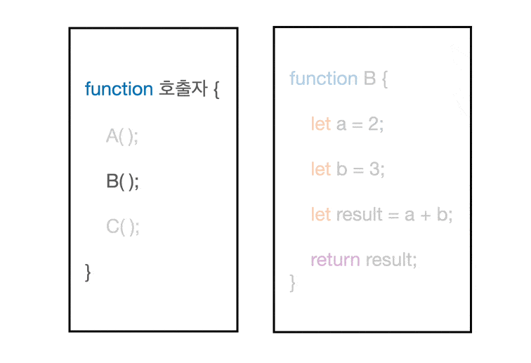
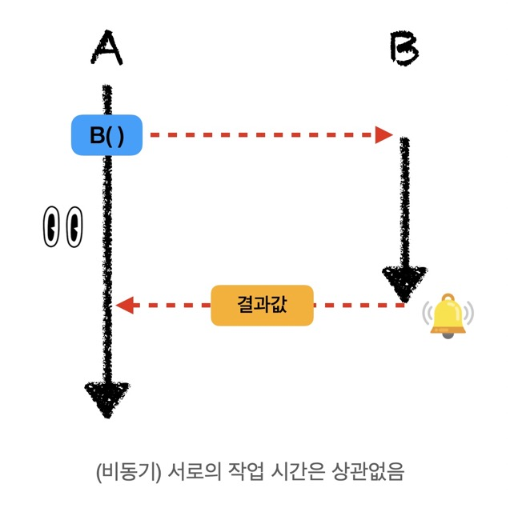
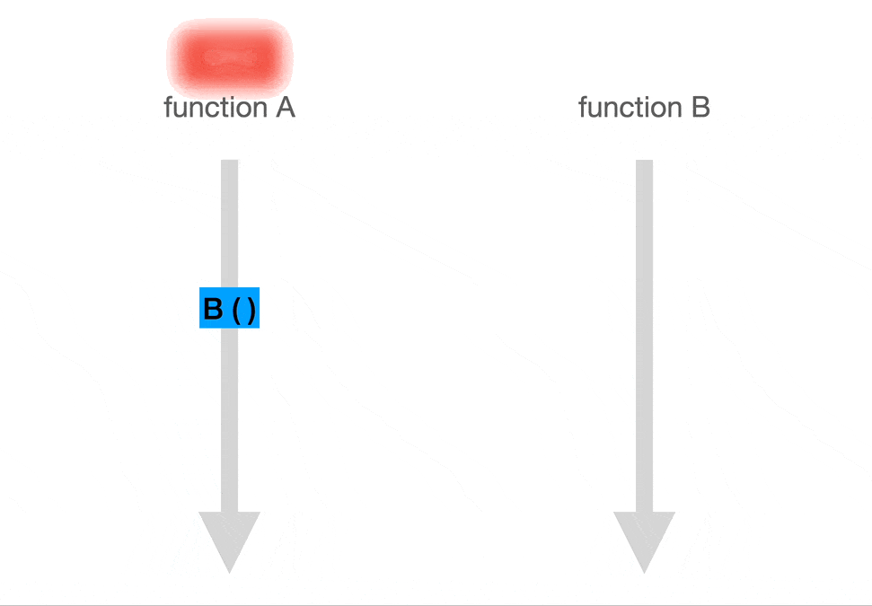
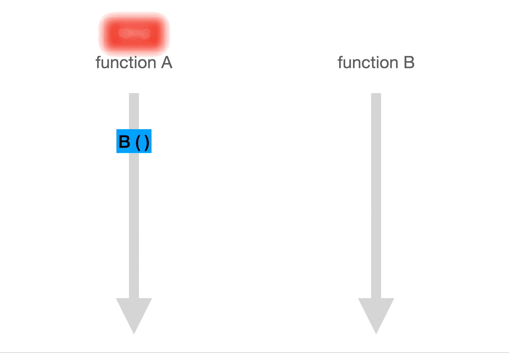
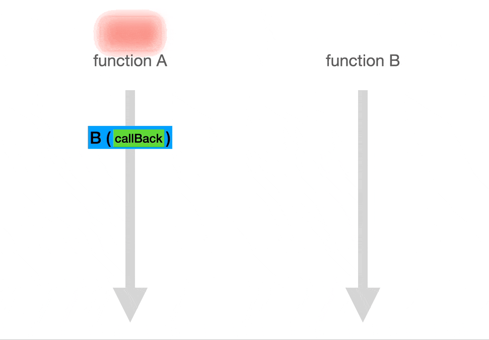
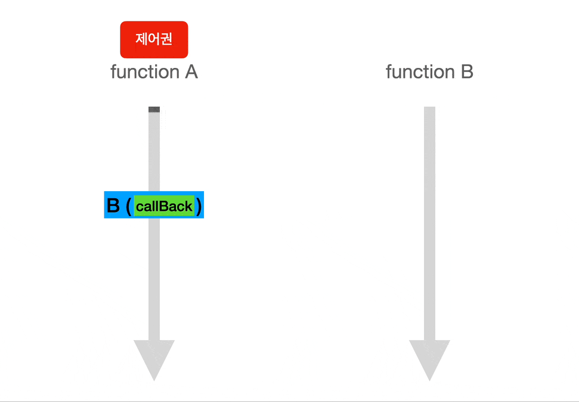

 

# 들어가며

> JavaScript is a single-threaded, non-blocking, asynchrounous programming language.

자바스크립트를 쓰는 개발자라면 한 번쯤은 들어본 자바스크립트에 대한 설명이다. 하지만, 이게 정확히 무슨 말인지 잘 와닿지 않는다. 논블로킹이면 막지 않는다라는 뜻이니까, 느낌상 여러 함수가 실행되는 것을 막지 않는다는 뜻인 것 같다. 근데, 동기적으로 실행되는 코드가 한 줄씩 차례대로 실행되니까 비동기는 여러 줄이 같이 실행되는건가..? 그럼 둘은 같은건가..? 매우 헷갈린다. 지금부터 이 블로킹과 논블로킹 그리고 동기와 비동기가 정확히 무엇을 의미하는지 알아보자.

 

# 제어권과 결과값

그 전에, 이 둘의 차이를 정확하게 이해하기 위해선 우선 제어권과 결과값이라는 개념을 알고 있어야한다.

제어권은 말그대로 함수를 제어할 수 있는 권한이다. 함수 안에 있는 내용이 실행되기 위해선, 해당 함수는 제어권을 부여받아야 한다. 쉽게, 함수가 행동할 수 있는 권리라고 생각하자.

결과값도 말그대로 함수의 결과 즉, 함수의 리턴값이다. 여기서 주의할 점이 있는데, 함수 실행 도중에 결과값을 요청하면, 아직 결과가 없더라도 함수는 '아직 결과 없음'이라는 결과값을 임시로 내놓을 수 있다.

함수들은 다음과 같이 서로 (제어권과) 결과값을 주고 받으며 실행된다.

<figure>
<a style="text-align: center; width: 100%;" href="../../images/sync-async-block-nonblock/control-result.gif">
  
  <figcaption></figcaption>
</a>
</figure>

 

# 블로킹과 논블로킹

블로킹과 논블로킹은 전체적인 작업의 흐름이 어떠한 작업에 의해 중단되는지 여부에 따라 결정된다. 즉, 함수를 실행하는 **제어권이 누구한테 있는지**가 핵심이다.

## 블로킹

**전체적인 작업의 흐름이 다른 작업에 의해 멈추면** 이는 블로킹이다.
제어권의 관점에서 보면, A 함수가 B 함수를 호출할 시 **제어권이** A 함수에서 B 함수로 **넘어간다.**
B 함수가 완료돼서야, 제어권이 B 함수에서 A 함수로 넘어온다.

이 과정을 그림과 함께 순서대로 살펴보자.

<figure>
<a style="text-align: center; width: 100%;" href="../../images/sync-async-block-nonblock/blocking.gif">
  
  <figcaption></figcaption>
</a>
</figure>

1. A 함수가 B 함수를 호출한다. 제어권은 A 함수에서 B 함수로 넘어간다.
2. 제어권을 받은 B 함수가 실행된다. 제어권을 잃은 A 함수는 A 함수의 실행을 멈춘다.
3. B 함수의 실행이 끝나고 제어권을 다시 A 함수에게 돌려준다. 나머지 A 함수가 실행된다.

## 논블로킹

**다른 작업의 실행이 전체적인 작업의 흐름을 중단시키지 않으면** 이는 논블로킹이다.
제어권의 관점에서 보면, A 함수가 B 함수를 호출하지만 제어권은 계속 A 함수에게 있다. 즉, **제어권은 넘어가지 않는다.**

이 과정을 그림과 함께 순서대로 살펴보자.

<figure>
<a style="text-align: center; width: 100%;" href="../../images/sync-async-block-nonblock/non-blocking.gif">
  
  <figcaption></figcaption>
</a>
</figure>

1. A 함수가 B 함수를 호출한다. 하지만, 제어권은 넘기지 않는다.
2. 제어권이 A 함수에게 있으므로, B 함수가 호출되어도 A 함수는 멈추지 않고 실행된다.

> 제어권이 없는 B 함수가 어떻게 실행되는건가?
>
> 함수의 실행 주체가 다른 서버나 동일 서버 내 다른 스레드(멀티 스레드)에 있기 때문에, 제어권을 넘겨주지 않아도 함수가 실행될 수 있다. 예를 들어, http 통신의 경우 B 함수를 실행하는 주체는 원격 서버가 될 수 있다.

 

# 동기와 비동기

동기와 비동기는 여러 작업들이 시간에 맞춰 실행되는지에 따라 결정된다. 즉, **작업 실행의 타이밍**이 핵심이다. 작업 실행의 타이밍을 맞추면 동기 맞추지 않으면 비동기다.

## 동기 (sync)

이 **'타이밍을 맞춘다(= 동기)'**라는 뜻은 2가지 중 한 가지 규칙을 따르는 것을 의미한다.

1. 작업의 시작과 완료 시간을 맞추기
2. 작업 시간이 겹치지 않게 차례대로 실행하기

<figure>
<a style="text-align: center; width: 100%;" href="../../images/sync-async-block-nonblock/sync.jpeg">
  
  <figcaption></figcaption>
</a>
</figure>

함수들끼리 이런 규칙을 지킬 수 있는 이유는 함수의 **호출자가 호출한 함수가 완료됐는지 계속 확인**하기 때문이다. 함수가 **완료되었다는 응답과 함께 결과값을 받은 후, 다음 함수를 실행**하는 것이다.

여기서, 호출자가 호출한 함수의 결과값(함수의 완료)을 기다린다는 뜻은 **결과값이 있어야 다음 작업을 수행할 수 있다**는 뜻을 의미한다.

<figure>
<a style="text-align: center; width: 100%;" href="../../images/sync-async-block-nonblock/sync-check.gif">
  
  <figcaption></figcaption>
</a>
</figure>

## 비동기 (async)

비동기는 말그대로 동기적이지 않다. 즉, 함수끼리 서로 시작과 완료에 대해 신경쓰지 않는다. **비동기로 호출된 함수는 완료되면 결과값과 함께 스스로 호출자에게 완료되었다는 신호를 준다.** 때문에, 여러 **함수들이 시작되고 끝나는 타이밍은 맞지 않을 수도 있다.**

여기서, 호출자가 호출한 함수의 결과값(함수의 완료)을 기다리지 않는다는 뜻은 당장 **결과값이 없어도 다음 작업을 수행할 수 있다**는 것을 의미한다.

<figure>
<a style="text-align: center; width: 100%;" href="../../images/sync-async-block-nonblock/async.jpeg">
  
  <figcaption></figcaption>
</a>
</figure>

 

# 블로킹/논블로킹, 동기/비동기 요약

## 블로킹 / 논블로킹

> 호출자가 호출한 함수에게 **제어권(함수의 실행권)을 넘겨주는가?**

**넘겨준다 = 블로킹**  : 호출자는 호출한 함수가 끝날 때까지 아무것도 하지 못하고 대기한다.

**넘겨주지 않는다 = 논블로킹**   : 호출자는 함수의 호출과 동시에 자신의 작업을 실행한다.

## 동기 / 비동기

> 호출자가 **호출한 함수의 완료 여부(결과값)를 확인하는가?**

**확인한다 = 동기**  : 호출자와 호출한 함수가 시간을 맞춘다.  (다음 작업이 이전의 결과값을 필요로 함)

**확인하지 않는다 = 비동기** : 함수끼리 서로 완료 여부를 신경쓰지 않는다.  (다음 작업이 이전의 결과값을 필요로 하지 않음)

 

# 블로킹/논블로킹, 동기/비동기 조합

위에서 알아본 개념들로 (2X2) 4가지 조합이 가능하다.
각 조합의 의미하는 바와 이에 대한 실제 예시들을 알아보자.

 

## 1. 동기 + 블로킹 (sync-blocking)

> 동기 : 호출자는 호출한 함수의 결과값을 필요로 함
>
> 블로킹 : 호출자는 호출한 함수가 끝날 때 (제어권/결과값을 돌려받을 때)까지 아무것도 못하고 대기
>
> = 호출자는 호출한 함수의 결과값을 받을 때 까지, 아무것도 못하고 대기

<figure>
<a style="text-align: center; width: 100%;" href="../../images/sync-async-block-nonblock/sync-blocking.gif">
  
  <figcaption></figcaption>
</a>
</figure>

<h3>예시</h3>

**커맨드에서 Input 입력받아 Output 출력하기**
: 제어권이 시스템에서 사용자로 넘어가, 시스템이 사용자가 입력한 결과값이 필요로 하기 때문에 기다린다.

<figure>
<a style="text-align: center; width: 100%;" href="https://blog.kakaocdn.net/dn/n3P4U/btrpJXZAf30/Q4n8oEhQUqCHWsyNWkLJ41/img.png">
  
  <figcaption></figcaption>
</a>
</figure>

 

## 2. 동기 + 논블로킹 (sync-nonblocking)

> 동기 : 호출자는 호출한 함수의 결과값을 필요로 함 (함수의 완료 여부를 물음)
>
> 논블로킹 : 호출자는 함수의 호출과 동시에 (제어권을 주지 않고) 자신의 작업을 실행
>
> = 호출자는 호출한 함수의 결과값을 받기 전까지 가능한 작업을 실행

<figure>
<a style="text-align: center; width: 100%;" href="../../images/sync-async-block-nonblock/sync-nonblocking.gif">
  
  <figcaption></figcaption>
</a>
</figure>

<h3>예시</h3>

**게임에서 데이터 로드율 표시하기**
: 맵 이동 시 서버가 맵 데이터 처리를 완료되었는지 계속 확인한다. 제어권은 나에게 있기 때문에 동시에 화면의 로드율 계속해서 업데이트 할 수 있다.

<figure>
<a style="text-align: center; width: 100%;" href="https://media.tenor.com/9uwdc8zTDMEAAAAC/loading-bar.gif">
  
  <figcaption></figcaption>
</a>
</figure>

 

## 3. 비동기 + 논블로킹 (async-nonblocking)

> 비동기 : 호출자는 호출한 함수의 결과값(콜백)이 당장 필요하지 않음
>
> 논블로킹 : 호출자는 함수의 호출과 동시에 (제어권을 주지 않고) 자신의 작업을 실행
>
> = 호출자는 호출한 함수의 결과값(콜백)이 당장 필요하지 않기 때문에,
> 이와 상관없이 자신의 작업을 실행

<figure>
<a style="text-align: center; width: 100%;" href="../../images/sync-async-block-nonblock/async-nonblocking.gif">
  
  <figcaption></figcaption>
</a>
</figure>

<h3>예시</h3>

**AJAX 요청**
: 클라이언트는 서버로 API 요청을 보낸 후, 응답을 기다리지 않고 자신의 작업을 실행한다.

<figure>
<a style="text-align: center; width: 100%;" href="https://i.gifer.com/DhTH.gif">
  
  <figcaption>키 입력을 할 때 마다 서버에 API 요청을 보내고 있지만, 이와 상관없이 클라이언트는 입력 받은 글자를 화면에 띄우고 있다.</figcaption>
</a>
</figure>

 

## 4. 비동기 + 블로킹 (async-blocking)

> 비동기 : 호출자는 호출한 함수의 결과값(콜백)이 당장 필요하지 않음
>
> 블로킹 : 호출자는 호출한 함수가 끝날 때 (제어권/결과값을 돌려받을 때)
> 까지 아무것도 못하고 대기
>
> = 호출자는 호출한 함수의 결과값(콜백)이 당장 필요 없지만,
> 받을 때까지 아무것도 하지 않고 대기

<figure>
<a style="text-align: center; width: 100%;" href="../../images/sync-async-block-nonblock/async-blocking.gif">
  
  <figcaption>A 함수는 B 함수의 작업이 당장 필요 없음에도 불구하고, 자신의 작업을 멈춰 B 함수가 끝날 때 까지 기다리고 있는 모습이다. 이런 경우는 거의 마주할 일이 없어서 넘어가도 무방하다.</figcaption>
</a>
</figure>

 

# Reference

- [https://www.youtube.com/watch?v=IdpkfygWIMk](https://www.youtube.com/watch?v=IdpkfygWIMk)
- [https://musma.github.io/2019/04/17/blocking-and-synchronous.html](https://musma.github.io/2019/04/17/blocking-and-synchronous.html)
- [https://inpa.tistory.com/entry/👩%E2%80%8D💻-동기비동기-블로킹논블로킹-개념-정리](https://inpa.tistory.com/entry/%F0%9F%91%A9%E2%80%8D%F0%9F%92%BB-%EB%8F%99%EA%B8%B0%EB%B9%84%EB%8F%99%EA%B8%B0-%EB%B8%94%EB%A1%9C%ED%82%B9%EB%85%BC%EB%B8%94%EB%A1%9C%ED%82%B9-%EA%B0%9C%EB%85%90-%EC%A0%95%EB%A6%AC)
- [https://joooing.tistory.com/entry/동기비동기-블로킹논블로킹](https://joooing.tistory.com/entry/%EB%8F%99%EA%B8%B0%EB%B9%84%EB%8F%99%EA%B8%B0-%EB%B8%94%EB%A1%9C%ED%82%B9%EB%85%BC%EB%B8%94%EB%A1%9C%ED%82%B9)
