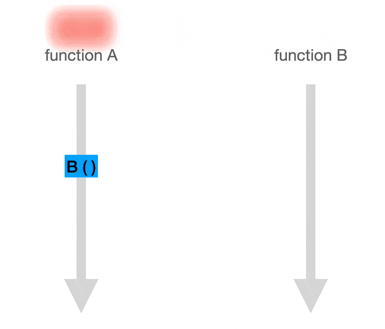
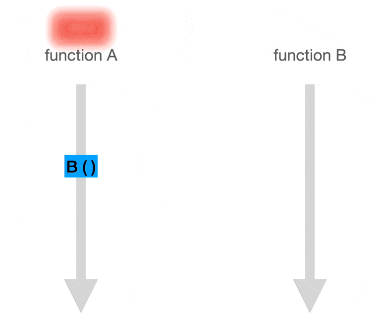
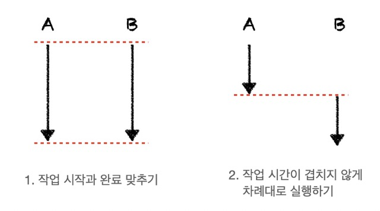
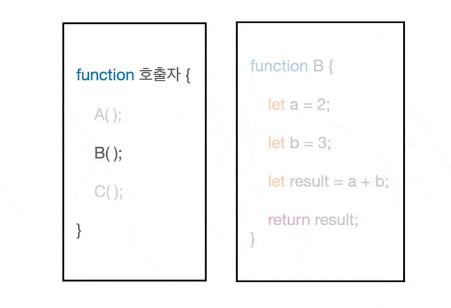

# 들어가며

> JavaScript is a single-threaded, non-blocking, asynchrounous programming language.

자바스크립트를 쓰는 개발자라면 한 번쯤은 들어본 자바스크립트에 대한 설명이다. 하지만, 이게 정확히 무슨 말인지 잘 와닿지 않는다. 논블로킹이면 막지 않는다라는 뜻이니까, 느낌상 여러 함수가 실행되는 것을 막지 않는다는 뜻인 것 같다. 근데, 동기적으로 실행되는 코드가 한 줄씩 차례대로 실행되니까 비동기는 여러 줄이 같이 실행되는건가..? 그럼 둘은 같은건가..? 매우 헷갈린다. 지금부터 이 블로킹과 논블로킹 그리고 동기와 비동기가 정확히 무엇을 의미하는지 알아보자.

# 제어권과 결과값

그 전에, 이 둘의 차이를 정확하게 이해하기 위해선 우선 제어권과 결과값이라는 개념을 알고 있어야한다.

제어권은 말그대로 함수를 제어할 수 있는 권한이다. 함수 안에 있는 내용이 실행되기 위해선, 해당 함수는 제어권을 부여받아야 한다. 쉽게, 함수가 행동할 수 있는 권리라고 생각하자.

결과값도 말그대로 함수의 결과 즉, 함수의 리턴값이다. 여기서 주의할 점이 있는데, 함수 실행 도중에 결과값을 요청하면, 아직 결과가 없더라도 함수는 '아직 결과 없음'이라는 결과값을 임시로 내놓을 수 있다.

함수들은 다음과 같이 서로 제어권과 결과값을 주고 받으며 실행된다.

<figure>
<a style="text-align: center; width: 100%;" href="../../images/sync-async-block-nonblock/control-result.gif">
  
  <figcaption></figcaption>
</a>
</figure>

# 블로킹과 논블로킹

블로킹과 논블로킹은 전체적인 작업의 흐름이 어떠한 작업에 의해 중단되는지 여부에 따라 결정된다. 즉, 함수를 실행하는 **제어권이 누구한테 있는지**가 핵심이다.

## 블로킹

**전체적인 작업의 흐름이 다른 작업에 의해 멈추면** 이는 블로킹이다.
제어권의 관점에서 보면, A 함수가 B 함수를 호출할 시 제어권이 A 함수에서 B 함수로 넘어간다.
B 함수가 완료돼서야, 제어권이 B 함수에서 A 함수로 넘어온다.

이 과정을 그림과 함께 순서대로 살펴보자.

<figure>
<a style="text-align: center; width: 100%;" href="../../images/sync-async-block-nonblock/blocking.gif">
  
  <figcaption></figcaption>
</a>
</figure>

1. A 함수가 B 함수를 호출한다. 제어권은 A 함수에서 B 함수로 넘어간다.
2. 제어권을 받은 B 함수가 실행된다. 제어권을 잃은 A 함수는 A 함수의 실행을 멈춘다.
3. B 함수의 실행이 끝나고 제어권을 다시 A 함수에게 돌려준다. 나머지 A 함수가 실행된다.

## 논블로킹

**다른 작업의 실행이 전체적인 작업의 흐름을 중단시키지 않으면** 이는 논블로킹이다.
제어권의 관점에서 보면, A 함수가 B 함수를 호출하지만 제어권은 계속 A 함수에게 있다. 

이 과정을 그림과 함께 순서대로 살펴보자.

<figure>
<a style="text-align: center; width: 100%;" href="../../images/sync-async-block-nonblock/non-blocking.gif">
  
  <figcaption></figcaption>
</a>
</figure>

1. A 함수가 B 함수를 호출한다. 하지만, 제어권은 넘기지 않는다.
2. 제어권이 A 함수에게 있으므로, B 함수가 호출되어도 A 함수는 멈추지 않고 실행된다.

> 제어권이 없는 B 함수가 어떻게 실행되는건가?
>
> 함수의 실행 주체가 다른 서버나 동일 서버 내 다른 스레드(멀티 스레드)에 있기 때문에, 제어권을 넘겨주지 않아도 함수가 실행될 수 있다. 예를 들어, http 통신의 경우 B 함수를 실행하는 주체는 원격 서버가 될 수 있다. 

# 동기와 비동기

동기와 비동기는 여러 작업들이 시간에 맞춰 실행되는지에 따라 결정된다. 즉, **작업 실행의 타이밍**이 핵심이다. 타이밍이 맞으면 동기 맞지 않으면 비동기다.

## 동기 (sync)

이 **'타이밍을 맞춘다(= 동기)'**라는 뜻은 2가지 중 한 가지 규칙을 따르는 것을 의미한다.

1. 작업의 시작과 완료 시간을 맞추기
2. 작업 시간이 겹치지 않게 차례대로 실행하기

<figure>
<a style="text-align: center; width: 100%;" href="../../images/sync-async-block-nonblock/sync.jpeg">
  
  <figcaption></figcaption>
</a>
</figure>

함수들끼리 이런 규칙을 지킬 수 있는 이유는 함수의 **호출자가 호출한 함수가 완료됐는지 계속 확인**하기 때문이다. 

<figure>
<a style="text-align: center; width: 100%;" href="../../images/sync-async-block-nonblock/sync-check.gif">
  
  <figcaption></figcaption>
</a>
</figure>

## 비동기 (async)

비동기는 말그대로 동기적이지 않다. 즉, 함수끼리 서로 시작과 완료에 대해 신경쓰지 않는다. 비동기로 호출된 함수는 완료되면 **스스로 호출자에게 완료되었다는 신호를 준다.** 때문에, 여러 함수들이 시작되고 끝나는 타이밍은 맞지 않을 수도 있다. 

# 동기와 블로킹의 조합

# 정리

# Reference

- https://www.youtube.com/watch?v=IdpkfygWIMk
- https://musma.github.io/2019/04/17/blocking-and-synchronous.html
- [https://inpa.tistory.com/entry/👩%E2%80%8D💻-동기비동기-블로킹논블로킹-개념-정리](https://inpa.tistory.com/entry/%F0%9F%91%A9%E2%80%8D%F0%9F%92%BB-%EB%8F%99%EA%B8%B0%EB%B9%84%EB%8F%99%EA%B8%B0-%EB%B8%94%EB%A1%9C%ED%82%B9%EB%85%BC%EB%B8%94%EB%A1%9C%ED%82%B9-%EA%B0%9C%EB%85%90-%EC%A0%95%EB%A6%AC)
- [https://joooing.tistory.com/entry/동기비동기-블로킹논블로킹](https://joooing.tistory.com/entry/%EB%8F%99%EA%B8%B0%EB%B9%84%EB%8F%99%EA%B8%B0-%EB%B8%94%EB%A1%9C%ED%82%B9%EB%85%BC%EB%B8%94%EB%A1%9C%ED%82%B9)
