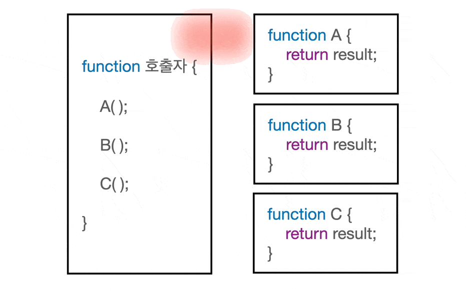

# 들어가며

> JavaScript is a single-threaded, non-blocking, asynchrounous programming language.

자바스크립트를 쓰는 개발자라면 한 번쯤은 들어본 자바스크립트에 대한 설명이다. 하지만, 이게 정확히 무슨 말인지 잘 와닿지 않는다. 논블로킹이면 막지 않는다라는 뜻이니까, 느낌상 여러 함수가 실행되는 것을 막지 않는다는 뜻인 것 같다. 근데, 동기적으로 실행되는 코드가 한 줄씩 차례대로 실행되니까 비동기는 여러 줄이 같이 실행되는건가..? 그럼 둘은 같은건가..? 매우 헷갈린다. 지금부터 이 블로킹과 논블로킹 그리고 동기와 비동기가 정확히 무엇을 의미하는지 알아보자.

# 제어권과 결과값

그 전에, 이 둘의 차이를 정확하게 이해하기 위해선 우선 제어권과 결과값이라는 개념을 알고 있어야한다.

제어권은 말그대로 함수를 제어할 수 있는 권한이다. 함수 안에 있는 내용이 실행되기 위해선, 해당 함수는 제어권을 부여받아야 한다. 쉽게, 함수가 행동할 수 있는 권리라고 생각하자.

결과값도 말그대로 함수의 결과 즉, 함수의 리턴값이다. 여기서 주의할 점이 있는데, 함수 실행 도중에 결과값을 요청하면, 아직 결과가 없더라도 함수는 '아직 결과 없음'이라는 결과값을 임시로 내놓을 수 있다.

함수들은 다음과 같이 서로 제어권과 결과값을 주고 받으며 실행된다.

<figure>
<a style="text-align: center; width: 100%;" href="../../images/sync-async-block-nonblock/control-result.gif">
  
  <figcaption></figcaption>
</a>
</figure>

# 블로킹과 논블로킹

# Reference

- https://www.youtube.com/watch?v=IdpkfygWIMk
- https://musma.github.io/2019/04/17/blocking-and-synchronous.html
