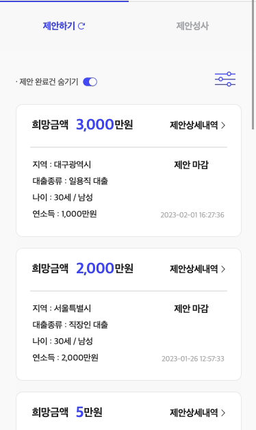
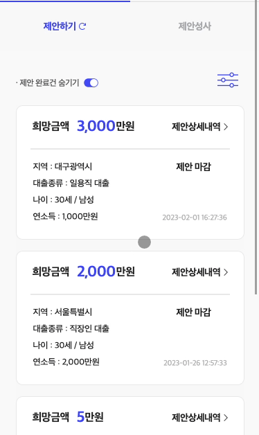

## 무한 스크롤이란?

무한 스크롤 (Infinite Scroll)은 유저가 페이지를 스크롤링 중 최하단에 도달했을 때, 나머지 컨텐츠를 로드하는 페이징 방식으로 페이지 번호를 일일이 클릭해야하는 페이지네이션 (Pagination)보다 편리한 사용자 경험 (UX)을 제공한다. 무한 스크롤의 장단점은 다음과 같다.

### 장점

- 한번에 모든 컨텐츠를 로드하지 않고, 보여줄 수 있는 만큼만 로드하기 때문에 리소스를 효율적으로 사용.
- 페이지 버튼을 클릭할 필요 없이, 컨텐츠 탐색이 가능하여 편리함.
- 따라서, 페이징이 많이 일어나는 환경 (모바일, 세로로 긴 화면)에 특화.

### 단점

- 한 페이지에 많은 컨텐츠를 로드할 경우, 성능 하락을 일으킬 수 있음.
- 많은 컨텐츠를 로드한 후, 다시 봤던 컨텐츠로 돌아가는데 번거로움.
- 사이트의 최하단 (Footer)에 도달하기 어려워짐.

## Intersection Observer API란?

무한 스크롤을 구현하는 한 가지 방법으로, 브라우저가 기본적으로 제공하는 Web API 중 하나다.

**브라우저 뷰포트(Viewport)와 타겟 요소(Element)의 교차점을 관찰**하며, 이를 통해 뷰포트 안에 해당 요소의 존재 여부를 판단한다. 쉽게 말해, 현재 화면에 요소가 보이고 있는지 여부를 알려주는데 이를 활용하여 다양한 기능을 구현할 수 있다.

### 활용 예시

아래는 MDN에서 설명하는 Intersection Observer API를 활용할 수 있는 예시다.

- 페이지 스크롤 시 이미지를 Lazy-loading(지연 로딩)
- **Infinite scrolling(무한 스크롤)을 통해 스크롤할 때 새로운 콘텐츠를 불러옴**
- 광고의 수익을 계산하기 위해 광고의 가시성을 판단
- 사용자가 결과를 볼 것인지에 따라 애니메이션 동작 여부를 결정

### 실행 로직

Intersection Observer API에는 `observer (관찰자)`, `entry (관찰 대상)`, `option (조건)` 그리고 `callback(콜백함수)`가 존재하며 다음과 같은 일련의 과정을 통해 동작한다.

1. `관찰자`와 `관찰 대상`을 생성
2. `관찰자`는 `관찰 대상`을 관찰
3. `관찰 대상`이 `조건`을 만족하면 `콜백 함수`를 실행

### Scroll Event를 사용하지 않는 이유

이전에는 window 객체에 scroll event를 연결하여 특정 지점까지 스크롤되었을 때, 다음 콘텐츠를 불러오는 식으로 무한 스크롤을 구현했다. 하지만 스크롤을 할때마다 이벤트가 호출되어 성능에 좋지 않았고, 쓰로틀(Throttle)이나 디바운싱 (Debouncing) 같은 최적화 작업이 추가적으로 필요했다.

> - 쓰로틀 (Throttle)
>   : 스크롤 이벤트가 발생한 이후, 일정 시간동안의 이벤트 콜백을 무시

> - 디바운싱 (Debouncing)
>   : 스크롤 이벤트가 연달아 발생하면, 마지막 (혹은 첫번째) 이벤트의 콜백만 실행

Intersection Observer API는 메인 스레드와 별개로 비동기적으로 실행되기 때문에, 최적화 없이도 훨씬 빠른 퍼포먼스를 보여준다.

## 직접 구현해보기

사내 프로젝트에서 구현한 무한 스크롤을 예시로 정리해보았다. 예시에서, API의 파라미터로 `offset (요청 데이터의 시작 인덱스)` 과 `size (요청 데이터의 수)` 를 받기 때문에, 만약 페이지 수를 받는 API를 사용한다면 조금 다르게 적용해야할 수 있다.

### 1. Data Fetching

우선, 상단에 데이터를 처리하기 위해 필요한 state를 정의해주자.

```jsx
const observer = useRef();
const offset = useRef(0);

const [hasMore, setHasMore] = useState(false);
const [isLoading, setIsLoading] = useState(true);
const [isMoreLoading, setIsMoreLoading] = useState(false);
const [dataList, setDataList] = useState([]);
```

하나씩 설명하자면, 다음과 같다.

- observer : 관찰자 (observer)를 생성한 후 저장
- offset : offset을 저장

> 위 두가지 변수는 컴포넌트 리렌더링이 필요하지 않으므로, ref로 선언하였다.

- hasMore : 아직 받아오지 않은 데이터가 남아있는지 여부. false일 경우, 더 이상 요청을 하지 않고 더보기 버튼과 로딩의 렌더링을 방지한다.
- isLoading, isMoreLoading : 초기 페이지의 로딩과 스크롤 시 하단에 생기는 로딩 렌더링
- dataList : 받아온 데이터 렌더링

이제, 본격적으로 데이터를 요청하는 함수를 선언해보자. 인자로 `mode`라는 문자열을 받는데 처음 페이지에 진입하거나 새로고침 시 `init` 으로 호출하고, 무한 스크롤 시 `loadMore` 으로 호출한다. `mode`에 따라서, `loading`과 `offset`을 다르게 처리해주자.

```jsx
const getData = async (mode) => {
  if (mode === "init") {
    setIsLoading(true);
  } else if (mode === "loadMore") {
    setIsMoreLoading(true);
  }

  const body = {
    size : 5,
    offset: mode === "init" ? 0 : offset.current,
  };

  const { status, data } = await exampleAPI.gets(body);
  ...
};
```

서버로부터 응답이 오면, 상태 코드에 맞게 데이터를 처리해주자.

1. 정상적으로 받아올 경우 ( 200 )

   응답에 `count (데이터의 수)` 가 있을 경우, offset과 size를 더한 값보다 크다면 아직 받아올 데이터가 남아있다는 뜻으로 `setHasMore`을 `true`로 할당한다. 반대의 경우, `false`로 할당한다.

   `mode` 가 `init` 일 경우, 0번째부터 시작하는 데이터이기 때문에 배열을 그대로 저장한다. `offset`은 `size (받아온 데이터의 수)`와 동일하다.

   `mode`가 `loadMore` 일 경우, 기존 데이터에 새로운 데이터를 합쳐준다. `offset`은 기존의 것과 `size`를 합쳐 누적시킨다.

   ```jsx
   if (status === 200) {
     if (data.data.count > offset.current + size) {
       setHasMore(true);
     } else {
       setHasMore(false);
     }

     if (mode === "init") {
       setLoanApplicationList(data.data.rows);
       offset.current = size;
     } else if (mode === "loadMore") {
       setLoanApplicationList((prev) => prev.concat(data.data.rows));
       offset.current = offset.current + size;
     }
   }
   ```

1. 에러가 발생할 경우 ( 4XX )

   404 에러는 해당 데이터가 존재하지 않기 때문에, 아래와 같이 처리해준다.

   추가적으로 이외 에러 코드의 에러 핸들링 또한 처리해주자.

   ```jsx
   else if (status === 404) {
    if (mode === "init") {
      setDataList([]);
    } else if (mode === "loadmore") {
      setHasMore(false);
    }
   } else {
    // 이외 에러 핸들링
   }
   ```

### 2. Observer 생성

이제 우리가 렌더링할 데이터의 컴포넌트를 관찰할 관찰자 (Observer)를 만들 차례다.
아래 코드를 하나하나 자세히 살펴보자.

```jsx
const loadMoreOnDisplay = useCallback(
  // 1. observer를 연결한 노드(엘리먼트)가 인자로 주어진다.
  (node) => {
    // 2. 이미 데이터 요청 중이라면, observer 생성을 중단한다.
    if (isMoreLoading) return;
    // 3. 새로 생성된 노드에 observer 연결시키기 위해 기존 연결을 끊는다.
    if (observer.current) observer.current.disconnect();
    /* 4. 새로운 observer를 생성하고 observer ref에 저장한다.
    observer의 인자로 여러 entries (관찰 대상)이 주어지는데,
    우리는 하나의 노드만 관찰하기 때문에 0번째 인덱스만 본다. */
    observer.current = new IntersectionObserver((entries) => {
      // 5. 관찰 중인 노드가 화면 안으로 들어오고 더 받을 데이터가 있으면 GET 요청
      if (entries[0].isIntersecting && hasMore) {
        getData("loadMore");
      }
    });
    // 6. 새로 생성한 observer가 노드를 관찰하도록 명령한다.
    if (node) observer.current.observe(node);
  },
  [isMoreLoading, hasMore]
);
```

성능 향상을 위해 `useCallback hook` 을 사용하자. 데이터 요청 함수가 호출될 때만 `observer` 생성 함수의 업데이트가 필요하다. 따라서,`Dependencies Array` 에는 `isMoreLoading`과 `hasMore` 이 들어간다.

### 3. Observer 타겟 요소 설정

모든 준비는 끝났다. 이제 `observer` 함수가 **마지막으로** 렌더링 된 컴포넌트를 `node`로 받아 실행되게 하면 된다. 앞서 생성한 `observer`가 콜백함수이기 때문에 `ref`가 아닌 `innerRef props` 로 넘겨주어야 한다. 그 다음, `innerRef props` 를 Item 컴포넌트의 wrapper의 `ref`로 설정해주자.

```jsx
...
return (
...
dataList.map(
  (item, index) => (
    <Item
      {...(dataList.length ===
        index + 1 && {
        innerRef: loadMoreOnDisplay,
        })}
        key={item.id}
        {...item}
      />
    )
  )
...

// Item.js
function Item ({..., innerRef}){
  ...
  return (
    <div ref={innerRef}>
    ...
    </div>
  )
  ...
}
```

### 4. 로딩 / 더보기 버튼 추가 (optional)

아주 가끔 미친듯이 스크롤을 하다보면, API 요청이 제대로 작동하지 않아 무한 스크롤이 안먹힐 때가 있다. 혹은 브라우저 환경에 따라, Intersection Observer API를 지원하지 않을 수도 있다. 이를 대비하여, 수동으로도 데이터 로드가 가능하게 하면 좋다.

더 받아올 데이터가 존재하고 동시에 로딩 중이라면 로딩을, 혹은 어떤 문제로 인해 로딩이 제대로 작동하지 않는다면 더보기 버튼을 렌더링 시켜주자.



```jsx
...
return (
...
  dataList.map(...)
  {isMoreLoading ? (
      <Loading
        isLoading={isMoreLoading}
        ...
      />
 ) : (
  <button
    onClick={() =>
      !isMoreLoading &&
      getLoanApplications("loadMore")
    }
  >
  더 보기
  </button>
  )}
...
```
