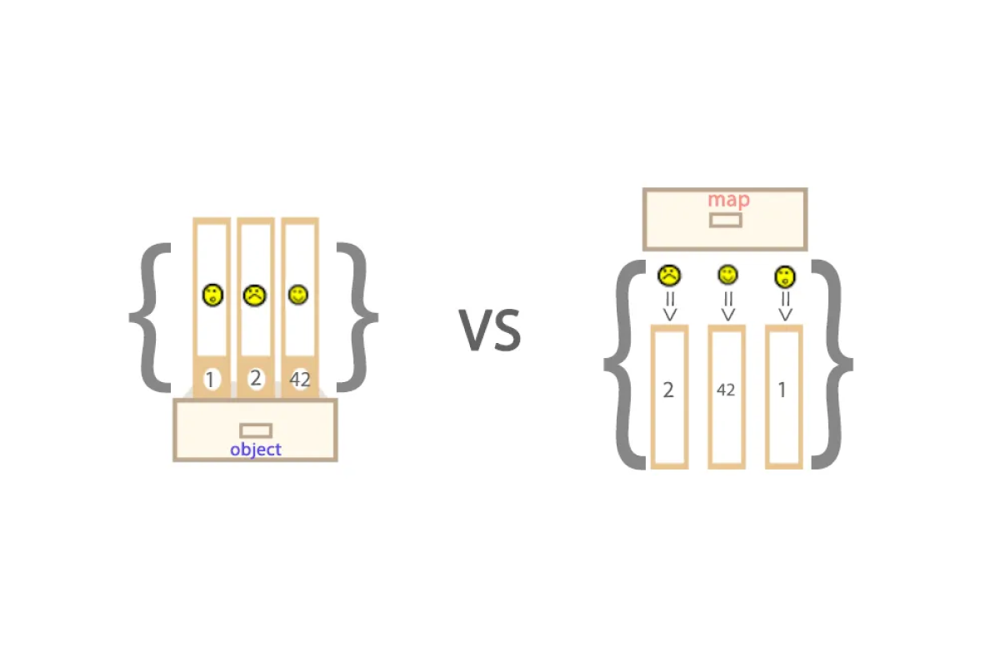

<a href="https://medium.com/front-end-weekly/es6-map-vs-object-what-and-when-b80621932373">
  
</a>

최근 코딩 테스트 문제를 풀면서 Map을 이용한 풀이들을 자주 접하였다. `key - value` 자료형이 필요할 때는 무조건 Object만 썼었는데 Map 객체가 궁금해졌다. 그래서, 이번 포스팅을 통해 Map이 무엇인지, 무엇이 좋고 어떻게 써야하는지 알아보려고 한다.

# Map이란?

ES6부터 도입된 문법이다. Object와 마찬가지로 `key-value` 쌍으로 이루어진 자료 구조로 Map들은 key를 통해 아주 쉽게 데이터에 접근 할 수 있도록 한다. 사실 간단한 데이터 구조에선 이 둘은 크게 차이가 나지 않는다. 그런데도, Map이 나중에 도입된 이유는 약간의 **성능적인 이점**과 **사용의 편리함** 때문인 것 같다. 구체적인 내용은 지금부터 알아보자.

# Object와의 주요 차이점

## 차이점

- Map은 내장 메소드만을 이용하여 값의 추가, 조회, 삭제가 가능하다.
- `key-value` 추가 / 삭제에 있어서 Object보다 좀 더 좋은 성능을 낸다.
- Key 선언에 있어서 타입 제한이 없다.
- 데이터가 추가된 순서를 기억한다. 때문에, 배열처럼 반복문을 사용할 수 있다.

주요한 차이점을 표로 정리하면 다음과 같다.

## 한 눈에 보기

| 차이점     | Map                                                         | Object                                                                                     |
| ---------- | ----------------------------------------------------------- | ------------------------------------------------------------------------------------------ | --- |
| 기본 key   | 직접 추가한 key 이외에는 어떠한 key도 가지고 있지 않는다.   | Prototype 기반이기 때문에, 기본 key가 존재한다. key 추가 시, 기존 것과 충돌할 위험이 있다. |
| key 자료형 | 모든 자료형이 가능하다.                                     | String 또는 Symbol만 가능하다.                                                             |
| key 순서   | 추가한 순서대로 정렬된다.                                   | 정렬되지 않는다.                                                                           |
| 순회       | 추가된 key 순으로 정렬되기 때문에, 순회가 가능하다.         | 모든 key의 배열을 구한 다음, 이를 순회하여 value를 참조해야한다.                           |
| 크기       | size 호출만으로 바로 알아낼 수 있다. ( O(1)의 시간 복잡도 ) | 모든 key를 구한 후, 그 길이를 구해야한다. ( O(n)의 시간 복잡도 )                           |
| 성능       | key-value 잦은 추가 / 제거 최적화 되어있다.                 | key-value 잦은 추가 / 제거에 최적화 되어 있지 않다.                                        |     |

# 언제 무엇을 써야하나?

## Object

- 객체를 json 객체로 변환하는 로직이 자주 반복되면, Object를 사용하는 것이 좋다. 기본적으로, Map 객체는 json으로 변환할 수 없다. 변환하려면 `stringify` 메소드의 두 번째 인자로 `replacer` 함수를 전달하여 변환 전 값을 변형하는 과정을 거쳐야한다.
- 간단한 데이터 구조를 다룰 경우, Object를 사용하는 것이 좋다. Map은 생성자 ( `new Map()` )로 객체를 만들지만, Object는 객체와 배열을 생성하는 간단한 방법으로 생성자로 객체를 생성하는 방법보다 더 좋은 퍼포먼스를 보인다.

## Map

객체에 데이터를 자주 추가, 삭제할 경우, Map을 쓰는 것이 좋다.

- 위 작업 시 성능적으로 더 뛰어나다. (1000만개의 entry가 있는 객체의 size를 구하는데, Object는 1600ms, Map은 1ms 이하가 걸렸다고 한다.)
- Prototype이 아니므로, 기본 key가 없다. 따라서, key 생성 시 중복될 위험이 적다.
- Map 객체는 조회, 추가, 삭제 등 다양한 메소드를 지원하기 때문에, `key-value` 형태의 데이터를 다루기 용이하다.
- Map은 key가 추가된 순으로 정렬되기 때문에, 그 자체가 iterable 하다. 따라서, 객체의 요소를 순회해야 하는 경우, 좋은 성능을 낸다.

# Map 객체 내부

## 속성

<h3>Map.prototype.size</h3>

Map에 저장된 데이터의 수를 가져옴.

```jsx
const map1 = new Map();

map1.set("a", "alpha");
map1.set("b", "beta");
map1.set("g", "gamma");

console.log(map1.size); // 3
```

## 함수

<h3>Map.prototype.set(key, value)</h3>

입력한 `key`에 `value`를 저장. 이미 `key`가 있다면 `value`를 덮어씀.

```jsx
const map1 = new Map();
map1.set("bar", "foo");

console.log(map1.get("bar")); // "foo"

console.log(map1.get("baz")); // undefined
```

<h3>Map.prototype.get(key)</h3>

`key`로 찾은 데이터가 있다면 `value`를 반환하고, 없으면 `undefined`를 반환

```jsx
const map1 = new Map();
map1.set("bar", "foo");

console.log(map1.get("bar")); // "foo"

console.log(map1.get("baz")); // undefined
```

<h3>Map.prototype.has(key)</h3>

`key`로 찾은 데이터 유무를 `boolean`으로 반환.데이터가 있다면 `true`, 없다면 `false`를 반환

```jsx
const map1 = new Map();
map1.set("bar", "foo");

console.log(map1.has("bar")); // true

console.log(map1.has("baz")); // false
```

<h3>Map.prototype.delete(key)</h3>

`key`로 찾은 데이터가 있다면, 그 데이터를 지우고 `true`를 반환한다. 없으면, `false`를 반환.

```jsx
const map1 = new Map();
map1.set("bar", "foo");

console.log(map1.delete("bar")); // true -> 삭제 성공을 의미

console.log(map1.has("bar")); // false
```

<h3>Map.prototype.clear()</h3>

Map 객체에 저장된 모든 데이터를 지움.

```jsx
const map1 = new Map();
map1.set("bar", "baz");
map1.set(1, "foo");

console1.log(map.size); // 2

map1.clear();

console.log(map1.size); // 0
```

<h3>Map.prototype.keys()</h3>

Map 객체에 저장된 모든 데이터의 `key`를 반환.

```jsx
const map1 = new Map();
map1.set("0", "foo");
map1.set(1, "bar");

const iterator1 = map1.keys();

console.log(iterator1); // MapIterator {'0' , 1}

console.log(iterator1.next().value); // "0"

console.log(iterator1.next().value); // 1
```

> **MapIterator.next()** ( 수동으로 반복자 순회 )
>
> 반복자 객체의 메소드인 `next()`  수동으로 호출하여 반복자 (Iterator)를 순회할 수 있다.
>
> ```jsx
> const myMap = new Map();
> myMap.set("0", "foo");
> myMap.set(1, "bar");
> myMap.set({}, "baz");
>
> const mapIter = myMap[Symbol.iterator]();
> console.log(mapIter); // MapIterator {'0' => 'foo', 1 => 'bar', {…} => 'baz'}
> console.log(mapIter.next()); // {value: Array(2) ( ['0', 'foo'] ), done: false}
> console.log(mapIter.next()); // {value: Array(2) ( [1, 'bar'] ), done: false}
> console.log(mapIter.next()); // {value: Array(2) ( [{}, 'baz'] ), done: false}
> console.log(mapIter.next()); // {value: Array(2) ( undefined ), done: true}
> ```

<h3>Map.prototype.values()</h3>

Map 객체에 저장된 모든 데이터의 `value`를 반환.

```jsx
const map1 = new Map();
map1.set("0", "foo");
map1.set(1, "bar");

const iterator1 = map1.values();

console.log(iterator1.next().value); // "foo"

console.log(iterator1.next().value); // "bar"
```

<h3>Map.prototype.entries()</h3>

Map 객체에 저장된 모든 데이터의 `[key, value]`를 반환.

```jsx
const map1 = new Map();

map1.set("0", "foo");
map1.set(1, "bar");

const iterator1 = map1.entries();

console.log(iterator1.next().value); // ["0", "foo"]

console.log(iterator1.next().value); // [1, "bar"]
```

<h3>Map.prototype.forEach(callbackFn[, thisArg])</h3>

Map 객체에 있는 데이터를 순차적으로 호출하여 콜백함수를 실행.

```jsx
const map1 = new Map([
  ["foo", 3],
  ["bar", {}],
  ["baz", undefined],
]);

map1.forEach((value, key, map) => {
  console.log(`map1[${key}] = ${value}`);
});

/* 
  "map1[foo] = 3"
  "map1[bar] = [object Object]"
  "map1[baz] = undefined"
*/
```

# WeakMap

객체는 한번 생성되면 참조하는 요소가 없어도 재사용 될 가능성이 있다고 판단되어 메모리에서 삭제되지 않고 계속 남아있다. 이런 경우 메모리가 낭비될 위험이 존재한다.그래서 WeakMap이 등장한다.

## 차이점

<h3>자동 가비지 컬렉팅</h3>

WeakMap은 참조하는 객체가 사라지면 자동으로 가비지 콜렉팅이 되는 Map 객체다. WeakMap의 key로 사용된 객체를 참조하는 것이 아무것도 없다면 해당 객체는 메모리와 WeakMap에서 자동으로 삭제된다.

```jsx
let john = { name: "John" };

let weakMap = new WeakMap();

weakMap.set(john, "...");

john = null; // 참조를 덮어씀

// john을 참조하는 요소가 없기 때문에 메모리에서 삭제됨
```

<h3>반복작업 관련 메서드 지원 X</h3>

WeakMap은 반복 작업과 `keys()`, `values()`, `entries()` 메서드를 지원하지 않는다. 따라서 위크맵에선 키나 값 전체를 얻는 게 불가능하다.

WeakMap이 지원하는 메서드는 `get`, `set`, `delete`, `has` 뿐이다. 반복 작업과 관련된 메서드를 지원하지 않는 이유는 가비지 컬렉션 동작 방식 때문이다. 객체의 참조 요소가 사라지면, 메모리에서 지워지는데 이 시점을 알 수 없다. 반복 작업 도중, 가비지 컬렉팅이 일어날 수 있기 때문에 WeakMap 전체 요소를 순회하며 동작하는 메서드는 불가능하다.

## 사용 예시

<h3>추가 데이터 저장</h3>

서드파티 라이브러리와 같은 외부 코드로 부터 객체를 가져와 작업하는 일은 흔하다. 이 객체에 데이터를 추가하여 어떤 작업을 해야할 때, WeakMap을 사용하면 좋다.객체를 key로 데이터를 WeakMap에 저장하면, 추후에 객체의 참조 요소가 사라지게 될 때 데이터도 함께 가비지 컬렉팅의 대상이 된다. 이런 식으로, 메모리 누수 없이 깔끔한 작업이 가능하다.

<h3>캐싱</h3>

캐싱은 시간이 오래 걸리는 작업의 결과를 저장하여 연산 시간과 비용을 절약하는 기법이다. 똑같은 함수를 여러 번 호출하면 최초 호출 시만 연산을 하고, 이후엔  `cache` 에 저장된 값을 결과로 가져온다. `cache`에 Map 객체를 사용할 경우, `cache`를 수동으로 청소해주어야 하는 반면, WeakMap을 사용하면 자동 가비지 컬렉팅이되므로 그럴 필요가 없다.

# Reference

- [https://developer.mozilla.org/en-US/docs/Web/JavaScript/Reference/Global_Objects/Map](https://developer.mozilla.org/en-US/docs/Web/JavaScript/Reference/Global_Objects/Map)
- [https://velog.io/@proshy/JSSet-Map-Object-정리](https://velog.io/@proshy/JSSet-Map-Object-%EC%A0%95%EB%A6%AC)
- [https://wooncloud.tistory.com/104#Map-prototype-get-key-](https://wooncloud.tistory.com/104#Map-prototype-get-key-)
- [https://shanepark.tistory.com/220](https://shanepark.tistory.com/220)
- [https://velog.io/@young_mason/JS-Data-Structure-Map과-Set-에-대하여](https://velog.io/@young_mason/JS-Data-Structure-Map%EA%B3%BC-Set-%EC%97%90-%EB%8C%80%ED%95%98%EC%97%AC)
- [https://ko.javascript.info/weakmap-weakset](https://ko.javascript.info/weakmap-weakset)
