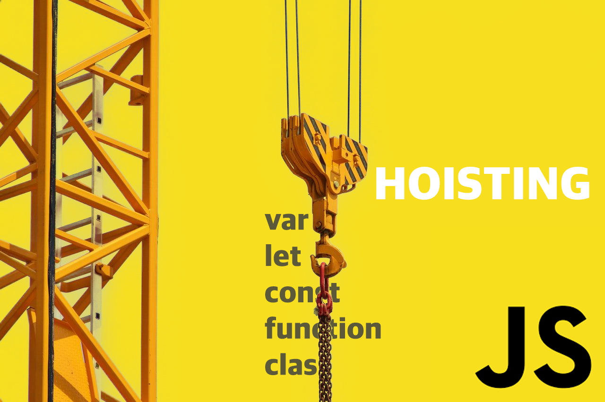
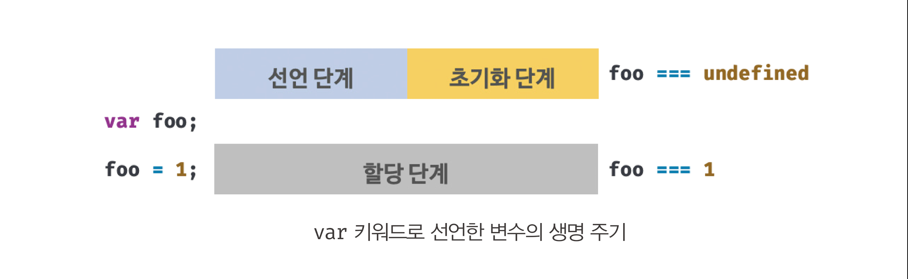
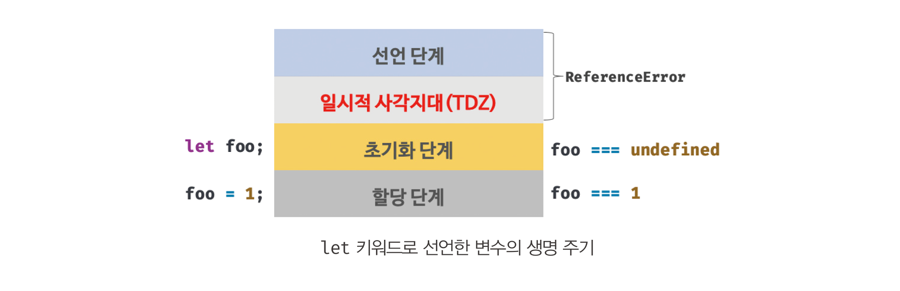

# 호이스팅이란?

호이스팅이란 변수 혹은 함수의 선언이 해당 스코프의 최상단으로 끌어 올려진 것 같이 동작하는 자바스크립트의 특징이다. 다음 예시를 보자.

```jsx
console.log(foo); // undefined

var foo;
```

자바스크립트 코드는 인터프리터에 의해 위에서부터 아래로 한줄 씩 실행된다. 위 코드에서 변수 `foo` 은 `var` 키워드로 선언이 되기 전, `console.log` 가 이를 참조하고 있다. 따라서, 참조 에러 (Reference Error)가 발생해야 할 것 처럼 보이지만, 에러가 발생하지 않고 `undefined` 가 출력된다. 또 다른 예시를 보자.

```jsx
console.log(foo); // Reference Error : foo is not defined

let foo;
```

똑같은 구조지만 `let` 키워드로 변수를 선언했다는 차이만 있다. 하지만, 이 코드는 참조 에러를 발생시킨다. 왜 이런 것일까? 바로 **호이스팅** 때문이다.

실제로 `var` 키워드의 선언문이 코드 상단으로 끌어 올려진 것은 아니다. 호이스팅을 이해하려면 자바스크립트 엔진이 코드를 실행할 때, 실행 컨텍스트를 생성하는 과정에서 스코프에 선언을 등록하는 방식을 알아야한다.

# 왜 발생하는가?

자바스크립트 엔진은 함수를 실행시키기 전, 해당 함수를 한 번 훑어본 후 함수 안에 존재하는 변수와 함수선언에 대한 정보를 기억하고 있다가 실행시킨다. 이 암묵적인 과정이 마치 선언이 끌어 올려진 듯한 느낌을 주는 것이다.

## 생명 주기의 이해

변수와 함수 선언의 정보들을 기억 (저장)하는데 컴퓨터는 자원 (보통 컴퓨터의 메모리)를 사용한다. 컴퓨터 시스템의 모든 자원은 유한하기 때문에 자원은 생성되고 사용되며 결국에 소멸되는 생명 주기를 갖는다.

## 변수 생성 과정 ( 3단계 )

변수의 생명 주기 중 변수 생성 과정은 공통적으로 ( 선언 / 초기화 / 할당 ) 총 3단계를 거친다.

### 1 ) 선언 단계 ( Declaration Phase)

- 자바스크립트 엔진이 변수를 실행 컨텍스트의 변수 객체에 등록한다.
  ( 변수 식별자를 등록할 뿐, 실제 메모리에는 아직 존재하지 않음 → 참조 불가 상태 )
- 이 변수 객체는 런타임 시, 스코프가 참조하는 대상이 된다.

### 2 ) 초기화 단계 (Initialization Phase)

- 변수 객체에 등록된 변수를 위한 공간을 메모리에 확보한다.
  ( 변수 객체가 메모리를 가리키며 참조가 가능하게 됨)
- 이 단계에서 변수는 undefined로 초기값이 설정(initialized)된다.

### 3 ) 할당 단계 ( Assignment Phase)

- undefined 상태인 변수에 실제 값을 할당한다.

# `var` vs `let` 호이스팅의 차이

맨 처음 예시에서 본 `var` 키워드로 선언한 변수의 호이스팅은 변수 생성 단계에서 그 원인이 나타난다. 다시 예시와 함께 살펴보자.

## `var` 키워드 변수 생성 단계

`var` 키워드로 선언된 변수는 런타임 이전에 **선언 단계 + 초기화 단계**가 같이 실행된다.

```jsx
// 1) 선언 단계 & 초기화 단계가 이미 완료된 상태
console.log(foo); // undefined

var foo;
console.log(foo); // undefined

// 2) 할당 단계
foo = 1;

console.log(foo); // 1
```

위 코드를 예시로, 좀 더 자세히 살펴보면 자바스립트 엔진은 다음 과정을 거쳤다.

1 ) **선언 단계**에서 코드를 한번 훑어본 후 `foo` 란 변수의 존재를 변수 객체에 등록해놓았다.

동시에, **초기화 단계**에서 `hoisting` 이라는 변수에 대한 값을 담기 위해 메모리를 확보한 후 그 공간에 `undefined` 를 초기값으로 설정해놓은 것이다.

2 ) 메모리가 확보되었으니, **할당 단계**에서 숫자 값을 할당해주었다.



## `let` 키워드 변수 생성 단계

`let` 키워드로 선언된 변수는 **선언 단계**와 **초기화 단계**가 분리되어 진행된다.

```jsx
// 1-1) 선언 단계 ( TDZ 시작 )

// 1-2)
console.log(foo); // ReferenceError : Cannot access 'foo' before initialization

// 2) 초기화 단계 ( TDZ 끝 )
let foo;
console.log(foo); // undefined

// 3) 할당 단계
foo = 1;

console.log(foo); // 1
```

위 코드를 예시로, 좀 더 자세히 살펴보면 자바스립트 엔진은 다음 과정을 거쳤다.

1 - 1 ) **선언 단계**에서 코드를 한번 훑어본 후 `foo` 란 변수의 존재를 변수 객체에 등록해놓았다.

1 - 2 ) 초기화 단계 이전에 변수를 참조하지만, `foo` 란 변수를 위한 메모리가 아직 확보되지 않은 상태이기 때문에, 참조 에러를 발생시킨다. 이로써, **선언 단계 ~** **초기화 단계 시작**까지 **일시적 사각지대 (TDZ)**가 형성된다.

> **일시적 사각지대 (Temperal Dead Zone) :** 변수를 위한 메모리 공간이 확보되지 않아 변수를 참조할 수 없는 구간. 스코프의 시작부터 초기화 단계의 시작점까지를 일컫는다.

2 ) 초기화 단계에서 `foo` 변수를 위한 메모리를 확보한다. 마찬가지로, 초기 값은 `undefined` 이다.

3 ) **할당 단계**에서 숫자 1을 할당해주었다.



# Reference

- [https://hanamon.kr/javascript-호이스팅이란-hoisting/](https://hanamon.kr/javascript-%ED%98%B8%EC%9D%B4%EC%8A%A4%ED%8C%85%EC%9D%B4%EB%9E%80-hoisting/)
- [https://nuhends.tistory.com/111](https://nuhends.tistory.com/111)
- [https://tecoble.techcourse.co.kr/post/2021-04-25-hoisting/](https://tecoble.techcourse.co.kr/post/2021-04-25-hoisting/)
- [https://poiemaweb.com/es6-block-scope#13-호이스팅](https://poiemaweb.com/es6-block-scope#13-%ED%98%B8%EC%9D%B4%EC%8A%A4%ED%8C%85)
