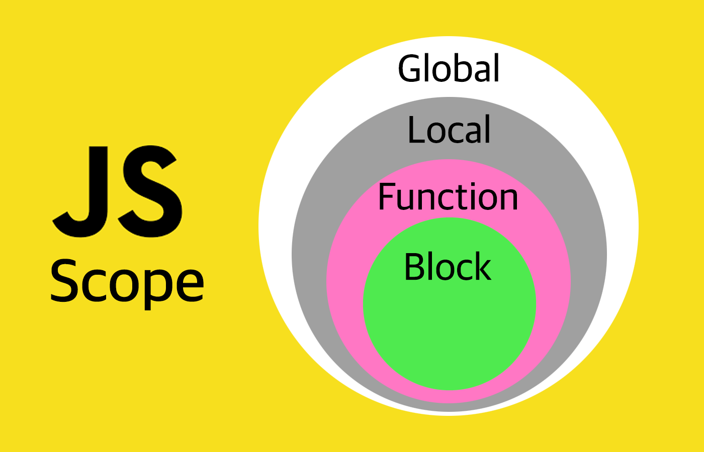
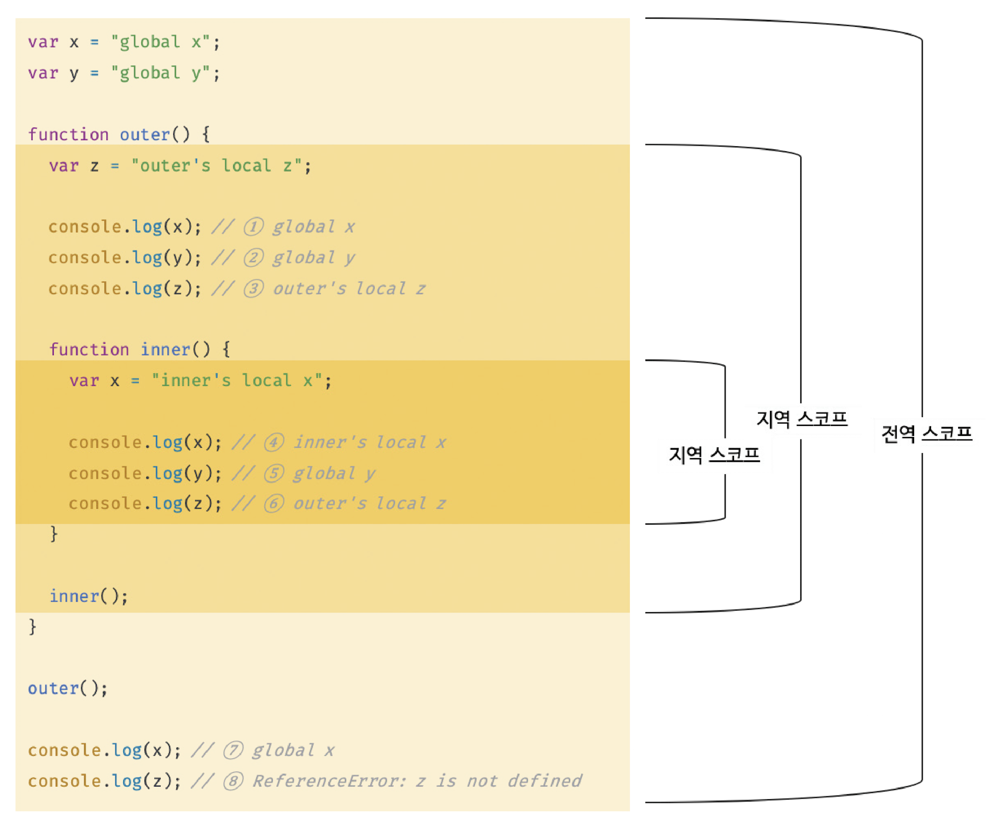
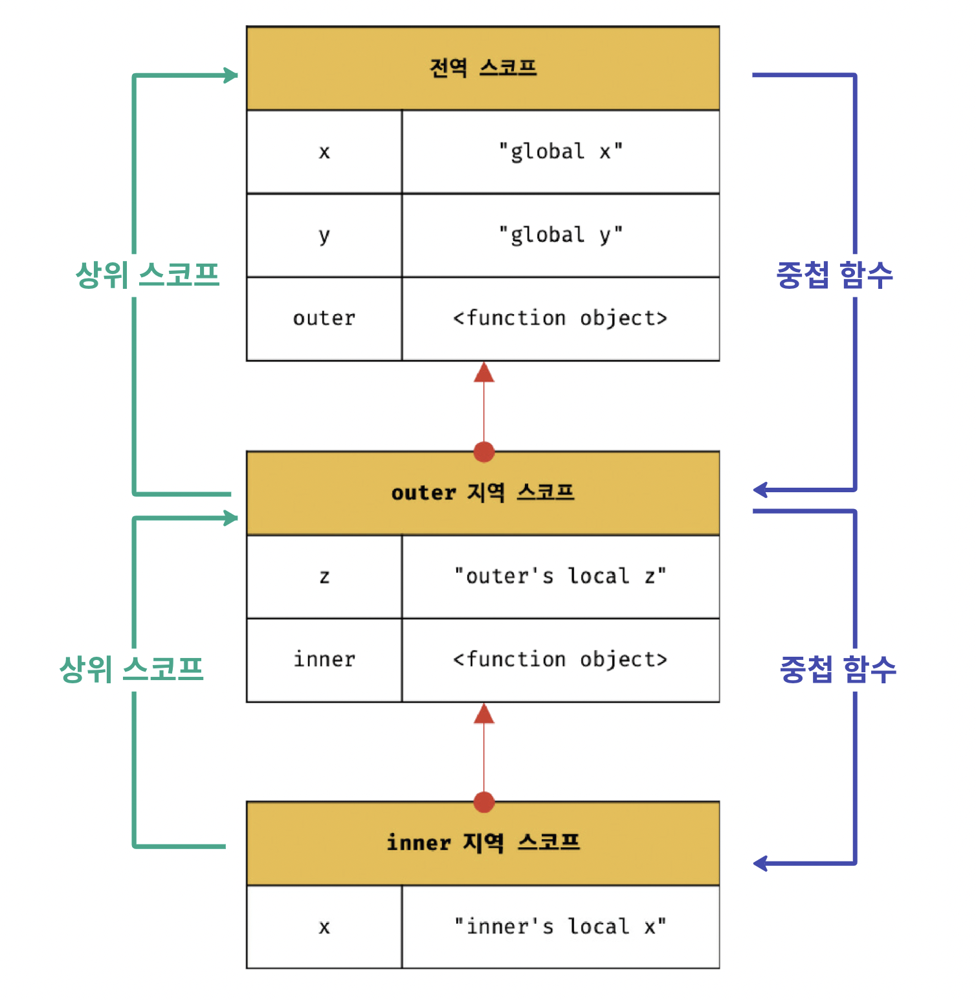
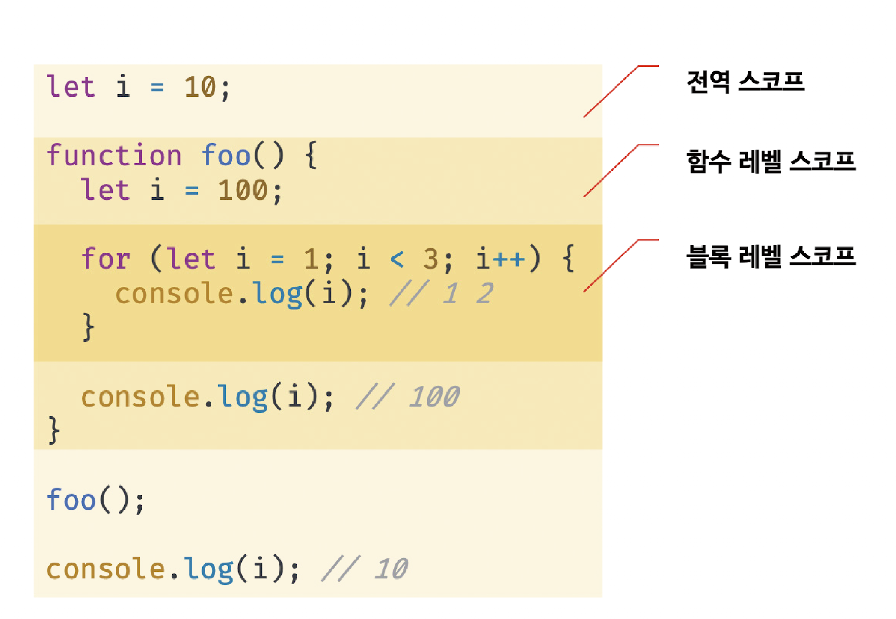

# 스코프란?

변수는 자신이 선언된 위치에 따라, 다른 코드가 변수 자신을 참조할 수 있는 범위가 결정된다. 사실, 이건 변수 뿐만 아니라 모든 식별자가 마찬가지다. 모든 식별자는 자신이 선언된 위치에 의해, 식별자 자신이 참조될 수 있는 범위가 달라진다. 이 범위를 스코프라고 한다.

> 식별자 ( Identifier) : 프로그래머가 선언하는 이름. 예로 변수명, 함수명, 속성명, 메소드명 등이 있다.

다음 예시 코드가 어떻게 동작할지 생각해보자.

```jsx
var x = "global";

function foo() {
  var x = "local";
  console.log(x); // (1)
}

foo();

console.log(x); // (2)
```

자바스크립트 엔진은 이름이 같은 두 변수 중에 어떤 변수를 참조해야할지 선택해야한다. 이를 식별자 결정이라고 한다. 엔진은 스코프를 가지고 결정한다. 즉, 스코프는 자바스크립트 엔진이 식별자를 검색할 때 사용하는 규칙이라고도 할 수 있다.

> **스코프 (Scope)** : 식별자가 유효한 범위. 자바스크립트 엔진이 식별자를 검색할 때 사용하는 규칙.

```jsx
var x = "global"; // 전역 스코프 ( 전역 변수 )

function foo() {
  var x = "local"; // 지역 스코프 ( 지역 스코프 )
  console.log(x); // "local"
}

foo();

console.log(x); // "global"
```

다시 예시로 돌아와서, 코드 가장 바깥에 선언된 `x` 변수는 어디서든 참조가 가능하다. 하지만, `foo` 함수 내에서 선언된 `x` 변수는 함수 안에서만 참조할 수 있다. 두 개의 변수는 식별자는 동일하나 스코프가 다른 별개의 변수다.

# 스코프의 종류

코드는 전역과 지역으로 분류할 수 있다.

| 구분 | 설명                  | 스코프      | 변수      |
| ---- | --------------------- | ----------- | --------- |
| 전역 | 코드의 가장 바깥 영역 | 전역 스코프 | 전역 변수 |
| 지역 | 함수 내부             | 지역 스코프 | 지역 변수 |

위의 표와 같이, 변수는 자신이 선언된 위치에 따라 자신이 유효한 범위인 스코프가 결정된다.



## 전역 스코프

전역이란 코드의 가장 바깥 영역을 말한다. 전역 스코프는 이 바깥 범위의 영역이다. 전역 스코프에서 변수를 선언하면 변수는 전역 변수가 된다. 전역 변수는 어디서든지 참조 가능하다.

위의 코드에서 변수 `x` , `y` 는 전역 변수로 어디서든 참조가 가능한 것을 볼 수 있다.

## 지역 스코프

지역이란 함수 내부 영역을 말한다. 지역 스코프는 이 함수 내부의 영역이다. 지역 스코프에서 변수를 선언하면 변수는 지역 변수가 된다. 지역 변수는 자신의 지역 스코프와 하위 지역 스코프에서 유효하다.

위의 코드에서 `x` 와 `z` 는 지역 변수다.

지역 변수 `x` 는 `inner` 함수 내부의 지역 스코프를 갖는다. 따라서, `inner` 내부에서 `x` 를 참조할 경우 지역 변수 `x` 를 참조하고 그 바깥에서 참조하면 전역 변수 `x` 를 참조하게 된다.

지역 변수 `z` 는 `outer` 함수 내부의 지역 스코프를 갖는다. 따라서, `outer` 함수 내부와 하위 함수 `inner` 안에서 지역 변수 `z` 를 참조할 수 있다. `z` 는 전역 스코프를 갖지 않으므로, 함수 밖에서 참조할 경우 참조 에러를 발생한다.

# 스코프 체인

함수는 전역에서 정의할 수도 있고 함수 안에서도 정의할 수 있다. 함수는 중첩이 가능하기 때문에 함수의 지역 스코프도 중첩될 수 있다. 따라서, 스코프는 함수의 중첩으로 인해 계층적 구조를 갖는다.

위의 코드를 다시 살펴보자. 코드에서 지역은 `outer` 함수 지역과 `inner` 함수 지역이 있다. `inner` 함수는 `outer` 의 중첩 함수다. `outer` 함수의 지역 스코프는 `inner` 함수의 지역 스코프의 상위 스코프다.  그리고 `outer` 함수의 지역 스코프의 상위 스코프는 전역 스코프다.

> **중첩 함수** : 함수 내부에서 정의한 함수

> **외부 함수** : 중첩 함수를 포함하는 함수

> **상위 스코프** : 중첩 함수를 포함하는 스코프

이러한 계층 구조를 도식으로 표현하면 다음과 같다.



이와 같이 모든 스코프는 하나의 계층적 구조로 연결되며, 최상위 스코프는 전역 스코프다. 이런 스코프의 계층적 구조를 스코프 체인이라고 한다.

자바스크립트 엔진은 스코프 체인을 통해 변수를 참조한다. 변수를 참조하는 스코프에서 시작하여 상위 스코프로 단방향으로 이동하며 선언된 변수를 검색한다.

스코프 체인은 물리적인 실체로 존재한다. 코드를 실행하기 전, 자바스크립트 엔진은 위 그림과 유사한 자료구조인 렉시컬 환경을 생성한다. 변수가 선언되면 변수 식별자가 자료구조의 `key`로 등록되고, 값이 할당되면 `key`에 해당하는 값을 변경한다. 변수 검색 또한 이 자료구조를 이용한다.

## 변수 검색

자바스크립트 엔진이 어떻게 스코프 체인을 통해 변수를 찾는지 알아보자. 위 코드 4, 5, 6번을 살펴보자.

4번 )

1.  `x` 변수를 참조하는 코드 `console.log(x)` 가 속한 스코프, `inner` 함수의 지역 스코프에서 `x`가 선언되었는지 확인한다.
2.  해당 함수 내에 `x` 변수 선언이 존재한다. 따라서, 검색된 변수를 참조하고 검색을 종료한다.

5번 )

1. `y` 변수 참조 코드의 스코프, `inner` 함수의 지역 스코프에서 `y` 가 선언되었는지 확인한다.

2. `inner` 함수 내에 `y` 변수 선언이 존재하지 않으므로 상위 스코프인 `outer` 함수의 지역 스코프로 이동한다.
3. `outer` 함수 내에도 없으므로 또 다시 상위 스코프인 전역 스코프로 이동한다.
4. 전역 스코프에 `y` 변수 선언이 존재한다. 따라서, 검색된 변수를 참조하고 검색을 종료한다.

6번 )

1.  `z` 변수 참조 코드의 스코프, `inner` 함수의 지역 스코프에서 `z` 가 선언되었는지 확인한다.

2.  `inner` 함수 내에 `z` 변수 선언이 존재하지 않으므로 상위 스코프인 `outer` 함수의 지역 스코프로 이동한다.
3.  `outer` 함수 내에 `z` 변수 선언이 존재한다. 따라서, 검색된 변수를 참조하고 검색을 종료한다.

이처럼, 자바스크립트 엔진은 스코프 체인을 통해 변수를 참조하는 코드가 존재하는 스코프에서부터 상위 스코프로 단방향으로 이동하며 선언된 변수를 검색한다. 때문에, 절대 하위 스코프로 내려가 식별자를 검색하는 일은 없다. 따라서, 상위 스코프에서 유효한 변수는 하위 스코프에서 참조가 가능하지만 하위 스코프에서 유효한 변수를 상위 스코프에서 참조할 수 없다.

### 함수 검색

함수도 식별자에 할당되기 때문에 스코프를 갖는다. 함수는 함수 객체가 식별자에 할당되는 것일뿐, 변수와 다를 것 없다. 다음 예시를 보자.

```jsx
// 전역함수
function foo() {
  console.log("global function foo");
}

function bar() {
  // 지역함수
  function foo() {
    console.log("local function foo");
  }
  foo(); // (1)
}

bar();
foo(); // (2)
```

같은 식별자 `foo` 로 정의된 두 개의 함수가 있다. 하지만, 이 둘은 서로 다른 스코프를 갖는다.

1번 `foo` 함수는 지역 함수 `bar` 의 스코프에서 호출되었다. 자바스크립트 엔진은 `bar` 함수의 지역 스코프 내에서 함수 `foo` 가 정의되어있는지 먼저 탐색한다. `foo` 가 있으므로, 1번은 `"local function foo"`를 출력한다.

2번 `foo` 함수는 전역 스코프에서 호출되었다. 따라서, 전역 스코프에서 정의된 `foo` 를 찾는다. 따라서, 2번은 `“global function foo”` 를 출력한다.

# 함수 / 블록 레벨 스코프

## 함수 레벨 스코프

함수 내에서 선언된 변수는 함수 내에서만 유효하며 함수 외부에서는 참조할 수 없다. 즉, 함수 내부에서 선언한 변수는 지역 변수이며 함수 외부에서 선언한 변수는 모두 전역 변수이다.

### var 키워드로 선언한 변수의 문제점

ES6 이전, `var` 는 변수를 선언할 수 있는 유일한 키워드였다.

`var` 키워드로 선언한 변수는 여러 문제점을 가지고 있는데, 다음과 같다.

1. 중복 선언 허용
2. **함수 레벨 스코프**
3. 변수 호이스팅 ( 이 <a href="../../javascript/hoisting">글</a>에서 확인할 수 있다. )

이 중 하나가 함수 레벨 스코프를 갖는다는 것이다.

구체적으로, `var` 키워드는 오로지 함수의 코드 블록을 지역 스코프로 인정한다. 이로 인해, 의도치 않게 전역 변수가 중복 선언, 값이 재할당 되는 경우가 있었다. 다음 코드를 보자.

```jsx
var i = 10;

for (var i = 0; i < 5; i++) {
  console.log(i); // 0 1 2 3 4
}

console.log(i); // 5
```

`var` 키워드는 블록 레벨 스코프를 인정하지 않기 때문에, `for` 문 안에서 `var` 키워드로 선언한 변수 `i` 는 지역 변수가 아닌 전역 변수다. 따라서, 변수 `i` 는 **중복 선언**되고 **의도치 않게** **전역 변수가 재할당** 되었다.

이런 문제로 인해, 함수 레벨 뿐만 아니라 블록 레벨을 지원하는 선언 키워드가 필요했고 ES6에서 `let` 과 `const`가 도입되었다 .

## 블록 레벨 스코프

함수 몸체 뿐만 아니라, 모든 코드 블록 ( `if`문, `for`문, `while`문, `try/catch`문 등) 내에서 선언된 변수는 코드 블록 내에서만 유효하며 코드 블록 외부에서는 참조할 수 없다. 즉, 코드 블록 내부에서 선언한 변수는 지역 변수이다.



## `var` vs `let` vs `const`

위에서 언급했듯, `var` 키워드는 변수의 재선언과 재할당이 모두 가능하고 게다가 유효 범위(스코프)가 함수 레벨이기 때문에 의도치 않은 버그를 발생시킬 수 있다. 따라서, ES6 이상 문법을 사용한다면, `let` 과 `const` 를 쓰는 것이 바람직하다.

변수 선언은 기본적으로 `const` 를 사용하고 재할당이 필요한 경우에만 `let` 을 사용하자. 이 때, 변수 스코프는 최대한 좁게 만드는 것이 안전하다.

|        | var       | let       | const     |
| ------ | --------- | --------- | --------- |
| 스코프 | 함수 레벨 | 블록 레벨 | 블록 레벨 |
| 재선언 | O         | X         | X         |
| 재할당 | O         | O         | X         |

# 렉시컬 스코프

프로그래밍 언어에서 상위 스코프를 결정하는 두 가지 방식이 있다. 바로, **동적 스코프 (dynamic scope)** 와 **정적 스코프 (static scope)** 또는 **렉시컬 스코프 (lexical scope)** 다.

> 동적 스코프는 **함수를 어디서 호출했는지**에 따라 함수의 상위 스코프를 결정한다.

> 렉시컬 스코프는 **함수를 어디서 정의했는지**에 따라 함수의 상위 스코프를 결정한다.

자바스크립트는 렉시컬 스코프를 따른다. 즉, 자바스크립트에서 함수의 상위 스코프는 함수 선언문이나 함수 표현식으로 함수가 정의될 때 정적으로 결정되고 이를 기억하여 함수가 호출될 때마다 상위 스코프를 참조한다.

이를 잘 머릿속에 새긴 후, 다음 코드를 보고 출력 값을 예상해보자.

```jsx
var x = 1;

function foo() {
  var x = 100;
  bar();
}

function bar() {
  console.log(x);
}

foo(); // ?
bar(); // ?
```

함수 `foo` 는 전역 함수다. 따라서, 전역에서 선언된 전역 변수 `x` 를 참조한다.

그런데 여기서 헷갈리는건 함수 `bar`다. 함수 `bar` 는 함수 `foo` 의 지역 스코프에서 호출되었다. 다시 한번 중요 포인트를 되새겨보자. 자바스크립트에서 상위 스코프는 함수가 정의된 위치에 의해 상위 스코프를 결정한다고 했다. 즉, 함수가 호출된 위치는 상위 스코프와 전혀 관계가 없다.

따라서, 함수 `bar` 도 `foo` 와 마찬가지로 전역에서 선언된 전역 함수이므로, `foo` 와 `bar` 모두 전역 변수 `x` 를 참조한다. 그 결과, 숫자 1을 출력할 것이다.

# Reference

- [https://poiemaweb.com/js-scope](https://poiemaweb.com/js-scope)
- [https://eblee-repo.tistory.com/37](https://eblee-repo.tistory.com/37)
- [https://dodo000.tistory.com/6](https://dodo000.tistory.com/6)
