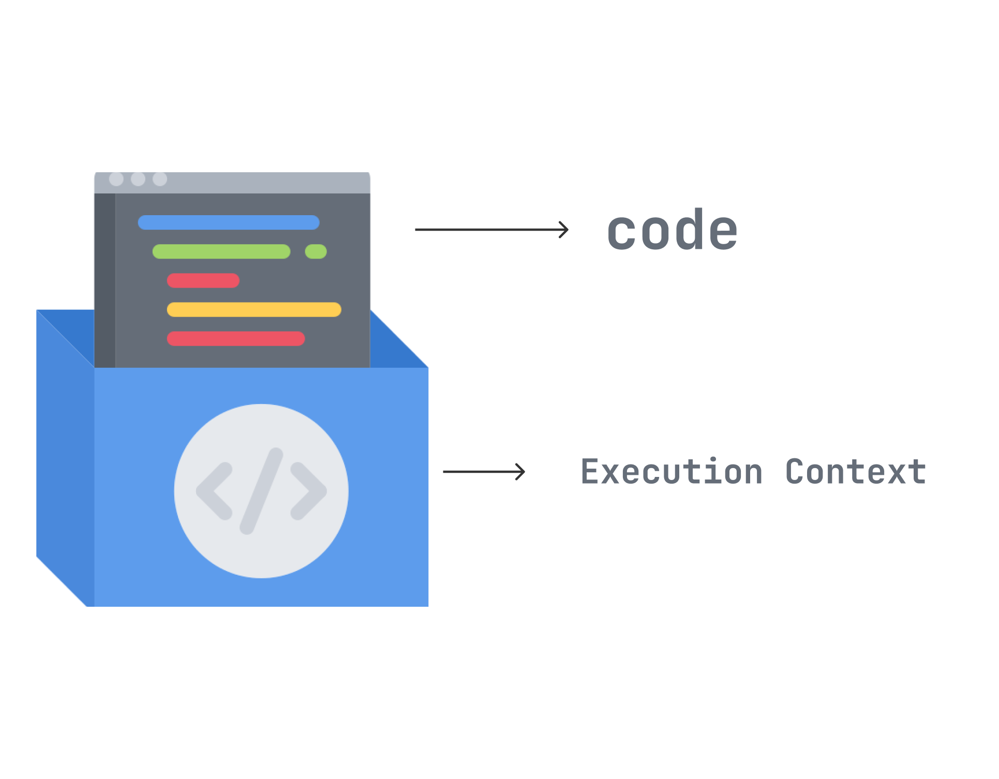
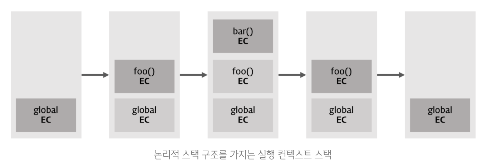

<br />

# 실행 컨텍스트

자바스크립트의 **실행 컨텍스트(Execution Context)**는 코드가 실행되는 환경을 의미하는데, 실행 컨텍스트를 번역하면 "코드의 문맥"으로 즉, 코드가 실행되는 환경이라고 볼 수 있다. 실행 컨텍스트는 코드가 실행되는 환경에서 필요한 모든 정보들을 모아둔 객체다. 이러한 정보를 저장해 둠으로써, 코드가 여러 번 실행되더라도 동일한 환경을 구성할 수 있게 된다.

<br />

# 생성 시점

자바스크립트 엔진은 스크립트를 처음 실행할 때 전역 컨텍스트를 생성하고, 이를 콜 스택 (call stack)에 push한다. 그리고 엔진은 스크립트를 순서대로 읽어 내려가다가 함수 호출을 만나면 해당 함수의 실행 컨텍스트를 새로 생성하고, 이를 또 콜 스택에 push한다. 즉, **실행 컨텍스트가 생성되는 시점은 함수가 실행되는 시점**인 것이다.

이런 식으로 함수가 실행되는 순서대로 콜 스택에 쌓인다. 더 이상 함수 호출이 없으면 가장 위에 쌓여있는 컨텍스트와 관련 있는 코드를 실행하면서 (LIFO), 전체 코드의 환경과 순서를 보장하게 된다.

## 예시

아래 예시를 통해 실행 컨텍스트의 생성 과정을 더 면밀히 살펴보자.

```jsx
var x = "xxx";

function foo() {
  var y = "yyy";

  function bar() {
    var z = "zzz";
    console.log(x + y + z);
  }

  bar();
}

foo();
```



1. 스크립트 코드를 실행하면 먼저 전역 컨텍스트가 콜 스택에 담긴다. 최상위 스코프이므로 코드가 처음 실행되고 종료될 때까지 전역 컨텍스트는 계속 유지된다.
2. `foo` 함수 호출 시, 엔진은 `foo` 함수에 대한 환경 정보를 수집하여 새로운 실행 컨텍스트를 생성하고 전역 컨텍스트 스택 위에 쌓는다.
3. `foo` 함수 실행 중 내부 함수 `bar`가 호출되면, 엔진은 `bar` 함수의 실행 컨텍스트를 생성한 후 스택 최상단에 쌓는다.
4. 스택 최상단의 `bar` 함수의 실행이 종료되면, `bar` 함수에 의해 만들어진 실행 컨텍스트는 콜 스택에서 제거된다.
5. `foo` 함수가 실행을 종료하면 `foo` 함수에 의해 만들어진 실행 컨텍스트는 콜 스택에서 제거된다.

<br />

# 종류

실행 컨텍스트는 다음 3가지 종류의 코드에 대해 실행 컨텍스트를 생성한다.

1. **전역 실행 컨텍스트 ( Global Execution Context )**

   최상위 스코프로 단 하나만 존재하며 따라서 모든 스크립트는 전역 컨텍스트 안에서 실행된다. 브라우저는 `window` 객체, Node.js은 `global` 객체가 전역 실행 컨텍스트가 된다.

2. **함수 실행 컨텍스트 ( Functional Execution Context )**

   함수가 호출될 때마다 해당 함수에 대해 생성되는 실행 컨텍스트다. 실행 컨텍스트는 함수가 호출되어야 생성되고, 각 함수들은 고유한 실행 컨텍스트를 갖는다.

3. **eval() 실행 컨텍스트 ( Eval Function Execution Context )**

   이제 거의 쓰지 않는 `eval()` 함수에 의해 생성되는 실행 컨텍스트이다.

<br />

# 구조

함수가 호출되면 전역에 있던 코드의 제어권이 함수의 내부로 이동하면서 함수 코드를 평가하기 시작한다.

함수 코드 평가는 아래 순서대로 진행된다.

1. 함수 실행 컨텍스트 생성
2. 함수 LexicalEnvironment 생성

   2-1. 함수 environmentRecord 생성

   2-2. ThisBinding

   2-3. outerEnvironmentReference 결정

평가 과정에서, 실행 컨텍스트에서 수집된 정보들을 살펴보자. 그 구조는 다음과 같다.

## VariableEnvironment

VariableEnvironment에 저장된 정보는 아래 LexicalEnvironment와 동일하다. 따라서, 각 정보의 설명도 아래와 동일하다.

차이점은 VariableEnvironment는 실행 컨텍스트가 처음 생성될 때 정보가 담기는 곳이고, 이를 스냅샷(복사본)으로 만든 LexicalEnvironment는 변경사항이 있을 때 생성되고 이를 반영한다.

<h4> · environmentRecord (snapshot) </h4>
<h4> · outerEnvironmentReference (snapshot) </h4>

## LexicalEnvironment

초기에는 VariableEnvironment와 같으나, 변경사항이 실시간으로 반영된다.

### environmentRecord

- 현재 컨텍스트와 관련된 코드 식별자 정보들 (매개변수명, 함수선언, 변수명 등)이 저장된다.
- JS엔진은 코드 실행 전에 정보를 먼저 수집하는데, 이 과정이 <a href="../../javascript/hoisting">호이스팅</a>이다.

### outerEnvironmentReference

- 외부환경에 대한 참조 정보가 저장된다.
- 상위 스코프에서 자신이 선언되었던 당시의 LexicalEnvironment를 참조한다. 연결리스트의 형태를 띠는데, 참조를 타고 끝까지 올라가면 전역 컨텍스트의 LexicalEnvironment가 나온다.
- 가까운 요소부터 차례대로 타고 올라가 참조가 가능하다. 즉, 내부에서 외부로 검색이 가능하며 이를 <a href="../../javascript/js-scope/#스코프-체인">스코프 체인</a>이라고 한다.
- 스코프 체인을 통해 상위 스코프에서도 식별자를 찾을 수 없으면 참조 에러가 발생한다.

## ThisBinding

`this`로 지정된 객체를 저장하며, `this`가 따로 지정되지 않은 경우에는 전역객체를 저장한다.

<br />

# 정리

1. 자바스크립트 엔진은 코드 실행 또는 함수 호출 시 해당 컨텍스트와 관련된 정보를 수집한다. 이 정보는 실행 컨텍스트 객체에 저장된다.
2. 최초로 저장되는 정보는 VariableEnvironment에 담기고 이후에 변경된 정보는 스냅샷인 LexicalEnvironment에 담긴다. 초기에 둘은 같은 정보를 담고 있으며, EnvironmentRecord와 OuterEnvironmentReference로 구성되어 있다.
3. EnvironmentRecord에는 매개변수명, 함수선언, 변수명 등 현재 컨텍스트와 관련된 코드 식별자 정보가 저장된다.
4. OuterEnvironmentReference에는 상위 스코프에서 자신이 선언되었던 당시의 LexicalEnvionment가 저장된다. 이를 통해 스코프 체이닝이 가능해지며, 식별자를 상위 스코프로 거슬러 올라가면서 찾을 수 있다.
5. ThisBinding은 `this`로 지정된 객체를 저장하며, `this`가 따로 지정되지 않은 경우에는 전역객체가 저장된다.

<br />

# Reference

1. [https://velog.io/@edie_ko/js-execution-context](https://velog.io/@edie_ko/js-execution-context)
2. [https://velog.io/@ggong/자바스크립트의-실행-컨텍스트-execution-context](https://velog.io/@ggong/%EC%9E%90%EB%B0%94%EC%8A%A4%ED%81%AC%EB%A6%BD%ED%8A%B8%EC%9D%98-%EC%8B%A4%ED%96%89-%EC%BB%A8%ED%85%8D%EC%8A%A4%ED%8A%B8-execution-context)
3. [https://joooing.tistory.com/entry/Javascript-실행-컨텍스트Execution-Context](https://joooing.tistory.com/entry/Javascript-%EC%8B%A4%ED%96%89-%EC%BB%A8%ED%85%8D%EC%8A%A4%ED%8A%B8Execution-Context)
