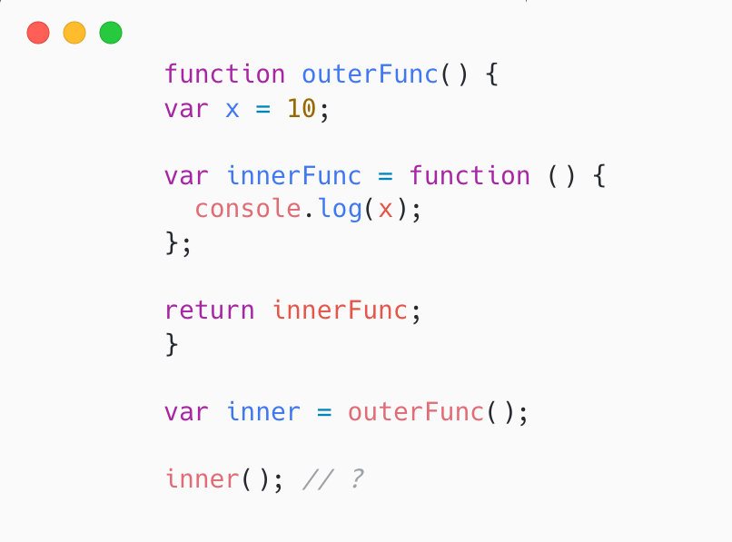
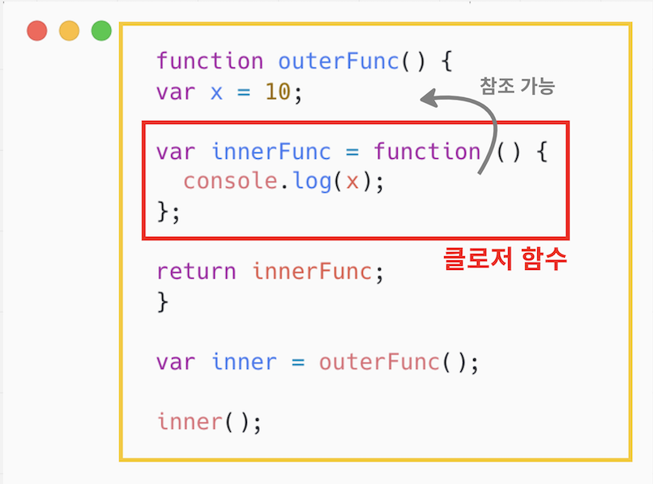

<br />

# 클로저란?

클로저는 자바스크립트 고유 개념이 아니다. 함수형 프로그래밍 언어에서 사용되는 중요한 특성이다.

## 예시 코드



클로저는 조금 난해한 개념이기 때문에 예시 코드를 먼저 보자.

1. 함수 `outerFunc()` 안에 함수 `innerFunc()`가 정의되어 있다.
2. 변수 `inner`에 함수 `outerFunc()`를 호출하여 리턴값인 함수 `innerFunc()`을 할당하였다.
3. 변수 `inner` 를 호출하였다.

> 여기서, `inner`의 실행 결과는 무엇일까?

클로저를 모른다면, 참조 에러 (Reference Error)를 예상할 수 있다.

왜냐하면, `outerFunc()` 은 내부 함수인 `innerFunc()` 을 리턴한 후 종료되었기 때문이다.

하지만 결과는 다음과 같다.


마치 `outerFunc()`의 지역변수 `x`가 다시 살아난 듯, 함수 `innerFunc()`에서 동작하고 있다.

실은, 처음부터 `x` 는 죽은 적이 없다. 왜냐하면 `innerFunc()`은 `outerFunc()`의 클로저 함수이기 때문이다.

## 클로저 알아보기

그렇다면 클로저란 무엇일까?

MDN에서 클로저를 다음과 같이 정의하고 있다.

> “클로저는 함수와 그 함수가 선언된 **렉시컬 환경의 조합**이다.“

여기서 핵심은 **함수가 선언된 렉시컬 환경**이다.

자바스크립트 엔진은 함수를 호출한 위치가 아닌, **함수가 선언된 위치에 따라 상위 스코프를 결정**한다. 이 개념이 바로 **렉시컬 스코프**이다.

즉, 함수가 기존에 선언된 환경을 토대로 변수를 조회한다는 뜻이다. 아주 간단하게 말해, 코드의 안쪽으로부터 바깥 방향으로 변수를 조회하는 것이다. (<a href="../../javascript/js-scope">스코프</a>) 여기서, 이런 기존의 외부 함수에 대한 정보가 **‘렉시컬 환경’**이다. 이런 특성 때문에, **내부 함수 (클로저 함수)는 외부 함수의 지역 변수에 접근**할 수 있게 된다.

자바스크립트 엔진은 함수가 호출될 때마다, 각 함수 별로 해당 함수를 실행하기 위한 정보들을 먼저 수집한다. (<a href="../../javascript/js-execution-context">실행 컨텍스트</a>) 이 정보들 중 하나가 외부 환경에 대한 참조(OuterEnvironmentReference)다. 말그대로, 어떤 중첩 함수가 실행되었을 때 **자신이 선언된 위치의 외부 환경 (= 상위 스코프)를 기억**한다. 때문에, **외부 함수의 실행이 내부 함수보다 먼저 끝나도 내부 함수 (클로저 함수)는 외부 함수에서 선언된 변수에 접근**할 수 있다.



### 요약

> **클로저 함수는 외부 함수의 렉시컬 환경을 기억하기 때문에,
> 이미 생명 주기가 종료된 외부 함수의 지역 변수에 접근할 수 있다.**

<br />

# 클로저의 활용

클로저는 **변수를 은닉하고 특정 함수만을 통한 상태 변경을 허용**함으로써, **변수의 상태를 안전하게 변경하고 유지** 가능하게 한다.

예를 들어 다음과 같은 카운터 함수가 있다고 하자.

```jsx
let num = 0;

const increase = function () {
  return ++num;
};

console.log(increase()); // 1
console.log(increase()); // 2
console.log(increase()); // 3
```

이 함수는 잘 작동하지만, 카운트의 상태가 전역 변수이기 때문에 어떤 함수든지 접근 가능하고 값을 변경할 수 있다. 카운트 상태를 안전하게 유지하기 위해선, 클로저를 사용하여 특정 함수만 상태를 변경하게 해야한다.

```jsx
const increase = (function () {
	let num = 0;

	// 클로저
	return function (){
		return ++num;
	};
)());

console.log(increase()); // 1
console.log(increase()); // 2
console.log(increase()); // 3
```

이 함수를 실행하면, 즉시 실행 함수가 실행되고 반환된 내부 함수가 `increase` 변수에 할당된다. 할당된 함수는 자신이 정의된 위치에 따라, 자신의 상위 스코프인 즉시 실행 함수의 렉시컬 환경을 기억하는 클로저다. 따라서, 클로저 함수는 카운트 상태 변수 `num` 을 어디서든 참조하고 변경할 수 있다.

즉시 실행 함수는 한 번만 실행되기 때문에, `increase` 가 여러번 호출되어도 초기화되지 않는다. 또, `num` 변수는 외부에서 접근이 불가하기 때문에 의도치 않은 변수 상태의 변경을 더 이상 걱정할 필요 없다.

<br />

# Reference

- [https://poiemaweb.com/js-closure](https://poiemaweb.com/js-closure)
- [https://developer.mozilla.org/ko/docs/Web/JavaScript/Closures](https://developer.mozilla.org/ko/docs/Web/JavaScript/Closures)
- [https://ljtaek2.tistory.com/147](https://ljtaek2.tistory.com/147)
