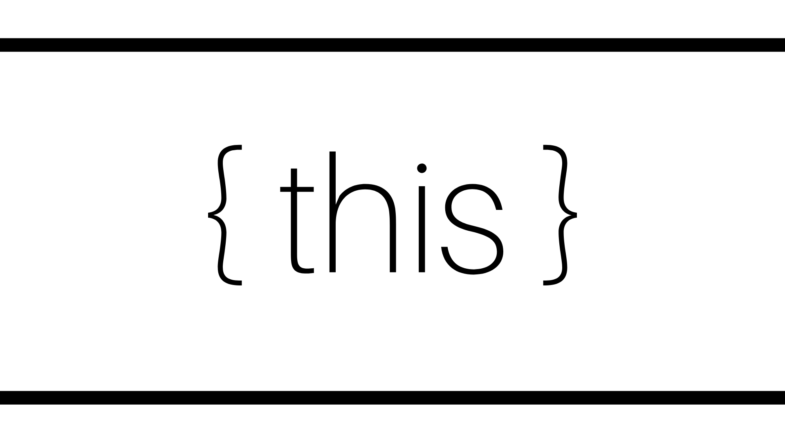

<br />

# This란

객체지향 프로그래밍에서 객체는 상태를 나타내는 프로퍼티와 동작을 나타내는 메서드가 하나의 논리적인 단위로 묶여진 자료구조다. 메서드가 자신이 속한 객체의 프로퍼티를 참조/변경하려면 **자신이 속한 객체를 가리키는 식별자를 참조할 수 있어야 한다.**

자바스크립트는 이를 위해 `this` 라는 특수한 식별자를 제공한다. `this` 는 **자신이 속한 객체 또는 자신이 생성할 인스턴스를 가리키는 참조 변수**다. `this`가 참조하는 대상은 ‘**함수가 호출되는 상황’**에 따라 바뀐다. 자바스크립트의 `this`는 일단 기본적으로 **함수가 호출될 때 결정**되며, **보통 자신을 호출한 주체의 정보**가 담기게 된다. 함수가 호출되는 상황은 크게 4가지가 있다.

<br />

# 1. 함수로서 호출

함수는 그 자체로 혼자서 독립적인 기능을 수행하는 경우 어딘가에 종속되지 않기 때문에, 함수는 호출한 주체 또한 없다. `this`는 자신을 호출한 주체의 정보를 담는다는 이야기를 했었는데, 함수 자체가 호출주체 없이 독립적으로 존재하면 **`this`는 전역객체**를 가리키게 된다.

```jsx
function myFunction() {
  return this;
}
console.log(myFunction()); // Window
```

## Strict Mode

Strict Mode (엄격 모드)에서는 함수 내 `this` 의 기본 바인딩이 없기 때문에, `undefined` 가 출력된다.

```jsx
"use strict";

function myFunction() {
  return this;
}
console.log(myFunction()); // undefined
```

## 화살표 함수

- 일반 함수는 호출 시 함수가 어떻게 호출 되는지에 따라 `this`가 가리킬 객체가 동적으로 결정된다. 반면, 화살표 함수는 함수를 선언할 때 `this`에 바인딩할 객체가 **정적으로 결정**된다.
- 화살표 함수에서 `this` 는 항상 상위 스코프의 `this` 를 가리킨다.
- 화살표 함수는 아래 4번과 같은 `call`, `apply`, `bind` 메서드로 `this`를 변경할 수 없다.

```jsx
var Person = function (name, age) {
  this.name = name;
  this.age = age;

  this.say1 = function () {
    setTimeout(function () {
      console.log(this.name + " is " + this.age + " years old");
    }, 1000);
  };

  this.say2 = function () {
    setTimeout(() => {
      console.log(this.name + " is " + this.age + " years old");
    }, 1000);
  };
};

var Alex = new Person("Alex", 23);

Alex.say1(); // 'Alex is 23 years old'
Alex.say2(); // 'undefined is undefined years old'
```

<br />

# 2. 메서드로서 호출

메서드는 자신을 호출한 대상에 종속되어 있다. 호출한 대상은 쉽게말해 **메서드 왼쪽에 명시된 객체**라고 생각하면 된다. 어떤 객체에 종속된다는 메서드의 특징은 `this`에도 그대로 적용이 된다. 메서드로 호출된 `this`는 부모 객체를 기준으로 바인딩되기 때문이다.

```jsx
var person = {
  firstName: "John",
  lastName: "Doe",
  fullName: function () {
    return this.firstName + " " + this.lastName;
  },
};

person.fullName(); //"John Doe"
```

<br />

# 3. new를 이용한 생성자 호출

생성자 함수는 어떤 공통된 성질을 갖는 객체들을 생성하는데 쓰이는 함수이다. 인스턴스를 찍어내는 일종의 '틀' 같은 역할을 하는 것이다. new 키워드에서 `this`는 **새롭게 생성된 인스턴스 객체**를 의미한다.

```jsx
function Person(name) {
  this.name = name;
}

var kim = new Person("kim");
var lee = new Person("lee");

console.log(kim.name); //kim
console.log(lee.name); //lee
```

<br />

# 4. `call` , `apply` , `bind`를 통한 호출 ( 명시적 바인딩 )

앞서 말한 `this`는 어떠한 규칙에 의해 자체적으로 적용되었다. 하지만, call이나 apply 메서드를 사용하면 `this`를 별도의 대상으로 지정할 수 있게 된다. `call`, `apply`, `bind` 호출에서는 **첫번째 인자로 들어가는 값이 바로 `this`**이다.

## `call` & `apply`

```jsx
const obj = { name: "Tom" };

const say = function (city) {
  console.log(`My name is ${this.name}. I live in ${city}.`);
};

say("Seoul"); // My name is . I live in Seoul.
say.call(obj, "Seoul"); // My name is Tom. I live in Seoul.
say.apply(obj, ["Seoul"]); // My name is Tom. I live in Seoul.
```

`say("soeul")` 은 `this`에 어떤 기본 바인딩이 되어있지 않으므로 `this`는 window 객체이다.

`say.call(obj, "Seoul")` , `say.apply(obj, ["Seoul"])`은 `this`를 `obj`로 명시적으로 바인딩했다.

`call` 메서드는 첫 번째 인자(`this`를 대체할 값)를 제외하고, 함수에 필요한 인자를 직접 입력하는 방식이다.

이와 달리, `apply` 메서드는 두 번째 인자부터 모두 배열로 넘겨줘야 한다.

## `bind`

```jsx
const obj = { name: "Tom" };

const say = function (city) {
  console.log(`My name is ${this.name}. I live in ${city}.`);
};

const boundSay = say.bind(obj);

boundSay("Seoul"); // My name is Tom. I live in Seoul.
```

`bind` 메서드는 함수를 바로 실행하지 않는 대신 bound 함수를 반환한다. bound 함수는 `bind` 메서드로 `this` 에 바인딩한 값을 저장하고 있다 .

<br />

# 정리

| 함수 호출 방식                            | this 바인딩                            |
| ----------------------------------------- | -------------------------------------- |
| 일반 함수 호출                            | 전역 객체                              |
| 메서드 호출                               | 메서드를 호출한 객체                   |
| 생성자 함수 호출                          | 생성자 함수가 (미래에) 생성할 인스턴스 |
| apply, call, bind 메서드에 의한 간접 호출 | 각 메서드에 첫 번째 인수로 전달한 객체 |

<br />

# Reference

- [https://poiemaweb.com/js-this](https://poiemaweb.com/js-this)
- [https://wooooooak.github.io/javascript/2018/12/08/call,apply,bind/](https://wooooooak.github.io/javascript/2018/12/08/call,apply,bind/)
- [https://nykim.work/71](https://nykim.work/71)
