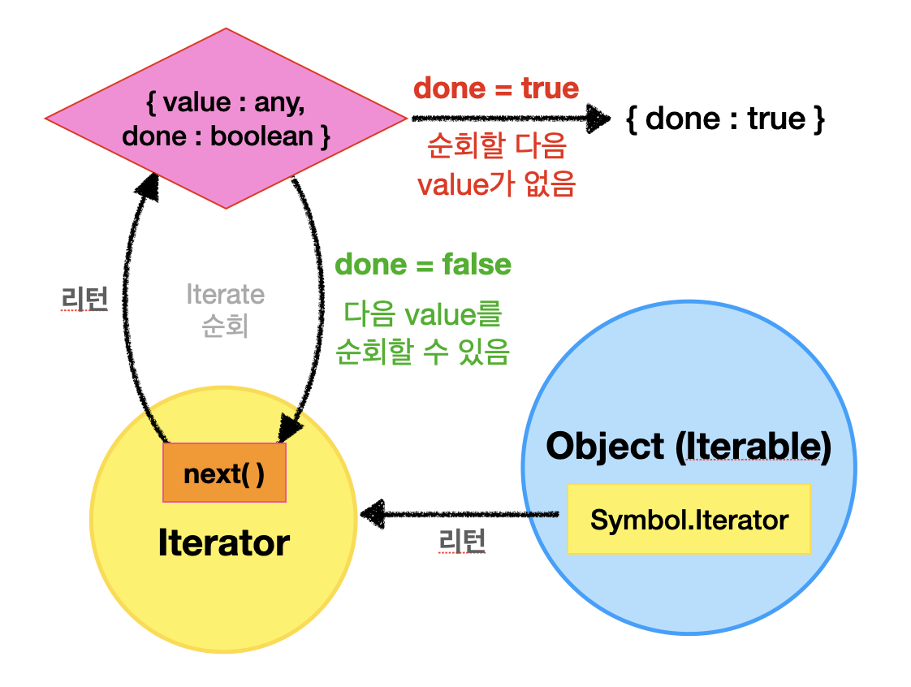

<div style="text-align: center;" href="https://cdn.dribbble.com/users/86357/screenshots/1796751/dominodribbble_alt.gif">
  
</div>

# 이터러블 / 이터레이터

이터레이션 프로토콜은 자료를 순회하기 위한 프로토콜(약속된 규칙)이다. 이터레이션 프로토콜을 따르는 객체는 `for .. of` 문으로 순회 가능하다.

이터레이션 프로토콜에는 이터러블 프로토콜과 이터레이터 프로토콜이 있다.

<p/>
<figure>
<a style="padding: 16px 0px 8px 0px; text-align: center; width: 100%; background-color: #ffffff" href="https://poiemaweb.com/img/iteration-protocol.png">
  
  <figcaption>이터레이션 프로토콜 (Iteration protocol)</figcaption>
</a>
</figure>
<p/>

## 이터러블

이터러블 프로토콜을 준수한 객체를 이터러블이라고 한다. 이터러블은 `Symbol.iterator` 메서드를 포함한다. 배열과 문자열 같은 이터러블은 `Symbol.iterator` 를 프로토타입 체인으로 상속받아 순회 가능하다.

> iterate : (계산·컴퓨터 처리 절차를) 반복하다 <br />
> iterate + able = **iterable = 반복 가능한 (객체)**

## 이터레이터

이터레이터(프로토콜)는 이터러블 객체의 요소를 탐색할 수 있게 해준다.

순회는 `next` 메서드를 사용한다. `next`를 호출하면 이터러블은 순서대로 이터레이터 리절트 객체를 하나하나 리턴한다.

이터레이터 리절트(result) 객체는 `{ value: any, done: boolean }` 형태로, `value` 는 현재 요소의 값 그리고 `done` 은 다음 요소로 순회할 수 있는지 여부를 나타낸다. 마지막 요소에 다다르면 `done: false`가 되어 더 이상 순회하지 않는다.

<figure>
<a style="text-align: center; width: 100%;" href="../../images/2023-04-19-js-iterable-generator/iterator.png">
  
  <figcaption></figcaption>
</a>
</figure>

## Symbol.iterator

이터레이터 객체는 `Symbol.iterator` 안에 정의되어 있다. 다음과 같이 이터러블이 아닌 객체에 `Symbol.iterator` 을 직접 정의하면 이터러블로 만들 수 있다.

```jsx
// 이터러블이 아닌 객체
let range = {
  from: 1,
  to: 4,
};

// Symbol.iterator를 직접 정의하여 이터러블로 만들기
range[Symbol.iterator] = function () {
  return {
    // 이터레이터 객체를 리턴(생성)
    current: this.from,
    last: this.to,

    next() {
      // 다음 이터레이터 리절트 객체를 리턴하는 메서드
      if (this.current <= this.last) {
        return { done: false, value: this.current++ };
      } else {
        return { done: true };
      }
    },
  };
};

// 이제 range는 이터러블이 되었다.
for (let num of range) {
  alert(num); // 1 -> 2 -> 3 -> 4
}
```

## 유사배열

유사배열은 인덱스와 `length` 프로퍼티가 있어서 배열처럼 보이는 객체다. 유사배열은 순회가 가능하나, 이터러블 프로토콜을 따르지 않으므로 이터러블 객체가 아니다. 이터러블 또한 인덱스와 `length` 가 없으므로 유사배열이 아니다.

```jsx
let arrayLike = {
  0: "zero",
  1: "one",
  length: 2,
};

for (let item of arrayLike) {
}
// TypeError : arrayLike is not iterable
```

유사배열을 배열처럼 다루고 싶다면, `Array.from`으로 진짜 배열(이터러블 객체)로 만들어주면 된다. `Array.from` 의 첫 번째 인자는 유사 배열, 두 번째 인자는 매핑 함수를 받는다.

```jsx
let arr = Array.from(arrayLike, (v) => "mapped" + v);
for (let item of arr) {
  console.log(item); // "mapped zero", "mapped one"
}
```

# 제너레이터

제너레이터 함수는 여러 개의 값(제너레이터)을 하나씩 반환(`yield`)할 수 있는 함수다. 제너레이터는 이터러블이면서 동시에 이터레이터인 객체다.

제너레이터 함수가 생성한 제너레이터 객체는 `Symbol.iterator`를 가진 이터러블객체다. 또, 제너레이터는 이터레이터과 마찬가지로 `next` 메서드를 가지며 호출 시 이터레이터 리절트 객체`{ value, done }`를 반환한다.

## 제너레이터 함수

제너레이터 함수는 `function*` 키워드로 선언한다. 그리고 하나 이상의 `yield` 문을 포함한다.

제너레이터 함수를 호출하면 함수가 실행되는 것이 아닌 제너레이터 객체가 생성된다. 이 제너레이터 객체는 `Symbol.iterator` 소유한 이터러블이면서 `next` 소유한 이터레이터다. 따라서, `Symbol.iterator` 메서드로 이터레이터를 따로 생성할 필요가 없다.

제너레이터 객체의 `next`를 호출하면, `yield` 문까지 코드가 차례대로 실행된다. `yield` 는 리턴 값을 제너레이터 객체로 감싸 리턴한다.

위의 이터레이터 구현 예시 코드를 제너레이터로 만들어보자. 이터러블 객체 생성 과정이 굉장히 간단해졌다.

```jsx
function* generateRange() {
  let current = 1;
  yield current;
  // (1) next
  current += 1;
  yield current;
  // (2) next
  current += 1;
  yield current;
  // (3) next
  current += 1;
  yield current;
  // (4) next
}

const range = generateRange(); // 제너레이터 객체 (이터러블 생성)

// (1) next 까지 실행
console.log(range.next()); // {value: 1, done: false}

// (2) next 까지 실행
console.log(range.next()); // {value: 2, done: false}

// (3) next 까지 실행
console.log(range.next()); // {value: 3, done: false}

// (4) next 까지 실행
console.log(range.next()); // {value: 4, done: true}
```

### yield로 제너레이터 안/밖으로 정보 교환

제너레이터는 간편한 이터러블 생성과 더불어, 더 강력한 기능을 제공한다. 제너레이터 객체를 리턴하는 `yield`는 결과를 출력할 뿐만 아니라, 값을 제너레이터 안으로 입력 받을 수도 있다.

값을 안/밖으로 전달하기 위해, `generator.next(arg)` 를 호출해야한다. 이 때, `arg` 는 `yield` 의 결과가 된다. 다음 예시를 보면 이해가 갈 것이다.

```jsx
function* gen() {
  // "1 더하기 1은 뭘까요?"를 (1)에 출력하고 입력을 기다림
  let ask1 = yield "1 더하기 1은 뭘까요?";
  alert(ask1); // 2

  // "2 곱하기 2은 뭘까요?"를 (2)에 출력하고 입력을 기다림
  let ask2 = yield "2 곱하기 2는 뭘까요?";
  alert(ask2); // 4
}

let generator = gen();

alert(generator.next().value); // (1) "1 더하기 1은 뭘까요?"

alert(generator.next(2).value); // (2) "2 곱하기 2는 뭘까요?"

alert(generator.next(4).done); // true
```

## 비동기 처리

제너레이터로 비동기 처리를 동기 처리처럼 구현 가능하다. 즉, 제너레이터가 비동기 처리 함수의 결과를 반환하도록 만들 수 있다.

```jsx
function getUser(genObj, username) {
  fetch(`https://api.github.com/users/${username}`)
    .then((res) => res.json())
    // 2. 제너레이터 객체에 비동기 처리 결과(응답)를 전달
    .then((user) => genObj.next(user.name));
}

// 제너레이터 함수 선언
function* gen() {
  let user;
  // 1. 비동기 함수 getUser을 호출(요청)한 후, 입력(응답)을 기다림
  // 3. 비동기 함수 getUser가 결과를 반환
  user = yield getUser(generator, "kim");
  console.log(user); // kim

  // 비동기 함수가 한 줄씩 동기적으로 처리됨
  user = yield getUser(generator, "park");
  console.log(user); // park

  user = yield getUser(generator, "jeong");
  console.log(user); // jeong
}

// 제너레이터 객체 생성
const generator = gen();

// 제너레이터 함수 시작
generator.next();
```

ES7에서 더 간편하게 비동기 처리를 구현할 수 있는 `async/await` 이 도입되었다.(사용 방법은 이 <a href="../../javascript/js-async-functions/#asyncawait">글</a>에서 확인할 수 있다.) 위의 코드와 비교해보자.

```jsx
// Promise를 반환하는 함수 정의
function getUser(username) {
  return fetch(`https://api.github.com/users/${username}`)
    .then((res) => res.json())
    .then((user) => user.name);
}

async function getUserAll() {
  let user;
  user = await getUser("kim");
  console.log(user);

  user = await getUser("park");
  console.log(user);

  user = await getUser("jeong");
  console.log(user);
}

getUserAll();
```

# 정리

- 이터러블 프로토콜을 준수한 객체는 `Symbol.iterator` 메서드를 포함한다. 이 프로토콜을 준수한 객체가 이터러블이며, `for .. of` 문으로 순회가 가능하다.
- 이터레이터 객체의 `next` 메서드를 호출하면, 다음 이터레이터 리절트 객체를 차례로 리턴하며 이터러블을 순회한다. 이 객체는 현재 값인 `value` 와 순회 가능 여부인 `done` 을 포함한다. `done` 이 `true` 가 되면 더 이상 순회하지 않는다.
- 유사배열은 인덱스와 `length` 프로퍼티를 가지고 있어 순회가 가능하나 이터러블이 아니다.
- 제너레이터는 `Symbol.iterator` 가진 이터러블이면서 동시에 `next`호출이 가능한 이터레이터다.
- 제너레이터 함수를 사용하면 쉽게 이터러블을 생성할 수 있다.
- 제너레이터는 값의 입력과 출력이 둘 다 가능하다. 이를 통해 비동기 처리도 가능하나 ES7의 `async/await`으로 더 쉽게 구현할 수 있다.

# Reference

- [https://ko.javascript.info/iterable](https://ko.javascript.info/iterable)
- [https://poiemaweb.com/es6-iteration-for-of](https://poiemaweb.com/es6-iteration-for-of)
- [https://ko.javascript.info/generators#ref-89](https://ko.javascript.info/generators#ref-89)
- [https://poiemaweb.com/es6-generator](https://poiemaweb.com/es6-generator)
