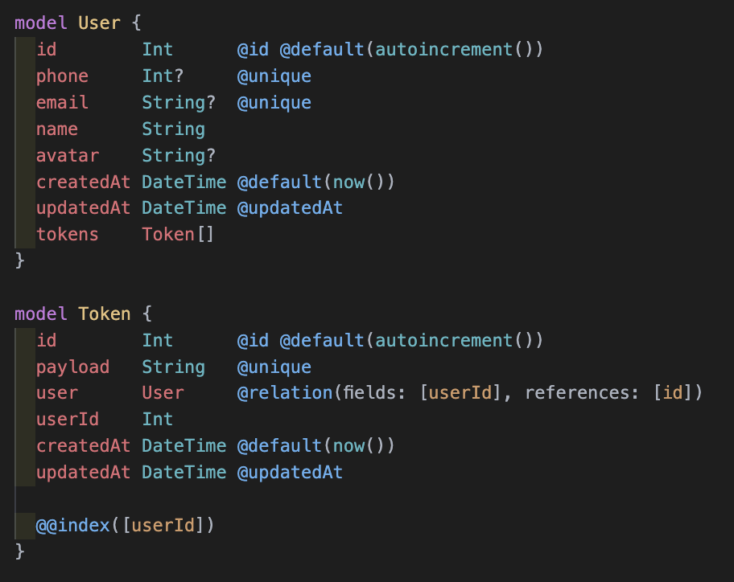
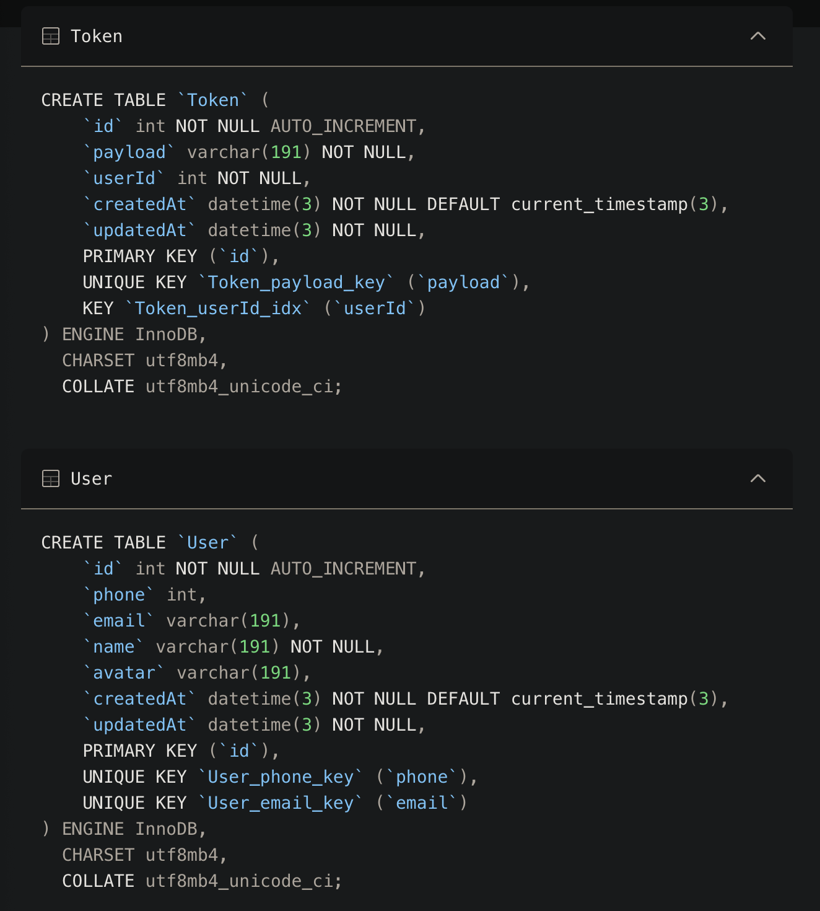

# Accounts Logic

## Upsert : Update or Create Records

- 조건에 맞는 기존 데이터가 있으면 업데이트 없으면 새롭게 생성
- where, create, update 객체가 모두 들어가야 함

```jsx
const upsertUser = await prisma.user.upsert({
  // 먼저 email이 존재하는지 찾음
  where: {
    email: "hello@gmail.com",
  },
  // 존재하면 update 실행
  update: {
    name: "pizza",
  },
  // email이 존재하지 않다면 생성
  create: {
    email: "hello@gmail.com",
    name: "pizza",
  },
});
```

# Token Logic

- 다른 모델 참조 시 자동완성이 되지 않을 때, 저장 후 다음 명령어 입력
  `npx prisma format`
- User의 id를 참조하는 Token 모델 생성

h

- `npx prisma db push` 로 PlanetScale DB에 반영하기



## connectOrCreate

- `connect` : 새로운 토큰을 이미 생성된 유저와 연결
- `create` : 새로운 토큰과 새로운 유저를 생성
- `connectOrCreate` : 유저를 찾으면 connect / 못찾으면 create (`upsert`와 비슷)

```jsx
const payload = phone ? { phone: +phone } : { email };
// 토큰 생성
const token = await client.token.create({
  data: {
    payload: "123",
    // 로그인한 유저의 id로 토큰 연결
    user: {
      connectOrCreate: {
        // phone or email이 있으면 기존 유저 연결
        where: {
          ...payload,
        },
        // 없으면 해당 payload로 새로운 유저 생성
        create: {
          name: "Anonymous",
          ...payload,
        },
      },
    },
  },
});
```

# Token UI

## BigInt

Number 원시 값이 안정적으로 나타낼 수 있는 최대치인 2^53 - 1보다 큰 정수를 표현할 수 있는 내장 객체

## onDelete: Cascade

부모 레코드가 삭제되면 자식 레코드도 함께 삭제

### 이외 옵션

- Restrict : 해당 필드를 지울 수 없음
- NoAction : Restrict과 비슷하나 사용중인 DB에 따라 다름
- SetNull : 참조하는 필드를 `NULL` 로 설정
- SetDefault : 참조하는 필드를 기본값으로 설정

# Serverless Session

## Iron Session

- 서명, 암호화된 쿠키를 사용하는 node.js stateless 세션 도구
- JWT는 암호화되지 않고 서명이 되어 있음
- 유저가 안에 있는 정보를 볼 수 없음
- 세션을 위한 백엔드 구축이 필요 없음

```bash
npm install iron-session
```

### `req.session.save()`

세션 데이터를 암호화 / 쿠키 설정

## Next 13 App Router에서 사용법

https://github.com/vvo/iron-session/issues/586#issuecomment-1568830066

### Session 유틸 함수

```tsx
import { getIronSession, createResponse } from "iron-session";

export const getSession = (req: Request, res: Response) => {
  const session = getIronSession(req, res, {
    cookieName: "이름",
    password: "암호",
    cookieOptions: {
      secure: false,
    },
  });

  return session;
};

export { createResponse };
```

### 사용법

```tsx
export async function POST(req: NextRequest) {
  const res = new Response();
  const { token } = await req.json();

  // Token 테이블에서 일치하는 레코드 찾기
  const exists = await client.token.findUnique({
    where: {
      payload: token,
    },
    // User 객체 추가
    include: { user: true },
  });

  if (!exists) return NextResponse.json({}, { status: 404 });

  // 세션 가져오기
  const session = await getSession(req, res);

  session.user = {
    id: exists?.userId,
  };

  // 쿠키에 저장
  await session.save();

  return createResponse(res, "ok", { status: 200 });
}
```

# Profile Handler

# Get User Profile

- 모든 api는 실제 백엔드 없이 개별적으로 동작하기 때문에
- 각 api 마다 type과 withIronSessionApiRoute config를 매번 설정해줘야함
- 쿠키에 세션이 userId가 저장되어 있기 때문에 Id에 해당하는 user정보를 가져올 수 있음

## TS 세션 데이터 Typing (req.session에 데이터 입력)

- req.session은 자동으로 올바른 유형으로 채워지므로 .save() 및 .destroy()를 호출 가능
- 세션 데이터를 입력한 후 특정 시점에 필요한 파일에 있는 한 프로젝트의 아무 곳에나 넣을 수 있음

# UseUser Hook

## router

- `push()` - 이전 페이제 대한 히스토리 남김
- `replace()` - 남기지 않음 (히스토리 스택에 새 URL 추가 방지)

# SWR

- Next.js 팀이 만든 React Data Fetching 라이브러리
- 먼저 캐시로부터 데이터를 반환한 후, fetch 요청(재검증)을 하고, 최종적으로 최신화된 데이터를 가져옴
- 컴포넌트가 자동으로 데이터 변경을 자동으로 감지, 이에 따라 UI를 빠르게 변경

## 설치

```bash
npm i swr
```

## 사용법

1. 네이티브 fetch의 단순한 래퍼인 fetcher 함수를 생성

```js
const fetcher = (...args) => fetch(...args).then((res) => res.json());
```

2. useSWR을 import하고, 함수 컴포넌트 내에서 사용

```js
const { data, error } = useSWR("/api/user/123", fetcher);
```

일반적으로, 세 가지 요청 상태가 가능: "loading", "ready", "error". data와 error 값을 사용해 현재 요청의 상태를 알아내고, 해당하는 UI를 반환

# useUser Refactor

## SWR Global Configuration

컨텍스트 SWRConfig는 모든 SWR 훅에 대한 Global Configuration(옵션)을 제공

```tsx
const { data, error, isValidating, mutate } = useSWR(key, fetcher, options);
```

### 설정 방법

최상위 컴포넌트를 SWRConfig 컴포넌트로 감싸준 후, `value` 에 값을 변환하기 위해 실행시킬 콜백 함수를 넣어준다.

```tsx
function fetcher(url: string) {
  return fetch(url).then((res) => res.json());
}
...
return (<SWRConfig value={{ fetcher }}>{children}</SWRConfig>);
```
