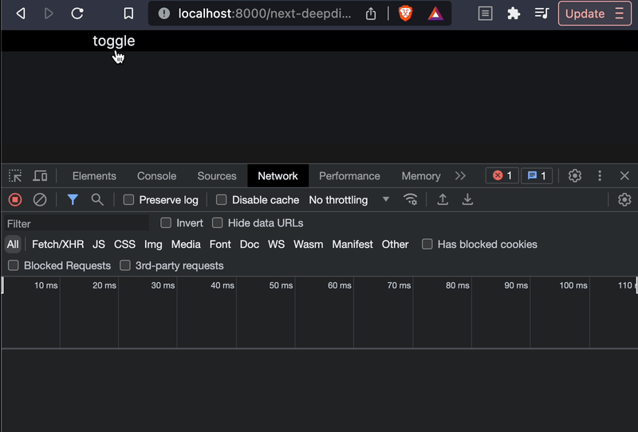
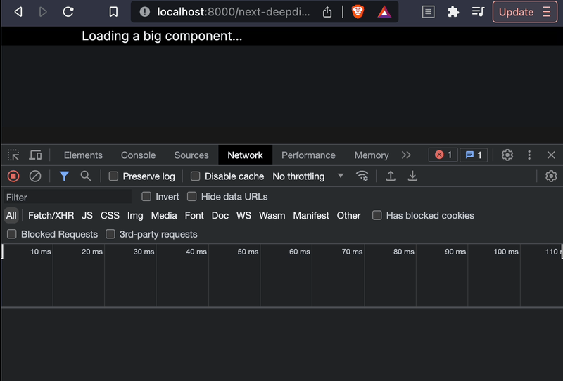

# MiddileWares

## V12

- 미들웨어는 첫 번째 파일 시스템 조회 전에 redirects 및 headers 직후 실행
- 각 라우트 파일 안에 `_middleware.ts` 에 미들웨어 로직 작성

```tsx
// pages/_middleware.ts

import type { NextFetchEvent, NextRequest } from "next/server";

export function middleware(req: NextRequest, ev: NextFetchEvent) {
  return new Response("Hello, world!");
}
```

### 실행 순서

- 미들웨어가 `/pages/_middleware.ts`에 생성된 경우 `/pages` 디렉토리 내의 모든 경로에서 실행
- 중첩 경로가 있는 하위 디렉터리가 있는 경우 미들웨어는 위에서 아래로 실행

## V13

- 프로젝트 루트 (`app` 혹은 `src` )에 `middleware.ts` 파일에 작성
- `middleware.ts` 한 파일안에서 `url`별로 분기해서 처리

```tsx
// root/middleware.ts ('_middleware.ts' X)

import type { NextRequest, NextFetchEvent } from "next/server";

export function middleware(req: NextRequest, ev: NextFetchEvent) {
  console.log(`it works! global middleware!`);

  if (req.nextUrl.pathname.startsWith("/chats")) {
    console.log(`this is chats ONLY middleware!`);
  }
}
```

# Responses and Redirections

## UserAgent

요청 유저의 응용 프로그램, 운영 체제, 공급 업체 및 / 또는 버전을 식별

## Check Cookies

```tsx
// v12
req.cookies.carrotsession;

// v13
req.cookies.has("carrotsession");
```

## Matcher

- 미들웨어는 모든 요청에서 발생 (api 포함)
- 페이지 하나를 불러올때마다 발생되는 관련 static 파일 요청이 있음
- 아래와 같이 매칭(matcher)되는 `url`에서만 미들웨어가 발생하도록 하기

```tsx
export const config = {
  matcher: ["/((?!api|_next/static|favicon.ico).*)"],
};
```

# Dynamic Import

- JS 모듈을 동적으로 가져와 실행
- SSR과 함께 작동
- `React.lazy`와 유사하게 사전 로드가 작동하도록 모듈의 최상위에 표시되어야 하므로 React 렌더링 내부에서 사용할 수 없음
- 예시 : 사용자가 검색을 입력한 후, 브라우저에서 모듈을 동적으로 로드하기

```tsx
// 브라우저는 JS 최상단에 import한 JS파일을 모두 다운
import dynamic from 'next/dynamic'
...

// 그러나, dynamic을 사용하면 컴포넌트가 실제로 화면에 렌더링되는 시점에 다운
const DynamicComponent = dynamic(() => import('../components/hello'), {ssr : false})

...
< DynamicComponent />
```



# Lazy-load Imports

dynamic 컴포넌트가 로드되는 동안 로드 상태를 렌더링하기 위해 로딩 컴포넌트를 추가

## next/dynamic loading

```tsx
import dynamic from "next/dynamic";

const Bs = dynamic(
  () =>
    new Promise((resolve) =>
      setTimeout(() => resolve(import("@/components/dynamic-component")), 5000)
    ),
  {
    ssr: false,
    loading: () => <div>Loading a big component...</div>,
  }
);

export default function DynamicImports() {
  return (
    <div>
      <Bs />
    </div>
  );
}
```

## React Suspense

```tsx
import dynamic from "next/dynamic";
import { Suspense } from "react";

const Bs = dynamic(
  () =>
    new Promise((resolve) =>
      setTimeout(() => resolve(import("@/components/dynamic-component")), 5000)
    ),
  {
    ssr: false,
  }
);

export default function DynamicImports() {
  return (
    <div>
      <Suspense fallback={<div>Loading a big component...</div>}>
        <Bs />
      </Suspense>
    </div>
  );
}
```



## With no SSR

모듈에 브라우저에서만 작동하는 라이브러리가 포함된 경우에는 `ssr: false`를 통해 CSR으로 실행

# \_document and Fonts

페이지를 랜더링하는 데 사용되는 `html` 및 `body` 태그를 업데이트

- 서버에서만 랜더링되므로 `onClick`과 같은 이벤트 핸들러는 `_document`에서 사용할 수 없음
- `Html`, `Head`, `Main` 및 `NextScript`는 페이지가 제대로 랜더링되는 데 필요
- `_document`는 서버에서 Next 앱의 HTML 뼈대를 만드는 역할을 함. 고로, 서버 사이드에서 한번만 실행

## 폰트 최적화

- 서버에서 HTML 파일 빌드 시, link로 연결된 구글폰트 주소로부터 폰트를 다운받아 CSS를 생성 (구글 폰트만 가능)/
- 로딩 시간이 획기적으로 감소

# Script Component

- HTML `script` 태그의 확장
- 앱에서 써드 파티 스크립트의 로드되는 우선 순위를 설정, 개발 시간을 절약하면서 로드하는 성능을 향상 가능

## strategy options

### beforeInteractive

페이지가 interactive 되기 전에 로드

### afterInteractive (default)

페이지가 interactive 된 후에 로드

### lazyOnload

다른 모든 데이터나 소스를 불러온 후에 로드

### worker (experimental)

web worker에 로드

## onLoad prop

`Script` 에 명시된 스크립트를 다 불러온 다음에 실행

# getServerSideProps

- 페이지에서 getServerSideProps(서버 측 렌더링)라는 함수를 export
- Next.js는 getServerSideProps에서 반환된 데이터를 사용하여 각 요청에서 이 페이지를 미리 렌더링

```tsx
export async function getServerSideProps(context) {
  return {
    props: {}, // will be passed to the page component as props
  };
}
```

## App dir (v13)

- fetch 함수에  `cache: 'no-store'` 옵션 추가
- Page 컴포넌트 내에서 `fetch` 후 `Promise`를 그대로 사용할 경우, Next는 응답 데이터의 내용 자체는 같을 지라도 레퍼런스가 다른 `Promise`로 인식하기 때문에 무한 `fetch` 가 일어남
- 따라서, 컴포넌트 밖에서 `fetch` 한 `Promise`를 저장 후 컴포넌트 내에서 사용

```tsx
// RIGHT (O)

import { use } from "react";

const getData = async () => {
  const res = await fetch("/api/...", {
    cache: "no-store", // SSR
  });
  return res.json();
};

const dataPromise = getData();

const Home: NextPage = () => {
  const data: DataResponse = use(dataPromise);
...
}

export default Home;
```

```tsx
// WRONG (X)

const getData = async () => {
  const res = await fetch("/api/...", {
    cache: "no-store",
  });
  return res.json();
};

const Home: NextPage = async () => {
  const data: ProductResponse = await getData();
...
}

export default Home;
```

# SSR + SWR

## Pre-rendering 초기값 설정

페이지를 미리 렌더링해야 하는 경우 Next는 2가지 형태의 사전 렌더링을 지원

- Static Generation (SSG)
- Server-side Rendering (SSR)

> SSR을 함께 사용하면, SEO를 위해 페이지를 미리 렌더링 가능

- SSR로 만들어진 데이터를 SWR의 캐시 초기값으로 설정하면, SSR과 CSR의 장점을 누릴 수 있음
  >

## SWRConfig 적용

```tsx
export default function Page({ fallback }) {
  // SWRConfig안에 SWR훅은 SWRConfig의 value값을 사용
  // fallback에는 key-value 객체를 통해 캐시의 초기값을 설정

  return (
    <SWRConfig value={{ fallback }}>
      <Article />
    </SWRConfig>
  );
}
```

# getStaticProps

- 항상 서버에서 실행되고 클라이언트에서는 실행 X
- 정적 HTML을 생성하므로 들어오는 request(예: 쿼리 매개변수 또는 HTTP 헤더)에 액세스할 수 없음
- SSG 페이지가 빌드 시 미리 렌더링되면 페이지 HTML 파일 외 실행 결과를 포함하는 JSON 파일을 생성

## gray-matter

문자열 또는 파일에서 front-matter을 파싱

## SSR vs SSG

- SSR (`getServerSideProps`) : 유저의 요청이 발생할 때마다 일어남
- SSG (`getStaticProps`) : 페이지가 빌드되고, nextJS가 해당 페이지를 export 한 후 일반 html로 될 때, 딱 한 번만 실행됨

# getStaticPaths

- 동적인 라우트(동적인 URL)을 갖는 페이지에서 getStaticProps를 사용할 때 필요 `ex: [id]/page.tsx (app dir) / [id].tsx - (page dir`)
- 동적 경로를 사용하는 페이지에서 `getStaticPaths`(정적 사이트 생성)라는 함수를 `export`할 때, `getStaticPaths`로 지정한 모든 경로를 정적으로 미리 렌더링
- SSG (`getStaticProps`)와 함께 사용해야함
- SSR (`getServerSideProps`)와 함께 사용 불가
- getStaticProps도 사용하는 동적 경로에서만 `export` 가능

# Dynamic getStaticProps

## matter.read(filepath, options)

- 파일 시스템에서 파일을 동기적으로 읽고 front matter를 파싱
- `matter()`와 동일한 객체를 반환
- `filepath`에 읽을 파일의 경로를 지정
  `ex) const file = matter.read('./content/blog-post.md');`

## remark-html

- HTML serializing 지원을 추가하는 remark 플러그인

# InnerHTML

## dangerouslySetInnerHTML

- 브라우저 DOM에서 `innerHTML`을 사용하기 위한 React의 대체 방법
- 일반적으로 코드에서 HTML을 설정하는 것은 사이트 간 스크립팅 공격에 쉽게 노출될 수 있기 때문에 위험
