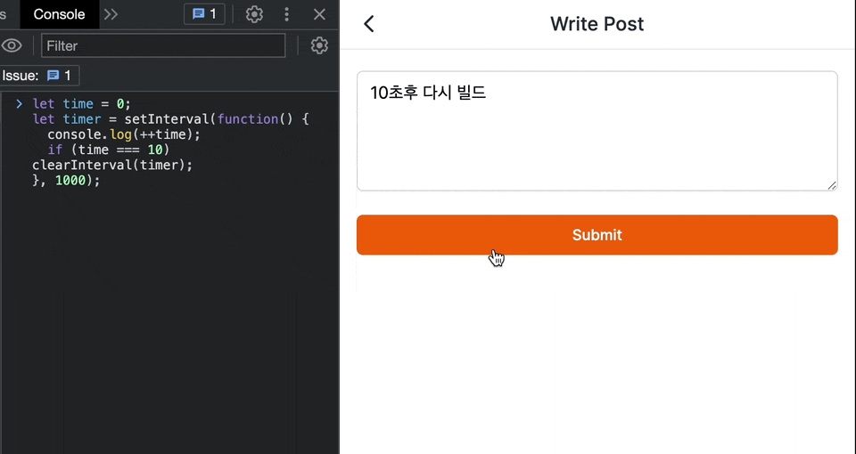
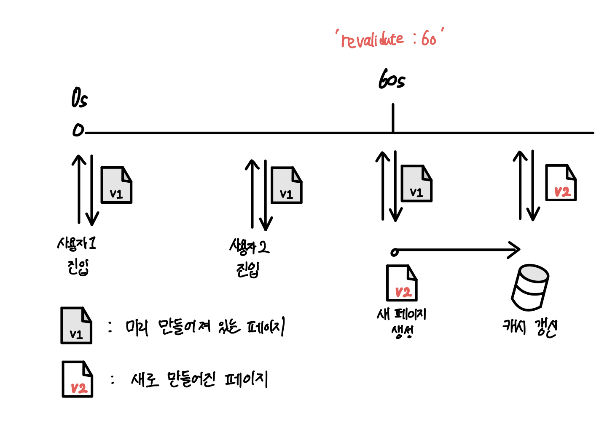

# INCREMENTAL SITE REGENERATION

## INCREMENTAL SITE REGENERATION

- 사이트를 빌드한 후 다시 static 페이지를 만들거나 업데이트
- 전체 사이트가 아닌 각 페이지별로 정적으로 페이지 (static-generation)를 생성
- 수백만 페이지로 확장하면서 static의 이점을 유지 가능

   

  

### getStaticProps

- 빌드 시 데이터를 fetch하여 static 페이지를 생성
- revalidate prop을 추가하여 ISR 구현 가능

#### revalidate

- 백그라운드(서버)에서 페이지를 재생성(rebuild)하고 캐싱하고 있는 시간 (최소 10초)
- 이 시간이 지난 후, 요청이 올 경우 해당 요청은 여전히 캐시된 페이지를 응답. 그 다음 페이지를 재생성하고 또 다음 revalidate 시간동안 캐싱

<figure>
<a style="text-align: center; width: 100%;" href="../../images/2023-03-30-network-cors/chrome-block.gif">
  
  <figcaption>출처 : <a>https://velog.io/@seungchan__y/NextJS%EC%99%80-ISR</a></figcaption>
</a>
</figure>

> 유저마다 다른 정보나 UI를 보여주는 페이지인 경우, ISR을 사용 불가

## On-demand Revalidation

- 특정 페이지에 대한 캐싱을 시간 주기가 아닌, 수동으로 업데이트
- `v12.2.0` 부터 사용 가능
- revalidate가 생략되면 revalidate가 호출될 때 on-demand 페이지만 revalidate함

## Blocking SSG

### getStaticPaths fallback3

#### blocking

- `getStaticPaths`에서 빌드되지 않은 새 경로는 SSR처럼 HTML이 생성될 때까지 기다리게함(block). 생성된 파일은 이후 요청을 위해 캐시됨
- 즉, 첫번재로 방문한 유저는 HTML이 만들어질 때 까지 기다리고 이후는 처음에 저장한 HTML 파일을 바로 받음
- 기본적으로 생성된 페이지를 업데이트 X
- 생성된 페이지를 업데이트하려면 `fallback: blocking`과 함께 ISR을 사용

## Fallback

### V12

#### false

- getStaticPaths에서 반환하지 않은 모든 경로는 404 페이지를 리턴

#### true

- blocking과 같이, 빌드시 경로에 대한 HTML 파일을 생성하지 않지만 block하지 않고 생성 시간동안 다른 페이지를 볼 수 있게 해줌.
- router.isFallback의 조건에 따라 로딩 표시 가능

### V13

페이지에서 export하는 변수의 값에 따라, 캐싱 옵션을 변경할 수 있다.

<a>https://nextjs.org/docs/app/api-reference/file-conventions/route-segment-config#dynamicparams</a>

#### dynamic

- `auto` (default): 컴포넌트가 가능하나 동적인 동작을 하지 못하도록 막으며 가능한 캐싱을 많이 하게 한다.
- `force-dynamic`: 모든 캐싱을 비활성화 하고, 동적 렌더링 및 fetch를 수행한다. 이 옵션은 구 `getServerSideProps`와 동일하다.
- `error`: 동적으로 가져오는 경우 에러를 발생시킨다. 다시 말하면 모든 페이지를 정적으로 렌더링하는 것을 강제한다. 이 옵션은 `getStaticProps`와 같으며 이 블로그가 이 옵션을 사용하였다.

#### force-static

정적인 렌더링이 강제되고, 레이아웃이나 페이지에서 데이터 요청이 있을 경우 쿠키, 헤더, `searchParams`의 값이 모두 빈값으로 나온다.

#### dynamicParmas

`generateStaticParams`로 생성되지 않은 파일을 방문했을 때 어떻게 동작할지 결정한다. (= V12의 fallback)

- `true` (default): 해당 페이지 요청이 오면 파일을 생성한다.
- `false`: 404를 반환한다. 위에서 만약 `force-static`나 `error`를 사용한다면 이 값이 자동으로 `false`가 된다.

#### revalidate

레이아웃과 페이지의 유효기간을 어떻게 가져갈지 정한다.

- `false`: Infinity를 준것 과 동일하며, 무기한 캐싱된다. 단, 개별적으로 내부 페이지에서 fetch의 캐싱 동작을 오버라이드 하지는 않는다.
- `0`: 동적 렌더링이 없어도 항상 페이지가 동적으로 렌더링 된다.
- `number`: 특정 유효시간 (초) 를 정할 수 있다.

# Future : React 18

## Suspense

- 컴포넌트가 렌더링되기 전까지 기다릴 수 있음
- React 16.6 버전에서는 코드를 불러오는 동안 “기다릴 수 있고”, 기다리는 동안 로딩 상태를 지정할 수 있도록 `<Suspense>` 컴포넌트가 추가
- 단순히 데이터 로딩뿐만 아니라 이미지, 스크립트, 비동기 작업을 기다리는 데에도 사용될 수 있음
- Suspense는 내부의 컴포넌트의 `fetch` 함수가 `Promise`를 반환하면 성공/실패를 확인한 후 컴포넌트를 렌더링

## Server Components

- 서버에서 React 컴포넌트를 렌더링
- 서버에서 HTML을 미리 생성하는 서버 측 렌더링(SSR) X
- "클라이언트 측 JS가 필요하지 않으므로" 페이지 렌더링이 빨라짐
- 서버 렌더링 + 클라이언트 측 상호 작용 = 사용자 경험을 향상

## Parallelism

- 서버에 의해 모든 컴포넌트가 평행적으로 렌더링
- 모든 컴포넌트들이 다른 컴포넌트가 렌더링되기까지 기다릴 필요 X
- http 스트리밍을 통해 리액트가 결과를 받으면 Suspense fallback에 따라 결과를 보여줌
