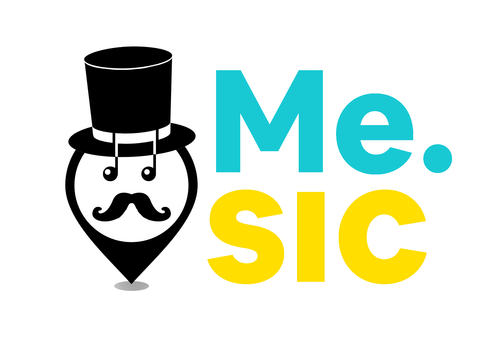

# Project : Mesic

> Mesic 바로가기 🏁
> [https://realmesic.space/](https://realmesic.space/)
>
> 
>
> Github 레포 🏠
> [https://github.com/codestates/Mesic-client](https://github.com/codestates/Mesic-client)

## What is Mesic?

어떤 노래를 들으면 생각나는 추억이 모두 하나 쯤은 있다. 그런 추억을 저장할 수 있는 서비스가 있으면 좋을 것 같아서 만든 서비스가 Mesic이다. **추억 (Memory) + 음악 (Music)**의 합성어로 말 그대로 음악에 관한 추억을 그 음악을 들었던 위치와 사진 그리고 간단한 메모와 함께 저장할 수 있다. 팔로우 기능도 있기 때문에, 다른 유저와 게시물을 공유하는 것 또한 가능하다.

이번 프로젝트는 약 4주 간의 시간 동안 나를 포함한 4명의 팀원들과 함께 진행하였다. 이렇게 큰 프로젝트를 해본 적은 처음이라 많이 서툴고 새로운 스택을 배우면서 적용시키는 과정에서 어려움이 많았다. 어려운 만큼 배운 점도 많았고 프로젝트를 완성시켰을 때 기분은 말로 표현하기 힘들 정도로 너무 좋았다. 하지만, 프로젝트가 끝나고 내 코드를 다시 보니 엉망이었다... 그래서 프로젝트가 끝난 후에도 같은 프론트엔드 팀원 분과 함께 리팩토링을 진행했다.

이번 포스팅은 프로젝트 기간동안 전체적으로 어떻게 설계했고 만들었는 지에 대해 정리하고 다음 글에서는 리팩토링 과정과 힘들었던 점들 그리고 느낀 점들에 대해서 생각해보는 시간을 가져보려 한다.

## Tech Stacks
서비스를 구현하기 위해 프론트엔드에서 다음과 같은 기술 스택들을 사용하였다.

### 1. React Hooks
React를 이용하여 효율적으로 앱을 설계할 수 있었다. 지도 기반 서비스의 특성 상, 핀의 정보가 바뀔 때 마다 일련의 동작을 연속적으로 실행해주어야 하는데 이 때 React의 state와 props 그리고 Hooks의 Effect 함수가 아주 유용하게 쓰였다. 예를 들어, 어떤 장소를 클릭했을 때, 그 위치에 대한 정보를 서버로부터 가져오고 모달 컴포넌트로 응답을 내려주어 유저가 정보를 읽을 수 있게 구현할 수 있었다.

모달 창의 경우, 세 가지 파트 (음악, 사진, 메모)로 구분되는데 각 파트 별로 안의 내용이 있을 때와 없을 때 그리고 내용을 수정할 때 UI가 달라진다. 이 때, 아주 비슷한 요소들로 이루어진 UI가 반복되는데 이를 컴포넌트화 시켜서 하나의 부품처럼 사용할 수 있었다. 따라서, 중복되는 코드가 없어지면서 가독성이 좋아지고 앱의 구조가 더 명확하게 보이는 효과를 얻을 수 있었다. 또한, 혹여 문제가 생기면 컴포넌트 하나만 고치면 되기 때문에, 유지보수가 더 쉬워졌다.

React Hooks를 사용하면서 Function 컴포넌트를 stateful하게 사용할 수 있었고 덕분에 컴포넌트 코드가 훨씬 간결해졌다. 예전 프로젝트에서 Class 컴포넌트를 이용했었는데, 기능이 별로 없는 간단한 앱이라도 코드가 너무 장황해지는 경험을 했다. props를 부모 컴포넌트로부터 상속받기 위해 super를 사용해야했고, 함수를 하나 만들더라도 모든 함수에 this를 걸어주고 binding을 해주어야했다. Hooks를 쓰면서 이런 불필요한 코드가 전부 없어졌다.

### 2. Redux
Redux는 state를 한 곳에서 관리하기 위해 사용하였다. 유저 id나 토큰 같은 정보는 다수의 컴포넌트에서 사용되기 때문에, 최상위에서 시작하여 모든 컴포넌트로 state를 내려주는 것은 비효율적이였다. (Props-drilling) 따라서, Redux의 store에 저장한 후 어디에서나 어디에서나 사용 가능하도록 만들었다. 그리고 Redux-persist를 이용하여, 새로고침 이후에도 store가 보존되어 로그인 상태가 유지되도록 구현할 수 있었다.

### 3. React Router
React는  페이지 간 이동 기능 지원하지 않기 때문에, React Router 같은 별도의 라이브러리가 필요했다. 

### 4. TypeScript
JavaScript만 사용하는 프로젝트를 하면서, 수 없이 많은 에러들을 만났다. 그 중 가장 많이 만난 에러가 Type 에러인데, 내가 만든 객체를 다른 컴포넌트에 넘기고 속성을 변경하고 하다보면 그 형태가 어떤지 추적이 불가능하였다. TypeScript는 컴파일 단계에서 부터 에러를 발생시키기 때문에, 내가 코드를 작성하면서 즉각적으로 틀린 부분을 수정할 수 있어 작업 속도가 더 빨라졌다.

또한, 서버나 외부 API로부터 받아온 데이터들에 타입을 지정해주어 에러를 방지할 수 있었고, 코드 위에 마우스 커서를 올리면 변수명 뿐만 아니라 데이터의 타입까지 알 수 있어서 협업에 많은 도움이 되었다.

### 5. SCSS
Nesting과 같이 CSS보다 심플한 표기법으로 CSS를 구조화하여 표현할 수 있었다. 속성 값을 변수로 혹은 속성들을 그룹으로 묶을 수 있어 (Mixin), 자주 사용하는 색상이나 비슷한 디자인의 CSS에 적용시켜 통일성을 지키고 중복되는 코드를 줄일 수 있었다. 각 컴포넌트 별로 scss 파일을 분리하고 최상위에서 Import함으로써 컴포넌트 별로 CSS를 관리할 수 있었다. 

### 6. Axios
HTTP 통신 시, 요청은 JSON 형태로 변환하고 응답은 JSON 형태의 데이터를 자동으로 파싱하여 매우 편리했다.

### 7. AWS-SDK
클라이언트에서 사진을 서버 (EC2)에 저장하게 되면, 업로드 중 다른 요청의 응답속도가 현저히 느려지는 문제와 파일 업로드 경로가 노출될 경우 서버 보안이 취약해질 수도 있다는 점을 고려해 이미지만 저장하는 S3 버킷을 생성하는 것이 나을 것이라고 판단했다. 따라서,  S3를 JavaScript로 접근 및 조작하기 위해 AWS-SDK를 사용했다.

### 8. Kakao Map API
지도 기반의 게시물 업로드 서비스이기 때문에, 외부 지도 API 서비스를 이용해야만 했다. 카카오맵은 우리나라 지도 API 중 가장 기능이 다양하고 커스터마이징이 자유로웠다. 카카오맵 API를 이용하여 키워드 기반의 장소검색, 마커 정보 미리보기, 마커 이미지 변경 등 지도에서 필요한 기능들을 구현할 수 있었다.

## Front End Workflow
클라이언트가 동작하는 방식을 도식화하면 다음과 같다.

### 지도 렌더 (MainPage)

메인페이지는 지도가 보여지는 페이지다. 메인페이지로 들어가면 로그인 상태에 따라 다른 정보가 보여진다. 비로그인이라면, 클라이언트에 저장된 더미데이터로 핀들이 생성된다. 이 핀들은 읽기만 가능하며 수정 또는 삭제가 불가하다.

유저가 로그인을 한다면, 서버로부터 유저 정보를 가져온다. 여기서, 유저 정보에 있는 user_id로 다시 한번 서버에 API 요청을 하여 유저가 만든 핀에 대한 정보를 모두 불러온다. 핀의 위치(위도, 경도)를 기반으로 지도에 마커를 생성하는데, 마커를 클릭할 때 핀의 id를 가져올 수 있도록 이벤트를 걸어준다.

### 팔로우 목록 클릭 시
로그인 시 서버로부터 받은 팔로우 목록으로 팔로우 목록 컴포넌트를 생성하였다. 팔로우 체크박스를 클릭하면, 서버 API를 통해 체크된 팔로우의 id로 팔로우가 만든 핀의 데이터를 응답으로 받고 위와 동일하게 마커들을 지도에 렌더링 시켜주었다.

### 핀 클릭 시 ( Read / Update / Delete )
핀을 클릭했을 때, 해당 핀의 id로 서버로부터 핀의 정보를 요청한다. 해당 핀에 대한 음악, 사진, 메모와 관련된 데이터를 응답으로 받아와서, ReadModal의 props로 전달한다. 위의 모든 과정이 완료되었으면, ReadModal이 열리면서 핀에 대한 정보를 조회할 수 있다.

ReadModal에서 조회뿐만 아니라 수정과 삭제도 가능하다. ReadModal 컴포넌트는 Redux의 mode 상태에 따라서 다른 UI가 렌더링된다. 기본적으로, 내 핀을 클릭할 때는 mode는 READ, 팔로우한 유저의 핀을 클릭할 때는 WATCH가 된다. READ는 수정과 삭제가 가능하고 WATCH는 조회만 가능하다.

READ mode에서 수정 버튼을 누르면, ReadModal 컴포넌트의 updateMode 상태가 활성화되며 음악, 사진, 메모 각각을 수정할 수 있는 컴포넌트를 렌더링시킨다. 수정 시, pin_id로 다시 핀의 정보를 가져오고 삭제를 할 경우, user_id로 다시 유저의 핀들을 지도에 렌더시킨다.

### 지도 클릭 시 ( Post )
지도를 클릭할 경우, PostModal 컴포넌트가 열리면서 핀을 생성할 수 있다. 핀이 생성되면, 다시 유저의 핀을 불러와 마지막에 만들어진 핀의 데이터를 ReadModal로 띄워주어 만들어진 핀을 조회할 수 있도록 하였다.

### 장소 검색 시
검색창에 키 입력 시, 입력된 값을 실시간으로 카카오맵 키워드 검색 API로 요청한다. 응답으로 받은 값의 목록을 띄워주웠다. 목록을 선택할 경우, 해당 위치로 화살표 마커를 표시해주었다.

### 마이페이지
처음 로그인 시, Redux의 store에 저장한 유저 정보를 띄워주었다. 유저 정보 수정 시, 다시 서버 API 요청을 통해 유저 정보를 받아와 변경된 정보를 반영할 수 있도록 하였다.
