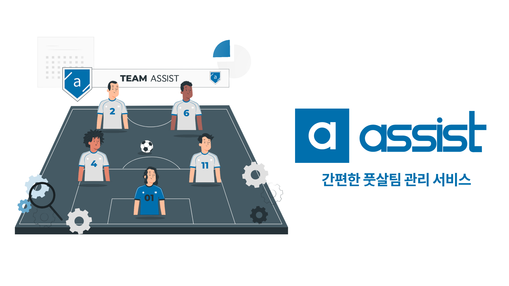

# Project : ASSIST

> ASSIST 바로가기 🏁
> [https://team-assist.kr/](https://team-assist.kr/)
>
> Github 레포 🏠
> [https://github.com/codestates/ASSIST](https://github.com/codestates/ASSIST)

## What is ASSIST?

풋살 팀이 한번 경기를 하기 위해서 주장은 많은 잡다한 일들을 해야만 한다.

프로젝트 어시스트는 풋살 팀을 운영하는데 있어, 반복되는 수고스러운 일들을 자동화시켜 주장이 쉽게 팀을 관리할 수 있도록 **도움(ASSIST)**을 주는 서비스다.

어시스트는 **카카오톡 알림톡**을 통해, 팀원들에게 경기나 팀에 관련된 소식들을 자동으로 공지해준다. 주장이 경기를 등록하면 자동으로 투표를 독려해주고, 투표가 완료되면 팀원들의 참석 여부와 같이 경기에 대한 정보를 팀원들에게 알려준다. 만약, 팀원이 부족하여 경기를 진행하는데 어려움이 있을 시 용병을 구할 수 있다. ( 용병 기능은 아직 자동화가 되지 않아, 기능이 완성될 때까지 프로젝트 팀이 직접 구할 예정이다. )

이번 프로젝트는 약 5주 간의 시간 동안 나를 포함한 4명의 팀원들과 함께 진행하는데, 기획자인 PM님을 제외하면 개발자는 3명이었다. 구현해야 할 기능과 페이지 수는 많은데, 팀원 수가 적어서 조금 힘들었다. 특히, 나와 다른 프론트엔드 팀원은 처음으로 진행하는 React Native 프로젝트여서 많은 시행착오를 겪었다. 실제로 서비스를 운영해 볼 생각으로 시작한 프로젝트였기 때문에, 사용자 입장에서 어떻게 하면 더 편하게 이용할 수 있을지 더 많이 고민했던 것 같다. 현재 프로젝트는 핵심 기능은 구현이 완성되었고 버그 수정과 기능 개선에 집중하고 있다.

이번 포스팅에서는 앱을 만들기 위해 선택한 기술 스택과 어떻게 설계했는 지에 대해 정리하고 다음 글에서는 프로젝트를 진행하면서 배운 점들과 힘들었던 점들 그리고 느낀 점들에 대해서 정리하는 시간을 가져보려고 한다.

## Tech Stacks

어시스트를 만드는데 다음과 같은 기술 스택들을 사용하였다.

### 1. React Native

React Native로 크로스 플랫폼 앱을 만들고자 했다. 많은 사람들이 쉽게 우리 서비스를 접하여 쉽게 사용하도록 하는 것이 가장 큰 목표였다. 따라서, 가장 많이 사용되는 Android / iOS / Web 세 가지 플랫폼으로 앱을 만들어 많은 사람들이 쉽게 접할 수 있도록 했다. ( 아직 Web 버전만 배포되어있지만 Android → iOS 순으로 출시할 예정이다. )

또한, 서비스가 모바일에 최적화 되어있기 때문에, React가 아닌 React Native를 선택하였다. Native는 `SafeAreaView` 나 `FlatList` 같은 모바일 환경에 알맞는 컴포넌트를 제공하기 때문에, 이를 활용하여 React를 사용하는 것보다 쉽게 앱을 만들 수 있었다.

Expo라는 앱을 쉽게 빌드, 배포할 수 있게 도와주는 프레임워크를 사용했다. Expo를 이용함으로써, Native 프로젝트가 처음인데도 별도의 어려운 개발 환경 세팅 없이 쉽게 개발을 시작할 수 있었다. 또한, 외부 URL과 연결시키거나 전화나 메시지 앱을 연동하는 등 유용한 모듈들을 사용할 수 있었다. 가장 좋았던 점은 Expo Go라는 앱으로 실제 내가 사용하는 핸드폰으로 앱을 테스트 해 볼 수 있다는 점이었다.

다만, 단점도 존재했는데 환경 세팅이 쉬운 만큼 개발할 수 있는 범위가 한정적이었다. 카카오톡 알림톡 서비스와 연동하는 것이 서비스의 핵심인데, 이를 구현하기 위해서 외부 링크로 앱을 구동시키는 deep Linking과 같은 기술이 필수적이었다. 하지만, Expo만으로는 불가능하고 Expo가 설정한 세팅에서 벗어나 개발 환경을 조작해야하는 eject 과정이 필요했다.

### 2. React Hooks

이번 프로젝트도 Class Component가 아닌 Functional Component를 사용하였다. 저번 프로젝트에서는 Hook을 하나도 사용하지 않았는데, 이번에 Hooks를 적극적으로 사용하면서 Functional Component의 이점을 제대로 느꼈다.

컴포넌트에서 반복되는 로직을 Hook으로 만들어, 단 한 줄의 코드로 여러 작업을 선행할 수 있었다. 이번 프로젝트에서 많은 커스텀 Hooks를 만들었다. 그 중 하나를 예를 들면, 팀의 최신 정보를 서버로부터 받아서 화면에 띄워야 하는데 서버 통신이 비동기 작업이다 보니, 응답 데이터를 받은 후에 컴포넌트를 렌더링시켜야 했다. 그래서, 서버로부터 데이터를 받기 전에 로딩 상태를 알려주고 응답 데이터를 받으면 데이터를 리턴해주는 커스텀 Hook을 만들었다. 많은 페이지에서 이런 로직이 반복되는데, 이 때마다 데이터를 요청하는 코드를 적지 않고 내가 만든 커스텀 Hook 한 줄로 이 작업을 끝낼 수 있었다.

그 외에도 이번 프로젝트에서는 React 컴포넌트의 모듈화를 제대로 활용했던 것 같다. 저번 프로젝트에서도 모듈화를 시켰다고 했지만, 컴포넌트를 부품처럼 사용했다기보단 반제품으로 사용했다는게 더 맞는 표현인 것 같다. 이전에는 하나의 완성된 컴포넌트 여러 개를 갖다붙여 페이지를 완성시켰다면, 이번 프로젝트에서는 React의 `children` props를 사용하여 컴포넌트를 더 세분화하여 페이지들을 만들었다. 컴포넌트를 더 잘게 쪼개니 반복되는 코드가 줄어들고 작업이 효율적으로 이루어져서 짧은 시간 안에 많은 페이지들을 완성시킬 수 있었다.

### 3. React Navigation

React Native 앱 내에서 페이지 간 라우팅을 하기 위해 사용한 라이브러리다. 모바일에 최적화 된 네비게이션 기능을 제공한다. 서비스에서는 Stack Naivgator만 필요하여 다른 Navigator를 사용하지 않았지만, Tab이나 Drawer 같은 네비게이터도 지원한다.

### 4. Redux

모바일 앱 특성 상 화면이 작아 PC보다 보여줄 수 있는 정보의 양이 적어 페이지 수가 굉장히 많아졌다. 여러 페이지들을 이동하면서 일일이 파라미터로 데이터를 전달하기가 매우 까다로웠다. 그래서, 모든 페이지에서 접근할 수 있는 상태 관리 라이브러리가 필요하였다.

이외에도 Redux-persist를 이용하여, 새로고침이나 카카오톡 외부 링크를 타고 페이지를 이탈한 후에도 store가 보존되어 로그인 상태가 유지되도록 구현하였다.

### 5. Styled-Components

CSS 스타일링이 된 컴포넌트를 만들어 React 모듈화의 이점을 극대화시킬 수 있었다. CSS 속성 값을 컴포넌트로 묶어 상속시킬 수도 있었고 자주 사용하는 색상이나 폰트 등을 컴포넌트화를 시켜 중복되는 코드를 줄일 수도 있었다.

### 6. TypeScript

TypeScript는 컴파일 단계에서 부터 에러를 발생시키기 때문에, 내가 코드를 작성하면서 즉각적으로 틀린 부분을 수정할 수 있어 작업 속도가 더 빨라졌다. 또한, 서버나 외부 API로부터 받아온 데이터들에 타입을 지정해주어 에러를 방지할 수 있었고, 코드 위에 마우스 커서를 올리면 변수명 뿐만 아니라 데이터의 타입까지 알 수 있어서 협업에 많은 도움이 되었다.

### 7. Axios

HTTP 통신 시, 요청은 JSON 형태로 변환하고 응답은 JSON 형태의 데이터를 자동으로 파싱하여 매우 편리했다.

## Front End Workflow

팀 추가 / 생성, 경기 일정 생성 등 기능 별로 Stack 네비게이터를 생성하였다. 네비게이터의 각 스크린에서 필요한 정보들을 수집하여 Redux Store에 저장한 후, 마지막 스크린에서 서버에 요청을 보내는 방법으로 대부분의 기능들이 구현되어 있다. 정보를 조회하는 경우, 필요한 스크린마다 서버로부터 데이터를 받아오는 Hook이 실행되어 최신의 정보로 스크린을 업데이트해주고 있다.

아래 그림은 여러 기능들 중, 경기 일정을 생성하는 과정을 그림으로 표현해보았다.

  

