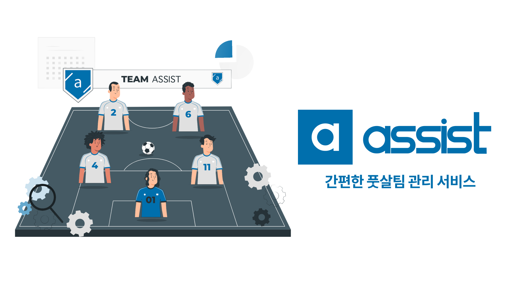

# Project : ASSIST



> ASSIST 바로가기 🏁
> [https://team-assist.kr/](https://team-assist.kr/)
>
> Github 레포 🏠
> [https://github.com/codestates/ASSIST](https://github.com/codestates/ASSIST)

## Intro

약 한달이 조금 넘는 기간동안 정신없이 달려왔다. 우리 팀은 사이드 프로젝트 대회 우승이라는 쾌거(?)를 이루었고 지금은 프로젝트 기간만큼은 아니지만 열심히 기능 개선에 힘쓰고 있다. 지난 프로젝트 기간을 돌아보며, 내가 생각하기에 가장 중요한 것들을 기록으로 남겨보려고 한다. 프로젝트를 통해 내가 배운 점들, 어려웠던 점과 해결 방법 그리고 느낀 점들에 대해 이야기 해보겠다.

## What I Learned

### 1. 컴포넌트의 모듈화

저번 프로젝트 회고에서도 모듈화를 배웠다고 했지만, 이번 프로젝트를 끝내고 보니 내가 했던게 반쪽짜리 모듈화였다는 생각이 들었다. 1편에서도 말했지만, 컴포넌트를 부품처럼 썼다기보다 반제품을 만들어 완제품을 완성시킨 느낌이었다.

[리팩토링 과정](https://velog.io/@gwanuuoo/%ED%94%84%EB%A1%9C%EC%A0%9D%ED%8A%B8-%ED%9A%8C%EA%B3%A0-Mesic-part-2#detailmodal-%EC%BB%B4%ED%8F%AC%EB%84%8C%ED%8A%B8-%EC%BD%94%EB%93%9C-%EC%88%98%EC%A0%95)을 거치며 이 정도면 React의 컴포넌트를 잘 활용했다고 생각했는데, 큰 착각이었다. 지금 생각하면 컴포넌트를 더 잘게 쪼개어 중복되는 코드를 훨씬 많이 줄일 수 있을 것 같다. 예전 프로젝트를 다시 생각해보면, 중복되는 UI 요소들이 굉장히 많았는데 처음부터 컴포넌트로 만들어 활용할 생각을 전혀 하지 못하였다.

지금 생각해보면, 이것이 얼마나 비효율적인 작업이었는지 뼈저리게 느낀다. 지금 레포에 있는 코드의 양을 아마 반으로 줄일 수 있을 것 같다. 지금 다시 이전 프로젝트를 만든다면 이런 식으로 컴포넌트를 만들었을 것 같다.


이번 프로젝트에서는 디자인 작업에서부터 만들어야할 컴포넌트 단위들을 생각하면서 작업을 했기 때문에, 만들어야 할 페이지 수는 이전 프로젝트보다 비교도 할 수 없이 많았지만 작업 속도는 훨씬 더 빨랐다.


이전과 컴포넌트를 보는 시각에도 변화가 생겼다. 이전에는 컴포넌트를 모달 창과 같은 하나의 큰 요소로 봤다면, 지금은 버튼 하나를 만들어도 중복되는 요소가 있다면 이를 나누어 코드 중복을 최소화 시킬 수 있다. 또한, 같은 컴포넌트라도 전달하는 props에 따라 CSS 속성의 변화를 주어 비슷한 UI 요소를 하나의 컴포넌트로 만드는 법을 익혔다.

### 2. Custom Hooks

이번 프로젝트에서 Hook이 안쓰이는 페이지가 없을 정도로 Hook을 많이 사용했다. 처음에는 Hook과 일반적인 함수의 차이를 알지 못하여서 커스텀 Hook을 만들지도 못하고 활용하지도 못하였다. Hook은 이름앞에 'use'가 붙으며, 컴포넌트가 마운트 될 시 무조건 실행되어야 하는 조건을 갖고 있다. 그래서, 여러 컴포넌트에서 반복되는 로직이 있으면 그 일련의 과정들을 선행시킬 수 있고 Hook에서 state를 리턴해준다면 그 state를 활용하여 정말 다양하게 사용할 수 있다.

많은 Hook들을 만들었는데 가장 많이 사용한 Hook은 `useTeamInfo`다. 팀의 경기 정보를 요청하는 API를 호출하여 데이터 리턴해주는 Hook인데 서버로부터 응답이 돌아올 때까지 로딩을 걸어둔다.

```ts
// useTeamInfo.tsx
export default function useTeamInfo() {
  ...
  const [data, setData] = useState<TeamInfo>(undefined);
  const [isLoading, setIsLoading] = useState(false);

  useEffect(() => {
    const fetchData = async () => {
      setIsLoading(true);
      try {
        const { data }: AxiosResponse<TeamInfo> = await axios.get(
         ...
        );
        setData(data);
      } catch (error) {
        ...
      }
      setIsLoading(false);
    };
    fetchData().catch(...);
  }, []);

  return { data, isLoading };
}
```

만약 로딩 중이라면, 로딩 스크린을 띄워주고 데이터를 받아오면 그 데이터를 렌더링 시켜주는 방식으로 각 스크린을 구현하였다.

<p align="center">

</p>

처음에는 모든 정보를 로그인 후 홈화면에 접근할 시 받아온 후, 클라이언트에 저장해놓으려고 했지만 이 방식은 문제가 많았다. 우선, 클라이언트에 필요 이상으로 많은 데이터를 저장하여 앱을 무겁게 만들 우려가 있었다. 그리고 유저가 앱을 사용하는 도중에 만약 팀의 정보가 바뀌게 된다면 유저가 잘못된 정보를 접할 우려가 있었다. 하지만, 이 방식을 채택한 후 어느 페이지든 최신의 정보를 서버로부터 받아오기 때문에 이런 문제점을 해결할 수 있었다.

## Challenges

프로젝트를 진행하면서 많은 어려움들이 있었지만, 그 중 가장 기억에 남는 두 가지가 있다.

### 1. Quick Tips

서비스 이용 방법을 설명하는 페이지를 구현하는 일이 그 중 하나였던 것 같다. 스크린에 있는 버튼을 하나씩 하이라이트 효과를 넣으면서 설명하는 말풍선을 달아야 했는데, 어떻게 구현할지 막막했다. 일단 가장 위에 쉐이드 효과를 주는 컴포넌트를 하나를 씌워주는 것은 확실했고, 하이라이트 효과를 어떻게 줄지가 관건이었다. 두 가지 방법을 생각했다.

하나는 버튼의 `z-index` 값을 높여 쉐이드 컴포넌트 위로 버튼이 올라오게 하는 것이었고, 두 번째는 버튼의 위치 값을 구한 다음 똑같은 버튼 컴포넌트를 위에 덮어 씌우는 방법이었다. 사실, 첫 번째 방법은 불가능했다. `z-index`는 같은 부모 컴포넌트 아래 형제 컴포넌트끼리만 조절이 가능하기 때문에 이미 겹겹히 쌓인 컴포넌트 구조 안에서 저 밑에 있는 컴포넌트를 끄집어 올리는 것은 불가능했다. 그래서 두 번째 방법을 채택했다.

두 번째 방법을 구현하기 위해, 유저의 화면 안에서 버튼의 절대적인 위치 값을 찾아야 했고 그 위로 또 다른 버튼이 띄워지게 만들어야 했다. 이 과정이 모든 페이지에서 똑같이 반복되는 로직이기 때문에, 커스텀 Hook을 만들어 쉽게 해결할 수 있었다.

React Native에서 컴포넌트가 렌더링 될 때, onLayout이라는 event가 발생하는데 콜백함수를 통해 event에 접근하여 컴포넌트의 위치 값을 구할 수 있었다. 이 위치 값이 정해지면 그 위치에 하이라이트 효과를 준 버튼을 렌더시켜 아래 있던 버튼이 위로 올라온 듯한 효과를 줄 수 있었다.

```ts
// useOnLayout.tsx
export default function useOnLayout() {
  const [layout, setLayout] = useState<undefined | LayoutType>(undefined);

  // 컴포넌트의 위치를 찾는 콜백함수
  const onLayout = useCallback((event: LayoutChangeEvent) => {
    // 위치 값이 담긴 객체
    const layout = event.nativeEvent.layout;
    setLayout(layout);
  }, []);

  return { layout, onLayout };
}
```

하지만, 페이드 효과가 없으니 화면이 넘어가는 움직임이 너무 부자연스러웠다. 페이드 효과도 마찬가지로 반복되는 로직이므로 커스텀 Hook을 만들어 구현하였다. React Native의 `Animated.View`를 이용하여 페이드 애니메이션 효과를 주었는데, [공식문서](https://reactnative.dev/docs/animated)에서 찾아볼 수 있다. 이 로직을 바탕으로 커스텀 Hook을 만들었다.

```ts
// useFadeAnim.tsx
export default function useFadeAnim({ duration }: useFadeAnimProps) {
  // Opcacity : 0에서부터 값이 시작
  const fadeAnim = useRef(new Animated.Value(0)).current;

  // 0에서 부터 1로 값이 증가 (= 페이드 인 효과 )
  const fadeIn = () => {
    Animated.timing(fadeAnim, {
      toValue: 1,
      duration,
      useNativeDriver: false,
    }).start();
  };

  // 1에서부터 0으로 값이 감소 (= 페이드 아웃 효과)
  const fadeOut = () => {
    Animated.timing(fadeAnim, {
      toValue: 0,
      duration,
      useNativeDriver: false,
    }).start();
  };

  return { fadeAnim, fadeIn, fadeOut };
}
```

이 두 가지 커스텀 Hook을 사용하여 다음과 같이 Quick Tips 화면을 구현할 수 있었다.

<p align="center">

</p>

### 2. Deep Linking

어시스트 서비스의 핵심은 카카오 알림톡을 이용한 자동 공지 기능이다. 많은 알림톡 공지들 중 팀 초대, 투표하기 알림톡은 알림톡 버튼을 통해 앱의 특정 페이지로 접근한다. 하지만, 앱은 웹과 다르게 URL이 없기 때문에, React Navigation의 Deep Linking이라는 기술을 통해 앱의 특정 주소로 접속할 수 있도록 링크를 만들어 주어야 했다.

대부분의 스크린에서 라우터의 파라미터를 넘겨주지 않고 Redux Store에 유저가 직접 입력 값들을 저장하여 마지막에 수집한 데이터를 서버로 전송했다. 하지만, 외부 링크로부터 파라미터를 받아야할 경우는 이 로직을 조금 변경할 시켜야 했다. 예를 들어, 알림톡을 통해 초대 코드를 받은 경우 초대 코드를 링크의 파라미터를 통해 초대 코드가 팀 가입하기 스크린에서 자동으로 입력되게 해야했다. 이 때는 인풋의 디폴트 값을 링크의 파라미터로 입력이 되게 만들었다.


<p align="center">

</p>

## Conclusion

5주라는 기간이 이렇게 빨리 지나갈 줄은 몰랐다. 매일 함께 앞만 보고 열심히 달린 팀원들에게 감사한 마음이다. 이번 프로젝트를 진행하면서 **팀의 소통**이 얼마나 중요한지 깨달았다. 우리 팀은 매일 아침에 줌에서 다 같이 모여 데일리 스크럼 회의 시간을 갖었다. 매일 자신이 맡은 테스크의 진행 사항을 보고하고 어려운 점이 있으면 거리낌 없이 팀에게 공유하였다. 나머지 팀원들이 모여 함께 문제를 어떻게 해결할 수 있을지 고민해보고 정 혼자서 안되면 함께 페어 프로그래밍을 진행하였다.

소통이 잘 되었던 이유를 생각하니, 매일 진행했던 회의가 큰 역할을 했던 것 같다. 매일 만나서 자유롭게 의견을 나눌 수 있는 시간을 갖다보니, 팀원들끼리 소통에 있어서 불편함이 없었던 것 같다. 다른 팀에 지인이 있었는데, 팀은 안타깝게도 기한 내에 프로젝트를 완성하지 못하였다. 대화를 나누어 보니, 팀이 정기적인 회의가 필요없다고 판단하여 각자가 알아서 프로젝트 관리 앱을 통해서 각자의 테스크를 진행했다고 한다. 그러다보니, 점점 팀원들끼리 소통이 줄어들고 테스크 진행 상황도 공유가 안되면서 계획이 많이 틀어졌다고 들었다.

이 이야기를 듣고, 팀의 체계가 얼마나 중요한지 깨달았다. 우리 팀도 매일 진행하는 데일리 스크럼이 매번 큰 의미가 있지는 않았다. 어떤 날에는 모두가 보고할 만한 특이 사항이 없어서 5분만에 회의가 끝나고 각자 테스크를 하러 가는 날도 있었다. 하지만, 이런 체계에 의해 만들어진 팀의 문화가 내가 모르는 사이 팀원들 간의 소통의 장벽을 낮추어 준 것 같다. 이와 더불어, 매일 내가 한 작업에 대해 보고를 해야하니 동기부여가 되는 점도 있었다. 내가 잘한 일이 있으면 팀원들은 칭찬을 아끼지 않았고 더 개선할 점이 있다면 좋은 피드백을 주었다. 덕분에, 원래 내가 할 수 있는 일보다 더 능력을 끌어올려 더 좋은 결과물을 낼 수 있었던 것 같다.

이번 프로젝트는 기획자와 함께 한 첫 프로젝트로서 의미가 깊다. 내가 알기로는 현업에서 기획자와 개발자 간의 트러블이 굉장히 잦다고 해서 처음에 조금 긴장했었다. 우려와 달리, 기획자였던 PM님은 우리를 많이 배려해주셨다. 새로운 기능을 기획을 하여도, 하나를 고집하지 않고 기술적으로 구현하기 어려울 것을 대비하여 좀 더 쉬운 대안책을 항상 준비하셨다. 이런 부분에 있어서 나 또한 감사함을 느껴 조금 어려울 지라도 되도록 기획자님의 생각대로 똑같이 구현해보려고 더 열심히 노력한 것 같다. 하지만, 기획에 있어 개발을 하더라도 서비스 품질에 크게 도움이 되지 않는다고 판단되면 회의를 통해 원래 기획을 변경하기도 하였다.

프로젝트를 진행하면서 아쉬웠던 점은 계획성이 좀 부족했었던 것 같다. 프로젝트 기간동안 Jira로 테스크를 관리했었는데, React Native 프로젝트는 처음이라 기능 구현에 있어서 방법을 확실히 알지 못했다. 특히, 카카오톡 초대 링크를 통해 앱에 접속하는 법이 미지수였다. 그 당시에는 Deep Linking이라는 개념조차 알지 못했다. 그래서, 시작부터 3주차까지는 매주마다 계획을 세우고 잘 지켜나갔지만 Deep Linking이 필요한 부분부터는 아는 것이 없어서 계획을 세우기가 좀 어려웠다. 그래서 점점 테스크 관리가 잘 안되기 시작했고 그때부터 체계적으로 작업을 하지 못한 것 같다. 일단 부딪혀보자는 생각으로 프로젝트에 임하니 시간이 얼마나 소요됐는지 추적이 되지 않고 방향을 잃었다.

다행히도, 그리 오랜 시간이 걸리지 않아서 프로젝트가 잘 마무리가 되었지만 이 기간동안 프로젝트 일정이 잘 관리되지 않아서 좀 아쉽다. 지금 생각하면 사전에 충분히 조사를 한 후에, 계획을 세울 수도 있었지만 그 때는 시간에 쫓기고 있다는 느낌에 그러지 못했던 것 같다. 또, Jira 사용이 미숙하여 점점 사용을 안하게 되는 면도 있었다. Jira와 깃을 연동하여 테스크를 관리할 수 있다는 사실을 최근에 알았다. Jira 사용법을 공부하여 다음 프로젝트에서는 꼭 사용해봐야겠다.

프로젝트 시작 단계에서부터 실제로 서비스를 운영하는 것을 목표로 개발을 시작했다. 그래서, 어떻게 하면 유저가 쉽게 서비스를 이용할 수 있을지 사용성에 대해 많이 고민했던 것 같다. 평소보다 더 많은 노력과 힘이 들었지만 내가 그만큼 성장한 것이 느껴진 프로젝트였다. 하루 빨리 테스트 팀을 구해서 서비스를 운영해보고 싶다!
