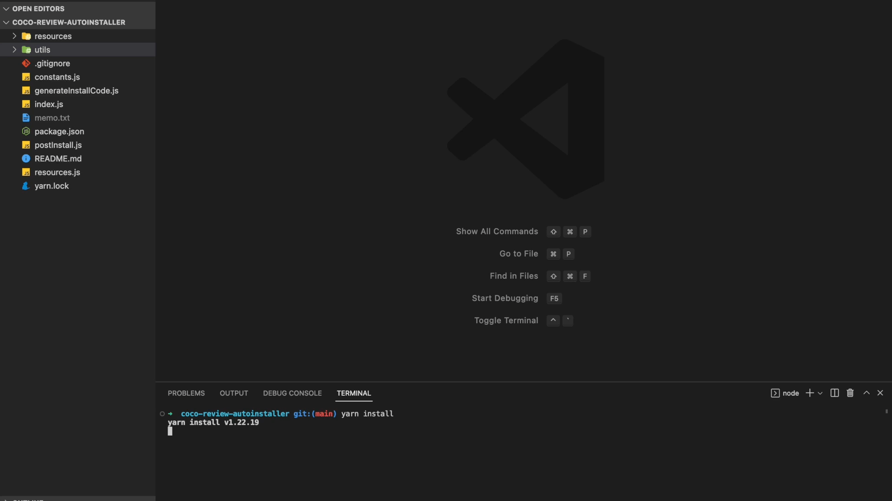

# Project : Review Auto-Installer


> Github 레포 🏠
> [https://github.com/Gwan-Woo-Jeong/coco-review-autoinstaller](https://github.com/Gwan-Woo-Jeong/coco-review-autoinstaller)

## Intro

현재 근무하고 있는 회사의 자체서비스 중, 쇼핑몰 리뷰관리 솔루션이 있다. 여러 쇼핑몰에서 판매하고 있는 특정 상품에 대한 리뷰를 통합 관리해주어 구매 전환율을 높여주는 서비스다. 메뉴얼을 보고 고객이 직접 설치하기도 하지만, 대부분 회사 측으로 설치 요청을 하여 내가 직접 설치할 경우가 많다.

설치는 어렵지 않다. 특정 태그의 class, id 혹은 module (카페24 웹 디자인에서 재사용 되는 UI, 리액트 컴포넌트와 비슷)를 찾아 iFrame 설치코드를 넣으면 된다. 하지만, 코드가 복잡하고 쇼핑몰마다 형태가 조금씩 달라서 꽤나 성가신 작업이다.

다른 업무도 있는데 매번 비슷하게 반복되는 작업에 오랜 시간을 쏟는 것에 회의감을 느껴, 시간을 조금 투자하여 자동설치 프로젝트를 기획하게 됐다. 사실, 이전에도 한번 만들었었는데 레포를 따로 만들어두지 않아 맥북을 바꾸면서 날려버렸다… 그래서 다시 만들며 현타가 조금 왔지만, 그래도 이전 버전을 개선하면서 꽤나 만족스러운 결과물을 내어서 기분이 좋다.

### 이전 버전과 다른점

1. 빌드 파일을 시간 별로 저장
   : 리뷰를 설치한 파일을 타임스탬프가 적힌 폴더에 따로 저장하도록 만들었다. 때문에, 필요시 이전 버전을 쉽게 복구할 수 있다.

2. 코드 반복 최소화
   : 시작 단계에서부터 자주 사용되는 유틸 함수를 따로 빼놓고, 반복되는 리뷰 정보에 관한 변수들 (리뷰 이름, JS경로, HTML경로 등)을 constants로 선언하여 반복되는 코드를 최대한 줄였다. 추후에 리뷰 종류를 추가하거나 유지보수 시에 도움이 많이 될 것 같다.

3. postinstall 적용
   : dependencies 설치 시, HTML 인풋 파일이 자동 생성된다. 이전에는 이를 생성하고 빌드하는 명령을 두번 실행해야 했지만, 이제 한번으로 빌드가 완료된다.

4. 환경변수 삭제
   : env를 없앴다. 이전 버전은 node로 각각의 JS파일을 실행하여 설치를 진행하여 환경변수가 필요했지만, 이번에는 각 파일에 선언된 함수를 한 파일에서 호출하기 때문에, 전역에서 사용되는 변수를 함수의 인자로 넘겨주었다.

## Planning

### Dependencies

- JSDOM
  : 자바스크립트로 HTML 코드를 조작하기 위한 라이브러리. 이번 프로젝트에 가장 핵심적인 역할을 했다.
- prompts
  : 프로그램 사용을 더 간편하게 하도록 인터페이스를 제공해준다.
- js-beautify
  : 더러운 HTML 아웃풋 코드를 예쁘게 다듬어 준다.
- ~~dotenv~~
  : 환경변수를 사용하려고 추가했는데, 생각해보니 환경변수가 없어도 되어서 삭제하였다.

### Structure

```
- index.js ( 엔트리 포인트 )
  : prompts로부터 쇼핑몰 아이디와 설치할 리뷰 종류를 입력받아 설치 코드를 생성한다.
   그리고 리뷰 종류에 따라 알맞는 빌드경로, DOM 객체, 설치코드를 인자로 넘겨 설치 함수를 실행한다.
- constants.js : 리뷰 정보에 관한 정보들이 담긴 변수 ( 리뷰명, HTML 경로, JS 경로 등 )
- generateInstallCode.js : 리뷰명에 따라, 설치 코드를 리턴해주는 함수
- postInstall.js : dependecies 설치 시, 자동 생성되는 HTML 인풋 파일
- resources.js : 각 파일의 경로를 반복문으로 돌리기 위해 생성한 객체
- /resources :
  - reviewForm.js ( 리뷰 작성 폼 설치 )
  - reviewAll.js ( 전체 리뷰 설치 )
  - reviewDetail.js ( 상품 상세 리뷰 설치 )
  - reviewCount.js ( 리뷰 수 표시 설치 )
  - reviewStars.js ( 상품 목록 별점 설치 )
  - reviewBest.js ( 베스트 리뷰 설치 )
  - reviewPopUp.js ( 리뷰 작성 팝업 설치 )
- /build
  - /(time-stamp)
    - /layout
      - 공통_레이아웃.html
      - 메인_레이아웃.html
    - /html
      - 리뷰_작성_폼.html
      - 전체_리뷰.html
      - 상품_상세_리뷰.html
      - 리뷰_수_표시.html
      - 상품_목록_별점.html
      - 베스트_리뷰.html
      - 리뷰_작성_팝업.html
```

## What I Learned

### Promise.all을 활용한 비동기적 함수 실행

선택한 리뷰 설치 함수를 반복문을 돌려 실행한 후, 인풋 HTML 코드를 초기화하는 로직에서 문제가 발생하였다. 모든 설치 함수가 실행되기 전, 초기화 함수가 동기적으로 실행되어 아웃풋이 나오지 않았다.

그래서, 방법을 찾은 결과 각 함수로 이루어진 배열을 Promise로 매핑한 후, Promise.all을 사용하여 비동기 로직을 구현할 수 있었다. Promise.all을 사용했을 때 장점은 모든 배열 안에 모든 Promise들은 동기적으로 실행되는 반면, Promise.all 구문은 비동기적으로 실행된다. 때문에, `Promise.then` 체이닝이나 `async await` 을 여러번 사용하는 것보다 실행 속도가 빠르다고 한다.

### Node File System 활용

파일과 디렉토리를 생성하고 수정하는 로직을 구현하면서 node의 `fs (file system)` 을 사용하는 법을 익혔다.

### Node.js에서 ES 모듈 (import/export) 사용법

처음 프로젝트를 시작했을 때, 프론트엔드 개발했을 때처럼 똑같이 `import` 를 사용하니 컴파일이 되지 않는 현상을 겪었다. 구글링해보니, Node.js는 CommonJS 모듈 시스템으로 돌아가며 `import`, `export` 와 같은 ES 모듈을 사용하려면 Babel 같은 트랜스파일러가 필요했지만, 13.2버전부터 정식으로 사용 가능하다고 한다. 그런데 약간 사용 방법이 달랐다.

1. package.json 파일의 최상위에 `type` 항목을 “module”로 설정한다.
2. `import` 시에 `.js` 확장자를 명시해준다.

## Final App View

### Package Install



### Auto-install


