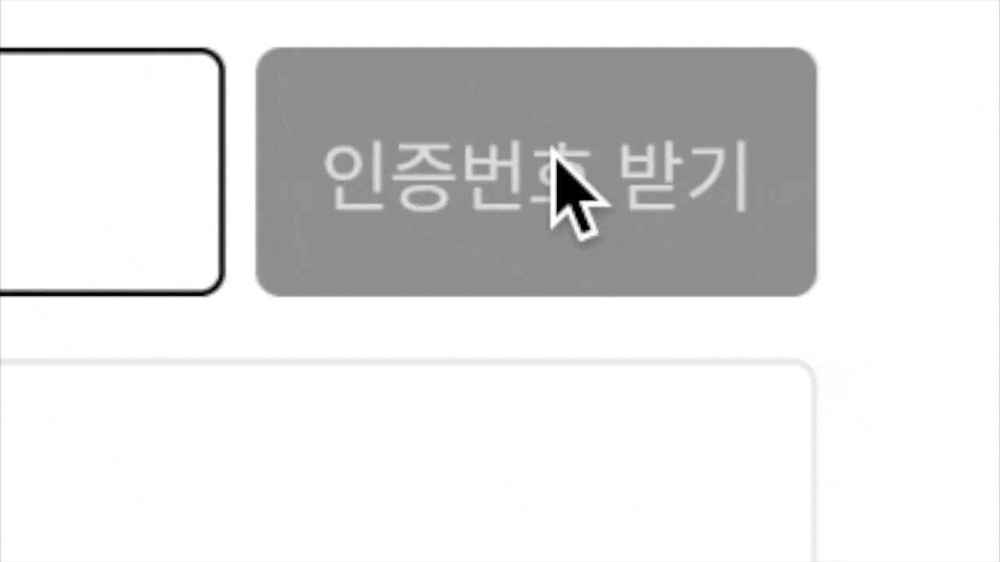

## 재전송 가능한 문자인증 타이머



회원가입 페이지를 만드는데, 문자인증으로 쓸만한 타이머 라이브러리를 찾지 못했다.. 재전송 버튼을 누르면 타이머를 재시작하고 싶은데.. 😂 그래서 어쩔 수 없이 직접 만들어보았다! 재사용 가능한 컴포넌트로 만들어서 여러 곳에서 요긴하게 써보자..!

## 카운트다운

가장 먼저 시간을 state로 만들자. 우리에게 필요한건 “분”과 “초”, 두 가지 상태를 만들자. 우선 1분 30초의 상태를 만들어보겠다.

```jsx
/* Timer.js */

const [minutes, setMinutes] = useState(1);
const [seconds, setSeconds] = useState(30);
```

이제 타이머의 가장 기본인 카운트다운을 구현해보자. 1초가 지날때마다 `minutes`와 `seconds`를 업데이트 해주어야 한다. Web API인 `setInterval` 함수를 사용하여 1초마다 남은 시간을 1초씩 차감하도록 하자.

```jsx
/* Timer.js */

const countdown = setInterval(() => {
  // seconds가 0보다 클 때,
  if (parseInt(seconds, 10) > 0) {
    setSeconds(parseInt(seconds, 10) - 1);
  }
  // seconds가 0일 때,
  if (parseInt(seconds, 10) === 0) {
    // minute도 0이면
    if (parseInt(minutes, 10) === 0) {
      // 타이머 종료
      clearInterval(countdown);
    } else {
      // minute이 남았으면, minute을 차감
      setMinutes(parseInt(minutes, 10) - 1);
      // seconds는 59초
      setSeconds(59);
    }
  }
  // 위 함수를 1초마다 실행
}, 1000);
```

위 카운트다운 함수를 `useEffect` Hook으로 타이머 컴포넌트가 마운트 될 때, 실행되게 하자. 여기서 중요한건, 타이머 컴포넌트가 언마운트 되기 전 카운트다운을 종료시켜야한다. 이를 위해, `useEffect` **cleanup 함수**를 사용하자.

```jsx
/* Timer.js */

useEffect(() => {
  // 위와 동일
  const countdown = setInterval(() => {
    ...
  }, 1000);

    // useEffect cleanup - 카운트다운 종료
    return () => clearInterval(countdown);
  }, [minutes, seconds]);
```

## 기본 타이머 코드

이제 `minutes`와 `seconds`를 리턴해주면 아주 기본적인 타이머가 완성된다.

```jsx
/* Timer.js */

function Timer() {
  const [minutes, setMinutes] = useState(1);
  const [seconds, setSeconds] = useState(30);

  useEffect(() => {
    const countdown = setInterval(() => {
      if (parseInt(seconds, 10) > 0) {
        setSeconds(parseInt(seconds, 10) - 1);
      }
      if (parseInt(seconds, 10) === 0) {
        if (parseInt(minutes, 10) === 0) {
          clearInterval(countdown);
          setTimer("stop");
        } else {
          setMinutes(parseInt(minutes, 10) - 1);
          setSeconds(59);
        }
      }
    }, 1000);

    return () => clearInterval(countdown);
  }, [minutes, seconds]);

  return (
    <>
      {minutes < 10 ? `0${minutes}` : minutes}:
      {seconds < 10 ? `0${seconds}` : seconds}
    </>
  );
}

export default Timer;
```

## 재시작 기능 추가

하지만 현재 타이머는 마운트 시, 자동으로 실행되고 종료 후에 아무런 후속 조치를 취할 수 없다. 위 기본 타이머를 리팩토링하여 재시작 기능을 추가해보자.

우선, 타이머의 state를 만들어주어 상위 컴포넌트에서 제어가 가능하게 만들자. 타이머를 제어하기 위해 필요한 상태는 4가지로 생각했다.

> 1. ‘initial’ - 초기 상태
> 2. ‘start’ - 시작
> 3. ‘restart’ - 재시작
> 4. ‘stop’ - 종료

위 4가지 상태를 타이머에 적용해보자.

```jsx
/* Timer.js */

...
useEffect(() => {
  // 초기, 종료 상태 : 카운트다운을 실행하지 않는다.
  if (timer === 'initial' || timer === 'stop') {
    return;
  }

  // 재시작 상태 : 타이머를 리셋한 후 다시 시작 상태로 돌린다.
  if (timer === 'restart') {
    setMinutes(1);
    setSeconds(30);
    setTimer('start');
  }

  const countdown = setInterval(() => {
    ...
    // seconds와 minutes가 모두 0이면
    if (parseInt(seconds, 10) === 0) {
      if (parseInt(minutes, 10) === 0) {
        // 타이머 종료
        clearInterval(countdown);
        setTimer('stop');
      }
      ...
    }
    }, 1000);
    ...
  }, [minutes, seconds, timer, setTimer]);
    ...
```

## props 설정

이제 상위 컴포넌트에서 시간과 타이머 상태를 props로 전달받아 어디서든 재사용이 가능한 컴포넌트로 만들자.

```jsx
/* Timer.js */

function Timer({min, sec, setTimer, timer}) {
  const [minutes, setMinutes] = useState(min);
  const [seconds, setSeconds] = useState(sec);

	...
	useEffect(() => {
		...
		// 타이머를 리셋한 후 다시 시작 상태로 돌린다.
	  if (timer === 'restart') {
	    setMinutes(min);
	    setSeconds(sec);
	    setTimer('start');
	  }
	  ...
	}, [minutes, seconds, timer, setTimer, min, sec]);
	...
}
```

## 렌더링

마지막으로 타이머의 상태에 따라, 알맞는 텍스트가 표시되도록 렌더링 함수를 만들자.

```jsx
/* Timer.js */

function Timer({min, sec, setTimer, timer}) {
  ...
  const getTime = () => {
    if (timer === 'start' || timer === 'restart') {
      return (
        <>
        	{minutes < 10 ? `0${minutes}` : minutes}:
		      {seconds < 10 ? `0${seconds}` : seconds}
		    </>
		  );
		} else if (timer === 'stop' && minutes === 0 && seconds === 0) {
		  return <>시간 만료</>;
		} else {
		  return null;
		}
	};

	return getTime();
}
```

## 최종 코드

### 타이머 컴포넌트

```jsx
/* Timer.js */

import React, { useState, useEffect } from "react";

function Timer({ min, sec, timer, setTimer }) {
  const [minutes, setMinutes] = useState(min);
  const [seconds, setSeconds] = useState(sec);

  useEffect(() => {
    if (timer === "initial" || timer === "stop") {
      return;
    }

    if (timer === "restart") {
      setMinutes(min);
      setSeconds(sec);
      setTimer("start");
    }

    const countdown = setInterval(() => {
      if (parseInt(seconds, 10) > 0) {
        setSeconds(parseInt(seconds, 10) - 1);
      }
      if (parseInt(seconds, 10) === 0) {
        if (parseInt(minutes, 10) === 0) {
          clearInterval(countdown);
          setTimer("stop");
        } else {
          setMinutes(parseInt(minutes, 10) - 1);
          setSeconds(59);
        }
      }
    }, 1000);

    return () => clearInterval(countdown);
  }, [minutes, seconds, timer, setTimer, min, sec]);

  const getTime = () => {
    if (timer === "start" || timer === "restart") {
      return (
        <>
          {minutes < 10 ? `0${minutes}` : minutes}:
          {seconds < 10 ? `0${seconds}` : seconds}
        </>
      );
    } else if (timer === "stop" && minutes === 0 && seconds === 0) {
      return <>시간 만료</>;
    } else {
      return null;
    }
  };

  return getTime();
}

export default Timer;
```

### 타이머를 사용하는 페이지

아래는 예시로 작성한 코드이니 참고만 부탁드립니다.

```jsx
/* SignUp.js */

import React, {useState} from 'react';
import Timer from '../../components/Timer.js';

function SignUp(){
  const [timer, setTimer] = useState('initial');
  ...

  const sendCode = async () => {
    // 타이머가 초기 상태면
    if(timer === 'initial'){
      // 타이머 시작
      setTimer('start');
    } else {
      // 아니면 재시작
      setTimer('restart');
    }
    // 인증번호 전송 코드
    ...
  };

    return (
      ...
      <Timer min={1} sec={30} timer={timer} setTimer={setTimer} />
      ...
      // 인증번호 전송 버튼
      <span onClick={sendCode}>{timer === 'initial' ? '인증번호 받기' : '재전송'}</span>
      ...
    )
  };
```
