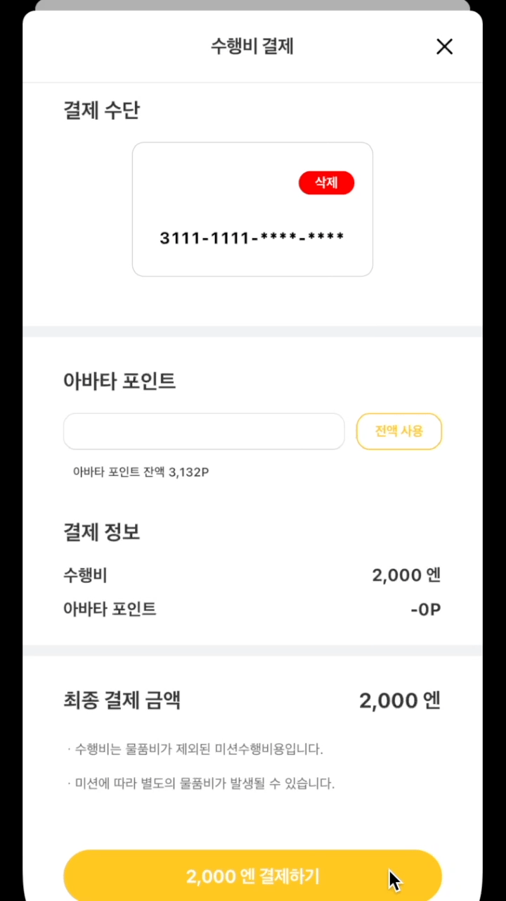
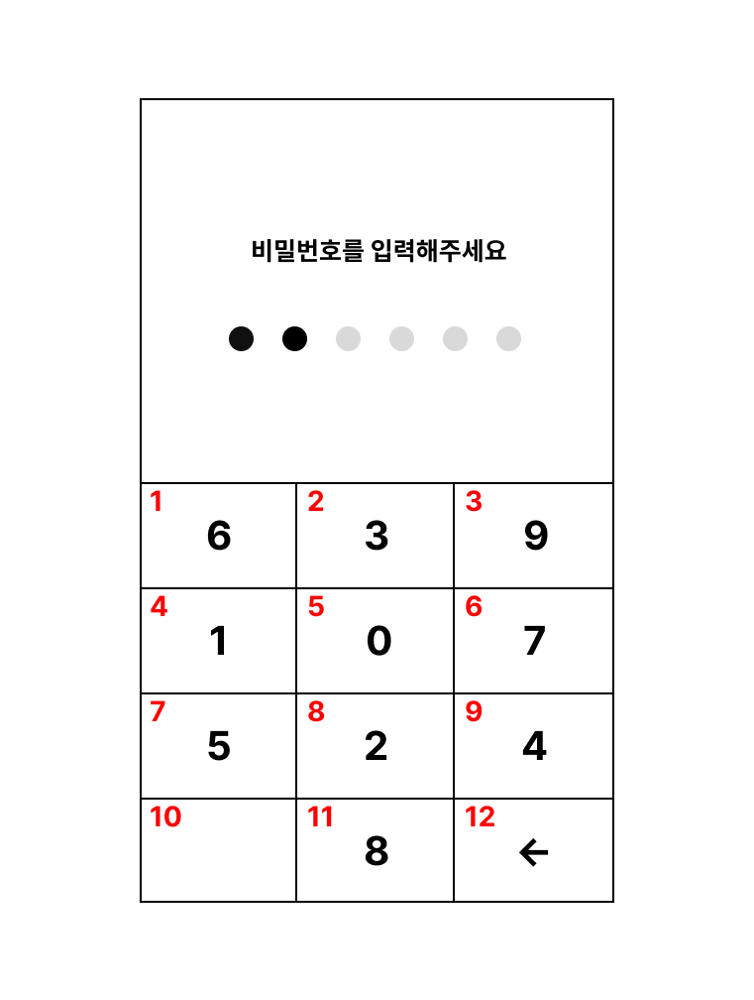
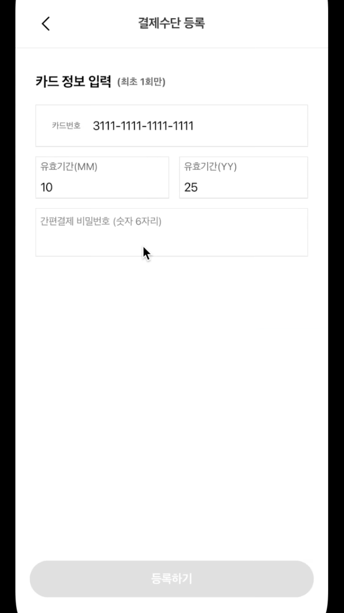
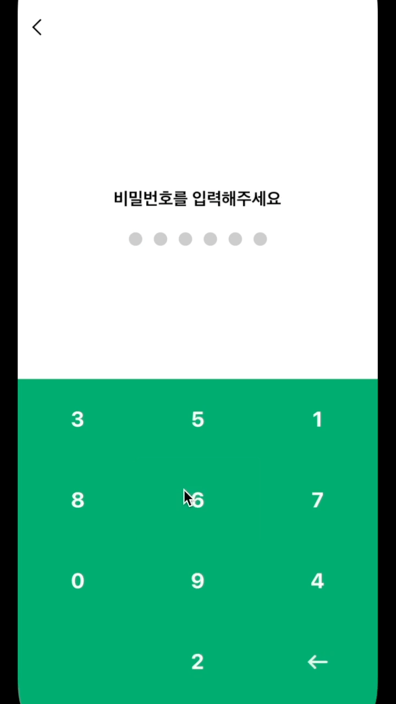

# 비밀번호 입력 스크린 만들기

이번 포스트에서는 사내 프로젝트에서 결제 비밀번호 스크린을 만든 경험을 공유해보고자 한다. 이 페이지를 처음 기획했을 때, 필요한 기능은 다음과 같았다.

1. 컴포넌트 렌더링 시, 비밀번호 입력창의 숫자가 무작위로 뒤섞이게 할 것
2. 비밀번호 재확인이 가능할 것
3. 비밀번호 길이, 메시지 등을 props로 조정 가능하게 할 것

## 구현해보기

### 1. 랜덤 숫자 배열 만들기

우선 숫자 키패드 배열을 만들어보자. 우리가 원하는 것은 숫자 0부터 9와 지우기 버튼으로 이루어진 키패드이다.일단 0부터 9까지의 수를 가지고 무작위로 섞는 함수를 선언한다. 숫자를 섞는 방법으로 **Fisher Yates Shuffle**이란 유명한 알고리즘을 가져왔다.

```jsx
const shuffle = (array) => {
  let m = array.length,
    t,
    i;
  // 섞을 요소가 남아 있을 때까지 계속 스왑(swap)을 한다.
  while (m) {
    // 남아 있는 요소를 선택한다.
    i = Math.floor(Math.random() * m--);
    // 위 요소를 현재 요소와 스왑한다.
    t = array[m];
    array[m] = array[i];
    array[i] = t;
  }
  return array;
};
```

위 알고리즘을 시각적으로 표현한 자료다. 카드가 스와핑을 통해 섞이는 과정을 보여준다.


이제 키패드로 다시 돌아오자. 내가 생각한 페이지는 다음과 같다.



그림에서 볼 수 있듯이, 키패드에서 숫자 이외의 키가 들어가는 자리는 10번째, 12번째 자리로 정해져있다. 따라서, 0부터 9까지 숫자가 잘 섞여진 배열이 있으면 해당 인덱스에 공백과 지우기 버튼을 삽입하면 된다. 위 함수에서 `Array.splice` 를 사용하여 이를 구현해보자.

```jsx
...
array.splice(array.length - 1, 0, 'blank');
array.splice(array.length, 0, 'delete');
return array;
```

결과적으로 키패드 배열은 이런 형태로 출력될 것이다.

```jsx
[6, 3, 9, 1, 0, 7, 5, 2, 4, "blank", 8, "delete"];
```

### 2. 키패드 입력 UI

키패드 배열이 완성되었으니, 입력창을 렌더링할 차례다. 키패드는 3X4의 배열인데, 웹에선 `grid`를 사용하여 쉽게 만들 수 있지만 React Native는 `grid`를 지원하지 않고 `FlatList`로 만들어아한다.

column은 `numColumns` props로 설정할 수 있지만, row는 렌더링 시 연산이 필요하다. 전체 키패드 높이`(h)`에서 4를 나눈 값을 구하여 `h/4` 를 버튼 하나의 높이로 설정하여 렌더링 시켜주자. `renderItem` 의 경우, 키패드 배열의 요소에 맞는 컴포넌트를 리턴해주면 된다.

```jsx
...
const [parentHeight, setParentHeight] = useState(0);
const [input, setInput] = useState('');
...
const onLayout = event => {
  const {height} = event.nativeEvent.layout;
  setParentHeight(height);
};

const renderItem = ({item}) => {
  if (item === 'blank') {
    return <View style={[style.blankStyle, {height: parentHeight / 4}]} />;
  } else if (item === 'delete') {
    return (
      <TouchableOpacity
        disabled={isCompelte}
        onPress={() => setInput(prev => prev.slice(0, -1))}
        style={[style.deleteStyle, {height: parentHeight / 4}]} />
    );
  } else {
    return (
      <TouchableOpacity
        disabled={isCompelte}
        style={[style.itemStyle, {height: parentHeight / 4}]}>
          <Text style={style.itemText}>{item}</Text>
      </TouchableOpacity>
    );
  }
};
...
return (
...
<View onLayout={onLayout} style={style.numberpadWrap}>
  <FlatList
    scrollEnabled={false}
    data={numbers}
    numColumns={3}
    renderItem={renderItem}
    keyExtractor={(_, index) => index.toString()}
  />
</View>
...

```

### 3. 키패드 입력 함수

비밀번호 입력 시, 여러 케이스를 고려하여 이에 맞는 함수를 실행하면 된다. 코드와 함께 자세히 살펴보자.

```jsx
const onPressPad = (value) => {
  // 입력할 비밀번호가 남았을 경우,
  if (passwordLength > input.length) {
    // 비밀번호 입력
    setInput((prev) => prev + value);
    // 비밀번호 한자리만 남았을 경우,
    if (passwordLength === input.length + 1) {
      // 비밀번호가 입력 값과 일치하지 않는 경우,
      if (password !== input + value) {
        // 입력 초기화 후, 에러 메시지 렌더링
        setInput("");
        setError(true);
        // 일치할 경우,
      } else {
        // 아래 참조
        replaceRoute(input + value);
      }
      // 에러 메시지 렌더링 후, 다시 입력할 경우
    } else if (input.length === 0 && error === true) {
      // 에러 메시지 제거
      setError(false);
    }
  }
};
```

한가지 고려해야할 점이 있는데, 비밀번호를 입력을 완료한 후 해당 페이지로 다시 돌아올 수 없다. 때문에, `navigation routes`로부터 비밀번호 입력 스크린을 제거한 후, 다음 스크린으로 이동시켜주어야 한다.

```jsx
const { ..., submitCallback } = props.route.params;

const replaceRoute = passwordInput => {
  navigation.dispatch(state => {
    // 현재 스크린 제거
    const routes = state.routes.slice(0, -1);

    return CommonActions.reset({
      index: routes.length - 1,
      routes: [...routes],
    });
  });

  // props로 받은 콜백함수 실행
  if (submitCallback) {
    submitCallback(passwordInput);
  }
};
```

### 4. 비밀번호 입력 피드백

비밀번호 길이 수 만큼 점이 생기고, 입력 시 입력된 비밀번호 수 만큼 점이 채워지는 UI를 구현해보자. 비밀번호 길이 `(n)`의 배열을 점으로 렌더링 시킨다. 이 때, `n` 개의 점 중 자신의 인덱스보다 입력된 비밀번호가 크다면 점에 색을 입히면 된다.

```jsx
return (
...
{[...Array(passwordLength)].map((_, index) => (
  <View
    style={[
    style.dotIndicator,
    input.length > index && style.activeDot,
    ]}
  />
))}
...
```

### 5. 비밀번호 재확인



이제 비밀번호 재확인 로직을 추가해보자. 비밀번호 재확인은 보통 비밀번호를 설정하거나 변경할 때, 사용되므로 기존 구조를 조금 바꿔야 했다.

비밀번호를 만드는 과정이기 때문에, 초기 비밀번호는 `undefined` 상태일 것이다.

```jsx
const {
  ...
  checkMessage = "비밀번호를 다시 입력해주세요",
  checkEnabled,
} = props.route.params;
...
const [password, setPassword] = useState(
  checkEnabled ? undefined : passwordProps,
);
```

다시 키패드 입력 함수로 돌아가서, 비밀번호 재확인 로직을 추가해준다. 코드와 함께 자세히 살펴보자.

```jsx
const onPressPad = value => {
  ...
  // 비밀번호 한자리만 남았을 경우,
  if (passwordLength === input.length + 1) {
    // 초기 비밀번호가 있을 경우,
    if (password) {
      // 비밀번호가 일치하지 않을 경우,
      if (password !== input + value) {
        // 입력 초기화 후, 에러 메시지 렌더링
        setInput('');
        setError(true);
      // 비밀번호가 일치할 경우,
      } else {
        // 스크린 이동 후, 콜백함수 실행
        replaceRoute(input + value);
      }
    // 비밀번호 재확인이 있지만 아직 초기 비밀번호가 없는 경우,
    } else if (checkEnabled && password === undefined) {
      // 재확인으로 넘어가면서 키패드 숫자를 한번 더 섞음
      setNumbers(shuffle([...NUMBERS]));
      // 재확인 메시지 렌더링
      setMessage(checkMessage);
      // 초기 비밀번호 설정 (다음 입력 시, 입력값과 이 번호를 비교)
      setPassword(input + value);
      // 입력값 초기화
      setInput('');
      // 그 외의 경우,
    } else {
    // 이런 경우는 없지만, 일단 스크린 이동
    replaceRoute(input + value);
  }
  ...
};
```

### 6. 뒤로가기



비밀번호 재확인 로직을 추가했다면, 뒤로가기 시 이전 스크린으로 이동하는 것이 아닌 초기 비밀번호를 입력으로 돌아가야한다. 초기 비밀번호와 비밀번호 재확인이 있다면 초기 상태로 돌아가는 로직을 추가해주자.

```jsx
const onPressReturn = () => {
  if (checkEnabled && password) {
    setNumbers(shuffle([...NUMBERS]));
    setError(false);
    setPassword(undefined);
    setInput("");
    setMessage(message);
  } else {
    navigation.goBack();
  }
};
```

## 최종코드

```jsx
...
const NUMBERS = [0, 1, 2, 3, 4, 5, 6, 7, 8, 9];

function PasswordInput(props) {
  const {navigation, t} = props;
  const {
    passwordLength = password ? password.length : 6,
    password: passwordProps,
    message: messageProps = '비밀번호를 입력해주세요',
    checkMessage = '비밀번호를 다시 입력해주세요',
    checkEnabled,
    submitCallback,
  } = props.route.params;

 const shuffle = (array) => {
	  let m = array.length, t, i;
	  while (m) {
	    i = Math.floor(Math.random() * m--);
	    t = array[m];
	    array[m] = array[i];
	    array[i] = t;
	  }
		array.splice(array.length - 1, 0, 'blank');
	  array.splice(array.length, 0, 'delete');
	  return array;
	}

  const [input, setInput] = useState('');
  const [numbers, setNumbers] = useState(shuffle([...NUMBERS]));
  const [parentHeight, setParentHeight] = useState(0);
  const [error, setError] = useState(false);
  const [isCompelte, setIsComplete] = useState(false);
  const [message, setMessage] = useState(messageProps);
  const [password, setPassword] = useState(
    checkEnabled ? undefined : passwordProps,
  );

  const replaceRoute = passwordInput => {
    navigation.dispatch(state => {
      const routes = state.routes.slice(0, -1);

      return CommonActions.reset({
        index: routes.length - 1,
        routes: [...routes],
      });
    });

    if (submitCallback) {
      submitCallback(passwordInput);
    }
  };

  const onLayout = event => {
    const {height} = event.nativeEvent.layout;
    setParentHeight(height);
  };

  const onPressPad = value => {
    if (passwordLength > input.length) {
      setInput(prev => prev + value);
      if (passwordLength === input.length + 1) {
        if (password) {
          if (password !== input + value) {
            setInput('');
            setError(true);
          } else {
            setIsComplete(true);
            replaceRoute(input + value);
          }
        } else if (checkEnabled && password === undefined) {
          setNumbers(shuffle([...NUMBERS]));
          setPassword(input + value);
          setInput('');
          setMessage(checkMessage);
        } else {
          setIsComplete(true);
          replaceRoute(input + value);
        }
      } else if (input.length === 0 && error === true) {
        setError(false);
      }
    }
  };

  const onPressReturn = () => {
    if (checkEnabled && password) {
      setNumbers(shuffle([...NUMBERS]));
      setError(false);
      setPassword(undefined);
      setInput('');
      setMessage(message);
    } else {
      navigation.goBack();
    }
  };

	const renderItem = ({item}) => {
    if (item === 'blank') {
      return <View style={[style.blankStyle, {height: parentHeight / 4}]} />;
    } else if (item === 'delete') {
      return (
        <TouchableOpacity
          disabled={isCompelte}
          onPress={() => setInput(prev => prev.slice(0, -1))}
          style={[style.deleteStyle, {height: parentHeight / 4}]} />
      );
    } else {
      return (
        <TouchableOpacity
          disabled={isCompelte}
          style={[style.itemStyle, {height: parentHeight / 4}]}>
          <Text style={style.itemText}>{item}</Text>
        </TouchableOpacity>
      );
    }
  };

  return (
    <Fragment>
      <SafeAreaView style={style.notchWrap} />
      <SafeAreaView style={style.wrap}>
        <View style={style.headerWrap}>
          <TouchableOpacity
            disabled={isCompelte}
            style={style.closeButton}
            onPress={onPressReturn} />
        </View>
        <View style={style.indicatorWrap}>
          <Text style={style.title}>{message}</Text>
          <View style={style.rowItem}>
            {[...Array(passwordLength)].map((_, index) => (
              <View
                style={[
                  style.dotIndicator,
                  input.length > index && style.activeDot,
                ]}
              />
            ))}
          </View>
          {error && (
            <Text style={style.error}>비밀번호가 일치하지 않습니다</Text>
          )}
        </View>
        <View onLayout={onLayout} style={style.numberpadWrap}>
          <FlatList
            scrollEnabled={false}
            data={numbers}
            numColumns={3}
            renderItem={renderItem}
            keyExtractor={(_, index) => index.toString()}
          />
        </View>
      </SafeAreaView>
    </Fragment>
  );
}
...
```
