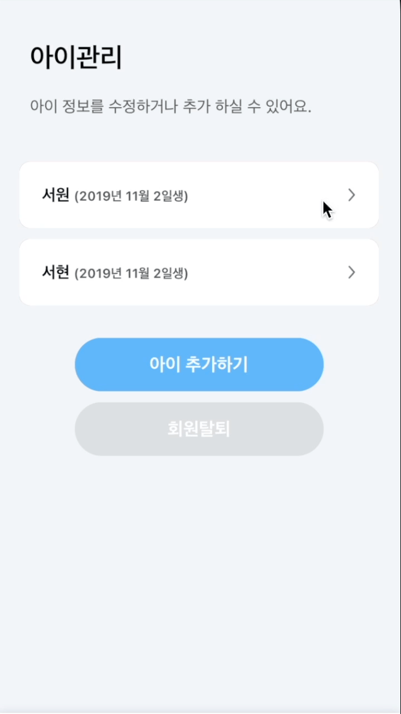

# react-native-gesture-handler/Swipeable로 밀어서 삭제 구현

이번 포스트에서는 react-native-getsture-handler에서 제공하는 Swipeable 컴포넌트를 사용하여, FlatList의 Item을 삭제를 구현한 경험을 공유해보고자 한다.

내가 만든 Swipeable은 삭제 기능만 필요했기 때문에, 스와이프가 되면 추가적인 조작 없이 바로 삭제가 가능하도록 만들고 싶었다. 스와이프가 너무 쉽게 밀리면 의도치 않은 동작이 일어날 수 있기 때문에, 잘 밀리지 않되 버튼의 문구만 쉽게 볼 수 있을 정도로 하고 그 이상으로 밀게 되면 삭제 할 수 있도록 만들었다.

본문은 API 요청을 통해 데이터를 가져온 후 과정에 대한 설명이다.

## Package 설치

먼저 패키지 설치를 진행하자.

```jsx
// npm
npm i react-native-gesture-handler

// yarn
yarn add react-native-gesture-handler
```

## FlatList로 데이터 나열하기

### renderItem 구현

렌더링할 개별 Item을 Swipeable 컴포넌트로 감싸준다. Swipeable 속성 중 다음과 같이 3가지를 주었다.

- friction : 스와이프 모션에 대한 마찰력이다. 값이 높을 수록 컴포넌트가 잘 밀리지 않게 된다. 기본 값이 1이지만, 3으로 높여 “삭제” 문구만 잘 볼 수 있도록 만들었다.
- leftThreshold / rightThreshold : 컴포넌트가 어디까지 밀려야 action이 동작하는지를 결정하는 값이다. 삭제 문구를 포함하는 View가 현재 `100px` 인데 `70px`까지 밀어야 작동하도록 설정하였다.

```jsx
const renderItem = ({ item, index }) => (
  <Swipeable friction={3} leftThreshold={70} rightThreshold={70}>
    ...
  </Swipeable>
);
```

### Swipeable Ref 저장

컴포넌트를 조작하기 위해서 이의 `ref` 값을 저장해야한다. Item이 여러 개이기 때문에, `useRef` hook을 배열로 선언하고 Item의 인덱스 순으로 배열 안에 할당해준다. 추후에 삭제 로직에서 삭제를 취소할 경우, Swipeable을 제자리로 되돌리는데 활용할 것이다.

```jsx
const refs = useRef([]);

const renderItem = ({item, index}) => (
  <Swipeable
    ...
    ref=(ref => (refs.current[index] = ref))
  >
    ...
  </Swipeable>
)
```

## Action 함수 구현

### renderActions

컴포넌트를 좌 또는 우로 스와이프 시, 나타나는 컴포넌트를 렌더링하는 함수다. 버튼을 터치하여 특정 동작을 일어나게 만드려면 여기에 `TouchableOpacity`를 렌더하면 된다. 하지만, 나는 삭제만 구현할 것이기 때문에 삭제 문구만 보이도록 하고 스와이프 이벤트가 발생할 경우 삭제 동작이 일어나게 할 것이다.

스와이프 방향을 구별하기 위해 direction을 인자로 받아 문구 위치를 조정했다.

```jsx
const renderAcitions = direction => {
  return (
    <View
      style={[
        style.deleteView,
        direction === 'left'
        ? style.leftView
        : direction === 'right'
        ? style.rightView
        : null
    ]}>
      <Text style={style.text}>삭제</Text>
    </View>
  );
};

const renderItem = ({item, index}) => (
  <Swipeable
    ...
    renderRightActions={() => renderAcitions('right')}
    renderLeftActions={() => renderAcitions('left')}
  >
    ...
  </Swipeable>
)
```

### onSwipeOpen

스와이프 이벤트가 발생 시, 동작하는 함수다. 여기에 삭제 로직을 추가하면 완성이다. 삭제하기 전 모달로 삭제 여부를 묻고, 만약 삭제 취소를 한다면 이전에 저장해둔 `ref`를 사용하여 Swipeable을 제자리로 옮긴다. 삭제 요청 중 만약 에러가 발생한다면 똑같이 되돌려야하기 때문에, `ref` 를 API 호출 함수에 인자로 전달하는 것이 좋다.

여기서 주의할 점은 현재 `refs`는 Swipeable `ref`들로 이루어진 배열이고 타겟 `ref`을 가져오기 위해선 `refs`를 Item의 인덱스로 참조해야한다.

```jsx
const refs = useRef([]);

const deleteAPI = async (id, ref) => {
  const {status, data} = await exampleAPI.remove(id);
  if (status !== 204) {
    ref.close(); // Swipeable를 되돌리는 메소드
  // 에러 핸들링
  }
  ...
};

const alertDelete = (id, ref) =>
  Alert.alert('', '삭제하시겠습니까?', [
    {text: '아니요', onPress: () => ref.close()},
    {text: '예', onPress: () => deleteAPI(id, ref)},
]);

const renderItem = ({item, index}) => (
  <Swipeable
    ...
    onSwipeableOpen={() => alertDelete(item.id, refs.current[index])}
  >
  ...
  </Swipeable>
)
```

## 최종코드

```jsx
...
const refs = useRef([]);

const deleteAPI = async (id, ref) => {
	const {status, data} = await exampleAPI.remove(id);
	if (status !== 204) {
		ref.close(); // Swipeable를 되돌리는 메소드
		// 에러 핸들링
	}
	...
};

const alertDelete = (id, ref) =>
  Alert.alert('', '삭제하시겠습니까?', [
    {text: '아니요', onPress: () => ref.close()},
    {text: '예', onPress: () => deleteAPI(id, ref)},
  ]);

const renderItem = ({item, index}) => (
  <Swipeable
    ...
    friction={3}
    leftThreshold={70}
    rightThreshold={70}
    renderRightActions={() => renderAcitions('right')}
    renderLeftActions={() => renderAcitions('left')}
    onSwipeableOpen={() => alertDelete(item.id, refs.current[index])}
  >
    ...
  </Swipeable>
);

const renderAcitions = direction => {
  return (
    <View
      style={[
        style.deleteView,
        direction === 'left'
        ? style.leftView
        : direction === 'right'
        ? style.rightView
        : null
    ]}>
      <Text style={style.text}>삭제</Text>
    </View>
  );
};

...

return (
...
  <FlatList
    renderItem={renderItem}
    ...
  />
...
```
