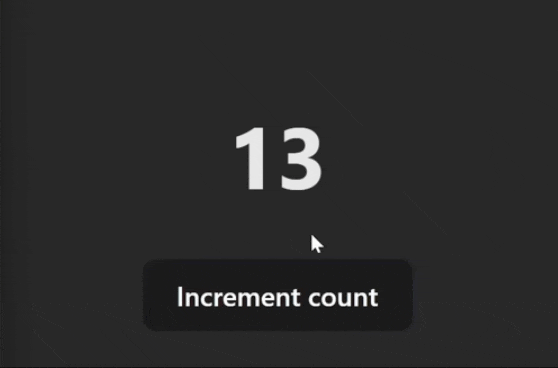
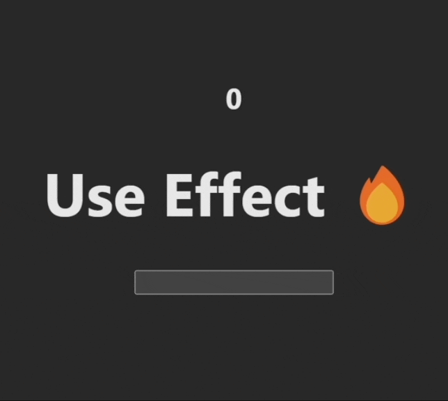
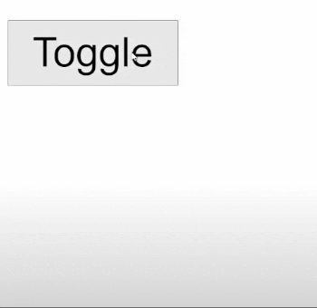
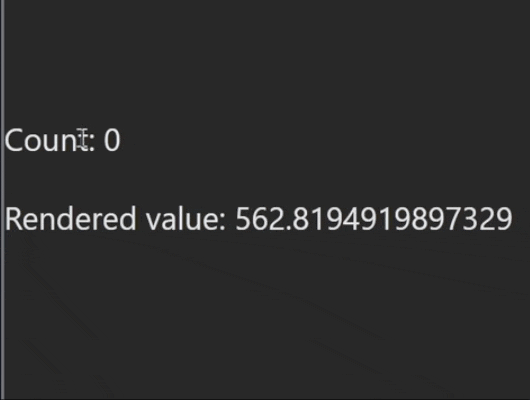
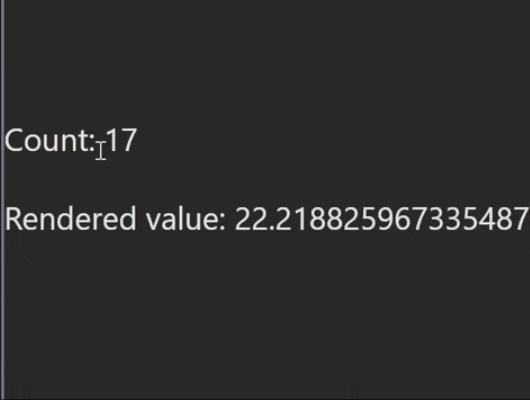
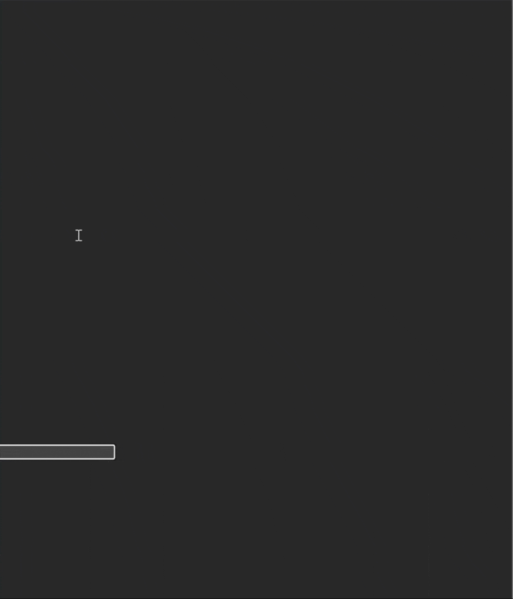

# useState

React의 가장 기본이 되는 Hook으로 컴포넌트를 리렌더(rer-ender)시킬 수 있다. state를 setState를 호출하여 값을 변경하면, 변경된 state를 보여주기 위해 컴포넌트가 리렌더된다.

```jsx
const [count, setCount] = useState(0);

return (
  <div>
    <h1>{count}</h1>
    <button onClick={() => setCount(count + 1)}>Increment count</button>
  </div>
);
```

<figure>
<a style="width: 50%;" href="../../images/2023-08-15-react-hooks-collection/useState-1.gif">
  
  <figcaption></figcaption>
</a>
</figure>

주의할 점은 `setState`는 동기적으로 동작한다는 것이다. 즉, `setState` 를 연속으로 여러 번 실행할 경우 업데이트 된 `state` 를 보장받지 못한다.

```jsx
const [count, setCount] = useState(0);

const increase = () => {
  setCount(count + 1);
  setCount(count + 1);
  setCount(count + 1);
};
```

위의 코드의 경우, 언뜻 보면 3이 렌더링 될 것 같지만 1이 렌더링 된다. 왜냐하면, 각 `setCount` 가 이전 `setCount` 가 변경한 최신의 `count` 를 받지 못하고 있기 때문이다. 이 코드를 제대로 동작시키려면 다음과 같이 고쳐야 한다.

```jsx
const [count, setCount] = useState(0);

const increase = () => {
  setCount((prev) => prev + 1);
  setCount((prev) => prev + 1);
  setCount((prev) => prev + 1);
};
```

`setState` 의 `prev`라는 매개 변수로 이전 `state` 에 접근할 수 있다. (변수명은 정해진 것은 아니다)

주의할 또 다른 점은, `state` 가 변할 경우 컴포넌트 전체가 리렌더링 된다는 점이다. 즉, 컴포넌트 내부에 정의된 모든 변수와 함수가 재선언되고 호출할 경우 재실행된다.

```jsx
const [input, setInput] = useState("");
그외 여러 useState...

fetch('/exmaple') // 모든 setState마다 호출

return (
	<div>
		<h2>{input}</h2>
		<input onChage={(e) => setInput(e.target.value)} type="text" />
		그외 여러 state...
	</div>
);
```

예를 들어, 위와 같이 컴포넌트 내부에 `fetch`와 같이 리소스를 꽤나 소모하는 함수를 실행한다면 여러 `state`가 변경되면서 심한 성능저하가 일어날 수 있다.

그렇다면, 검색어 자동완성 기능과 같이 `input` 을 입력할 때마다 API를 호출하여 값을 받아오는 로직은 어떻게 구현할 수 있을까?

이를 구현하려면 다음과 같은 요구사항이 충족되어야 한다.

- `setInput` 으로 변경된 `input`에 접근
- 모든 `setState` 가 아닌 `setInput`으로 인한 리렌더링 시, API 호출

# useEffect

`useEffect` 를 사용하면 된다. `useEffect`는 함수와 변수를 받아, 변수의 값이 변경될 시 함수를 실행시킨다. 변수는 의존성 배열(denpendency array)로 여러 값을 포함시킬 수 있다. 의존성 배열이 비어있을 경우, 함수는 최초 렌더링 시 한 번만 실행된다.

`useEffect` 를 사용하여 다음과 같이 검색어 자동완성 기능을 구현할 수 있다.

```jsx
const [input, setInput] = useState("");
그외 여러 useState...

useEffect(() => {
	fetch(`/exmaple?search=${input}`) // 변경된 input으로 GET 요청
	.then((res) => {/* do something */});
}, [input]); // input의 값이 변경될 때마다

return (
	<div>
		<h2>{input}</h2>
		<input onChage={(e) => setInput(e.target.value)} type="text" />
		그외 여러 state...
	</div>
);
```

주의할 점은 `useEffect` 가 렌더링 시, 자동으로 실행되기 때문에 우리가 예상치 못한 이유로 리렌더링이 발생할 시 부작용을 일으킬 수도 있다. 예를 들어, `setInterval` 과 같은 Web API를 호출 시 컴포넌트가 리렌더링 되더라도 브라우저는 계속해서 콜스택에 콜백 함수를 쌓는다.

<figure>
<a style="width: 50%;"  href="../../images/2023-08-15-react-hooks-collection/useEffect.gif">
  
  <figcaption>다른 `setState`으로 발생한 리렌더링으로 인해 `setInterval` 이 두 번 예약되어 `count` 가 2씩 증가하고 있다.</figcaption>
</a>
</figure>

다른 `setState`으로 발생한 리렌더링으로 인해 `setInterval` 이 두 번 예약되어 `count` 가 2씩 증가하고 있다.

그러므로, 꼭 `clearInterval` 로 리렌더링 전에 기존 `setInterval` 을 종료해야한다. 방법은 `useEffect` 내부 함수가 `clearInterval`를 리턴하도록 하면 된다. 이 리턴 시킨 `clearInterval`은 컴포넌트가 리렌더링을 위해 기존 컴포넌트를 언마운트하는 시점에 실행된다.

```jsx
useEffect(() => {
  const incrementer = setInterval(() => {
    setCounter((prev) => prev + 1);
  }, 1000);

  return () => clearInterval(incrementer);
}, []);
```

# useLayoutEffect

`useEffect`와 거의 비슷하나, 내부 함수가 실행되는 시점이 다르다.

`useEffect`는 의존성 배열 안의 `state`가 렌더링 된 후 함수가 실행된다. 다음과 같이, 짧은 시간 안에 화면이 두 번 바뀌며 깜빡임이 일어난다.

1. 초기(이전) `state` (리)렌더링
2. `useEffect` 내부 함수의 `setState`로 인한 `state` 변경
3. 리렌더링 발생 (깜빡임)

<figure>
<a  href="../../images/2023-08-15-react-hooks-collection/useEffect.gif">
  
  <figcaption>`useEffect` 를 사용한 경우</figcaption>
</a>
</figure>

반면 `useLayoutEffect`는 의존성 배열 안의 `state`가 렌더링 되기 전에 함수가 실행된다.

1. ~~초기(이전) `state` (리)렌더링~~ (단, 화면을 볼 수 없음 = 블로킹이 일어남)
2. `useLayoutEffect` 내부 함수의 `setState`로 인한 `state` 변경
3. (리)렌더링 발생

```jsx
const [show, setShow] = useState(false);

// useEffect(() => {
useLayoutEffect(() => {
  if (!show) return;
  const { bottom } = button.current.getBoundingClientRect();
  popup.current.style.top = `${bottom + 25}px;`;
}, [show]);

return (
  <>
    <button ref={button} onClick={() => setShow((prev) => !prev)}>
      Toggle
    </button>
    <div ref={popup}>Popup</div>
  </>
);
```

<figure>
<a  href="../../images/2023-08-15-react-hooks-collection/useEffect.gif">
  
  <figcaption>`useLayoutEffect` 를 사용한 경우</figcaption>
</a>
</figure>

대부분의 경우 `useEffect` 를 쓰는 케이스가 많다. `useLayoutEffect` 는 말그대로 DOM 요소의 레이아웃(위치, 너비 등)에 대한 정보를 바탕으로 어떤 작업을 해야할 때 유용하다.

또한, 의존성 배열이 비어있어도 기본적으로 `useLayoutEffect` 는 리액트가 DOM을 계산한 후 페인팅하기 전에 함수를 실행하기 때문에 `useEffect` 보다 일찍 실행된다.

# useContext

모든 컴포넌트에서 접근 가능한 전역 `state`를 관리할 수 있다. 컴포넌트 트리에서 `props`를 통해 전달하지 않아도 되기 때문에 props drilling을 해결하여 코드의 가독성을 높일 수 있다.

예를 들어, 다음과 같은 상황에서 유용하게 사용된다.

- 로그인 정보와 같은 전역 데이터가 필요한 경우
- 언어 설정과 같은 사용자 환경 설정 데이터 관리
- 전역적으로 접근 가능한 테마 설정 데이터 관리

다음은 `useContext`로 앱 내부 모든 컴포넌트에서 테마 설정이 가능하도록 구현한 예시 코드다.

```jsx
// ThemeContext.js
import { createContext, useState } from "react";

const ThemeContext = createContext({
  theme: "light",
  setTheme: () => {},
});

export const ThemeProvider = ({ children }) => {
  const [theme, setTheme] = useState("light");

  const value = { theme, setTheme };

  return (
    <ThemeContext.Provider value={value}>{children}</ThemeContext.Provider>
  );
};

export default ThemeContext;
```

```jsx
// Component.js
import React, { useContext } from "react";
import ThemeContext from "./ThemeContext";

function Component() {
  const { theme, setTheme } = useContext(ThemeContext);

  const handleClick = () => {
    setTheme(theme === "light" ? "dark" : "light");
  };

  const backgroundStyle = { background: theme === "dark" ? "black" : "white" };

  return (
    <div style={backgroundStyle}>
      <button onClick={handleClick}>Toggle Theme</button>
      This is a themed component!
    </div>
  );
}

export default Component;
```

```jsx
// App.js
import React from "react";
import { ThemeProvider } from "./ThemeContext";
import Component from "./Component";

function App() {
  return (
    <ThemeProvider>
      ...
      <Component />
      ...
    </ThemeProvider>
  );
}

export default App;
```

<figure>
<a  href="../../images/2023-08-15-react-hooks-collection/useContext.gif">
  
  <figcaption></figcaption>
</a>
</figure>

# useReducer

`useState`와 비슷하나,복잡한 `state`를 관리하는 데 사용된다. 특히, 다양한 하위 컴포넌트들이 동일한 `state`에 접근하여 업데이트를 수행할 때 유용하다.

```jsx
const [state, dispatch] = useReducer(reducer, initialState);
```

위와 같이, `useReducer`는 `reducer`와 `initialState`를 인자로 받아, `state`와 함께 `dispatch`는 액션 객체을 전달하는 함수를 리턴한다.

`reducer`는 호출될 때 현재 상태와 액션 객체를 인자로 받아 새로운 상태를 반환하는 함수이고, `initialState`는 초기 상태 값이다.

`useState`보다 `state` 업데이트 로직을 효과적으로 분리하고 여러 액션을 처리하기 좋기 때문에 좀 더 복잡한 상태 관리에 유용하다.

아래와 같이 사용 가능하다.

```jsx
// 초기 state 정의
const initialState = { count: 0 };

// state를 업데이트하는 함수
function reducer(state, action) {
  switch (action.type) {
    case "increment":
      return { count: state.count + 1 };
    case "decrement":
      return { count: state.count - 1 };
    default:
      throw new Error();
  }
}

function Counter() {
  const [state, dispatch] = useReducer(reducer, initialState); // state, dispatch를 받아옴

  // disptach에 액션 객체가 전달되면 reducer를 통해 정의된 방식으로 state가 변경되고, 이에 따라 컴포넌트가 리렌더
  return (
    <>
      <p>Count: {state.count}</p>
      <button onClick={() => dispatch({ type: "increment" })}>Increment</button>
      <button onClick={() => dispatch({ type: "decrement" })}>Decrement</button>
    </>
  );
}

export default Counter;
```

# useRef

변경 가능한 값을 저장하고 유지하는 경우에 사용된다. `useState`와 다르게,컴포넌트 렌더링 사이에서도 값을 변경할 수 있으며, 값의 변경이 리렌더링을 일으키지 않는다.

`ref`는 변경 가능한 객체로, `.current` 속성을 통해 참조값에 접근할 수 있다. 초기값을 설정할 수 있다. (optional) 
DOM 요소를 참조하는데, 많이 사용되며 다음과 같은 방법으로 가능하다.

```jsx
const inputRef = useRef(null);

const handleClick = () => {
  inputRef.current.focus(); // DOM 요소에 직접 접근
};

// 버튼을 누를 시, input 요소로 포커스가 이동
return (
  <>
    <input ref={inputRef} type="text" />
    <button onClick={handleClick}>Focus the input</button>
  </>
);
```

# useMemo

함수의 결과값을 저장(메모이제이션 / 캐싱)하고, 의존성 배열에 변수의 값이 변경 될 시 계산을 다시 수행한다. 컴포넌트 리렌더링 시, 의존성 배열 안의 값이 같을 경우 저장된 값을 불러와 불필요한 계산을 방지하여 렌더링 성능을 향상시킬 수 있다.

간단한 예시로, `Math.random`메소드를 호출하여 랜덤 숫자를 생성한 후 리턴 값을 `useMemo` 로 저장해보았다.

```jsx
const [count, setCount] = useState(0);

const expensiveCal = () => {
	return Math.random() * 1000
};

const renderedValue = useMemo(() => expensiveCal(), [])

return (
	<div>
		<p onClick={() => setCount((prev => (prev + 1)}>
			Count : {count}
		</p>
		<p>Rendered Value : {renderedValue}</p>
	</div>
)
```

그 결과, `setCount`로 인해 컴포넌트 전체가 리렌더링 되어도 `renderedValue` 는 다시 계산되지 않고 캐싱된 값을 그대로 가져온 것을 확인할 수 있다.

<figure>
<a  href="../../images/2023-08-15-react-hooks-collection/useMemo-1.gif">
  
  <figcaption></figcaption>
</a>
</figure>

의존성 배열에 `count`를 넣으면, `setCount`로 인한 리렌더링 발생 시 `renderedValue`를 다시 계산하는 것을 확인할 수 있다.

```jsx
const renderedValue = useMemo(() => expensiveCal(), [count]);
```

<figure>
<a  href="../../images/2023-08-15-react-hooks-collection/useMemo-2.gif">
  
  <figcaption></figcaption>
</a>
</figure>

# useCallback

`useMemo`와 달리, 함수 자체를 메모이제이션하여 의존성 배열에 명시된 값이 변경될 때만 새로운 함수를 생성한다. 이를 통해 불필요한 리렌더링을 줄이고 성능을 최적화한다.

시간이 오래 걸리는 연산을 수행하는 함수가 리렌더링 시마다 다시 실행되면 성능이 크게 저하한다. 이런 경우, `useCallback`을 사용하여 이 함수를 메모이제이션하여, 리렌더링 비용을 줄이는 것이 좋다.

```jsx
// useCallback을 사용하여 함수를 메모이제이션
const memoizedExpensiveOperation = useCallback(() => {
  // 애니메이션이나 복잡한 렌더링 로직..
}, []);

const handleClick = () => {
  memoizedExpensiveOperation(); // 메모이제이션된 함수 호출
  setCount(count + 1);
};
```

위와 같이, 의존성 배열에 빈 배열을 전달하므로 함수는 최초 생성 이후 재생성되지 않기 때문에 리렌더링의 비용을 줄일 수 있다.

`useCallback`을 사용하는 다른 이유는 자식 컴포넌트에 함수를 전달할 때 메모이제이션을 통해 매번 새로운 함수가 생성되지 않도록 함으로써, 자식 컴포넌트의 불필요한 리렌더링을 방지하기 위해서다.

또 다른 최적화 기법인 `React.memo`는 컴포넌트를 메모이제이션한 후, `props`의 변경이 있을 때만 해당 컴포넌트를 리렌더링시킨다. 하지만, `props`의 비교는 얕은 비교(shallow comparison)이라는 한계가 존재한다.

얕은 비교(Shallow Comparison)란 두 객체의 내부 값을 비교하는 것이 아니라 메모리 상의 참조 위치를 비교하는 것이다. 코드 상으로 같게 보이는 두 객체도 메모리 참조가 다르면 리액트는 서로 다른 객체로 인식한다.

```jsx
// 얕은 비교 (shallow comparison)
const obj1 = { a: 1, b: 2 };
const obj2 = { a: 1, b: 2 };
const obj3 = obj1;

console.log(obj1 === obj2); // false
console.log(obj1 === obj3); // true

/* 얕은 비교는 일반적으로 빠르고 간단하지만, 
객체의 구조와 값까지 비교할 수 없다는 치명적인 단점이 존재 */
```

함수도 객체이기 때문에, 얕은 비교를 통해 두 개의 함수가 동일한 기능을 하는지 정확하게 비교할 수 없다. 각각 메모리 상 동일한 참조 위치를 가리키는 지만 확인할 뿐이다. 그러므로, `React.memo` 를 사용할 시 `useCallback` 으로 메모이제이션 되지 않은 함수를 `props`로 전달한다면 `React.memo`를 사용하더라도 해당 컴포넌트는 계속해서 리렌더링 될 것이다. 따라서, 상위 컴포넌트에서 자식 컴포넌트에 함수를 전달할 때는 `useCallback`을 사용하여 메모이제이션된 함수를 전달하는 것이 좋다.

결론적으로 `useCallback`, `useMemo`, `React.memo` 등의 최적화 도구는 필요한 상황에서만 사용해야한다. 최적화가 크게 필요하지 않은 부분에 이러한 기능을 적용하면, 오히려 캐싱 및 리렌더링 여부의 비교 연산에 리소스가 소모되어 성능이 저하될 수 있기 때문이다.

# useTransition

비동기 작업의 상태를 표시해주는 기능을 제공한다. 두 개의 인자를 받는다.

1. 비동기 작업의 실행상태(로딩)를 표시할 때, 화면에 보여줄 시간 간격
2. 해당 상태를 표시할 때의 렌더링 우선순위

사용 방법은 다음과 같다.

```jsx
const [startTransition, isPending] = useTransition({ timeoutMs: 1000 });
const [data, setData] = useState([]);

const handleChange = (e) => {
  startTransition(() => {
    const pokemonList = fetchPokemon(e.target.value); // API 호출 등의 비동기 작업 처리
    setData(pokemonList);
  });
};

return (
  <div>
    <div>
      {ispending && "Loading"}
      data.map((item) => (<div key={item.id}>
        <h1>{item.name}</h1>
      </div>
      ))}
    </div>
  </div>
);
```

<figure>
<a style="width: 50%;" href="../../images/2023-08-15-react-hooks-collection/useTransition.gif">
  
  <figcaption></figcaption>
</a>
</figure>

`useTransition`을 사용하면 `state`의 업데이트를 특정 단위로 나누어 화면에 렌더링한다. 이렇게 하면 브라우저가 화면을 업데이트하는 속도가 향상된다.

`setState`로 `state`를 전체적으로 업데이트할 때, `useTransition`의 `timeoutMs` 옵션 값을 적용함에 따라 부분적인 업데이트를 먼저 수행하고 해당 밀리초가 지난 후 나머지 업데이트를 실행할 수 있다. 이렇게 함으로써, 복잡한 계산 작업이 포함된 리액트 컴포넌트의 렌더링 속도를 높일 수 있다.
