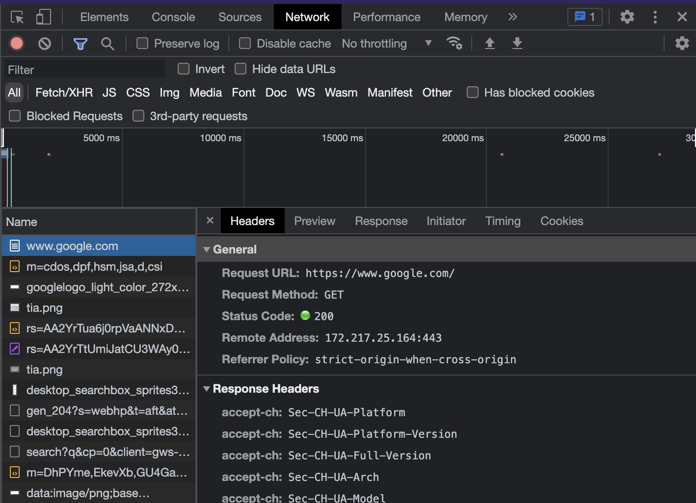
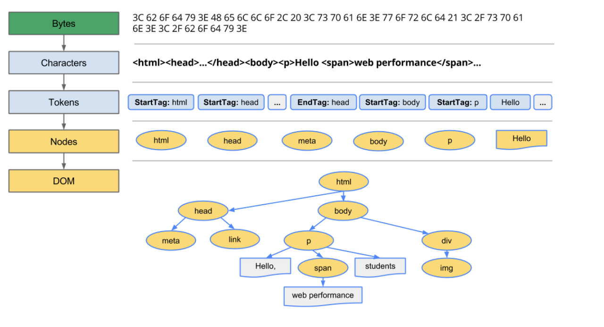
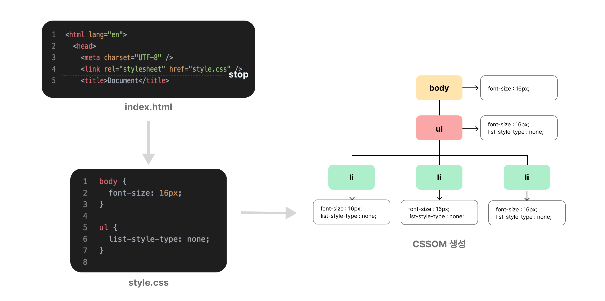
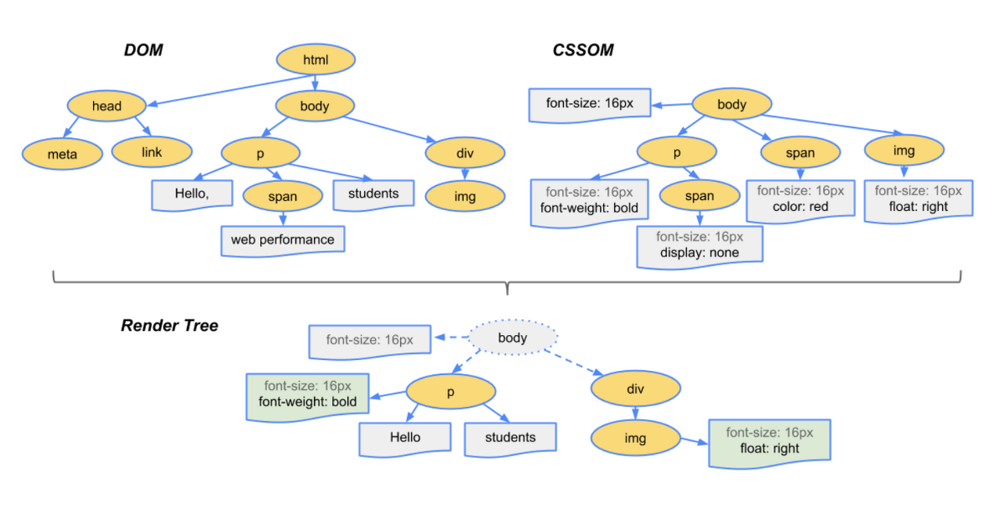
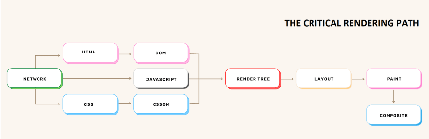
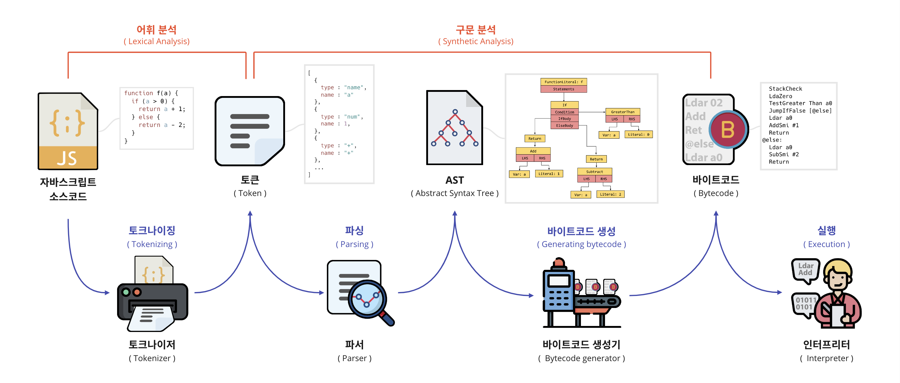
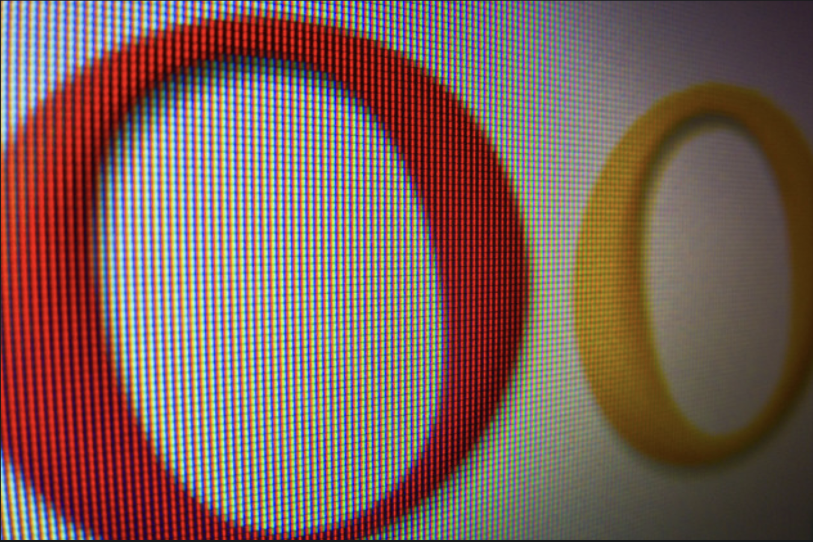
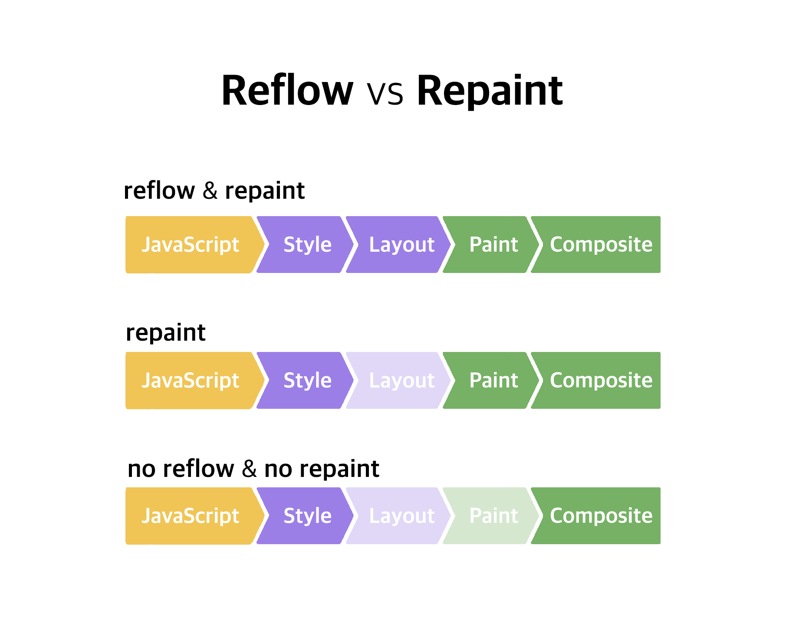

이번 포스팅에서는 우리가 브라우저를 켰을 때, 화면에 웹 페이지가 그려지기 까지 과정을 살펴보고자 한다. 본문으로 들어가기 전에, 결론부터 간략히 요약하자면 브라우저는 다음과 같은 과정을 통해 웹 페이지를 보여준다.

1. 브라우저는 HTML, CSS, 자바스크립트, 이미지, 폰트 파일 등 필요한 **리소스를 요청**하고 서버로부터 **응답**을 받는다.

2. 브라우저의 렌더링 엔진은 **HTML, CSS를 파싱**하여 **DOM과 CSSOM을 생성**한 후 이 둘을 **렌더 트리로 결합**한다.

3. 그리고 **자바스크립트를 파싱**하여 **AST를 생성**하고 **바이트코드로 변환하여 실행**한다. 이 때, 자바스크립트는 DOM API를 통해 DOM이나 CSSOM을 변경할 수 있는데 변경 사항이 있다면 다시 렌더 트리를 결합한다.

4. 렌더 트리를 기반으로 HTML 요소의 **레이아웃을 계산**한다.

5. 브라우저 화면에 HTML 요소를 **페인팅**한다.

이 내용을 이해하기 위해선, **파싱**과 **렌더링**이라는 브라우저의 기능을 알아야 한다.

> 파싱 (parsing) : 프로그래밍 언어의 문법 맞게 작성된 텍스트 문서를 읽고 실행하기 위해 텍스트 문서의 문자열을 토큰으로 분해하고, 토큰에 문법적 의미와 구조를 담아 파스 트리 (parse tree)라는 자료구조를 기반으로 프로그래밍 언어와 기계어의 중간 언어인 바이트코드를 실행한다.

> 렌더링 : HTML, CSS, 자바스크립트로 작성된 문서를 파싱하여 브라우저 화면에 보이게 하는 작업을 의미한다.

## 요청 & 응답

먼저 브라우저 렌더링에 필요한 리소스(HTML, CSS, 자바스크립트, 이미지, 폰트 등의 정적 파일 또는 서버가 동적으로 생성한 데이터)를 서버로부터 가져오기 위해 서버에 요청한다. 브라우저에는 서버에 요청을 전송하기 위해 주소창이 있다. 주소창에 URL을 입력한 후 엔터를 누르면, URL의 호스트 이름이 DNS를 통해 IP 주소로 변환되고 이 주소를 가지고 있는 서버에게 요청을 보내게 된다.

<a href="../../images/2023-02-27-browser-rendering/url-structure-and-scheme.png">
  
</a>

예를 들어, `https://google.com`을 주소창에 입력한 후 엔터를 누르면, 루트 요청이 google.com 서버로 전송된다.

> **루트 요청** : scheme과 host로만 구성된 URI에 의한 요청

루트 요청에는 구체적으로 어떤 리소스를 요구하는지 명시되어 있지 않지만 서버는 루트 요청에 대해 암묵적으로 index.html을 응답하도록 설정되어있다. 이 말은 즉, `https://google.com`은 `https://google.com/index.html`과 같은 요청이다.

만약, index.html이 아닌 다른 정적 파일을 요청하기 위해선 `https://google.com/assets/data/data.json` 같이 요청할 파일의 정적 경로와 파일명을 host 뒤의 path에 명시하여 서버에 요청하면 된다. 서버는 이에 대한 응답으로 assets/data 폴더 안의 data.json 파일을 전송할 것이다.

실제로 이 과정을 브라우저 내에서 확인해보자. 요청과 응답은 개발자 도구의 network 탭에서 확인할 수 있다.

<a href="../../images/2023-02-27-browser-rendering/browser-rendering-network-tab.png">
  
</a>

위 화면은 처음 구글에 접속했을 때, 개발자 도구에서 network 탭의 모습이다. 그런데, 분명 `https://google.com/(index.html)`로 요청했지만 index.html과 함께 요청하지 않은 이미지와 json 등 다른 리소스까지 같이 응답을 받았다.

그 이유는 브라우저가 index.html 문서 안에 있는 요청들에 대한 응답까지 받아오기 때문이다. 구체적으로, 브라우저 렌더링 엔진이 HTML 파일을 파싱할 때, 첫 라인부터 마지막까지 차례대로 파싱한다. 이 과정 중에, 외부 리소스를 가져오는 태그가 있다면, 브라우저는 리소스 파일을 서버로 요청한다. 예를 들어, CSS 파일을 요청하는 태그로는 `<link>`, 자바스크립트 파일 요청 태그는 `<script>`, 이미지 파일 요청 태그로 `` 가 있다.

## HTML 파싱 / DOM 생성

서버에서 받아온 HTML 문서는 오직 텍스트로만 이루어져있다. 이 텍스트를 우리가 아는 웹페이지로 변환하기 위해서 문서를 브라우저가 이해할 수 있는 자료구조의 형태로 바꿔주어야 한다. 이 객체 형태의 자료구조를 **DOM 구조라고 한다**.

아래 그림은 브라우저 렌더링 엔진이 HTML 파싱부터 DOM을 생성하는 과정을 보여준다. 이 순서들을 더 자세히 알아보자.

<a href="../../images/2023-02-27-browser-rendering/dom-process.png">
  
</a>

**1. 바이트(Bytes)** : 서버가 브라우저 요청에 대해 바이트 (2진수) 형태로 된 HTML 문서를 응답한다.

**2. 문자열(Characters)** : HTML 문서는 meta 태그의 charset 속성에 지정된 인코딩 방식에 따라 문자열로 변환된다. 서버는 이 인코딩 방식을 응답 헤더에 담아 브라우저에게 전달한다.

**3. 토큰(Tokens)** : 문자열로 이루어진 HTML문서를 토큰들로 분해한다.

> 토큰 : 문법적 의미를 갖는 코드의 최소 단위

**4. 노드(Nodes)** : 각 토큰을 객체로 변환하여 노드를 생성한다.

> 노드 : DOM을 구성하는 기본 요소

**5. DOM** : HTML 요소들의 중첩관계를 바탕으로 노드들을 트리 자료구조로 구성한다. 이 트리 자료구조를 DOM이라고 한다.

위에서 보듯이, 브라우저가 HTML 문서를 이해하고 조작하기 위해서는 HTML 문서를 객체로 변환하는 과정이 필요하다. 이를 위해, HTML 문서를 파싱하여 DOM(Document Object Model)이라는 자료구조를 생성하는 것이다. 브라우저는 HTML 요소들을 이러한 객체들로 구조화하여 자바스크립트를 이용해 HTML 문서를 동적으로 조작하거나, 이벤트 처리 등을 할 수 있다.

## CSS 파싱 / CSSOM 생성

앞서 브라우저가 서버로부터 HTML 파일을 받아 파싱하는 도중, `link` 태그를 만나면 CSS파일을 요청한다고 했다. 이렇게 가져온 CSS 파일도 마찬가지로 브라우저가 CSS 문서를 이해하고 조작하려면 파싱 (바이트 형태의 파일을 문자열로 인코딩 → 토큰으로 분해 → 노드 생성 → 트리 구조화) 을 거쳐 문서를 객체로 변환하는 과정이 필요하다.

이렇게 만들어진 자료구조가 **CSSOM**이다. 브라우저는 이제 다시 HTML 파싱으로 돌아가 남아있는 요소들에 대한 DOM을 생성한다.

**CSSOM이 DOM과 다른 점**은 CSS는 부모 요소의 속성이 자식 요소에게 상속된다는 점이다 . 예를들어, `ul` 태그와 `li` 태그가 각각 `부모 - 자식`의 관계를 갖으면 `ul` 태그의 CSS 속성이 `li` 태그에게도 적용된다. 아래 그림을 보면, `ul` 태그에 선언된 `font-size: 16px` 과 `list-style-type: none` 속성이 `li` 태그에게도 전달된 것을 볼 수 있다.

<a href="../../images/2023-02-27-browser-rendering/CSSOM.png">
  
</a>

## 렌더 트리 생성

**DOM**과 **CSSOM**은 브라우저가 웹페이지의 구조와 스타일을 이해하고 또 조작하기 위해서 만든 객체 트리 형태의 자료구조다. 브라우저가 웹페이지를 화면에 렌더링, 즉 그리기 위해선 이 두 개의 트리를 결합하여 **렌더 트리 (render tree)**를 생성해야한다.

<a href="../../images/2023-02-27-browser-rendering/render-tree.png">
  
</a>

말그대로 렌더링을 위한 트리이기 때문에, `meta` 태그나 `script` 태그 혹은 `display : none` CSS 속성으로 인해 화면에 그려지지 않는 노드들을 포함하지 않는다. 브라우저는 렌더 트리를 기반으로 HTML 요소의 위치와 크기를 계산하며 **페인팅 (painting)** 과정에서 픽셀을 렌더링한다.

<a href="../../images/2023-02-27-browser-rendering/rendering-path.png">
  
</a>

특정 상황에서 위 렌더링 과정은 반복해서 실행될 수 있다. 다음과 같은 경우, 브라우저는 레이아웃 계산과 페인팅을 다시 실행한다.

- DOM 조작으로 노드를 추가하거나 삭제
- 브라우저 창의 리사이징으로 인한 뷰포트 크기 변경
- HTML 요소의 레이아웃을 변화시키는 CSS 스타일의 변경

반복되는 레이아웃 계산과 페인팅 즉, 리렌더링은 성능에 영향을 주는 꽤나 무거운 작업이다. 그러므로, 가급적이면 리렌더링이 자주 일어나지 않도록 하는 것이 좋다.

## 자바스크립트 파싱

<a href="../../images/2023-02-27-browser-rendering/js-parsing-to-execution.png">
  
</a>

렌더링 엔진은 HTML 파일을 파싱하며, DOM을 생성하는 동안 `<script>` 태그를 만나면 파싱을 일시 중지한다. 그리고 나서 해당 파일을 서버에서 다운로드하고, 자바스크립트 코드를 파싱한다. 이 과정에서 브라우저 렌더링 엔진은 자바스크립트 엔진에 제어권을 넘겨 파싱을 담당한다. 이후에는 브라우저 렌더링 엔진이 다시 제어권을 받아 HTML 파싱을 재개한다.

자바스크립트 엔진은 코드를 파싱하여 기계어로 변환하고 실행한다. 이 과정에서 코드는 토큰 단위로 분해되어 AST(추상 구문 트리)로 변환된다. 이후 AST는 인터프리터가 이해할 수 있는 중간 수준의 바이트 코드로 변환된다. 이러한 변환 과정은 바이트 코드 생성기가 담당한다. 마지막으로 받아온 자바스크립트 파일은 바이트 코드로 실행된다.

## 레이아웃

레이아웃 단계는 요소들의 기하학적인 속성, 즉 위치와 크기를 계산하는 과정이다. 이때 렌더트리를 활용하여 각 요소들에 대한 정보를 확인한다. 그러나 렌더트리에는 요소들의 위치나 크기와 관련된 정보가 있지만, 전체 화면에서 어디에 위치할지에 대한 정보는 아직 파악되지 않는다. 이를 계산하는 것이 바로 레이아웃 단계다.

브라우저는 렌더트리의 맨 위에서부터 아래로 내려가며, 각 요소들이 전체 화면에서 어디에, 어떤 크기로 배치되어야 하는지를 계산한다. 이때 모든 값은 `px`값으로 변환된다.

## 페인트



레이아웃 단계에서 위치에 대한 계산이 완료되면, 이제 화면에 보여주는 작업이 필요하다. 브라우저 화면은 작은 점들인 픽셀로 이루어져 있다.

각각의 픽셀은 정보를 가지고 있고, 이들이 모여 하나의 이미지, 화면을 구성한다. 따라서 화면에 색상을 입히거나 요소를 보여주기 위해서는 이 픽셀에 대한 정보가 필요하다.

이 정보를 채워나가는 작업을 **페인팅(painting)** 이라고 한다. 페인팅은 픽셀들을 채워나가는 과정으로, 이를 통해 우리는 파일 내용을 단순한 텍스트에서 이미지화된 모습으로 브라우저 화면을 통해 볼 수 있게 된다.

## 리플로우 / 리페인트

> **리플로우 ( reflow )** : HTML 요소들의 위치나 크기, 내용 등이 변경될 때, 브라우저가 해당 요소들의 위치와 크기를 다시 계산하는 과정

> **리페인트 ( repaint )** : 브라우저에서 화면을 다시 그리는 과정

사용자가 브라우저 화면 크기를 조절하거나 특정 버튼을 눌러 화면 요소를 추가하거나 삭제하는 경우, 화면에 있는 모든 요소의 위치나 크기 등이 바뀌게 된다.

이러한 변화를 화면에 반영하려면 모든 요소의 위치와 크기를 다시 계산하고 다시 그려야하는데, 이와 같은 인터랙션으로 인해 이전의 레이아웃과 페인팅 과정을 반복하는 것을 **리플로우 (reflow)**와 **리페인트 (repaint)**라고 한다.

```jsx
const divNode = document.createElement("div");
```

예를 들어, 위 코드는 자바스크립트를 이용해서 새로운 div 요소를 생성하는 코드이다. DOM은 HTML 문서를 통해 웹 페이지의 정보를 담고 있을 뿐만 아니라, 자바스크립트를 이용해서 동적으로 요소들을 조작할 수 있는 DOM API를 제공한다. CSS도 마찬가지로 조작할 수 있다.

DOM 조작으로 요소가 변경되면, 브라우저는 DOM 트리를 재구성하고, CSSOM과 결합하여 새로운 렌더링 트리를 만든다. 그리고 레이아웃(layout)과 페인팅(paint) 작업을 다시 수행하여 새로운 화면을 보여준다. DOM 조작은 리플로우와 리페인트를 일으키는 대표적인 작업이다.

레이아웃과 페인팅은 별개의 작업이므로, 각각이 발생할 수도 있고, 둘 다 발생할 수도 있다. 크기나 위치와 같은 속성이 변경되면 레이아웃 작업만 다시 수행하면 되고, 스타일과 같은 속성이 변경되면 페인팅 작업만 다시 수행하면 된다.

<a href="../../images/2023-02-27-browser-rendering/reflow-vs-repaint.png">
  
</a>

# Reference

- [모던 자바스크립트 Deep Dive](https://search.shopping.naver.com/book/catalog/32472713016?cat_id=50010881&frm=PBOKMOD&query=%EB%AA%A8%EB%8D%98+%EC%9E%90%EB%B0%94%EC%8A%A4%ED%81%AC%EB%A6%BD%ED%8A%B8+Deep+Dive&NaPm=ct%3Dlewoj0b4%7Cci%3Dd2a24ad9b36f508759ca65a0c282a7e5f1461421%7Ctr%3Dboknx%7Csn%3D95694%7Chk%3D42d650ee1d5bfeacedf99c58eb22deee8c43ac7c)
- [https://web.dev/critical-rendering-path-constructing-the-object-model/](https://web.dev/critical-rendering-path-constructing-the-object-model/)
- [https://joooing.tistory.com/entry/rendering](https://joooing.tistory.com/entry/rendering)
