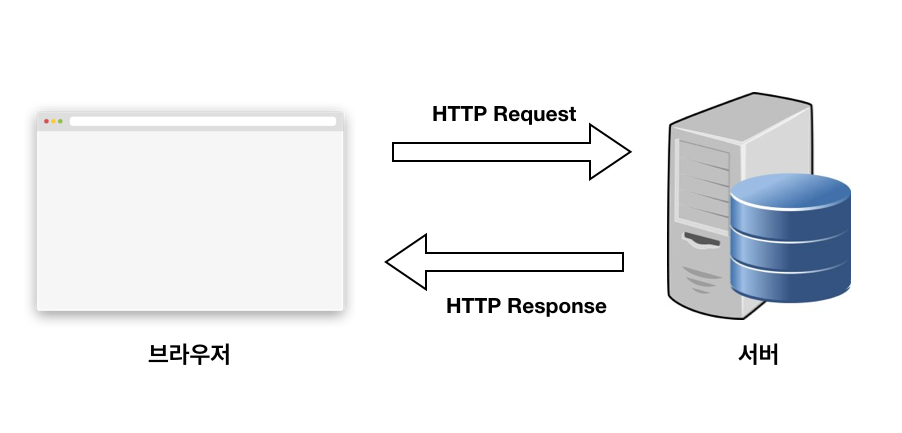
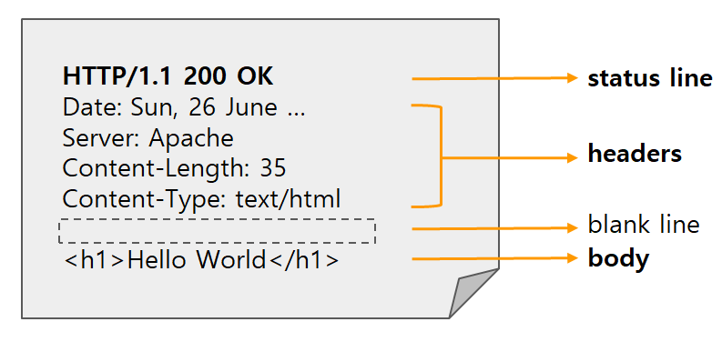

# HTTP란?

HTTP는 하이퍼텍스트 전송 프로토콜(HyperText Transfer Protocol)의 약어로, 인터넷에서 데이터를 주고받을 수 있는 프로토콜이다. 웹 페이지를 방문할 때마다 사용자의 컴퓨터는 HTTP를 통해 인터넷 어딘가에 있는 다른 컴퓨터에서 해당 페이지를 다운로드한다.

프로토콜은 **상호 간에 정의한 규칙을 의미하며, 특정 기기 간에 데이터를 주고받기 위해 정의**된다. 통신 프로토콜은 각각의 기기가 데이터를 주고받을 때의 규칙을 명시하여, 데이터 전송 과정을 원활하게 만든다.

컴퓨터 네트워크에서 데이터를 보내고 받는 성격에 따라, 다양한 프로토콜이 만들어졌다. 예를 들어, 웹 문서를 주고받을 때는 HTTP를 사용하고, 파일을 주고받을 때는 FTP를, 메일은 SMTP, POP 등의 프로토콜을 사용한다.

웹에서는 브라우저와 서버 간에 데이터를 주고받기 위한 방식으로 HTTP 프로토콜을 사용하고 있다. HTTP 프로토콜은 일반적으로 TCP/IP 통신 위에서 동작하며, 기본 포트는 80번이다.

# 무상태성 (stateless)

HTTP 프로토콜의 특징 중 하나는 **무상태(stateless)성**이다. 데이터를 주고 받기 위한 각각의 데이터 요청이 서로 독립적으로 관리된다는 의미다. 쉽게 말하면, **이전 데이터 요청과 다음 데이터 요청이 서로 관련이 없다**는 것이다.

이러한 특징 덕분에 서버는 세션과 같은 별도의 추가 정보를 관리하지 않아도 되고, **다수의 요청 처리 및 서버의 부하를 줄일 수 있는 성능 상의 이점**이 있다.

하지만 **클라이언트가 서버에 추가 데이터를 전송해야 한다는 단점**도 있다.

상태 유지와 무상태성에 대해 좀 더 면밀히 파해쳐보자.

<h2>상태 유지</h2>

클라이언트 - 서버 관계에서, 서버가 클라이언트의 이전 상태를 저장하고 다음 요청에 대해 이전 상태를 유지하는 것을 의미한다. 예를 들어, 한 번 홈페이지에 로그인하면 페이지를 이동하더라도 로그인이 계속 유지되는 것은 서버가 클라이언트의 상태를 계속 유지하고 있기 때문이다. 이러한 상태 유지는 보통 쿠키(Cookie)와 세션(Session) 메모리를 이용하여 구현된다.

상태 유지의 문제점은, 해당 서버가 멈추거나 사용할 수 없을 때 발생한다. 새로운 서버에서는 이전 서버에서 가지고 있던 상태값들을 가지고 있지 않기 때문이다.

예를 들어, 로그인한 유저가 게시판 페이지에 들어가서 글쓰기 버튼을 눌렀는데, 다시 로그인 하라는 화면이 뜰 수 있다. 이 유저의 로그인 정보가 있는 서버가 다운되어 다른 서버가 대신 역할을 이어 받았는데, 해당 유저의 로그인 정보가 없기 때문에 발생하는 문제다.

또한 상태 유지 방식은 하나의 서버가 만약 100명의 클라이언트를 처리할 수 있을 때, 100명보다 많은 클라이언트가 몰리면 이미 연결된 100명의 클라이언트 중 일부가 빠져나가야 다음 클라이언트가 처리할 수 있다. 이는 클라이언트의 상태를 저장하기 위한 용량 한계가 존재하기 때문이다.

따라서, 현업에서는 클라이언트의 상태 데이터를 따로 캐시 서버(Redis)에 저장하여 이용하는 경우가 많다.

<h2>무상태</h2>

클라이언트 - 서버 관계에서, 서버가 클라이언트의 상태 정보를 보존하지 않는다. 대신 클라이언트에서 요청할 때마다 필요한 정보를 모두 담아서 서버로 보내고, 서버는 해당 요청을 처리한 뒤 응답을 보내는 방식이다.

서버는 상태 정보를 보존하지 않아도 되므로, **상태 유지에 대한 부담이 매우 적다**. 또한 서버간에 요청을 분산시키기 쉽기 때문에 대규모 트래픽 발생 시에도 **서버 확장이 용이**하다.

하지만 이러한 구조에서는 클라이언트가 모든 상태 정보를 가지고 있어야 하므로, **클라이언트의 부담이 증**가할 수 있다. 또한 모든 요청에 필요한 정보를 모두 담아서 보내야 하므로 **네트워크 부하가 증가**할 수 있다.

# 비연결성 (connetionless)

HTTP 프로토콜의 또 다른 특징 중 하나는 **비연결성(stateless)성**이다. 비연결성은 클라이언트와 서버가 **한 번 연결을 맺은 후, 클라이언트 요청에 대해 서버가 응답을 마치면 맺었던 연결을 끊어 버리는 성질**을 말한다.

<h2>장점</h2>

HTTP는 인터넷 상에서 불특정 다수의 통신 환경을 기반으로 설계되었다. 만약 서버에서 다수의 클라이언트와 연결을 계속 유지해야 한다면, 이에 따른 많은 리소스가 발생하게 된다. 이를 줄이면 **더 많은 클라이언트와 연결**을 할 수 있으므로, HTTP는 한 번의 통신 후 서버 - 클라이언트의 연결을 끊는다.

<h2>단점</h2>

서버는 클라이언트를 기억하고 있지 않으므로 동일한 클라이언트의 모든 요청에 대해, 매번 새로운 연결을 시도/해제의 과정을 거쳐야하므로 **연결/해제에 대한 오버헤드**가 발생한다.

<h3>KeepAlive</h3>

이에 대한 해결책으로 HTTP의 KeepAlive 속성을 사용할 수 있다.

KeepAlive는 지정된 시간동안 서버와 클라이언트 사이에서 패킷 교환이 없을 경우, 상대방의 안부를 묻기위해 패킷을 주기적으로 보내는것을 의미한다. 이 때 패킷에 반응이 없으면 접속을 끊게된다.

주기적으로 클라이언트의 상태를 체크한다는 것으로 미루어보아 KeepAlive 역시 완벽한 해결책은 아니다.

설령 KeepAlive 속성이 On 상태라해도, 서버가 바쁜 환경에서는 프로세스 수가 기하급수적으로 늘어나기 때문에 KeepAlive로 상태를 유지하기 위한 메모리를 많이 사용하게 되므로 주의해야한다.

# HTTP 요청과 응답

HTTP 프로토콜을 사용하여 데이터를 주고받기 위해서는 클라이언트가 요청을 보내고 서버가 응답을 받아야 한다.

클라이언트란 요청을 보내는 측을 말하며 일반적으로 웹에서는 브라우저를 가리킨다.

서버란 요청을 받는 측을 말하며 보통 원격지의 컴퓨터를 가리킨다.



# HTTP 메시지

클라이언트의 요청과 이에 대한 서버의 응답은 HTTP 메시지를 포함한다. 메시지에는 서로 데이터 교환하기 위해 필요한 정보가 기록되어 있다.

HTTP 요청과 응답 메시지의 구조는 서로 닮았으며, 그 구조는 **1) 시작줄, 2 ) 헤더 3 ) 본문**으로 구성되어 있다.

## 요청 메시지


<h3>Start line</h3>

말 그대로 요청의 첫 줄이다. 다음 세 가지로 구성되어 있다.

1. HTTP method : 요청의 의도를 담고 있다. ( 아래에서 더 자세히 알아보자 )
2. Request target : 요청이 전송되는 목표 주소
3. HTTP version : 버전에 따라 메시지 구조나 데이터가 다를 수 있어 버전을 명시한다.

```java
GET /test.html HTTP/1.1
[HTTP Method] [Request target] [HTTP 버전]
```

<h3>Headers</h3>

HTTP 메시지에 추가 정보를 포함시키는 부분이다. 크게 세 가지 부분으로 나뉜다.

1. 일반 헤더(General headers) : 메시지 전체에 적용되는 정보
2. 요청 헤더(Request headers) : 요청 메시지의 목적과 클라이언트에 대한 정보
3. 본문 헤더(Entity headers) : HTTP 메시지 본문의 정보

- **`Host`**: 요청하려는 서버의 호스트 이름과 포트 번호를 지정
- **`User-agent`**: 클라이언트 프로그램 정보를 담고 있다. 이 정보를 통해 서버는 클라이언트(브라우저)에 맞는 최적의 데이터를 보낼 수 있다.
- **`Referer`**: 바로 직전에 머물렀던 웹 링크 주소를 지정
- **`Accept`**: 클라이언트가 처리 가능한 미디어 타입 종류를 나열
- **`If-Modified-Since`**: 여기에 쓰여진 시간 이후로 변경된 리소스를 취득한다. 페이지가 수정되었으면 최신 페이지로 교체한다.
- **`Authorization`**: 인증 토큰을 서버로 보낼 때 쓰이는 헤더
- **`Origin`**: 서버로 POST 요청을 보낼 때 요청이 어느 주소에서 시작되었는지 나타내는 값이다. 이 값으로 요청을 보낸 주소와 받는 주소가 다르면 <a href="../../web-network/network-cors">**CORS(Cross-Origin Resource Sharing) 에러**</a>가 발생한다.
- **`Cookie`**: 쿠키 값이 key-value 형태로 표현된다.

<h3>Body</h3>

HTTP 요청이 전송하는 데이터를 담고 있는 부분이다. 전송하는 데이터가 없다면 공백이다.

(보통 POST 요청일 경우, HTML 폼 데이터가 포함되어 있다.)

```java
POST /test HTTP/1.1

Accept: application/json
Accept-Encoding: gzip, deflate
Connection: keep-alive
Content-Length: 83
Content-Type: application/json
Host: google.com
User-Agent: HTTPie/0.9.3

{
    "test_id": "tmp_1234567",
    "order_id": "8237352"
}
```

## 응답 메시지



<h3>Status line</h3>

응답의 상태를 간략하게 나타낸다. 세 가지 파트로 구성되어 있다.

1. HTTP version : 응답에 사용된 HTTP 버전
2. Status Code : 요청이 어떻게 처리되었는지 나타내는 상태 코드 ( 아래에서 더 자세히 알아보자 )
3. Status Text : 위 상태 코드에 상응하는 메시지 (ex. `200 - OK`, `404 - Not Found`)

```java
HTTP/1.1 200 OK
[HTTP version] [Status Code] [Status Text]
```

<h3>Headers</h3>

요청과 동일하지만 응답에서만 사용되는 headers 항목이 있다.

- **`Location`** : 301, 302 상태코드일 때만 볼 수 있는 Header로 서버의 응답이 다른 곳에 있다고 알려주면서 해당 위치(URI)를 지정
- **`Server`** : 웹 서버의 종류
- **`Age`** : max-age 시간내에서 얼마나 흘렀는지 초 단위로 알려주는 값
- **`Referrer-policy`** : 서버 referrer 정책을 알려주는 값 ex) origin, no-referrer, unsafe-url
- **`WWW-Authenticate`** : 사용자 인증이 필요한 자원을 요구할 시 , 서버가 제공하는 인증 방식
- **`Proxy-Authenticate`** : 요청한 서버가 프록시 서버인 경우 유저 인증을 위한 값

<h3>Body</h3>

HTTP 요청 메시지의 Body와 일반적으로 동일하다. 마찬가지로 전송하는 데이터가 없으면 비어있다.

```jsx
HTTP/1.1 404 Not Found

Connection: close
Content-Length: 1573
Content-Type: text/html; charset=UTF-8
Date: Mon, 20 Aug 2018 07:59:05 GMT

<!DOCTYPE html>
<html lang=en>
  <meta charset=utf-8>
  <meta name=viewport content="initial-scale=1, minimum-scale=1, width=device-width">
  <title>Error 404 (Not Found)!!1</title>
  <style>
    *{margin:0;padding:0}html,code{font:15px/22px arial,sans-serif}html{background:#fff;color:#222;padding:15px}body{margin:7% auto 0;max-width:390px;min-height:180px;padding:30px 0 15px}* > body{background:url(//www.google.com/images/errors/robot.png) 100% 5px no-repeat;padding-right:205px}p{margin:11px 0 22px;overflow:hidden}ins{color:#777;text-decoration:none}a img{border:0}@media screen and (max-width:772px){body{background:none;margin-top:0;max-width:none;padding-right:0}}#logo{background:url(//www.google.com/images/branding/googlelogo/1x/googlelogo_color_150x54dp.png) no-repeat;margin-left:-5px}@media only screen and (min-resolution:192dpi){#logo{background:url(//www.google.com/images/branding/googlelogo/2x/googlelogo_color_150x54dp.png) no-repeat 0% 0%/100% 100%;-moz-border-image:url(//www.google.com/images/branding/googlelogo/2x/googlelogo_color_150x54dp.png) 0}}@media only screen and (-webkit-min-device-pixel-ratio:2){#logo{background:url(//www.google.com/images/branding/googlelogo/2x/googlelogo_color_150x54dp.png) no-repeat;-webkit-background-size:100% 100%}}#logo{display:inline-block;height:54px;width:150px}
  </style>
  <a href=//www.google.com/><span id=logo aria-label=Google></span></a>
  <p><b>404.</b> <ins>That’s an error.</ins>
  <p>The requested URL <code>/payment-sync</code> was not found on this server.  <ins>That’s all we know.</ins>
```

# URL

URL은 웹을 뒷받치는 **주소체계**다.

웹은 수 많은 파일(자원)이 연결되어 있는 공간이다. 따라서, 웹에 존재하는 파일을 **다른 파일과 구별하는 효과적인 식별자**가 필요하다. 방대한 웹에서 이 자원을 구별하는 식별자가 바로 URL(Uniform Resource Locators)이다. 말그대로, 웹에서 접근가능한 자원(Resource)의 주소(Locator)를 일관되게(Unifrom) 표현하는 형식이다.

<h2>URL의 구성</h2>


- **프로토콜**: 웹에서 서버와 클라이언트간에 어떤 방법으로 자원을 접근할지 알려준다.
- **호스트**: IP 또는 `www.example.com`과 같은 도메인명을 쓴다. 포트번호는 생략 가능 (http 기본 포트 : 80)
- **경로**: 서버에서 자원에 대한 경로다. 루트 디렉토리는 `/`으로 시작한다. (예: https://www.example.com/).
- **매개변수**: 키와 값으로 짝을 이룬다. (`key=value`) 여러개면 `&` 으로 구분한다.
- **부분 식별자**: 자원의 세부 부분을 지정할 때 쓴다. 이것 없이도 자원을 지정할 수 있지만, 해당 자원 안에서 더 세부적인 부분을 가르킬 때 쓴다.

# HTTP 요청 메서드

우리는 URL을 사용하여, 브라우저(클라이언트)를 통해 서버에 존재하는 특정 데이터를 가리켜 요청할 수 있다. 여기서 **요청하는 데이터에 특정 동작을 수행**하고 싶으면 HTTP 요청 메서드(Http Request Methods)를 이용할 수 있다.

일반적으로 HTTP 요청 메서드는 HTTP Verbs라고도 불리우며 아래와 같은 주요 메서드를 갖고 있다.

- **GET** : 존재하는 자원에 대한 **요청**
- **POST** : 새로운 자원을 **생성**
- **PUT** : 존재하는 자원에 대한 **변경**
- **DELETE** : 존재하는 자원에 대한 **삭제**

이와 같이 데이터에 대한 조회, 생성, 변경, 삭제 동작을 HTTP 요청 메서드로 정의할 수 있다. 때에 따라서는 POST 메서드로 PUT, DELETE의 동작도 수행할 수 있다.

기타 요청 메서드는 다음과 같다.

- HEAD : 서버 헤더 정보를 획득. GET과 비슷하나 Response Body를 반환하지 않음
- OPTIONS : 서버 옵션들을 확인하기 위한 요청. [CORS](../../web-network/network-cors)에서 사용

# HTTP 상태 코드

<h3>2xx - 성공</h3>

200번대의 상태 코드는 대부분 **성공**을 의미한다.

- `200 - OK` : GET 요청에 대한 성공
- `204 - No Content` : 성공했으나 응답 본문에 데이터가 없음
- `205 - Reset Content` : 성공했으나 클라이언트의 화면을 새로 고침하도록 권고
- `206 - Partial Conent` : 성공했으나 일부 범위의 데이터만 반환

<h3>3xx - 리다이렉션</h3>

300번대의 상태 코드는 대부분 클라이언트가 이전 주소로 데이터를 요청하여 서버에서 새 URL로 **리다이렉트를 유도**하는 경우를 의미한다.

- `301 - Moved Permanently` : 요청한 자원이 새 URL에 존재
- `303 - See Other` : 요청한 자원이 임시 주소에 존재
- `304 - Not Modified` : 요청한 자원이 변경되지 않았으므로 클라이언트에서 캐싱된 자원을 사용하도록 권고. [ETag](https://developer.mozilla.org/en-US/docs/Web/HTTP/Headers/ETag)와 같은 정보를 활용하여 변경 여부를 확인

<h3>4xx - 클라이언트 에러</h3>

400번대 상태 코드는 대부분 **클라이언트의 코드가 잘못된 경우**다. 유효하지 않은 자원을 요청했거나 요청이나 권한이 잘못된 경우 발생한다.

- `400 - Bad Request` : 잘못된 요청
- `401 - Unauthorized` : 권한 없이 요청. Authorization 헤더가 잘못된 경우
- `403 - Forbidden` : 서버에서 해당 자원에 대해 접근 금지
- `404 - Not Found` : 요청한 자원이 서버에 없음
- `405 - Method Not Allowed` : 허용되지 않은 요청 메서드
- `409 - Conflict` : 최신 자원이 아닌데 업데이트하는 경우. ex) 파일 업로드 시 버전 충돌

<h3>5xx - 서버 에러</h3>

500번대 상태 코드는 **서버 쪽에서 오류**가 난 경우다.

- `501 - Not Implemented` : 요청한 동작에 대해 서버가 수행할 수 없는 경우
- `503 - Service Unavailable` : 서버가 과부하 또는 유지 보수로 내려간 경우

# 정리

<h6> 1 ) HTTP는 클라이언트 (브라우저) - 서버 간 일종의 데이터 교환 규칙이다.</h6>
<h6> 2 ) HTTP의 특징으로는 무상태성과 비연결성이 있다. </h6>
- 무상태성 : 서버가 클라이언트의 상태를 보존하지 않는다.
    - 장점 : 서버 확장 용이 / 서버 부하 감소 
    - 단점 : 클라이언트 요청 시 추가 데이터 부담 / 통신 시 더 큰 리소스 발생

- 비연결성 : 서버가 클라이언트의 요청을 응답한 후 연결을 끊는다.
  - 장점 : 통신 리소스를 줄여, 더 많은 클라이언트와 연결 가능
  - 단점 : 연결 / 해제에 대한 오버헤드 발생

<h6>3 ) HTTP 요청과 응답은 통신에 필요한 정보가 담긴 메시지를 포함한다.</h6>


- 요청 : 클라이언트는 URL을 통해 서버에 있는 특정 데이터를 요청하고 요청 메서드로 해당 데이터에 어떤 동작을 수행할지 정한다.
- 응답 : 서버는 요청에 대해 응답 상태 코드와 요청한 데이터를 응답 본문에 담아 클라이언트에게 넘긴다.

# Reference

- [https://hanamon.kr/네트워크-http-http란-특징-무상태-비연결성/](https://hanamon.kr/%EB%84%A4%ED%8A%B8%EC%9B%8C%ED%81%AC-http-http%EB%9E%80-%ED%8A%B9%EC%A7%95-%EB%AC%B4%EC%83%81%ED%83%9C-%EB%B9%84%EC%97%B0%EA%B2%B0%EC%84%B1/)
- [https://joshua1988.github.io/web-development/http-part1/](https://joshua1988.github.io/web-development/http-part1/)
- [https://victorydntmd.tistory.com/286](https://victorydntmd.tistory.com/286)
- [https://inpa.tistory.com/entry/WEB-📚-Stateful-Stateless-정리](https://inpa.tistory.com/entry/WEB-%F0%9F%93%9A-Stateful-Stateless-%EC%A0%95%EB%A6%AC)
- [https://ohcodingdiary.tistory.com/5](https://ohcodingdiary.tistory.com/5)
