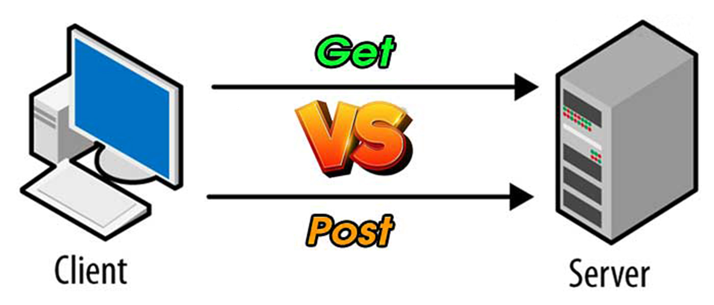
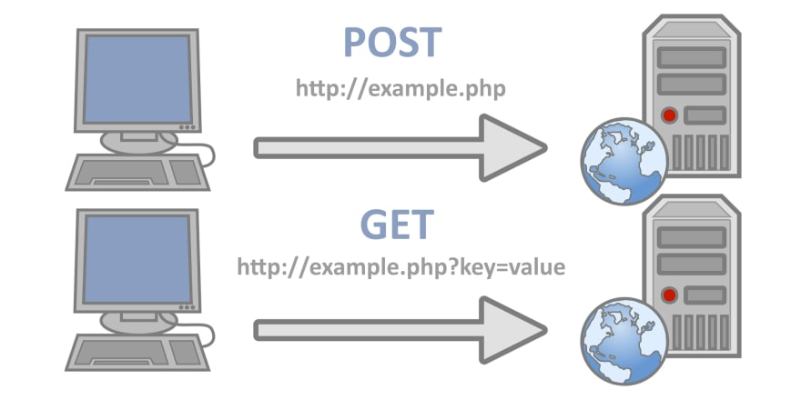

<br />

# GET

클라이언트가 서버로부터 데이터를 가져와 보여줄 때 사용한다. 즉, 어떠한 정보를 가져와서 조회하기 위해 사용하는 메서드(방식)이다.

클라이언트에서 서버로 요청 시, URL 주소에 간단한 쿼리스트링(QueryString)을 포함하여 전송한다. 쿼리스트링은 `key`와 `value`의 형태로 요청 파라미터가 여러개일 경우 `&`를 붙인다.

```
ex) http://example.com/boardList?name=제목&contents=내용
```

GET 요청은 데이터를 **읽는 용도**로만 사용되며 **데이터 변형에 어떤 영향도 주지 않는다.**

즉, 데이터를 조회할 뿐 생성 / 수정 / 삭제하지 않는다.

## 특징

- URL에 쿼리스트링 (QueryString) 형식으로 변수를 포함하여 요청
- 데이터를 Headers에 포함하여 전송
- URL에 데이터가 노출되어 보안에 취약 - 민감한 데이터를 다룰 경우 사용 금물
- 요청이 브라우저 기록에 남음
- 요청을 북마크 추가 가능
- 요청 시 데이터 길이 제한이 존재
- 불필요한 요청을 제한하기 위해 캐싱이 가능

> 캐싱 (Caching) : 데이터를 GET 요청으로 가져온 후 데이터를 미리 저장시켜 놓으므로써, 또 다시 같은 요청이 발생할 경우 해당 리소스에 빠르게 접근할 수 있도록 해주는 기술

<br />

# POST

클라이언트가 리소스를 생성 또는 수정하기 위해 서버로 보내는 요청 메서드다.

GET 요청과 달리, POST 요청은 Body에 데이터를 넣어서 전송한다다. 이에 따라, POST 요청 메시지에서는 `Content-Type`이라는 헤더 필드가 필요하며, 전송하는 데이터의 타입을 명시해야 한다. 메세지 길이에 대한 제한은 없지만 `Time Out`이 존재하여 클라이언트에서 페이지를 요청하고 기다리는 시간이 필요하다.

POST 요청은 데이터를 Body에 포함시키기 때문에 URL에 데이터가 노출되지 않는다. 하지만, 이 또한 개발자 도구, Fiddler 같은 툴로 내용 확인이 가능하기 때문에 민감한 데이터의 경우 암호화가 반드시 필요하다**.**

**또한,** 즐겨찾기나 캐싱이 불가능하며 쿼리스트링 데이터 뿐만 아니라 라디오 버튼, 텍스트 박스 등의 객체 값도 전송 가능하다.

## 특징

- HTTP Body에 데이터를 포함하여 요청
- URL에 데이터가 노출 되지 않음 - 요청 내용 확인이 가능하기 때문에, 암호화 필요
- 요청이 브라우저 기록에 남지 않음
- 요청을 북마크에 추가할 수 없음
- 요청 시 데이터 길이 제한이 없음
- 요청을 캐싱할 수 없음

<br />

# 멱등성

GET과 POST의 중요한 차이점 중 하나로 멱등성(idempotent)이 있다. 멱등성의 사전적 정의는 다음과 같다.

> 수학이나 전산학에서 연산의 한 성질을 나타내는 것으로, **연산을 여러 번 적용하더라도 결과가 달라지지 않는 성질**을 의미한다. - 위키백과

여기서 핵심은 **연산을 여러 번 적용하더라도 결과가 달라지지 않는 성질**이다. 즉, 동일한 연산 (요청)에 대한 결과가 항상 같다는 뜻이다.

HTTP 요청 메서드가 멱등하면 한 번 보내는 것과 연속해서 여러 번 보내는 것이 같은 효과를 발생시키고, 서버의 상태도 변함이 없다.

`GET`은 멱등한 메서드이기 때문에, 동일한 요청을 여러 번 전송해도 동일한 응답이 돌아온다. 예를 들어, 지금 보고 있는 이 포스팅의 URL을 새로고침하면 항상 동일한 HTML 파일을 조회하는 요청이 서버로 전달되어 똑같은 글을 다시 볼 수 있을 것이다.

이와 달리 `POST` 요청은 멱등하지 않는 메서드이기 때문에, 동일한 요청을 여러 번 전송해도 응답은 매 번 다를 수 있다. 예를 들어, 만약 이 글에 댓글을 여러 번 달게 된다면 같은 내용일지라도 다른 `id`를 가진 댓글 여러 개가 서버에 전송되어 저장될 것이다.

따라서 , **`GET`은 데이터 상태를 변경하지 않기 때문에 (ONLY 조회) 멱등한 메서드**이고 **`POST` 는 데이터 상태를 변화 (생성 / 수정 / 삭제)시키기 때문에 멱등하지 않는 메서드**다.

추가적으로, 리소스에 대한 행위를 정확하게 표현하는 메서드를 사용해야 API의 가독성을 높일 수 있다. 그러므로, **생성에는 `POST`, 수정은 `PUT` 또는 `PATCH`, 삭제는 `DELETE`를 사용**도록 하자.

> PATCH와 PUT의 차이? <br />
> PATCH : 리소스의 **일부분만 수정**하기 위해 사용 <br />
> PUT : 리소스의 **모든 속성을 수정**하기 위해 사용

<br />

# 정리



|                       | GET                                                  | POST                        |
| --------------------- | ---------------------------------------------------- | --------------------------- |
| 사용 용도             | 리소스 요청                                          | 리소스 생성                 |
| HTTP 응답 코드        | 200 - OK                                             | 201 - Created               |
| 데이터의 위치         | Headers                                              | Body                        |
| 리소스 전달 방식      | 쿼리스트링                                           | HTTP Body                   |
| URL 예시              | http://example.com/boardList?name=제목&contents=내용 | http://example.com/addBoard |
| URL 데이터 노출 여부  | O                                                    | X                           |
| 캐시                  | O                                                    | X                           |
| 브라우저 기록         | O                                                    | X                           |
| 북마크 추가           | O                                                    | X                           |
| 데이터 길이 제한      | O                                                    | X                           |
| 데이터 상태 변경 여부 | X                                                    | O                           |
| idempotent (멱등성)   | O                                                    | X                           |

<br />

# Reference

- [https://velog.io/@songyouhyun/Get과-Post의-차이를-아시나요](https://velog.io/@songyouhyun/Get%EA%B3%BC-Post%EC%9D%98-%EC%B0%A8%EC%9D%B4%EB%A5%BC-%EC%95%84%EC%8B%9C%EB%82%98%EC%9A%94)
- [https://mangkyu.tistory.com/17](https://mangkyu.tistory.com/17)
- [https://developer.mozilla.org/ko/docs/Glossary/Idempotent](https://developer.mozilla.org/ko/docs/Glossary/Idempotent)
