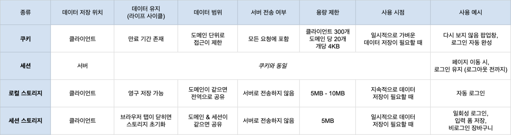

 

<a href="../../web-network/network-http">HTTP 프로토콜</a>의 특징은 비연결성과 무상태성이다. 무상태성의 큰 단점은 서버가 클라이언트를 알지 못하기 때문에 매 요청마다 확인해야한다는 것이다. 이를 보완하기 위해, 쿠키와 세션을 이용하여 HTTP 통신 시 상태 유지를 가능하게 한다.

> **비연결성 (connectionless)**
> 클라이언트가 서버에 요청을 했을 때, 그 요청에 맞는 응답을 보낸 후 **연결을 끊는 처리방식**

> 무상태성 (s**tateless)**
> 연결을 끊는 순간 클라이언트와 서버의 통신이 끝나며 **상태 정보는 유지하지 않는 특성**

# 쿠키 (Cookie)

사용자가 웹 사이트에 방문하면, 사이트의 서버에서 **사용자의 컴퓨터에 저장하는 작은 기록 파일**이다. 서버가 사용자의 상태 정보를 사용자의 브라우저에 심어놓고 필요할 때 사용한다.

> **쿠키**라는 이름의 유래?  
> 동화 헨젤과 그레텔에서 주인공이 길을 잃지 않기 위해 과자 가루를 뿌린 이야기에서 유래했다고 한다.
> **사용자의 정보를 잃지 않겠다는 의미** 정도로 기억하면 좋을 것 같다.

<h2>특징</h2>

1. 이름, 값, 만료일(저장기간), 경로 정보로 구성
2. 클라이언트에 총 300개의 쿠키 저장 가능
3. 하나의 도메인 당 20개의 쿠키 저장 가능
4. 하나의 쿠키는 4KB까지 저장 가능

<h2>동작 순서</h2>

1. 클라이언트가 페이지를 요청
2. 웹 서버는 페이지(HTML 파일)와 함께 쿠키를 생성하여, 클라이언트에게 응답
3. 클라이언트(브라우저)는 쿠키를 저장, 서버 재요청 시 쿠키와 함께 요청 메시지 전송
4. 동일 사이트 재방문 시 클라이언트(브라우저)에 해당 쿠키가 있는 경우, 요청 페이지와 함께 쿠키를 전송

<h2>사용 예시</h2>

- 팝업 창 ‘다시 보지 않음’ 설정
- 로그인 자동 완성 기능

# 쿠키의 문제점

하지만 쿠키는 다음과 같은 문제점을 가지고 있었고 이를 보완하기 위해 새로운 기술들이 도입된다.

- HTTP 요청에 암호화 되지않은 상태로 사용되기 때문에 **보안에 취약**

  **_⇒ 쿠키의 보안 이슈를 해결하기 위해 , 세션이 등장_**

- **용량과 개수에 제한**이 있기 때문에, 대용량 데이터는 저장이 불가능
- **모든 HTTP 요청에 포함**되어 있어 웹 서비스 **성능에 악영향**

  **_⇒ 쿠키의 용량 / 속도의 이슈를 해결하기 위해 웹스토리지 (Web Storage)가 HTML5에서 도입_**

# **세션(Session)**

사용자가 브라우저를 통해 웹서버에 접속한 시점으로부터 브라우저를 종료하여 연결을 끝내는 시점까지, 같은 사용자로부터 오는 일련의 요청을 하나의 상태로 보고, 그 상태를 일정하게 유지하는 기술.

즉, **방문자가 웹 서버에 접속해있는 상태**를 하나의 단위로 보고 그것을 세션이라고 한다.

<h2>특징</h2>

1. 웹 서버에 웹 컨테이너의 상태를 유지하기 위한 정보를 저장
2. 웹 서버의 저장되는 쿠키 (=세션 쿠키)
3. 브라우저 종료, 서버에서 세션을 삭제을 경우에만 삭제되므로 쿠키보다 비교적 보안상 안전
4. (서버 용량이 허용하는 한) 저장 데이터의 용량 제한 없음
5. 각 클라이언트에 고유 session-id를 부여하고 id를 가진 클라이언트마다 요구에 맞는 서비스 제공

<h2>동작 순서</h2>

1. 클라이언트가 서버에 페이지를 요청
2. 서버는 클라이언트의 `Request-Header` 필드인 `Cookie`를 보고, 클라이언트가 해당 session-id를 보냈는지 확인
3. session-id가 존재하지 않는다면 서버는 session-id를 생성해 클라이언트에게 반환
4. 서버에서 클라이언트로 돌려준 session-id를 쿠키를 사용해 서버에 저장
5. 클라이언트는 재접속 시, 쿠키를 이용해 session-id 값을 서버에 전달

<h2>사용 예시</h2>

- 화면을 이동해도 로그인이 풀리지 않고 로그아웃하기 전까지 유지

## 쿠키와 세션의 차이

세션도 결국 쿠키를 사용하기 때문에 역할과 동작 원리 모두 비슷하지만, 다음과 같은 차이점이 존재한다.

<h3>저장 위치</h3>

- 쿠키는 서버의 자원을 전혀 사용하지 않는다.
- 세션은 서버의 자원을 사용한다.

<h3>보안</h3>

- 쿠키는 클라이언트에 저장되기 때문에 변질되거나 요청 시 스니핑 등으로 인해 보안에 취약하다.
- 세션은 쿠키에 session-id만 저장한 후, 해당 id로 서버에서 처리하기 때문에 비교적 안전하다.

<h3>라이프 사이클</h3>

- 쿠키는 만료기간이 있지만, 파일로 저장되어 브라우저를 종료되도 유지된다. 만료기간을 길게 지정해, 직접 삭제할 때까지 유지 가능하다.
- 세션도 만료기간이 있지만, 브라우저가 종료되면 이와 상관없이 삭제된다.

<h3>속도</h3>

- 쿠키가 더 우수하며, 정보가 쿠키에 있어 서버 요청 시 빠르다.
- 세션은 정보가 서버에 있기 때문에, 처리가 요구되어 비교적 느리다.

<h2>무엇을 써야하나</h2>

세션이 쿠키에 비해 안전하나 서버의 자원을 쓰기 때문에, 속도가 느려질 수 있다. 따라서, 쿠키와 세션 모두를 필요에 맞게 적절히 사용하면 웹 사이트의 퍼포먼스를 향상 시킬 수 있다.

# 웹 스토리지 (Web Storage)

**해당 도메인과 관련된 특정 데이터를** 서버가 아닌 **클라이언트 웹브라우저에 저장**할 수 있도록 제공하는 기능이다.

<h2>특징</h2>

1. 쿠키와 마찬가지로, **키/값 형태**로 데이터를 저장하고 **키를 기반으로 데이터를 조회**
2. **사이트의 도메인 단위로 접근이 제한** (A 도메인에서 저장한 데이터는 B 도메인에서 조회가 불가능)
3. 두 종류의 저장소(**영구저장소 - LocalStorage /** **임시저장소 -SessionStorage)**를 나뉘어, **데이터의 지속성**에 **따라** 응용 환경에 맞는 선택이 가능

## 로컬 / 세션 스토리지

웹 스토리지에는 다음과 같이 두 가지 종류의 저장소가 있다.

1. **로컬 스토리지 ( Local Storage )**
2. **세션 스토리지 (Session Storage)**

웹 스토리지이기 때문에, 위 3가지 특징을 공통으로 갖는다. 두 저장소의 차이점을 중심으로 더 알아보자.

<h3>데이터 유지</h3>

- 로컬 스토리지는 브라우저를 닫았다가 다시 열어도 데이터가 계속 유지된다.
- 세션 스토리지는 탭이 열려있는동안 데이터가 유지된다. 닫으면 데이터가 삭제된다.

<h3>데이터 범위</h3>

- 로컬 스토리지는 도메인 별로 생성된다. 도메인이 같으면 전역적으로 공유된다.
- 세션 스토리지는 같은 도메인이라도 세션이 다르면 접근이 불가하다.

<h3>Windows 전역 객체 내 컬렉션</h3>

- 로컬 스토리지는 LocalStorage라는 컬렉션을 통해 저장 / 조회된다.
- 세션 스토리지는 SessionStorage라는 컬렉션을 통해 저장 / 조회된다.

## 웹 스토리지와 쿠키의 차이

쿠키의 치명적인 약점 (속도, 용량)을 보완하고자 웹 스토리지가 등장하였다.
이 둘의 차이점은 다음과 같다.

<h3>서버 전송 여부</h3>

- 쿠키는 매 요청마다 서버로 전송된다.
- 웹 스토리지는 클라이언트에 데이터를 저장하고 서버로 전송하지 않아, 네트워크 트래픽 비용을 줄여준다.

<h3>용량 제한</h3>

- 쿠키는 용량 매우 제한적이다. (개당 4KB)
- 웹 스토리지는 용량이 크다. (5MB 이상 - 브라우저마다 상이)

<h3>데이터 유지</h3>

- 쿠키는 만료일자가 있어 언젠가 제거된다.
- 로컬 스토리지는 영구적으로 저장 가능하다. 세션 스토리지는 탭이 열려있는 동안 계속 유지된다.

 

> 캐시(Cache)와 로컬 스토리지의 차이?
>
> 캐시는 매우 자주 사용되는 데이터에 사용자가 빠르게 접근할 수 있도록 하기 위해 저장된다. HTML 및 CSS와 같은 파일이 자주 사용되므로 캐시에 저장된다.
>
> 반면, 로컬 스토리지는 조금 덜 일반적이며 조금 더 사용자에게 특화된 데이터다. 양식 정보나 자주 방문한 페이지처럼 사용자에게 맞춤화된 데이터나 CSS 및 HTML이 렌더링하는 객체 및 데이터도 포함된다.

# 정리

쿠키는 stateless한 HTTP 통신을 stateful하게 사용하기 위해 만들어졌다. 하지만 쿠키 또한 보안 취약, 낮은 속도, 용량 부족이라는 약점이 나타났다. 이를 보완하기 위해 새로운 기술들이 도입된다.

보안을 강화하기 위해, 세션이 등장한다. 세션도 쿠키를 사용하기 때문에 작동 원리는 비슷하다. 그러나, 데이터를 서버에 저장하고 처리하기 때문에 데이터를 클라이언트에 저장하는 쿠키보다 비교적 안전하다. 하지만, 그만큼 서버에 부하가 생겨 속도가 느려질 수 있다. 그러므로, 두 기술을 필요에 맞게 적절히 혼용하는 것이 좋다.

낮은 속도와 용량이 부족한 약점을 보완하기 위해 HTML5에서 웹 스토리지가 등장한다. 웹 스토리지는 매번 요청되는 쿠키의 데이터를 브라우저에 저장시켜, 네트워크 트래픽을 덜어주었다. 웹 스토리지는 임시 저장소인 세션 스토리지와 영구 저장소인 로컬 스토리지로 나뉘어 데이터의 지속성에 맞게 활용이 가능하다.

이 글에서 소개된 4가지 기술을 표로 정리해보았다.

<figure>
<a href="../../images/2023-03-27-web-storage/web-storage-table.png">
  
  <figcaption>쿠키, 세션, 웹 스토리지 정리 [클릭]</figcaption>
</a>
</figure>

# Reference

- [https://velog.io/@design0728/브라우저-저장소-LocalStorage-SessionStorage-Cookie](https://velog.io/@design0728/%EB%B8%8C%EB%9D%BC%EC%9A%B0%EC%A0%80-%EC%A0%80%EC%9E%A5%EC%86%8C-LocalStorage-SessionStorage-Cookie)
- [https://contents.premium.naver.com/codetree/funcoding/contents/221224153606732kt](https://contents.premium.naver.com/codetree/funcoding/contents/221224153606732kt)
- [https://dev-coco.tistory.com/61](https://dev-coco.tistory.com/61)
- [https://stackoverflow.com/questions/43519890/what-is-the-difference-between-local-storage-and-cache-in-the-browser](https://stackoverflow.com/questions/43519890/what-is-the-difference-between-local-storage-and-cache-in-the-browser)
