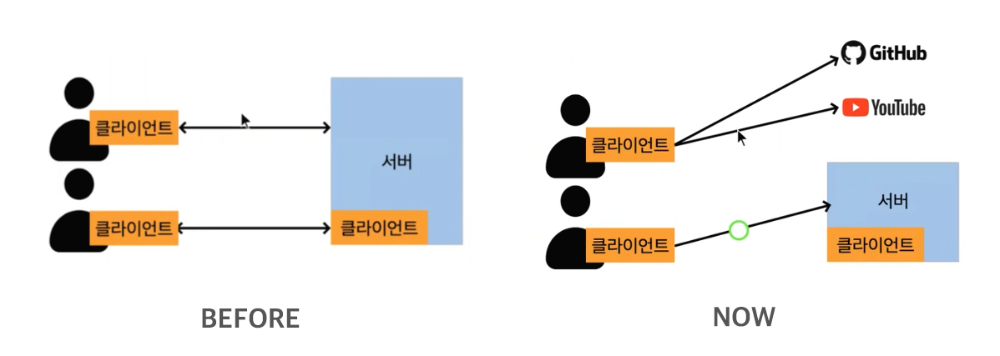
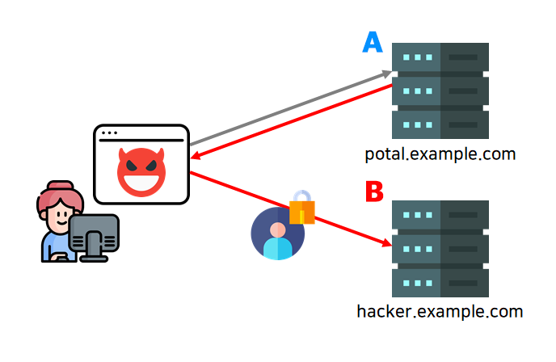
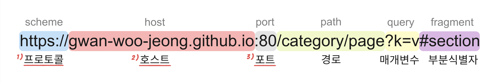
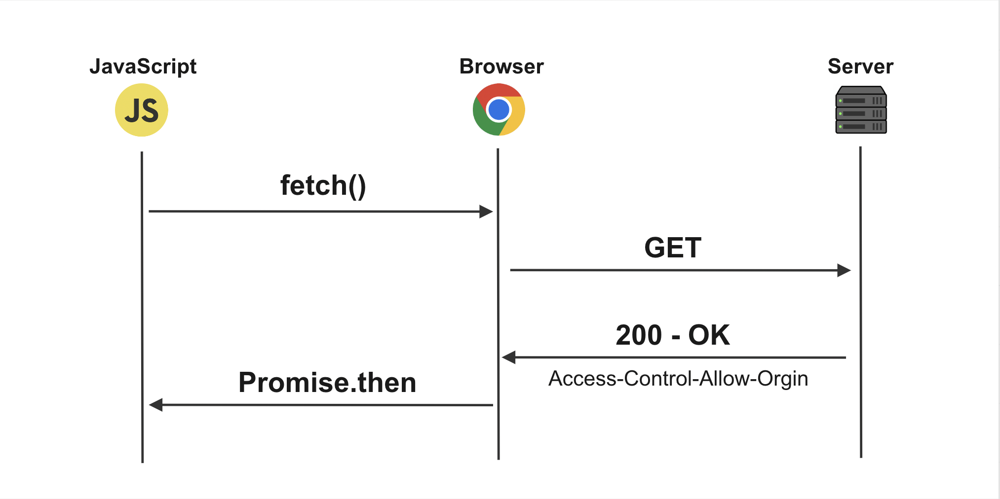
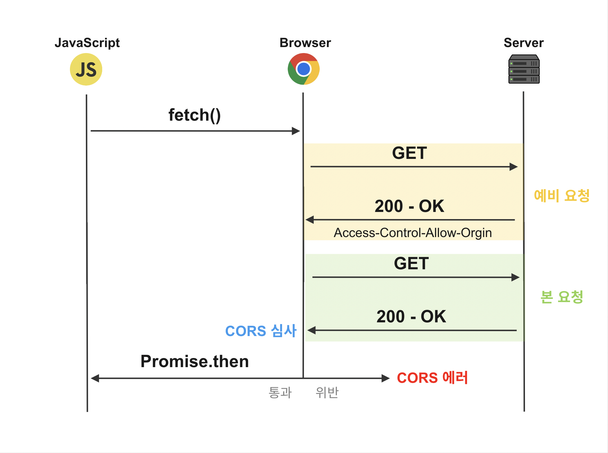

# 들어가기전

## 등장 배경

예전에는 클라이언트가 동일한 서버에서만 리소스를 받았기 때문에, 리소스의 위험성에 대한 의심의 여지가 없었다. 그런데, 계속해서 웹 생태계가 다양화되면서 서로 다른 도메인 간에 데이터를 주고 받을 일이 많아졌다.

브라우저는 기본적으로 안정성을 이유로 동일한 출처의 리소스만 허용하는데 (SOP), 개발자들은 이를 우회하기 위해 JSONP를 사용하는 등 꼼수를 사용했다. 이런 배경에서 다른 장치의 도입이 필요해졌고, 합의된 출처 간에 안전한 리소스 공유를 위해 만들어진 메커니즘이 CORS이다.

> **JSONP** : HTML 문서의 script 태그로 다른 도메인을 요청 할 시 SOP 정책이 적용되지 않는다는 점을 이용해 다른 도메인으로부터 데이터를 받는 요청 방식이다. (더 이상 사용하지 않는다.)

## 교차 출처의 위험성

교차 출처 리소스 공유(CORS)를 알기 전에 왜 브라우저가 기본적으로 동일 출처 리소스 공유(SOP)를 원칙으로 하는지 알아야한다. 브라우저는 사용자의 민감한 정보를 지니고 있기 때문에, 안전하게 보호되어야 한다.

민감한 정보라고 하면 대표적으로 토큰이 있다. 토큰은 원격 서버에 접근 할 수 있는 인증 정보다. 만약, 브라우저에서 CORS가 비활성화 되어있다면 다음과 같은 최악의 시나리오를 생각해볼 수 있다.

내 브라우저는 사이트 A에 로그인을 하여 토큰을 가지고 있다. 그리고 한 해커가 사이트 A를 사칭하여 메일을 보내 사이트 B의 페이지의 링크를 보냈고 나는 그 링크를 클릭했다. 이 페이지를 방문하면 사이트 A의 페이지 콘텐츠와 인증 정보를 반환하는 요청을 하게되고 해커는 내 사이트 A 계정으로 사이트 A를 접속할 수 있게 된다.

# CORS

CORS는 HTTP 헤더에 CORS 관련 항목을 추가하여, 웹 어플리케이션이 출처가 다른 리소스에 접근이 가능하도록 브라우저에게 알려주는 체제이다.

CORS에서 가장 헷갈리는 부분들을 먼저 짚고 넘어가자.

1. **CORS는** 방어가 아닌 **방어를 풀어주는 역할**을 한다. 교차 출처 리소스 접근을 막는 것은 SOP이고 CORS는 이를 허용해준다.
2. **SOP는** 서버가 아닌 **브라우저의 방어 수단**이다. 즉, 브라우저가 신뢰할 수 없는 출처의 리소스를 차단하는 것이다.

<figure>
<a style="text-align: center; width: 100%;" href="../../images/2023-03-30-network-cors/chrome-block.gif">
  
  <figcaption>CORS 정책에 위배되는 응답 리소스는 브라우저에 의해 블락당한다.</figcaption>
</a>
</figure>

# 출처란?

브라우저는 다음 3가지를 기준으로 출처가 같은지 아니면 다른지 판단한다.

&emsp; **1. 프로토콜**  
&emsp; **2. 호스트**  
&emsp; **3. 포트 (보통 생략, 명시될 경우 일치해야 함)**  

이 3가지가 모두 같으면 동일 출처(Same-Origin) 요청이고, 하나라도 다르면 교차 출처(Cross-origin) 요청이다. 교차 출처 요청을 할 경우, CORS 정책을 준수해야 정상적으로 응답을 받을 수 있다.

# CORS의 동작

CORS는 기본적으로 다음과 같은 과정으로 동작한다.

1. 클라이언트가 HTTP 헤더에 `Origin` 필드의 값으로 출처(현재 접속한 사이트)를 담아 요청을 보낸다.
2. 서버가 헤더에 `Access-Control-Allow-Origin` 필드의 값으로 허용된 출처 (신뢰할 수 있는 사이트나 API 주소 목록)를 담아 응답을 보낸다.
3. 클라이언트의 브라우저는 `Origin` 값과 `Access-Control-Allow-Origin` 값을 비교해 유효한 응답인지 확인한다. 유효하지 않으면 응답을 사용하지 않는다.

# CORS 요청 방식 3가지

## Simple Request

아래와 같은 일정 조건들을 모두 충족한 요청에 사용한다. 이 까다로운 조건들 중 하나라도 만족하지 못할 시, 더 안전한 요청 방식인 Preflight Request를 보낸다.

**조건 1 - 메서드**
: `GET`, `POST`, `HEAD` 중 하나

**조건 2 - 헤더**
: `Accept`, `Accept-Language`, `Content-Language`, `Content-Type`, `DPR`, `Downlink`, `Save-Data`, `Viewport-Width`, `Width` 중 하나

**조건 3 - Content-type의 값**
: `application/x-www-form-urlencoded`, `multipart/form-data`, `text/plain` 중 하나

## Preflight Request

본 요청을 보내기 전에 Preflight Request(예비 요청)을 먼저 보낸다. 본 요청이 서버 데이터에 영향을 줄 수 있기 때문에, 먼저 안전한지 확인하는 것이다. 예비 요청에서 허락이 떨어지면, 본 요청이 가능하다.

예비 요청은 `OPTIONS` 메서드를 사용해야 하고, 헤더의 `Origin` 필드의 값으로 출처에 대한 정보가 들어가야 한다. 이 때 헤더에는 `Origin` 뿐만 아닌, 본 요청에 대한 다른 정보도 포함될 수 있다.

본 요청의 응답이 돌아오면, 브라우저는 응답이 CORS 정책을 준수하고 있는지 심사한다. 브라우저는 일단 응답을 받기 때문에, CORS를 위반해도 응답 헤더에 `200 - OK`가 뜬다. 따라서, 정책 위반 판단 여부는 상태코드가 아닌 `Access-Control-Allow-Origin` 값이 존재하는지 여부로 판단해야 한다.

> 매 요청마다 예비 요청을 보내는 것은 비효율적이다. 한 가지 옵션으로 백엔드는 예비 요청에 대한 응답에 `Access-Control-Max-Age` (CORS가 캐싱되는 시간)를 포함하여 프론트에게 준다. 그러면, 해당 시간만큼 프론트는 예비 요청을 프리 패스할 수 있다.

## Credentialed Request

앞서 말했듯이, 토큰 등 사용자 식별 정보는 악용될 수 있으므로 이를 담은 요청에 대해선 보다 엄격한 조건이 요구된다. 이 조건을 갖춘 요청이 Credentialed Request다.

브라우저가 기본 제공하는 비동기 리소스 요청들 (`XMLHttpRequest`, `fetchAPI`)은 옵션을 따로 주지 않으면 헤더에 쿠키나 인증 정보를 함부로 담지 않는다. 만약, 요청에 이를 담고 싶다면 `credential` 옵션에 값을 주어야 한다.

이 옵션에는 3가지 값을 사용할 수 있다.

1. same-origin : 동일 출처 간 요청에만 인증 정보를 담을 수 있다. (기본 값)
2. include : 모든 요청에 인증 정보를 담는다.
3. omit : 모든 요청에 인증 정보를 담지 않는다.

이 중 include 값을 사용하기 위해선 2가지 조건을 더 충족해야 한다.

1. `Access-Control-Allow-Origin`의 값이 와일드 카드 (\* : 모두 허용)이 아닌 출처 주소를 정확하게 명시해야 한다.
2. 응답 헤더에 반드시 `Access-Control-Allow-Credentials : true`가 있어야 한다.

# CORS 해결 방법

CORS 정책을 위반한 경우, 보통 `Access-Control-Allow-Origin` 의 값을 올바르게 주면 해결된다. 와일드 카드(\*)를 값으로 지정해주면, 모든 출처를 허용하기 때문에 약간 위험할 수 있다. 따라서 정확한 출처 주소를 명시해주는 것이 더 안전하게 해결하는 방법이다.

# 요약

1. CORS는 교차 출처 리소스를 허용해주는 체제고 SOP(브라우저 기본 값)는 이를 차단하는 체제다.
2. CORS 요청 방식은 Simple Request, Preflight Request, Crendential Request가 있다. 열거 순으로 요청 조건이 더 까다롭지만 그만큼 더 안전하다.
3. 보통 `Access-Control-Allow-Origin` 필드의 값을 올바르게 주면 CORS 에러를 해결할 수 있다.

# Reference

- [https://developer.mozilla.org/ko/docs/Web/HTTP/CORS](https://developer.mozilla.org/ko/docs/Web/HTTP/CORS)
- [https://security.stackexchange.com/questions/170389/http-access-control-cors-purpose](https://security.stackexchange.com/questions/170389/http-access-control-cors-purpose)
- [https://hymndev.tistory.com/78](https://hymndev.tistory.com/78)
- [https://joooing.tistory.com/entry/CORS](https://joooing.tistory.com/entry/CORS)
- [https://blog.zairo.kr/entry/이해하기-쉬운-웹-보안-모델-이야기-1-SOP-CORS](https://blog.zairo.kr/entry/%EC%9D%B4%ED%95%B4%ED%95%98%EA%B8%B0-%EC%89%AC%EC%9A%B4-%EC%9B%B9-%EB%B3%B4%EC%95%88-%EB%AA%A8%EB%8D%B8-%EC%9D%B4%EC%95%BC%EA%B8%B0-1-SOP-CORS)
