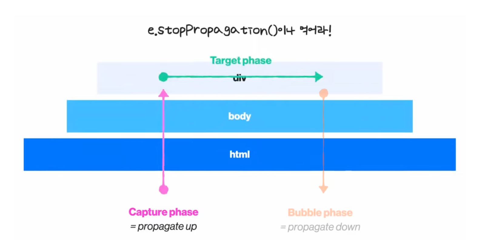

<br />

# 이벤트란?

**이벤트**란 클릭이나 키보드 입력과 같이 일반적으로 사용자가 행하는 모든 동작을 일컫는다.

사용자의 입력을 받기 위해, 우린 HTML 요소에 이벤트를 연결해주는데 이것을 **이벤트 바인딩**이라고 하고 이벤트를 우리의 의도대로 처리하는 행위를 **이벤트 핸들링**이라고 한다.

<br />

# 이벤트 플로우

이벤트 핸들링을 위해 우린 브라우저 내에서 이벤트가 어떻게 동작하는 지 알 필요가 있다.

HTML 요소들은 태그 안에 태그가 위치하는 식으로 계층적으로 이루어져있다. 때문에 한 요소에 이벤트가 발생할 경우, 해당 요소의 부모 이벤트들이 전부 실행되는 **연쇄적 이벤트 흐름(이벤트 플로우)**이 일어난다.

예를 들어, div - body - html가 중첩된 구조의 웹 사이트가 있다고 하자. 우리가 div를 클릭할 시, div에 등록된 클릭 이벤트가 실행된다.

그런데 만약 부모 요소인 body와 html에 바인딩된 이벤트가 있다면, 이벤트 플로우에 의해 해당 이벤트도 실행되게 된다.

<a href="../../images/2023-04-01-event-flow/event-flow-start.png">
  
</a>

사용자가 직접적으로 발생시킨 이벤트가 바인딩된 요소는 이벤트의 시발점이 되고, 이로 인해 중첩된 요소들은 이벤트 탑승을 하게 된다.

<br />

# target / currentTarget

이벤트 핸들러(함수)를 이벤트에 바인딩하면 해당 함수의 인자로 이벤트에 대한 다양한 정보가 포함된 이벤트 객체 주어진다.

우리는 이벤트 객체의 `target` 과 `currentTarget` 이라는 프로퍼티를 통해 이벤트가 정확히 어디서 발생했는지 에 관한 정보를 알 수 있다.

이 둘의 차이를 다음 예시 코드를 통해 알아보자.

```jsx
const body = document.body;
body.addEventListener("click", (e) => {
  e.target; // ?
  e.currentTarget; // ?
  this; // ?
});
```

## target

이벤트의 시발점이 되는 요소다. 즉, 이벤트 핸들러를 실행시킨 요소라고 할 수 있다. 위 예시에서, body의 이벤트 핸들러는 div의 클릭으로 인해서 실행되었다. 따라서, `e.target` 은 div이다.

## currentTarget

이벤트 핸들러가 직접적으로 바인딩 된 요소다. 위 예시에서, body의 이벤트 핸들러가 바인딩 된 요소는 당연하게도 body이다. 따라서, `e.currentTarget` 은 body이다.

추가적으로, 이벤트 핸들러 내에서 `this`는 현재 실행 중인 이벤트인 `currentTarget`을 의미한다.

```jsx
body.addEventListener("click", (e) => {
  e.target; // div
  e.currentTarget; // body
  this; // body
});
```

<a href="../../images/2023-04-01-event-flow/event-target.png">
  
</a>

<br />

# 이벤트 전파 단계

HTML 요소의 이벤트는 계층적 구조로 인해 이벤트의 연쇄적인 흐름(이벤트 플로우)이 일어난다고 했다. 이 이벤트의 흐름을 이벤트가 전파(propagate)된다고도 표현한다.

모든 이벤트는 다음 3가지 전파 단계를 가진다.

1. 캡처 단계 (이벤트 캡처링)
2. 타겟 단계
3. 버블 단계 (이벤트 버블링)

다음 그림을 보며, 각 단계를 살펴보자.

<a href="../../images/2023-04-01-event-flow/event-phase.png">
  
</a>

## 캡처 단계 (이벤트 캡처링)

이벤트가 하위 요소로 전파되는 단계다. 쉽게 말해, 이벤트가 부모 → 자식 요소 / 바깥 → 안쪽 방향으로 이어진다. 이 전파 방식을 이벤트 캡처링이라고 한다.

> 이벤트가 이벤트가 일어난 요소을 찾으러 가는 모습 (capture : 포획하다)을 상상해보자.

실제 코드에서 자주 쓰이진 않지만, 가끔 유용하게 쓰이기도 한다. 예를 들어, 모달의 바깥 부분을 클릭하여 모달을 닫을 때 사용될 수 있다. 모달의 바깥 부분은 모달의 부모 요소이기 때문에, 이벤트 캡처링을 사용하면 바깥 부분의 이벤트(닫기)가 동작하게 된다.

이벤트 캡처링을 사용하기 위해선 `addEventListener`의 3번째 인자인 `useCapture`를 `true`로 주면 된다. 기본 값은 `false` 이다. 즉, **브라우저 이벤트는 기본적으로 버블링을 사용**한다.

```jsx
addEventListener(type, listener, useCapture);
```

## 타겟 단계

이벤트가 실제 주인에게 전달되는 단계다. 즉, 이벤트가 실제로 바인딩 된 요소(`currentTarget`)의 이벤트가 실행된다.

그림에서, 실제 클릭의 대상(타겟)인 div에게 클릭 이벤트가 전달되는 단계이다.

## 버블 단계 (이벤트 버블링)

이벤트가 상위 요소로 전파되는 단계다. 쉽게 말해, 이벤트가 자식 → 부모 요소 / 안쪽 → 바깥 방향으로 이어진다. 이 전파 방식을 이벤트 버블링이라고 한다.

> 이벤트가 발생한 요소로부터 생긴 거품이 외부로 퍼지는 모습을 상상해보자.

이벤트 **버블링은 브라우저 이벤트의 기본 전파 방식**이다. 그러므로, 그림에서 아무런 이벤트 제어를 하지 않는다면 3 → 4 → 5 순으로 이벤트가 실행된다.

<br />

# 이벤트 제어 방법

보통의 경우, 우리는 자식 요소의 이벤트만 발생시키고 싶지 이벤트가 전파되어 부모 요소의 이벤트까지 발생시키고 싶지 않다.

하지만, 브라우저의 이벤트는 캡처링과 버블링으로 동작하기 때문에 이벤트 흐름의 구조 자체를 바꿀 순 없다. 그러므로, 우리는 HTML 요소의 **이벤트 전파를 방지하는 방식으로 이벤트를 설계**해야한다.

## 이벤트 전파 방지 방법

### event.stopPropagation

이벤트 객체의 `stopPropagation` 메서드는 말그대로 전파(propagation)를 막는다(stop). 이를 호출하면 버블링 / 캡처링 설정에 따라 상위 / 하위 요소로의 이벤트 전파를 중단시킨다.

<a href="../../images/2023-04-01-event-flow/event-stoppropagation.png">
  
</a>

### event.stopImmediatePropagation

이벤트 객체의 `stopImmediatePropagation` 메서드는 이벤트 전파와 더불어 이름 그대로 가까이에 있는(immediate), 즉 한 요소에 등록된 여러 이벤트의 실행까지 막는다.

`stopPropgagation`은 이벤트의 전파만 막고 싶을 때,  `stopImmediatePropgation`은 이벤트 전파와 더불어 현재 실행중인 이벤트 핸들러 이후 어떤 이벤트 핸들러도 실행시키고 싶지 않을 때 사용하면 유용하다.

### e.target의 조건으로 방지

좀 더 섬세한 이벤트 핸들링이 필요하다면, 직접 조건을 분기시켜 동작을 예약할 수 있다.

`e.target` 은 이벤트를 발생시킨 요소라고 했다. 이 요소의 속성(`tagName`, `className`, `id` 등)을 이벤트가 전파된 요소들과 비교하여 원하는 동작을 실행할 수 있다.

예를 들어, HTML body에 이벤트를 등록하고 이벤트가 상위 요소로 전파 (버블링)될 때 각 요소마다 `id` 값을 비교하여 특정 동작을 수행하도록 구현할 수 있다.

```jsx
document.body.addEventListener("click", (e) => {
  if (e.target.id === "ancestor") {
    print("ancestor");
  }

  if (e.target.id === "parent") {
    print("parent");
  }

  if (e.target.id === "child") {
    print("child");
  }
});
```

<br />

# 전파 방지 시 주의할 점

이벤트 전파를 막는 `stopPropgation` 메서드는 나중에 이벤트 전파가 필요한 상황에 문제가 될 수 있다.

예를 들어, 서비스 내에서 유저들의 클릭 패턴을 파악하기 위해 클릭 이벤틀르 감지하는 분석 시스템을 사용한다. 이 때, 분석 시스템은 클릭 이벤트의 버블링으로 이를 감지하는데, 이 클릭 감지 이벤트의 전파가 `stopPropagation` 으로 인해 중단되어 분석이 이루어지지 않을 수 있다. 그러므로, 되도록 버블링을 막지 않는 것이 좋다.

만약 버블링을 막아야 한다면 커스텀 이벤트를 사용하여 문제를 해결할 수 있다. 각 요소의 이벤트 핸들러의 이벤트 객체에 데이터를 저장하면 이벤트 객체는 다른 이벤트 핸들러와 공유된다. 이를 이용하여 현재 전파되고 있는 이벤트를 제어할 수 있다.

아래 코드는 이벤트 캡처링이 일어나는 코드이다. child 영역을 클릭하면 ancestor의 이벤트가 먼저 실행된다.
이벤트의 커스텀 속성으로 `ancestor : first` 가 저장된다.
그 다음 parent의 이벤트가 실행되고 이벤트의 커스텀 속성으로 `parent : second` 가 저장된다.
마지막 child의 이벤트가 실행되고 이벤트에서 공유되고 있는 이벤트의 커스텀 속성에 접근할 수 있다.

```jsx
ancestor.addEventListener(
  "click",
  (e) => {
    e.target.ancestor = "first";
    print("ancestor");
  },
  true
);

parent.addEventListener(
  "click",
  (e) => {
    e.target.parent = "second";
    print("parent");
  },
  true
);

child.addEventListener("click", (e) => {
  print(e.target.ancestor + e.target.parent + "last"); // first second last
});
```

<br />

# 이벤트 위임 (Event Delegation)

이벤트 위임은 이벤트 전파를 활용하여 하위 요소마다 이벤트를 등록하지 않고 상위 요소에서 하위 요소의 이벤트를 제어하는 방식이다.

여러 하위 요소에 일괄적으로 이벤트를 달거나 동적으로 생성된 하위 요소에 이벤트를 등록시킬 때 유용하게 쓰일 수 있다.

예를 들어, `ul` 요소 안에 여러 `li` 요소가 있는 리스트를 제어하는 코드가 있다.

```html
<h1>오늘의 할 일</h1>
<ul class="itemList">
  <li>
    <input type="checkbox" id="item1" />
    <label for="item1">이벤트 버블링 학습</label>
  </li>
  <li>
    <input type="checkbox" id="item2" />
    <label for="item2">이벤트 캡쳐 학습</label>
  </li>
</ul>
```

```jsx
var inputs = document.querySelectorAll("input");
inputs.forEach(function (input) {
  input.addEventListener("click", function (event) {
    alert("clicked");
  });
});
```

<br />

여기서 DOM 조작으로 `itemList`에 새로운 `item`을 추가하더라도, `input`의 이벤트를 등록하는 코드가 동작하지 않는다. 그러므로, 새로운 `item` 의 `input`을 클릭해도 `alert`는 동작하지 않는다.


<br />

이벤트 전파를 사용하면 이 문제를 해결할 수 있다. `input`에 이벤트를 등록하지 않고 `itemList`에 이벤트를 등록하자. 위 코드에서 이벤트는 버블링이 된다. 즉, `input / label` → `li (item)` → `ul (itemList)` 순으로 이벤트가 전해진다는 뜻이다.

```jsx
var itemList = document.querySelector(".itemList");
itemList.addEventListener("click", function (event) {
  alert("clicked");
});
```

<br />

이렇게, `input`에서 시작된 이벤트는 `itemList`에 바인딩 된 이벤트를 발생시켜 동적으로 생성된 `item` 이 정상적으로 작동하게 된다.


<br />

# 요약

1. 브라우저 이벤트에는 캡처링 단계, 타겟 단계, 버블링 단계라는 이벤트 플로우가 존재한다. 캡처링은 이벤트가 상위 → 하위요소로, 버블링 (기본 값)은 하위 → 상위 요소로 전달된다.
2. 이벤트 플로우 자체를 바꿀 순 없다. 이벤트 핸들러의 이벤트 객체를 조작하여 이벤트 전파를 막는 방식으로 제어해야한다.
3. 이벤트 위임은 이벤트 전파를 활용하여 상위에서 하위 요소의 이벤트를 제어할 수 있는 방식이다.

<br />

# Reference

- [https://youtu.be/7gKtNC3b_S8](https://youtu.be/7gKtNC3b_S8)
- [https://ko.javascript.info/bubbling-and-capturing](https://ko.javascript.info/bubbling-and-capturing)
- [https://inpa.tistory.com/entry/JS-📚-버블링-캡쳐링](https://inpa.tistory.com/entry/JS-%F0%9F%93%9A-%EB%B2%84%EB%B8%94%EB%A7%81-%EC%BA%A1%EC%B3%90%EB%A7%81)
- [https://joshua1988.github.io/web-development/javascript/event-propagation-delegation/](https://joshua1988.github.io/web-development/javascript/event-propagation-delegation/)
