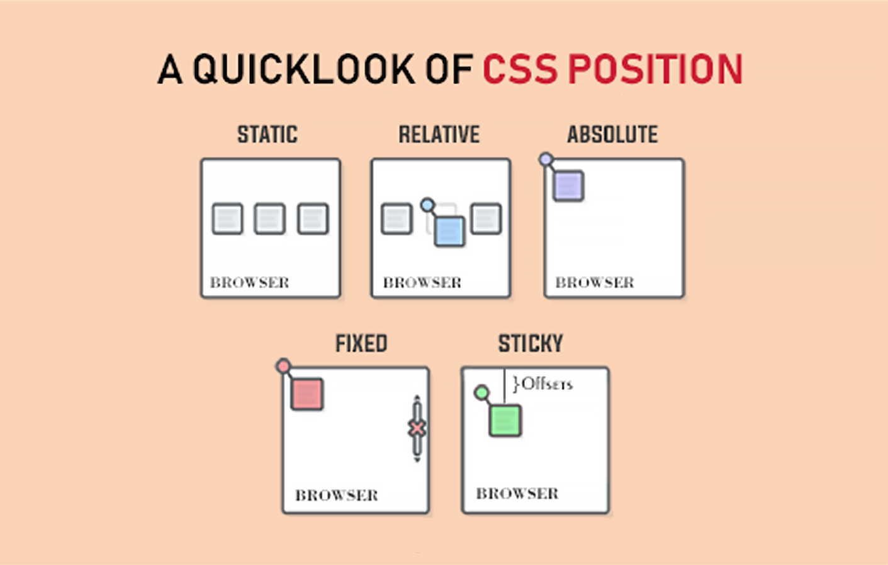

# position 속성

position 속성은 웹 페이지에서 요소의 위치(position)를 배치하는 방식을 결정한다. 보통 요소의 위치 지정을 위해 부수적으로 top, left, bottom, right 속성 (오프셋)과 함께 사용한다. position 속성에는 다음 5가지 설정 값이 있다.

1. static
2. relative
3. absolute
4. fixed
5. sticky

# static (default)

position 속성의 기본 설정 값으로, 요소를 HTML 문서에 작성된 순으로 화면에 위치시킨다. 때문에, position 속성 중 유일하게 위치를 지정하는 top, left, bottom, right 속성 (오프셋)을 무시한다.

예를 들어, `<main>` 안에 3개의 `
` 가 있다면, 3개의 `
` 가 작성된 순서대로 나란히 배치된다.

  See the Pen <a href="https://codepen.io/daleseo/pen/mdMdzob">
  position-static</a> by Dale Seo (<a href="https://codepen.io/daleseo">@daleseo</a>)
  on <a href="https://codepen.io">CodePen</a>.

위 static의 예시를 바탕으로, 다른 position 속성을 비교하여 더 쉽게 알아보자.

# relative

기존 위치(static)를 벗어나 요소를 위치시킬 수 있는 속성이다. 요소의 위치는 기존 위치(static)을 기준으로 상대적으로 배치된다. 오프셋을 주어 상하좌우로 얼마나 떨어지게 할지 지정할 수 있다.

예를 들어, 기존 3개의 `
` 중, 2번째 `
`를 `position: relative` 로 변경한 후 `top: 28px; left: 48px;`을 주었다. 그 결과, 2번째 요소가 움직이면서 3번째와 겹치는 것을 확인할 수 있다.

  See the Pen <a href="https://codepen.io/daleseo/pen/qBXBJzg">
  position-relative</a> by Dale Seo (<a href="https://codepen.io/daleseo">@daleseo</a>)
  on <a href="https://codepen.io">CodePen</a>.

# absolute

상위 요소를 기준으로 해당 요소를 위치시킨다.

DOM 트리 거슬러 올라가 상위 요소 중 `position: static`이 아닌 요소가 기준이 된다. 만약, 기준이 되는 요소가 없으면 DOM 트리의 최상위 요소인 `<body>`가 기준이 된다. 그래서 보통 absolute 포지셔닝을 할 때는 부모 요소를 `position : relative` 로 지정해주는 것이 관례이다.

마찬가지로, 오프셋을 주어 기준이 되는 상위 요소로부터의 거리를 지정할 수 있다.

예시를 보면, `position : absolute` 과 오프셋으로 인해 2번째 요소가 우측 하단에 위치한 것을 볼 수 있다.

  See the Pen <a href="https://codepen.io/daleseo/pen/abybRra">
  position-absolute</a> by Dale Seo (<a href="https://codepen.io/daleseo">@daleseo</a>)
  on <a href="https://codepen.io">CodePen</a>.

그런데, 이번에는 3번째 요소에도 위치의 변화가 생겼다. `position: absolute` 인 요소는 기준이 되는 상위 요소에 위치가 귀속되고 나머지 하위 요소는 무시한다. 그래서, 3번째 요소가 마치 2번째 요소처럼 위치하게 된 것이다.

# fixed

HTML 요소가 아닌 viewport(브라우저 전체화면)을 기준으로 요소를 위치시킨다. 따라서 브라우저를 스크롤 할 시에, 화면에서 요소의 위치가 고정(fixed)되는 효과를 준다.

동일하게, 오프셋으로 브라우저의 가장자리로부터 얼마나 떨어지게 할지 정할 수 있다.

예시를 보면, 2번째 `
`가 부모인 `<main>` 을 벗어나 브라우저 화면의 우측 하단에 고정된 것을 확인할 수 있다.

  See the Pen <a href="https://codepen.io/daleseo/pen/rNzNqXv">
  position-fixed</a> by Dale Seo (<a href="https://codepen.io/daleseo">@daleseo</a>)
  on <a href="https://codepen.io">CodePen</a>.

# sticky

요소가 스크롤 중에 지정된 위치에 도달하면 들러붙어(sticky) 더 이상 스크롤 방향으로 움직이지 않는 효과를 일으킨다. 쉽게 말해, 설정한 위치에 도달하기 전까진 static이었다가 도달하면 fixed 효과를 내는 포지션 속성이다.

따라서, 위치를 지정하는 top, left, bottom, right 속성(오프셋)이 필수적이다. 4가지 중 하나라도 없으면 동작하지 않는다.

예시를 보면, 2번째 요소가 `top: 0;` (브라우저 최상단)에 도달하기 전까진 계속 움직이다가, 최상단에 도달하는 순간 위치가 고정되는 것을 볼 수 있다.

  See the Pen <a href="https://codepen.io/daleseo/pen/LYjYgrg">
  position-sticky</a> by Dale Seo (<a href="https://codepen.io/daleseo">@daleseo</a>)
  on <a href="https://codepen.io">CodePen</a>.

# Reference

- [https://www.daleseo.com/css-position/](https://www.daleseo.com/css-position/)
