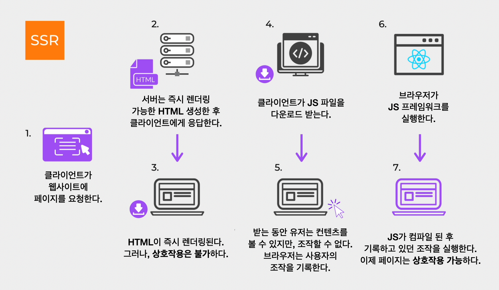
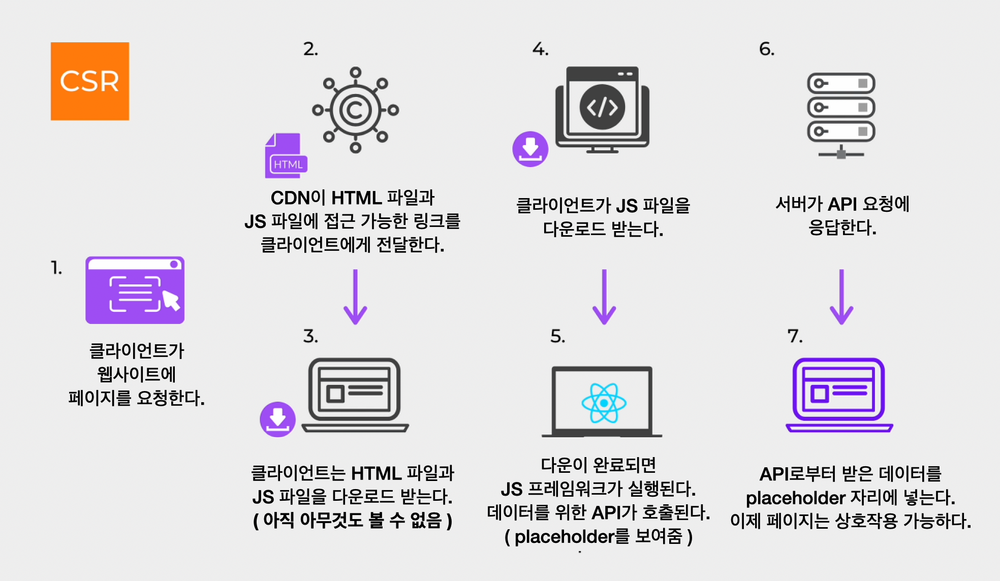

# MPA vs SPA

웹 어플리케이션의 페이지 구성 방식은 MPA와 SPA로 구분된다.

## MPA

MPA (Multiple Page Application)는 여러 페이지로 구성된 웹 애플리케이션이다. 사용자가 인터랙션을 할 때마다 서버로부터 새로운 HTML을 받아 해당 링크로 이동하여 새로운 페이지를 렌더링한다. 전통적인 웹 페이지 구성 방식이다.

## SPA

SPA (Single Page Application)는 하나의 페이지로 구성된 웹 애플리케이션이다. 최초 한 번 브라우저에 페이지 전체를 로드한 후, 특정 부분만 Ajax를 통해 데이터를 바인딩한다. SPA는 현재 웹 개발 트렌드 중 하나이며, JS 프레임워크(React, Vue 등)를 사용하여 구현할 수 있다.

# SSR vs CSR

이 MPA와 SPA의 페이지를 렌더링하는 방식이 SSR과 CSR이다. 각각의 렌더링 방식이 어떻게 이루어지는지 살펴본 후, 두 방식을 비교해보자.

## SSR

SSR은 서버 사이드 렌더링(Server Side Rendering)의 약어로, 서버에서 전체 페이지의 HTML 코드를 생성하고 이를 클라이언트에 전달하여 브라우저에서 페이지를 렌더링하는 방식을 의미한다. MPA에서 주로 이 렌더링 방식을 채택한다.

다음과 같은 과정을 거쳐 초기 화면을 렌더링 한다.

간단하게 요약하자면, 다음과 같다.

1. 클라이언트가 초기 화면 로드를 위해 서버에 요청한다.
2. 서버에서 완전한 HTML을 생성 한 후, CSS까지 적용한다. 이렇게 완성된 화면과 JS 파일을 브라우저에 응답으로 전달한다.
3. 브라우저는 응답 받은 페이지를 바로 띄우고 JS 파일을 다운로드한다. (아직 인터랙션 불가)
4. JS 다운로드 후 실행하여 페이지를 완성한다.

이후 페이지의 변경 사항이 있을 시, 모든 리소스를 다시 서버로부터 받아온다.

## CSR

CSR은 (Client-Side Rendering) 클라이언트 사이드 렌더링의 약어로, 브라우저에서 페이지를 렌더링하는 방식이다. 대부분의 SPA에서 이 렌더링 방식을 쓰고 있다.

다음과 같은 과정으로 초기 화면을 렌더링한다.

간단하게 요약하자면, 다음과 같다.

1. 클라이언트가 초기 화면 로드를 위해 서버에 요청한다.
2. 서버는 화면 로드에 필요한 완전한 리소스(HTML, CSS, JS)를 응답한다.
   (모든 JS 파일을 받기 때문에 초기 로딩 시간이 오래 걸릴 수 있다.
   그동안 로딩이나 스켈레톤 같은 placeholder를 보여준다.)
3. 다운이 완료되면 JS 프레임워크를 실행한 후, 데이터를 위한 API를 호출한다.
4. 데이터를 받으면 placeholder 자리에 표시한다.

이후 사용자의 인터랙션에 따라, 필요한 데이터만 서버에 요청하여 받아온다.

## 비교

페이지 로딩 시간, SEO, 서버 자원 사용 측면에서 SSR과 CSR을 비교해보면서 각각의 장단점을 파악해보자.

<h3>웹 페이지 로딩 시간</h3>

<h6>초기 화면 로딩 : SSR 👑</h6>

**SSR** : 서버에서 미리 완성된 화면과 JS 파일을 브라우저에 전달하기 때문에, 초기 화면 로딩이 빠르다.

**CSR** : 서버는 페이지 로드에 필요한 완전한 리소스 (HTML, CSS, JS)를 응답한다. 모든 JS 파일을 받기 때문에 초기 로딩 시간이 오래 걸릴 수 있다.

<h6>나머지 로딩 : CSR 👑</h6>

**SSR** : 페이지 변경 시 모든 리소스를 다시 받아와 느리고 모든 리소스를 다시 로드하기 때문에 화면이 깜빡일 수 있다. 또한, 초기 페이지가 보여지는 시간과 유저가 페이지와 상호작용 할 수 있는 시간의 격차가 있어 사용자 경험이 좋지 않다.

**CSR** : 서버로부터 필요한 데이터만 받아와 리렌더링이 필요한 부분에만 DOM에 동적으로 삽입하여 화면을 갱신하기 때문에 화면의 깜빡임이 없다. 그리고, 페이지가 보여지는 즉시 상호작용이 가능하기 때문에 좋은 사용자 경험을 제공할 수 있다.

<h3>SEO 대응 : SSR 👑</h3>

> 검색 엔진 최적화 (SEO) :
> 검색 엔진이 웹을 크롤링하며 페이지에 컨텐츠 색인을 생성하는 과정이다.

**SSR** : 서버로부터 생성되어 전달되는 각각의 페이지의 모든 데이터가 HTML에 포함되어 있어, 검색 엔진이 원하는 컨텐츠를 찾기 쉽다.

**CSR** : JS를 통해 페이지 내용을 동적으로 로드하고 사용자와의 상호작용에 따라 페이지의 내용이 변화한다. 때문에, 검색 엔진이 JS를 실행하여 페이지 내용을 가져오도록 하는 등의 추가적인 작업이 필요하다.

<h3>서버 자원 사용 : CSR 👑</h3>

**SSR** : 렌더링이 서버측에서 이루어진다. 즉, 클라이언트는 화면을 렌더링이 필요할 때마다 매번 서버에 요청을 보내고 서버는 모든 리소스를 완성시켜 응답을 보낸다.

**CSR** : 클라이언트 측에서 렌더링이 이루어진다. 초기에 렌더링을 위한 JS 파일을 모두 받은 후에, 꼭 필요한 데이터만 서버에게 요청한다.

<h3>결론</h3>

페이지 렌더링 방식은 서비스, 프로젝트, 콘텐츠의 성격을 고려하여 선택하는 것이 바람직하다.

<h6>SSR 사용 케이스</h6>
- 네트워크가 느릴 때
  - CSR은 한번에 모든 것을 불러오지만 SSR은 각 페이지마다 나눠불러오기 때문이다.
- SEO가 필요할 때
- 최초 로딩이 빨라야하는 사이트를 개발 할 때
- 메인 스크립트가 크고 로딩이 매우 느릴 때
  - CSR은 메인 스크립트가 로딩이 끝나면 API로 데이터 요청을 보낸다. 대조적으로, SSR은 한 번의 요청으로 전체 렌더가 가능한 페이지가 돌아온다.
- 웹 사이트가 상호작용이 별로 없을 때

<h6>CSR 사용 케이스</h6>
- 네트워크가 빠를 때
- 검색 노출이 필요 없을 때
- 서버의 성능이 좋지 않을 때
- 메인 스크립트가 가벼울 때
- 사용자에게 보여줘야 하는 데이터의 양이 많을 때
  - 로딩창을 띄울 수 있는 장점이 있기 때문이다.
- 웹 어플리케이션에 사용자와 상호작용할 것들이 많을 때
  - 빠르게 첫 화면을 띄웠는데 클릭이 안되는 것 보다, 조금 늦게 보이더라도 바로 클릭이 되는게 사용자 경험 측면에서 더 낫다.

# + Universal Rendering

Universal Rendering은 SSR과 CSR의 장점을 섞어 놓은 렌더링 방식이다.

초기 로딩 시 SSR처럼 HTML과 CSS 파일을 웹 서버에서 처리하고 JS 파일은 CDN에 배포하여 처리한다. 이후에는 CSR처럼 클라이언트에서 상호작용하며 렌더링한다.

실행 순서는 다음과 같다.

1. 사용자가 초기 페이지 접속을 요청하면, 서버에서 SSR 방식으로 렌더링 된 HTML을 보낸다.
2. 브라우저는 JS 파일을 다운로드하고 JS 프레임워크를 실행한다. 이를 Hydration이라고 한다.
3. 사용자가 페이지와 상호작용하며 다른 페이지로 이동할 경우, 서버가 아닌 브라우저에서 CSR 방식으로 처리된다.

Universal Rendering의 단점은 구현이 어렵다는 것이다. 그러나 최근에는 이를 지원하는 프레임워크들(Next.js, Nuxt.js 등)이 등장하여 이 문제를 해결하고 있다. 이러한 프레임워크들 덕분에 Universal Rendering은 쉽게 구현할 수 있게 되었으며, 현재는 새로운 대세로 떠오르고 있다.

# Reference

- [https://miracleground.tistory.com/entry/SSR서버사이드-렌더링과-CSR클라이언트-사이드-렌더링](https://miracleground.tistory.com/entry/SSR%EC%84%9C%EB%B2%84%EC%82%AC%EC%9D%B4%EB%93%9C-%EB%A0%8C%EB%8D%94%EB%A7%81%EA%B3%BC-CSR%ED%81%B4%EB%9D%BC%EC%9D%B4%EC%96%B8%ED%8A%B8-%EC%82%AC%EC%9D%B4%EB%93%9C-%EB%A0%8C%EB%8D%94%EB%A7%81)
- [https://hahahoho5915.tistory.com/52#:~:text=- CSR의 경우 HTML%2C CSS,으로 SSR이 더 빠르다.&text=- 첫 페이지를 로딩한,의 동작을 가정하자](https://hahahoho5915.tistory.com/52#:~:text=%2D%20CSR%EC%9D%98%20%EA%B2%BD%EC%9A%B0%20HTML%2C%20CSS,%EC%9C%BC%EB%A1%9C%20SSR%EC%9D%B4%20%EB%8D%94%20%EB%B9%A0%EB%A5%B4%EB%8B%A4.&text=%2D%20%EC%B2%AB%20%ED%8E%98%EC%9D%B4%EC%A7%80%EB%A5%BC%20%EB%A1%9C%EB%94%A9%ED%95%9C,%EC%9D%98%20%EB%8F%99%EC%9E%91%EC%9D%84%20%EA%B0%80%EC%A0%95%ED%95%98%EC%9E%90).
- [https://velog.io/@vagabondms/기술-스터디-SSR과-CSR의-차이](https://velog.io/@vagabondms/%EA%B8%B0%EC%88%A0-%EC%8A%A4%ED%84%B0%EB%94%94-SSR%EA%B3%BC-CSR%EC%9D%98-%EC%B0%A8%EC%9D%B4)
