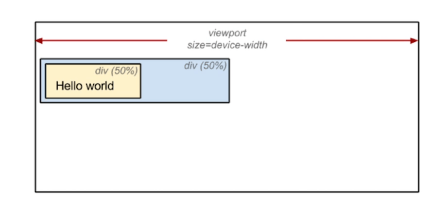
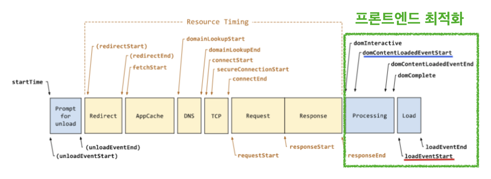
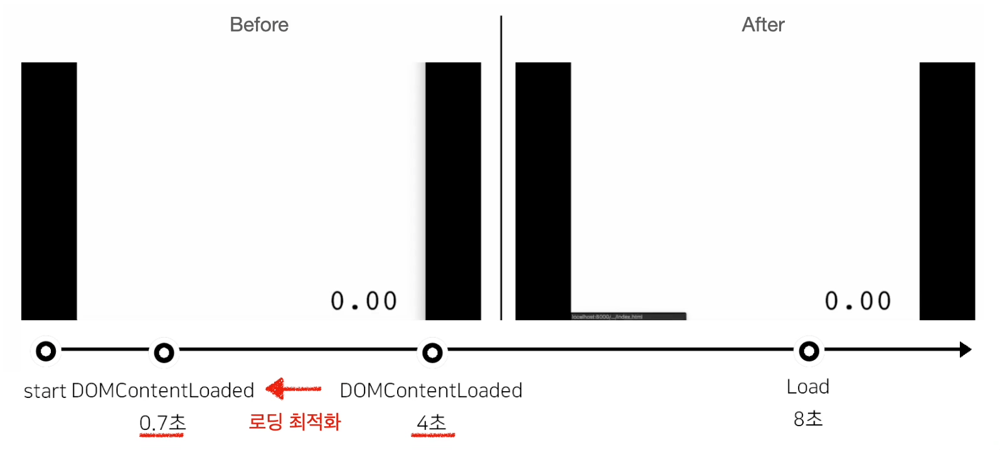
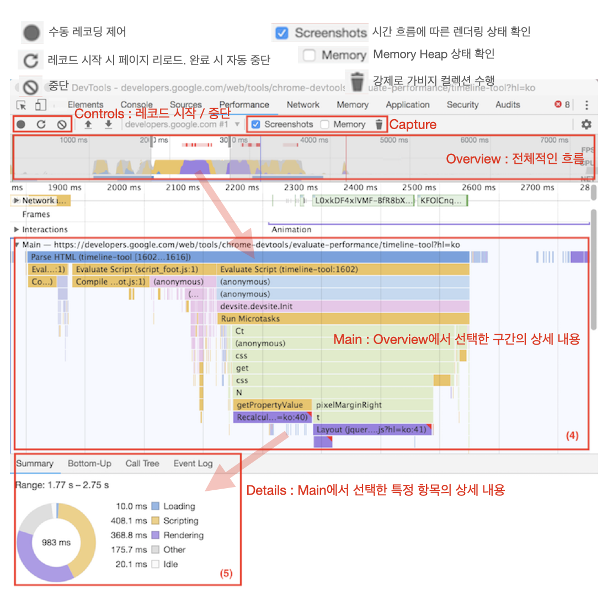
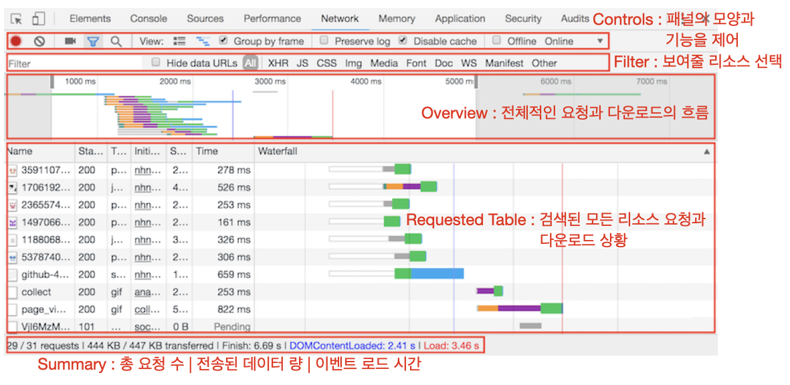
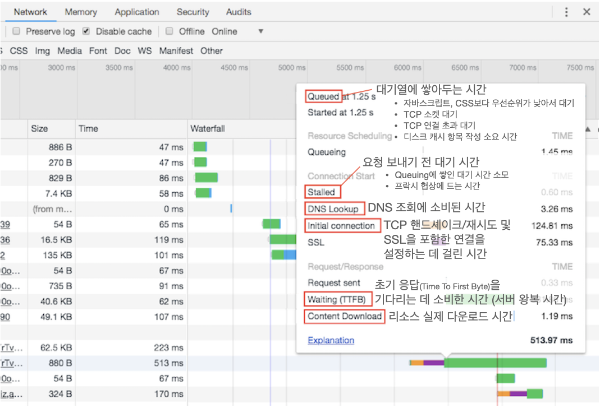
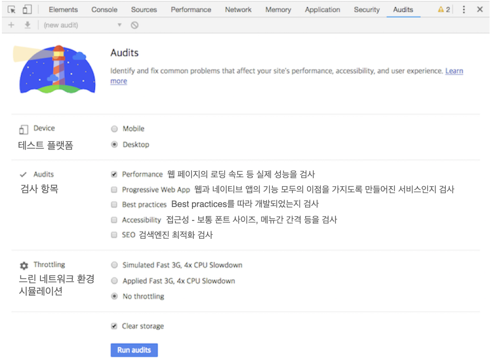
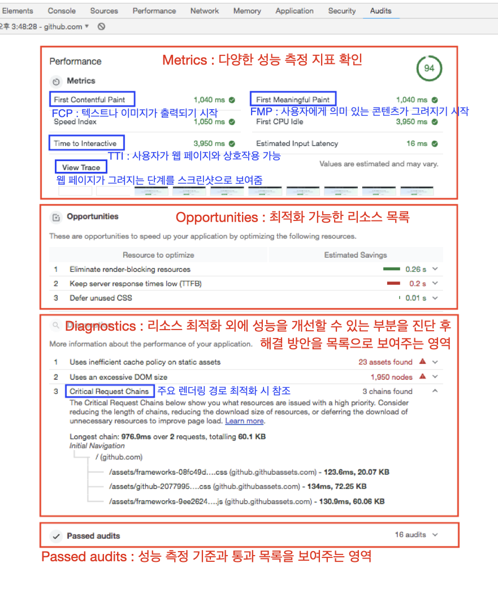
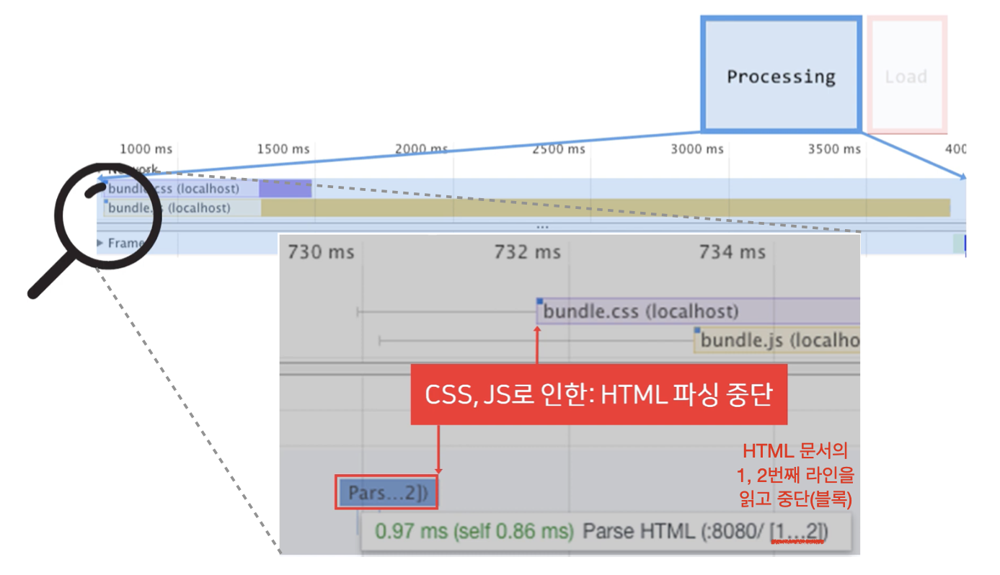
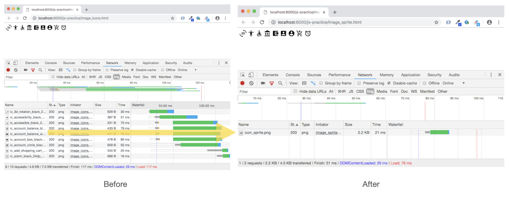

# 프론트엔드 성능 최적화란

프론트 단에서 성능이란 다음 두 가지 능력을 의미한다.

1. **로딩 성능** : 다운로드 받은 리소스를 빠르게 해석하는 능력
2. **렌더링 성능** : 해석한 리소스를 끊김없이 부드럽게 표현해내는 능력

즉, 프론트엔드의 성능을 향상시키기 위해선 **로딩 성능**과 **렌더링 성능**을 **최적화**해야 한다.

최적화 방법들을 알아보기 전에, 우선 브라우저가 어떻게 화면을 사용자에게 보여주는지 간단하게 살펴보도록 하자. (보다 상세한 과정은 이 <a href="../../web-etc/browser-rendering">글</a>에서 확인할 수 있다.)

# 브라우저 렌더링 과정

## 파싱 (⇒ DOM / CSSOM)

브라우저는 가장 먼저 HTML 파일을 다운로드 받고 첫 줄부터 차례대로 해석(파싱)한다. 단순 텍스트에서 자신이 이해할 수 있는 트리 형태의 객체 자료구조인 **DOM**으로 변환한다. 파싱 중 `<script />` , `<link />` , `` 태그를 만나면 해당 리소스를 요청하고 다운로드한다. 리소스 중 CSS 파일이 있다면, 마찬가지로 CSS 문서 또한 **CSSOM**으로 해석한다.

<a href="../../images/2023-02-27-browser-rendering/CSSOM.png">
  
</a>

## 스타일 (⇒ 렌더 트리)

이렇게 완성된 HTML 요소들의 관계도(DOM 트리)와 CSS 선택자들의 관계도(CSSOM 트리)를 매칭시키는 스타일 단계에 들어간다. 이 단계를 거치면, 렌더 트리(Render Tree)가 생성되고 브라우저는 이제 본격적으로 화면을 그릴 준비가 된다.

<a href="../../images/2023-02-27-browser-rendering/render-tree.png">
  
</a>

## 레이아웃 (⇒ 위치/크기 계산)

우리가 그림을 그릴 때, 색칠을 하기 전에 스케치를 하는 것처럼 브라우저도 레이아웃 단계를 거쳐 먼저 구도를 잡는다. 브라우저는 렌더 트리의 최상위 노드부터 최하위 노드까지 순회하며 각 노드들의 정확한 위치와 크기를 계산한다.

<figure>
<a href="../../images/2023-04-24-frontend-performance-optimization/layout-pixel.gif">
  
  <figcaption>만약 CSS 속성 값이 %라면 픽셀 단위(px)로 변환하여 렌더 트리에 반영한다.</figcaption>
</a>
</figure>

## 페인트 (⇒ 레이어)

브라우저는 밑그림을 그린 후, 각 노드를 색칠한다. 이 때 각 노드를 한 페이지에 그리는 것이 아닌, 개별적인 레이어에 그린다.

단, 모든 노드가 레어어화 되는 것은 아니다. `transform` 등의 특정 속성을 적용하면 해당 노드와 관련 노드들은 하나의 레이어로 분리되어 위치와 관련된 CSS 속성에 동일한 영향을 받는다.

페인트 단계에서 브라우저는 위치와 관련 없는 CSS 속성 (색상, 투명도 등)을 적용한다.

<a href="https://i.pinimg.com/originals/b7/89/9b/b7899b0f68ae40dcbc2f9843473cdcea.png">
  
</a>

## 합성 & 렌더 (⇒ 웹 페이지)

생성된 레이어를 합성하여 하나의 완성된 페이지를 만든다. 이 단계를 거치면 드디어 사용자는 화면에서 웹 페이지를 볼 수 있게 된다.

## 레이아웃(리플로우) / 리페인트

클릭이나 타이핑 등, 사용자와의 상호작용이 일어나면 웹 페이지의 UI는 이에 맞춰 변화한다. 이런 동작은 DOM 조작이나 CSS 속성값을 변화시켜 브라우저의 리렌더링을 발생시킨다. 이 때, 레이아웃이나 페인트가 다시 일어날 수 있다.

레이아웃을 다시 수행하는 과정을 **리플로우(Reflow)**라고도 하는데, 다음과 경우에 발생한다.

1. DOM 조작으로 인한 HTML 요소가 추가 또는 삭제
2. 위치나 크기에 영향을 주는 CSS 속성값의 변경
   (`height`, `width`, `left`, `top`, `font-size`, `line-height` 등)

반대로, 요소의 위치나 크기에 영향을 주지 않는 CSS 속성값의 변화는 **리페인트(Repaint)**만 일으킨다. (`background-color`, `color`, `visibility`, `text-decoration` 등)

리플로우는 전체 픽셀을 다시 계산해야 되는 만큼 부하가 크고 렌더링 시간이 더 오래 걸린다. 리페인트는 이미 계산된 픽셀 값으로 레이어를 그리기 때문에 부하가 덜 하다. 따라서, 불필요한 리플로우는 최대한 방지해야한다.

<figure>
<a href="../../images/2023-02-27-browser-rendering/reflow-vs-repaint.png">
  
  <figcaption>리플로우는 모든 렌더링 과정을 거치기 때문에, 렌더링 성능에 치명적이다. 리플로우는 되도록 피하자!</figcaption>
</a>
</figure>

## 브라우저 렌더링 과정 정리

브라우저가 서버로부터 리소스를 받은 후, 웹 페이지를 화면에 그리기까지 과정은 다음과 같다.

1. 리소스를 해석하여 (HTML →) DOM +( CSS →) CSSOM ⇒ **렌더 트리**를 생성한다.
   (**파싱 ⇒ 스타일**)
2. 렌더 트리의 각 노드의 위치와 크기를 픽셀로 계산한다. (**레이아웃**)
3. 노드들을 여러 레이어에 그린다. (**페인트**)
4. 레이어를 합쳐 웹 페이지를 화면에 띄운다. (**합성 & 렌더**)

이후, DOM 조작이나 CSS의 위치/크기 관련 속성값 변경이 일어나면 **리플로우**, 이외의 CSS 속성값 변경은 **리페인트**가 발생한다.

# 성능 측정 지표

성능을 측정하는 지표가 있어야 효과적으로 성능 최적화를 이룰 수 있다. 즉, “빠르게 동작하는 웹페이지”의 대한 명확한 기준을 세우는 것이 중요하다. 왜냐하면 그 기준에 따라 성능을 최적화 시키는 방법이 다르기 때문이다.

## 브라우저 기준의 성능 측정

예전 웹 페이지는 브라우저가 얼마나 빨리 리소스를 파싱하고 렌더링을 시작할 수 있는지 빠른 웹페이지의 기준이었다. 네비게이션 타이밍 모델은 이러한 브라우저의 주요 이벤트를 기준으로 성능을 측정할 수 있도록 돕는다.

<figure>
<a href="../../images/2023-04-24-frontend-performance-optimization/navigation-model-front-opt.png">
  
  <figcaption>네비게이션 모델에서 리소스를 다운받은 이후의 단계가 프론트엔드 최적화를 시킬 수 있는 영역이다.</figcaption>
</a>
</figure>

네비게이션 모델에서 리소스를 다운받은 이후의 단계가 프론트엔드 최적화를 시킬 수 있는 영역이다.

이 모델에서 눈 여겨봐야 할 이벤트는 **DOMContentLoaded** 와 **load** 이벤트이다.

**DOMContentedLoaded 이벤트**는 HTML과 CSS 파싱이 끝나고 DOM과 CSSOM을 구성한 상황을 의미한다. 즉, 렌더 트리를 구성할 준비가 된 상태다.

**load 이벤트**는 HTML을 그리기 위해 필요한 모든 리소스가 로드된 시점을 의미한다.

전통적인 성능 측정 방식에서 이 두 이벤트의 시점이 빠를 수록, 발생 시차가 좁을 수록 성능이 좋은 것으로 간주되었다. 다시 말해, 빨리 리소스를 파싱하고 화면에 컨텐츠를 일찍 그리기 시작하면 성능이 뛰어난 웹 페이지였던 것이다.

하지만 개발 패러다임이 <a href="../../web-etc/csr-ssr/#mpa">MPA(Multiple Page Application)</a>에서 <a href="../../web-etc/csr-ssr/#spa">SPA(Single Page Application)</a>으로 변화하면서 기존 측정 방식으로 성능을 판단하기 어려워졌다. SPA에선 파싱할 HTML 코드량이 적어 DOMContentLoaded나 load 이벤트가 빠르게 발생했다. 하지만, 웹 사이트가 <a href="../../web-etc/csr-ssr/#csr">CSR(Client Side Rendering)</a>로 동작하면서 사용자가 실질적인 컨텐츠를 볼 수 있는 시간은 느려졌다.

<figure>
<a href="../../images/2023-04-24-frontend-performance-optimization/browser-opt-example.gif">
  
  <figcaption>스크립트가 무거운 웹페이지에서 브라우저 기준의 성능 최적화를 적용시킨 모습이다.<br />
최적화로 인해 프로그레스바가 더 이른 시간에 그려졌지만, 실제 컨텐츠를 볼 수 있는 시간은 같다.</figcaption>
</a>
</figure>

## 사용자 기준의 성능 측정

그래서 빠른 웹페이지의 기준은 사용자가 **의미 있는 컨텐츠가 처음 보여지는 시점(FMP)**으로 바뀌었다. 현재 웹 페이지는 이 시점을 앞당기는 최적화를 해야한다.

<a href="https://user-images.githubusercontent.com/35218826/59728736-36851b80-9276-11e9-854d-bf1f2e0992f4.png">
  
</a>

사용자 기준의 성능 측정은 브라우저의 핵심 이벤트가 아닌, 사용자 입장에서 컨텐츠를 보여지는 여러 시점을 기반으로 한다. 그 시점들은 다음과 같다.

1. FP (First Paint) : 빈 화면에서 무언가가 처음 그려지는 시점
2. FCP (First Contentful Paint) : 텍스트나 이미지가 출력되기 시작하는 시점
3. **FMP (First Meaningful Paint)** : 사용자에게 의미 있는 컨텐츠가 그려지기 시작하는 시점. 컨텐츠를 노출하기 위해 필요한 CSS, JS 로드가 시작되고 스타일이 적용되어 주요 컨텐츠를 볼 수 있다.
4. TTI (Time to Interactive) : JS 초기 실행이 완료되어 사용자가 페이지와 상호작용 할 수 있는 시점

FMP와 더불어 중요한 것은 **주요 렌더링 결과를 최적화**하여 사용자에게 웹페이지가 (프로그레스바만 보여주는게 아닌) 실질적으로 작동하고 있다는 인상을 주는 것이다.

<figure>
<a href="https://user-images.githubusercontent.com/35218826/59728735-36851b80-9276-11e9-8a3d-ed60eaec2d1d.png">
  
  <figcaption>주요 렌더링 경로 최적화가 잘 된 웹페이지와 그러지 못한 웹페이지의 비교</figcaption>
</a>
</figure>

## 성능 측정 도구

크롬 브라우저를 기준으로, 개발자 도구에 성능 관련 패널은 Network, Perforance, Audits가 있다.

<h3>Performance</h3>

웹 페이지의 로딩 단계를 차트로 볼 수 있다. 로딩을 레코딩하고 단계 별로 소요 시간을 확인하여 최적화가 필요한 부분을 찾을 수 있다.

<a href="../../images/2023-04-24-frontend-performance-optimization/tool-performance.png">
  
</a>

<figure>
<a href="https://user-images.githubusercontent.com/35218826/59729118-ef982580-9277-11e9-84f7-1fb3cf4e3a5f.gif">
  
  <figcaption>웹 페이지 로드 시, 레코딩을 한 후 Main 영역에서 로딩 과정을 확인할 수 있다.</figcaption>
</a>
</figure>

<h3>Network</h3>

웹 페이지가 로딩 중 요청한 리소스의 상태를 차트로 볼 수 있으며, 리소스 최적화 상태를 비교할 수 있다.

<a href="../../images/2023-04-24-frontend-performance-optimization/tool-network.png">
  
</a>

<h3>리소스의 서버 요청 대기 시간 보기</h3>

<a href="../../images/2023-04-24-frontend-performance-optimization/tool-network-waiting.png">
  
</a>

<h3>Audits 패널</h3>

사용자 기준 성능 측정 지표를 확인할 수 있다.

<a href="../../images/2023-04-24-frontend-performance-optimization/tool-audits.png">
  
</a>

<h3>측정 후 화면</h3>

<a href="../../images/2023-04-24-frontend-performance-optimization/tool-audits-result.png">
  
</a>

# 로딩 최적화

## 블록 리소스 최적화

<h3>블록 리소스 (CSS, JS)</h3>

브라우저는 서버로부터 리소스를 내려받은 후, HTML 문서부터 파싱하여 DOM을 생성한다고 했다. 그런데, HTML 파서는 `<link>`나 `<style />` 태그를 만나면 DOM 생성을 중단(블록)하고 CSS나 JS 파일을 파싱하기 시작한다.

<figure>
<a href="../../images/2023-04-24-frontend-performance-optimization/block-resource.png">
  
  <figcaption>블록 리소스로 인해 HTML 파싱이 지연된 시간 동안, 사용자는 빈 화면을 보고 있어야 한다.</figcaption>
</a>
</figure>

왜 브라우저는 HTML 파싱을 멈추고 CSS와 JS를 먼저 파싱할까? 그 이유는 당연하게도 브라우저가 CSS와 JS를 먼저 알지 못하면 웹 페이지를 정상적으로 그릴 수 없기 때문이다.

<h4>CSS</h4>

브라우저가 웹 페이지를 그리기 위해선, 렌더 트리(DOM + CSSOM)가 있어야 한다. CSSOM이 만들어지지 않은 상태에서는 브라우저는 텍스트와 기본 마크업 밖에 보여줄 수 없다. 이런 화면이 잠시라도 보여지게 된다면 사용자 경험 측면에서 매우 좋지 않을 것이다. 따라서, 이런 상황을 방지하기 위해 브라우저는 CSS 파싱 전 HTML 파싱을 중단시킨다.

<a href="https://i0.wp.com/css-tricks.com/wp-content/uploads/2019/04/s_601945040BCA3610D759145A4442799C97B904D9A9F8326DD30FDF0CF48A96B7_1555165463692_duckduckgo-compare.jpg?ssl=1">
  
</a>

<h4>JS</h4>

그럼 JS은 렌더링과 관련이 없는데 왜 HTML 파싱을 막는 것일까? 사실, 관련이 있다. 왜냐하면 JS 엔진은 DOM API를 통해 DOM과 CSSOM에 접근하고 변경할 수 있기 때문이다.

브라우저 엔진과 JS 엔진은 기본적으로 직렬 동작한다. 즉, 하나가 실행되면 다른 하나는 동작을 멈춘다. 만약 JS 엔진이 파싱 중에 병렬적으로 DOM 조작한다면, 리플로우가 일어나 시작부터 다시 DOM을 그려야할 것이고 렌더링이 심각하게 지연될 것이다. 이런 경우를 방지하기 위해서, HTML 파싱을 중단시킨 후 JS 코드를 먼저 파악하는 것이다.

CSS와 JS는 HTML 파싱을 중단시키므로 **블록 리소스(Block resource)**라고 부른다. 우리는 로딩 최적화를 이루기 위해, 이 블록 리소스 문제를 반드시 해결해야한다.

<h3>최적화 방법</h3>

블록 리소스가 HTML 파싱을 차단하지 않도록 하는 방법은 크게 2가지가 있다.

1. 블로킹 되지 않는 **특정 위치에서 태그를 삽입**하는 방법
2. 특정 속성을 사용하여 **비동기적으로 HTML 파싱**하는 방법

<h4>CSS 최적화</h4>

렌더 트리를 구성하기 위해 DOM과 CSSOM이 필요하다. DOM은 파싱 중 태그를 찾을 때마다 구축이 가능하나 CSSOM은 CSS를 모두 파싱해야 구성할 수 있다. 따라서, CSSOM이 완성되지 않으면 렌더 트리의 조합이 차단되기 때문에 렌더링이 블록(렌더링 차단 리소스)된다.

다음과 같은 방법으로 블로킹을 방지하여 CSS 최적화를 하자.

① HTML 문서의 최상단 `<head>` 안에서 CSS 불러오기 (특정 위치)

```html
<head>
  <link href="style.css" rel="stylesheet" />
</head>
```

② 특정 조건에서 필요한 CSS는 미디어 쿼리로 불러오기 (비동기)

```jsx
// 기본 CSS
<link href="style.css" rel="stylesheet" />
// 페이지 인쇄용 CSS
<link href="print.css" rel="stylesheet" media="print" />
// 세로 모드용 CSS
<link href="portrait.css" rel="stylesheet" media="orientation:portrait"
```

③ `@import`로 외부 CSS 파일 불러오지 않기 (병렬로 내려받지 않기 때문에, 로딩 시간 길어질 수 있음)

```scss
/* foo.css */
@import url("bar.css");
```

④ 인라인 스타일 사용 (CSS 파일을 받기 전, 빠르게 보여주어야 할 스타일의 경우 ex. 프로그레스바)

```html
<head>
  <style type="text/css">
    .wrapper {
      background-color: red;
    }
  </style>
</head>
```

<h4>JS 최적화</h4>

JS는 DOM 조작을 통해 DOM / CSSOM 트리를 변경할 수 있기 때문에, 모든 스크립트가 다운되고 실행될 때까지 HTML 파싱(DOM 생성)이 중단된다. 이로 인해, 렌더 트리(DOM + CSSOM)의 구성 또한 지연된다. 따라서, JS는 블록 리소스이자 렌더링 차단 리소스이기도 하다.

<figure>
<a href="https://wormwlrm.github.io/static/98fa3272b42769edf1bb9e3fc70407e8/a6d36/3.png">
  
  <figcaption>일반적인 스크립트 로드 순서<br />(HTML 파싱과 스크립트 로딩이 동기(직렬)적으로 일어나고 있다) </figcaption>
</a>
</figure>

만약 JS가 DOM 조작을 하지 않으면 HTML 파싱을 블로킹하지 않고 동시에 스크립트를 로드할 수 있다. (async 속성 사용)

<figure>
<a href="https://wormwlrm.github.io/static/cb15314ad68cf7b5d34cd2f3386fabab/a6d36/4.png">
  
  <figcaption>async 스크립트의 로드 순서<br />(HTML 파싱과 스크립트 로딩이 비동기(병렬)적으로 일어나고 있다)</figcaption>
</a>
</figure>

따라서, 다음과 같은 방법으로 블로킹을 방지하여 JS 최적화를 하자.

1. 스크립트 태그를 HTML문서 최하단, `</body>` 직전에 배치하기 (특정 위치)

```html
<body>
  <div>...</div>
  <div>...</div>
  <script src="app.js" type="text/javascript"></script>
</body>
```

2. `async` 또는 `defer` 속성을 명시하여 스크립트 로딩과 HTML 파싱을 비동기적으로 실행하기 (비동기)

```html
<html>
  <head>
    <script
      async
      src="https://google.com/analatics.js"
      type="text/javascript"
    ></script>
  </head>
  <body>
    <div>...</div>
    <div>...</div>
  </body>
</html>
```

<figure>
<a href="https://wormwlrm.github.io/static/4b70dc585a1eae2aff8d56e4bfa44ef0/a6d36/5.png">
  
  <figcaption>defer 스크립트의 로드 순서<br/>(HTML 파싱과 스크립트 로딩이 비동기적으로 일어난다. 스크립트 실행은 HTML 파싱이 끝난 후 일어난다.)</figcaption>
</a>
</figure>

> <h3>async와 defer 의 차이</h3>
>
> `async`와 `defer` 모두 스크립트 로딩과 HTML 파싱을 병렬적으로 수행하지만 **스크립트를 실행시키는 시점이 다르다**.
>
> `async`는 스크립트 실행이 로딩 직후 일어나는데 반면, `defer` 는 HTML 파싱이 끝난 후 발생한다.
>
> 이런 특성 때문에, `async` 스크립트는 실행 순서가 보장되지 않는다. 만약 스크립트 간에 의존성이 존재한다면 제대로 동작하지 않을 수도 있다. 따라서, `async` 는 DOM에 직접 접근하지 않거나 의존성이 없는 스크립트를 실행할 때 효과적이다.
>
> 이와 달리, `defer`는 선언순으로 실행 순서가 보장된다. 즉, 스크립트 파일이 먼저 다운 받아도 DOM 구성(HTML 파싱)이 끝나고 실행된다. 따라서, `defer`는 DOM의 모든 엘리먼트에 접근할 수 있으며 실행 순서도 보장되기 때문에 스크립트 파일 간에 의존성이 있는 경우 매우 유용하다.
>
> 그러나, `defer`는 스크립트 파일의 실행을 지연시키기 때문에, 스크립트 파일이 너무 큰 경우 페이지의 로딩 속도가 느려질 수 있다. 때문에, 스크립트 파일의 크기와 로딩 속도를 고려하여 적절하게 사용해야 한다.

## 리소스 요청 수 줄이기

<h3>이미지 스프라이트</h3>

여러 개 이미지를 하나로 만든 후, CSS `background-position` 속성으로 이미지를 부분적으로 사용하는 방법이다.

<a href="../../images/2023-04-24-frontend-performance-optimization/image-sprite.png">
  
</a>

<h3>이미지 지연 로딩</h3>

사용자 화면에 보이는 이미지만 먼저 요청하고 스크롤 할 때마다 필요한 이미지만 요청하여 리소스 요청 수를 줄이는 방법이다.

<a href="https://blog.kakaocdn.net/dn/bgPSC7/btrg1YkElpj/DkvyYHnBkBwlZtnKmyHRm0/img.gif">
  
</a>

<h3>CSS, JS 번들링</h3>

webpack과 같은 모듈 번들러로 여러 JS 파일을 하나의 번들 파일로 생성(번들링)한다. 마찬가지로 여러 파일을 하나의 번들로 묶어 요청 수를 줄이는 방법이다.

<a href="https://img1.daumcdn.net/thumb/R1280x0/?scode=mtistory2&fname=https%3A%2F%2Fblog.kakaocdn.net%2Fdn%2FcxOxfx%2FbtqEiLC3pk4%2Fb8y3096QNfSo8dXjKLwHC1%2Fimg.png">
  
</a>

<h3>내부 스타일시트 사용</h3>

외부 스타일 시트를 `<link>` 태그로 불러오는 것이 아닌, 내부 스타일시트를 `<style>` 태그 안에 선언하여 외부로부터 CSS 파일 요청하는 횟수를 줄일 수 있다. 단, 내부 스타일시트는 캐싱되지 않으므로 매번 HTML 문서에 포함된다. 따라서, 필요한 경우만 사용하자.

<h3>작은 이미지를 HTML, CSS로 대체</h3>

사용하는 아이콘 이미지 개수가 적으면 이미지 파일 대신 이미지를 Data URI로 처리하여 HTML, CSS에 이미지를 포함 시킬 수 있다. 외부 이미지 경로를 Base64로 변환된 URI로 대체하면 된다.

이 또한 이미지 파일을 요청하는 횟수를 줄일 수 있지만, 내부 스타일과 같이 캐시 문제가 있기 때문에 필요한 경우만 사용하는 것이 좋다.

## 리소스 용량 줄이기

<h3>중복 코드 제거</h3>

JS 코드 중 자주 사용되는 코드는 `utils.js` 와 같은 하나의 파일로 관리한다. 중복 코드의 양을 최소화하면 리소스 용량을 줄일 수 있다.

<h3>트리 쉐이킹</h3>

나무를 흔들면 가지가 떨어지는 것과 같이, 라이브러리에서 꼭 필요한 기능만 가져와 파일 용량을 줄이는 방법이다.

```jsx
import _ from "lodash"; // (X)
import array from "lodash/array"; // (O)
```

<h3>HTML 마크업 최적화</h3>

HTML 중첩을 최소화하고 공백, 주석 등을 제거하자. 불필요한 마크업으로 인해 DOM 트리와 HTML 파일 용량이 커지지 않게 하자.

<h3>간결한 CSS 선택자 사용</h3>

간결한 CSS 선택자를 사용하여 스타일을 적용하자. 되도록 `id` 대신 `class` 선택자를 써서 중복되는 스타일을 묶어 처리하고 선택자 수를 최소화하는 것이 좋다.

<h3>압축하여 사용</h3>

HTML, CSS, JS는 모두 압축(minify)가능하다. 불필요한 주석과 공백을 제거한 후 난독화하여 사용한다.

<h3>올바른 확장자 사용</h3>

이미지와 폰트 등의 경우 올바른 확장자를 사용하여 파일 용량을 줄일 수 있다.

- 이미지
  - 화질 차이가 작으면, png보다 jpg, jpeg가 용량이 더 작다.
  - 애니메이션의 경우, gif보다 mp4 파일이 용량을 덜 차지한다.
- 폰트
  - WOFF2는 모든 브라우저가 지원하고 용량이 가장 작기 때문에 가급적 이 형식을 사용하는 것이 좋다.

## 로딩 최적화 정리

|              | 블록 차단 리소스 최적화                                                                                                 | 리소스 요청 수 줄이기                | 리소스 용량 줄이기                                            |
| ------------ | ----------------------------------------------------------------------------------------------------------------------- | ------------------------------------ | ------------------------------------------------------------- |
| CSS          | - 태그를 `<head>` 안에 배치<br />- 미디어 쿼리 사용<br />- @import 사용 지양<br />- 때에 따라, 인라인 스타일 사용<br /> | -내부 스타일 시트 사용               | - 복잡한 선택자 사용 지양<br />- 공통 스타일 class로 묶기     |
| JS           | - 태그를 `</body>` 직전 배치<br />- `async`,`defer` 사용                                                                | - 모듈 번들링                        | - 트리 쉐이킹<br />- 불필요한 코드 제거<br />- 압축 및 난독화 |
| 이미지, 폰트 |                                                                                                                         | - 이미지 스프라이트<br />- 지연 로딩 | 올바른 확장자 사용<br />- 불필요한 파일 요청 지양             |
| 공통         |                                                                                                                         |                                      | - 캐싱                                                        |

# 렌더링 최적화

## 레이아웃 최적화

레이아웃은 모든 렌더링 과정을 다시 일으키기 때문에 비용이 매우 큰 작업이다. 때문에 불필요한 레이아웃을 **최소화** 해야한다. 요소의 위치나 크기를 변경하는 CSS 속성 값의 변경 또는 DOM 조작을 최대한 지양하자.

만약 레이아웃이 발생하면 렌더링이 오래 걸리기 때문에, 화면이 부자연스럽게 끊기는 현상이 발생할 수 있다. 때문에, 레이아웃을 **최대한 빨리 처리**하는 것 또한 매우 중요하다.

<h3>JS 실행 최적화</h3>

<h4>강제 동기 레이아웃 피하기</h4>

레이아웃은 원래 비동기이다. 하지만 DOM 요소의 특정 프로퍼티는 조작하지 않고, 읽기만 해도 강제적으로 동기적 레이아웃이 발생한다. 프로퍼티를 읽는 순간 브라우저는 최신 값을 계산해야하기 때문에, 레이아웃을 다시 수행한다.

```jsx
const tabBtn = document.getElementById("tab_btn");

tabBtn.style.fontSize = "24px";
console.log(testBlock.offsetTop);
// offsetTop을 읽는 순간, 브라우저 내부에서는 동기 레이아웃이 발생
tabBtn.style.margin = "10px";
// 레이아웃
```

<h4>레이아웃 스래싱 피하기</h4>

강제 동기 레이아웃이 매우 빈번하게 일어나는 경우, 렌더링 성능이 급격히 하락한다. 이를 레이아웃 스레싱이라고 한다. 아래 코드는 반복문 안에서 강제 동기 레이아웃을 유발하는 코드가 계속해서 동작하여 스레싱을 일으킨다.

이 강제 동기 레이아웃을 유발하는 프로퍼티를 반복문 밖에서 캐싱하여 레이아웃 스레싱을 방지할 수 있다.

```jsx
function resizeAllParagraphs() {
  const box = document.getElementById("box");
  const paragraphs = document.querySelectorAll(".paragraph");
  const width = box.offsetWidth; // (+) 프로퍼티 저장

  for (let i = 0; i < paragraphs.length; i += 1) {
    // paragraphs[i].style.width = box.offsetWidth + 'px'; (-) 강제 동기 레이아웃 발생
    paragraphs[i].style.width = width + "px"; // (+)
  }
}
```

<h4>하위 노드의 DOM 조작 / 스타일 변경</h4>

DOM을 변경하는 노드가 상위에 있을 수록, 이에 영향을 받는 하위 노드가 많아진다. 따라서, 되도록 하위의 노드에 DOM 변경을 가해 레이아웃 범위를 줄이는 것이 좋다.

영향 받는 엘리먼트 제한

DOM이나 스타일을 변경하면 레이아웃 과정을 통해 관련된 다른 요소까지 영향을 주어 또 다른 레이아웃을 발생시킬 수 있다. 다음과 같은 관계에서 레이아웃에 유의하자.

1. 부모 - 자식 관계 : 부모 요소의 높이가 가변적일 때, 자식 요소의 높이가 바뀌면 부모 요소에서 레이아웃이 다시 일어난다. 부모 요소의 높이를 고정하면 하위 요소는 레이아웃의 영향을 받지 않게 된다.
2. 같은 위치의 요소 : 여러 요소가 인라인으로 있을 때, 첫 번째 요소의 `width` 가 변경으로 나머지 요소들의 위치가 바뀌어 레이아웃이 일어날 수 있다.

<h4>숨겨진 엘리먼트 수정</h4>

요소를 숨기는 방법은 2가지가 있다.

1. `display : none` : DOM 조작과 스타일 변경에도 레이아웃과 리페인트가 일어나지 않는다. 따라서, 많은 수의 요소를 변경해야할 때 이 속성을 사용하여 숨긴 상태에서 변경한 후 다시 보이도록 하여 레이아웃을 방지할 수 있다.
2. `visibility : hidden` : 마찬가지로 보이지 않기 때문에 리페인트는 발생하지 않지만, 공간을 차지하여 레이아웃이 일어난다.

따라서, 요소를 숨길 때 `display: none`이 성능 상 유리하다.

<h3>HTML, CSS 최적화</h3>

<h4>CSS 규칙 최소화</h4>

CSS 규칙이 많고 복잡할 수 록 스타일 계산과 레이아웃이 오래 걸린다. 따라서, 규칙과 선택자를 최소한으로 가져가서 렌더링을 가볍게 하자.

<h4>DOM 깊이 최소화</h4>

DOM 트리를 작고 얕게 가져가는 것이 렌더링 성능에 유리하다. 또, 불필요한 래퍼 요소는 제거하자.

## 애니메이션 최적화

보통 한 프레임의 처리가 16ms 내로 처리되어야 60fps 주사율의 화면에서 끊김 없이 자연스럽게 렌더링된다. 이 시간 내로 프레임을 처리하려면, JS 실행 시간은 레이아웃과 페인트 과정을 고려했을 때, 10ms 이내에 완료되어야 한다.

<h3>requestAnimationFrame 사용</h3>

requestAnimationFrame API를 사용하면 주사율(60fps)에 맞춰 애니메이션을 실행할 수 있다. 프레임마다 실행되어 일정한 간격으로 애니메이션을 수행하고 페이지가 보이지 않는 상태에서 콜백 함수를 실행하지 않는다.

<h3>CSS 애니메이션 사용</h3>

JS를 이용한 애니메이션은 DOM이나 CSSOM을 변경하기 때문에 레이아웃을 발생시켜 성능에 좋지 않을 수 있다. CSS 애니메이션은 렌더링 최적화가 되어있어 부드럽게 애니메이션 구현이 가능하다.

CSS 애니메이션을 사용할 시, `position : absolute` 이나 `fixed` 를 설정하여 주변 요소의 레이아웃을 변경하는 일을 방지하자. 또, `transform` 속성을 사용하면 레이어가 분리되어 레이아웃이나 페인트에 영향을 받는 요소의 수를 줄이고 해당 레이어는 합성만 일어나 렌더링이 최소화된다.

## 렌더링 최적화 정리

- 레이아웃 최적화
  - JS 최적화
    - 강제 동기 레이아웃 / 레이아웃 스레싱 피하기
    - 하위 노드의 DOM 조작 / 스타일 변경
    - 요소 숨길 때, `display: none` 사용
    - 레이아웃 영향 받는 요소 제한
  - HTML, CSS 최적화
    - CSS 규칙 최소화
    - DOM 깊이 최소화
- 애니메이션 최적화
  - requestedAnimationFrame 사용
  - CSS 애니메이션 사용
    - 애니메이션 요소 position 고정
    - 위치 변경은 `transform` 사용

# Reference

- [https://ui.toast.com/fe-guide/ko_PERFORMANCE](https://ui.toast.com/fe-guide/ko_PERFORMANCE)
- [https://youtu.be/G1IWq2blu8c](https://youtu.be/G1IWq2blu8c)
- [https://wormwlrm.github.io/2021/03/01/Async-Defer-Attributes-of-Script-Tag.html](https://wormwlrm.github.io/2021/03/01/Async-Defer-Attributes-of-Script-Tag.html)
- [https://coffeeandcakeandnewjeong.tistory.com/34#](https://coffeeandcakeandnewjeong.tistory.com/34#)
